### Problem 1

###### At the beginning, we arbitrarily choose two variables to plot the data. We find that we find two colors are better separated than the quality based on our chosen variables.

    ggplot(wine) + 
      geom_point(aes(x=volatile.acidity, y=fixed.acidity, color=color))

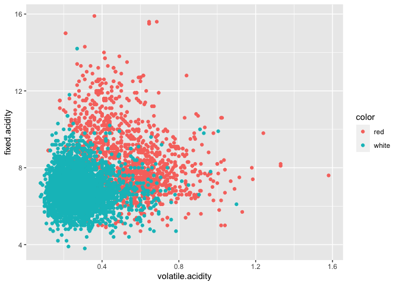

    wine$quality <- factor(wine$quality)
    ggplot(wine) + 
      geom_point(aes(x=volatile.acidity, y=fixed.acidity, color=quality))

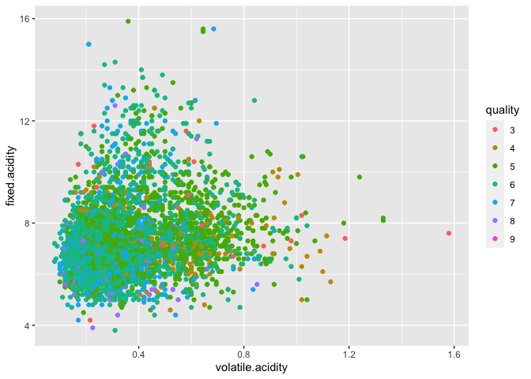

    #summary(wine)
    unique(wine$color)

    ## [1] "red"   "white"

    unique(wine$quality)

    ## [1] 5 6 7 4 8 3 9
    ## Levels: 3 4 5 6 7 8 9

#### K-mean model

###### In the data, we already have two target variable as prior knowledge: color has two categories, and quality has seven categories. Although we get the best k is 5 through Gap statistics, we decide to lel k=2 to better predict color; and let k=7 For the prediction of qulity.

    # Run k-means with 2 clusters and 25 starts
    X<-wine[,1:11]
    clust2 = kmeanspp(X, k=2, nstart=25) # Using kmeans++ initialization

    # A few plots with cluster membership shown
    qplot(fixed.acidity, volatile.acidity, data=wine, color=factor(clust2$cluster))

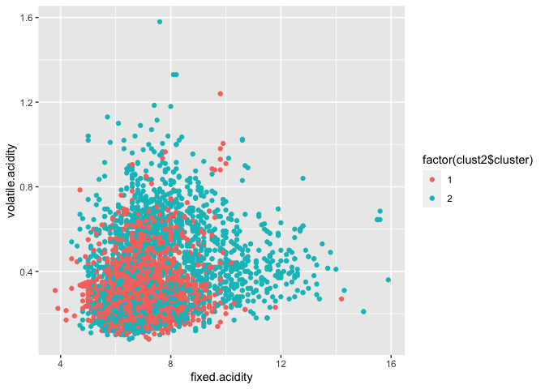

    qplot(citric.acid, residual.sugar, data=wine, color=factor(clust2$cluster))

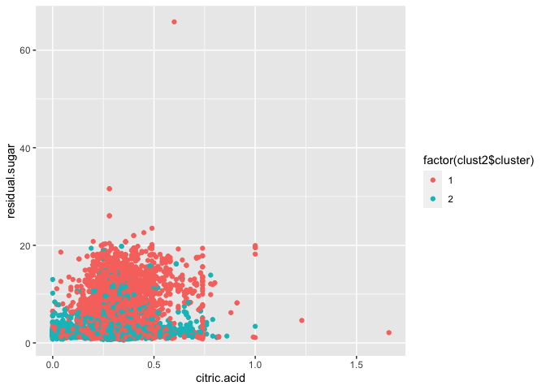

    qplot(chlorides, free.sulfur.dioxide, data=wine, color=factor(clust2$cluster))

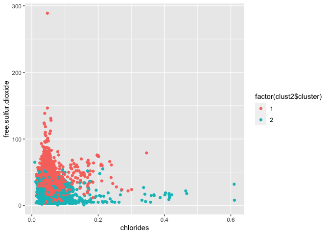

    qplot(total.sulfur.dioxide , density , data=wine, color=factor(clust2$cluster))

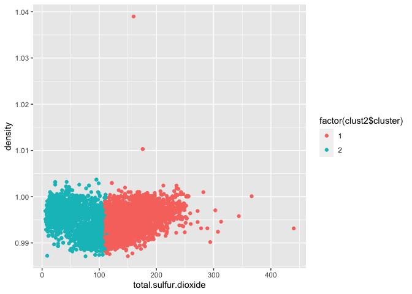

    qplot( pH , sulphates , data=wine, color=factor(clust2$cluster))

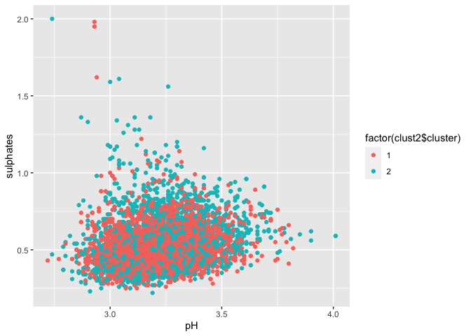

    qplot( pH ,  alcohol , data=wine, color=factor(clust2$cluster))

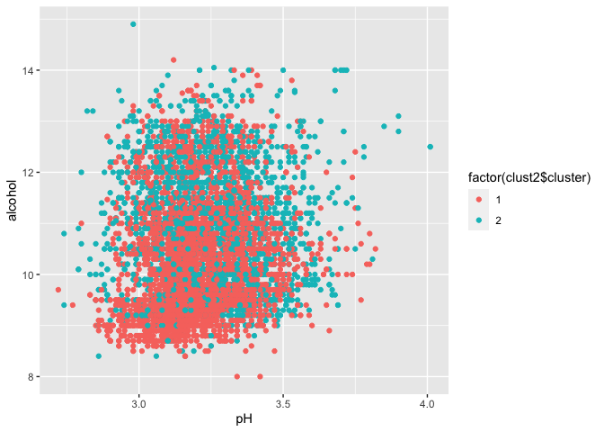

###### Based on the above clusters, we can see how many white/red wine in each cluster as below

    wine_c2<- cbind(clust2$cluster,wine)
    wine_c2 %>% group_by(clust2$cluster,color) %>% summarise(num=n())

    ## `summarise()` has grouped output by 'clust2$cluster'. You can override using the `.groups` argument.

    ## # A tibble: 4 x 3
    ## # Groups:   clust2$cluster [2]
    ##   `clust2$cluster` color   num
    ##              <int> <chr> <int>
    ## 1                1 red      85
    ## 2                1 white  3604
    ## 3                2 red    1514
    ## 4                2 white  1294

###### From the above results, we know that the variable named total.sulfur.dioxide corresponding to the wine color. In that picture, the two clusters have similar pattern of the wine colors. We can further calculate the accuray: (1514+3604)/6497 = 78.8% which is better than 7 clusters.

    # Run k-means with 7 clusters and 25 starts
    clust7 = kmeanspp(X, k=7, nstart=25) # Using kmeans++ initialization

    ## Warning: Quick-TRANSfer stage steps exceeded maximum (= 324850)

    qplot(fixed.acidity, volatile.acidity, data=wine, color=factor(clust7$cluster))

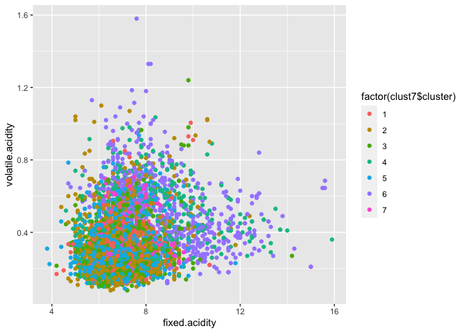

    qplot(citric.acid, residual.sugar, data=wine, color=factor(clust7$cluster))

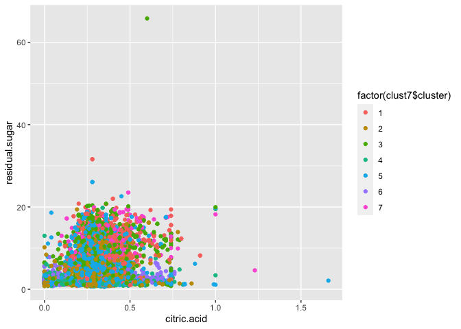

    qplot(chlorides, free.sulfur.dioxide, data=wine, color=factor(clust7$cluster))

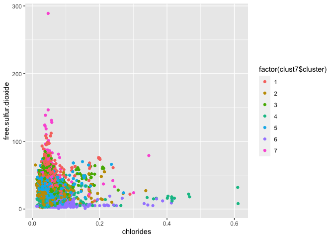

    qplot(total.sulfur.dioxide , density , data=wine, color=factor(clust7$cluster))

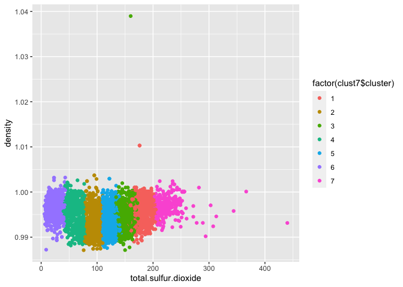

    qplot( pH , sulphates , data=wine, color=factor(clust7$cluster))

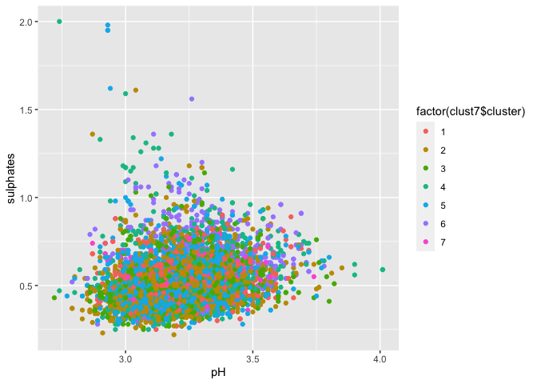

    qplot( pH ,  alcohol , data=wine, color=factor(clust7$cluster))

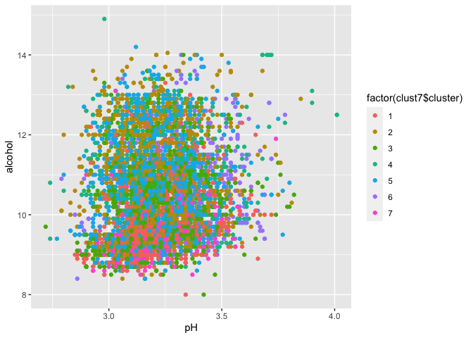

###### From all of the above graphs, we cannot see the variable named total.sulfur.dioxide also corresponding to the wine qulity. However, let’s see the accurary with repect to quality.

    wine_c7<- cbind(clust7$cluster,wine)
    wine_c7 %>% group_by(clust7$cluster,quality) %>% summarise(num=n())

    ## `summarise()` has grouped output by 'clust7$cluster'. You can override using the `.groups` argument.

    ## # A tibble: 44 x 3
    ## # Groups:   clust7$cluster [7]
    ##    `clust7$cluster` quality   num
    ##               <int> <fct>   <int>
    ##  1                1 3           3
    ##  2                1 4          30
    ##  3                1 5         377
    ##  4                1 6         368
    ##  5                1 7          64
    ##  6                1 8          14
    ##  7                2 3           2
    ##  8                2 4          41
    ##  9                2 5         283
    ## 10                2 6         505
    ## # … with 34 more rows

###### From the above results, we can see that there is not similar quality pattern correspongding to the seven clusters. Therefore, k-mean is a good way to predict wine color, but not helpful for quality classification.

#### PCA Model

    library(tidyverse)

    ## ── Attaching packages ─────────────────────────────────────── tidyverse 1.3.0 ──

    ## ✓ tibble  3.0.6     ✓ purrr   0.3.4
    ## ✓ tidyr   1.1.2     ✓ stringr 1.4.0
    ## ✓ readr   1.3.1     ✓ forcats 0.5.0

    ## ── Conflicts ────────────────────────────────────────── tidyverse_conflicts() ──
    ## x purrr::accumulate()        masks foreach::accumulate()
    ## x mosaic::count()            masks dplyr::count()
    ## x purrr::cross()             masks mosaic::cross()
    ## x mosaic::do()               masks dplyr::do()
    ## x tidyr::expand()            masks Matrix::expand()
    ## x dplyr::filter()            masks stats::filter()
    ## x ggstance::geom_errorbarh() masks ggplot2::geom_errorbarh()
    ## x dplyr::lag()               masks stats::lag()
    ## x tidyr::pack()              masks Matrix::pack()
    ## x mosaic::stat()             masks ggplot2::stat()
    ## x mosaic::tally()            masks dplyr::tally()
    ## x tidyr::unpack()            masks Matrix::unpack()
    ## x purrr::when()              masks foreach::when()

    library(ggplot2)
    #install.packages("usmap")
    library(usmap)
    library(lubridate)

    ## 
    ## Attaching package: 'lubridate'

    ## The following objects are masked from 'package:base':
    ## 
    ##     date, intersect, setdiff, union

    library(randomForest)

    ## randomForest 4.6-14

    ## Type rfNews() to see new features/changes/bug fixes.

    ## 
    ## Attaching package: 'randomForest'

    ## The following object is masked from 'package:dplyr':
    ## 
    ##     combine

    ## The following object is masked from 'package:ggplot2':
    ## 
    ##     margin

    library(splines)
    #install.packages("pdp")
    library(pdp)

    ## 
    ## Attaching package: 'pdp'

    ## The following object is masked from 'package:purrr':
    ## 
    ##     partial

    library(ggcorrplot)

    plot(X, pch=19, col=rgb(0.3,0.3,0.3,0.3))

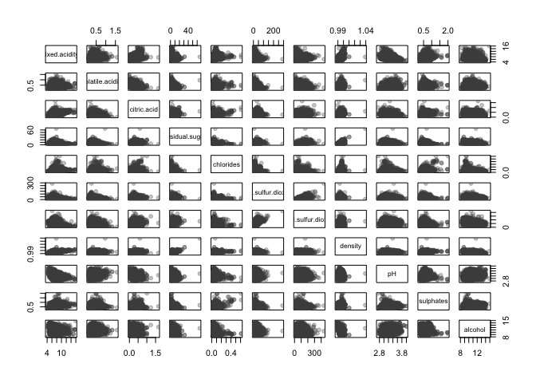

    cor(X)

    ##                      fixed.acidity volatile.acidity citric.acid residual.sugar
    ## fixed.acidity           1.00000000       0.21900826  0.32443573     -0.1119813
    ## volatile.acidity        0.21900826       1.00000000 -0.37798132     -0.1960112
    ## citric.acid             0.32443573      -0.37798132  1.00000000      0.1424512
    ## residual.sugar         -0.11198128      -0.19601117  0.14245123      1.0000000
    ## chlorides               0.29819477       0.37712428  0.03899801     -0.1289405
    ## free.sulfur.dioxide    -0.28273543      -0.35255731  0.13312581      0.4028706
    ## total.sulfur.dioxide   -0.32905390      -0.41447619  0.19524198      0.4954816
    ## density                 0.45890998       0.27129565  0.09615393      0.5525170
    ## pH                     -0.25270047       0.26145440 -0.32980819     -0.2673198
    ## sulphates               0.29956774       0.22598368  0.05619730     -0.1859274
    ## alcohol                -0.09545152      -0.03764039 -0.01049349     -0.3594148
    ##                        chlorides free.sulfur.dioxide total.sulfur.dioxide
    ## fixed.acidity         0.29819477         -0.28273543          -0.32905390
    ## volatile.acidity      0.37712428         -0.35255731          -0.41447619
    ## citric.acid           0.03899801          0.13312581           0.19524198
    ## residual.sugar       -0.12894050          0.40287064           0.49548159
    ## chlorides             1.00000000         -0.19504479          -0.27963045
    ## free.sulfur.dioxide  -0.19504479          1.00000000           0.72093408
    ## total.sulfur.dioxide -0.27963045          0.72093408           1.00000000
    ## density               0.36261466          0.02571684           0.03239451
    ## pH                    0.04470798         -0.14585390          -0.23841310
    ## sulphates             0.39559331         -0.18845725          -0.27572682
    ## alcohol              -0.25691558         -0.17983843          -0.26573964
    ##                          density          pH    sulphates      alcohol
    ## fixed.acidity         0.45890998 -0.25270047  0.299567744 -0.095451523
    ## volatile.acidity      0.27129565  0.26145440  0.225983680 -0.037640386
    ## citric.acid           0.09615393 -0.32980819  0.056197300 -0.010493492
    ## residual.sugar        0.55251695 -0.26731984 -0.185927405 -0.359414771
    ## chlorides             0.36261466  0.04470798  0.395593307 -0.256915580
    ## free.sulfur.dioxide   0.02571684 -0.14585390 -0.188457249 -0.179838435
    ## total.sulfur.dioxide  0.03239451 -0.23841310 -0.275726820 -0.265739639
    ## density               1.00000000  0.01168608  0.259478495 -0.686745422
    ## pH                    0.01168608  1.00000000  0.192123407  0.121248467
    ## sulphates             0.25947850  0.19212341  1.000000000 -0.003029195
    ## alcohol              -0.68674542  0.12124847 -0.003029195  1.000000000

    # a quick heatmap visualization
    ggcorrplot::ggcorrplot(cor(X), hc.order = TRUE)

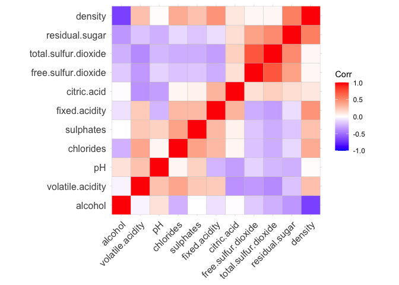

    pc_X = prcomp(X, rank=7, scale=TRUE)
    #summary(pc_X)
    plot(pc_X, type="l")

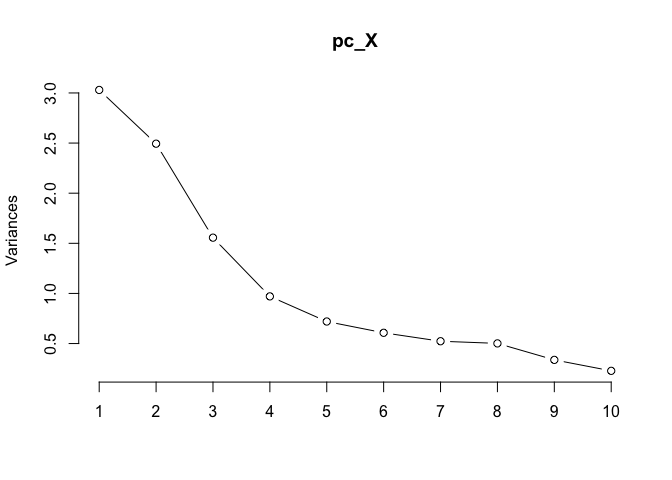

    biplot(pc_X)

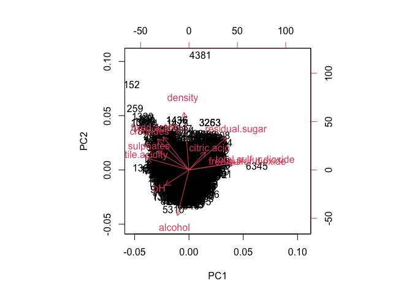

    #pc_X$rotation
    round(pc_X$rotation[,1:7],2) 

    ##                        PC1   PC2   PC3   PC4   PC5   PC6   PC7
    ## fixed.acidity        -0.24  0.34 -0.43  0.16 -0.15 -0.20 -0.28
    ## volatile.acidity     -0.38  0.12  0.31  0.21  0.15 -0.49 -0.39
    ## citric.acid           0.15  0.18 -0.59 -0.26 -0.16  0.23 -0.38
    ## residual.sugar        0.35  0.33  0.16  0.17 -0.35 -0.23  0.22
    ## chlorides            -0.29  0.32  0.02 -0.24  0.61  0.16 -0.05
    ## free.sulfur.dioxide   0.43  0.07  0.13 -0.36  0.22 -0.34 -0.30
    ## total.sulfur.dioxide  0.49  0.09  0.11 -0.21  0.16 -0.15 -0.14
    ## density              -0.04  0.58  0.18  0.07 -0.31  0.02 -0.05
    ## pH                   -0.22 -0.16  0.46 -0.41 -0.45  0.30 -0.42
    ## sulphates            -0.29  0.19 -0.07 -0.64 -0.14 -0.30  0.53
    ## alcohol              -0.11 -0.47 -0.26 -0.11 -0.19 -0.52 -0.10

    summary(pc_X)

    ## Importance of first k=7 (out of 11) components:
    ##                           PC1    PC2    PC3     PC4     PC5     PC6     PC7
    ## Standard deviation     1.7407 1.5792 1.2475 0.98517 0.84845 0.77930 0.72330
    ## Proportion of Variance 0.2754 0.2267 0.1415 0.08823 0.06544 0.05521 0.04756
    ## Cumulative Proportion  0.2754 0.5021 0.6436 0.73187 0.79732 0.85253 0.90009

    wine = cbind(wine, pc_X$x[,1:7])
    wine$quality <- factor(wine$quality)

    ggplot(wine, aes(PC1, PC2, color=color, fill=color)) +
      stat_ellipse(geom="polygon", col="black",alpha=0.5) +
      geom_point(shape=21, col="black")

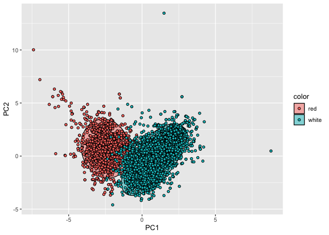
\#\#\#\#\#\# From the above graph, we can clear see that the two
clusters well correspond to wine colors. Therefore, PCA is a good
predictor for wine color.

    wine$quality<-factor(wine$quality)

    ggplot(wine, aes(PC1, PC2, color=quality, fill=quality)) +
      stat_ellipse(geom="polygon", col="black",alpha=0.5) +
      geom_point(shape=21, col="black")

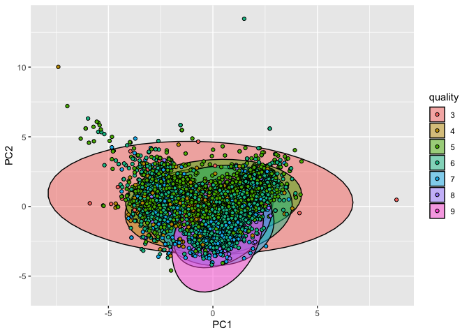

    ggplot(wine, aes(PC3, PC4, color=quality, fill=quality)) +
      stat_ellipse(geom="polygon", col="black",alpha=0.5) +
      geom_point(shape=21, col="black")

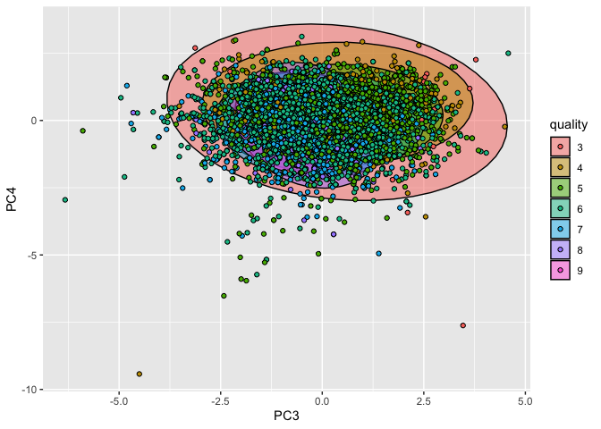

    ggplot(wine, aes(PC5, PC6, color=quality, fill=quality)) +
      stat_ellipse(geom="polygon", col="black",alpha=0.5) +
      geom_point(shape=21, col="black")

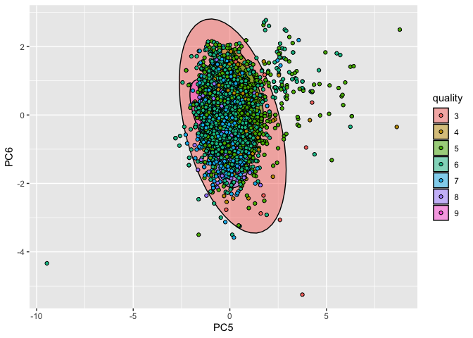

    ggplot(wine, aes(PC7, PC6, color=quality, fill=quality)) +
      stat_ellipse(geom="polygon", col="black",alpha=0.5) +
      geom_point(shape=21, col="black")

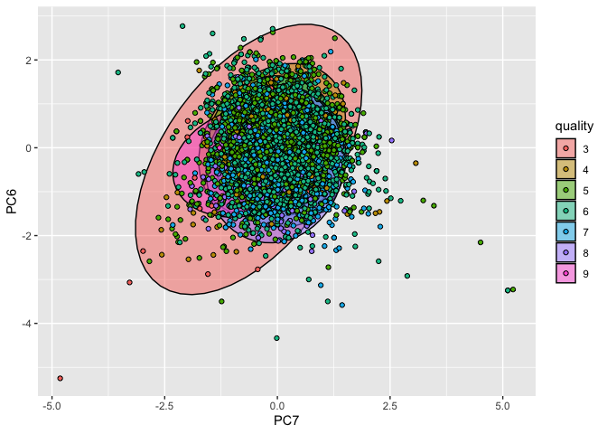
\#\#\#\#\#\# From the above graphs, we can see that none of them have a
similar pattern as wine quality. Therefore, we cannot predict the
quality from these chemical information.

#### principal component regression: predicted quality

    wine$quality <- as.numeric(wine$quality)
    lmwine = lm(quality ~ PC1 + PC2 + PC3 + PC4 + PC5 + PC6 + PC7, data=wine)
    summary(lmwine)

    ## 
    ## Call:
    ## lm(formula = quality ~ PC1 + PC2 + PC3 + PC4 + PC5 + PC6 + PC7, 
    ##     data = wine)
    ## 
    ## Residuals:
    ##     Min      1Q  Median      3Q     Max 
    ## -3.3155 -0.4967 -0.0342  0.4834  3.1270 
    ## 
    ## Coefficients:
    ##              Estimate Std. Error t value Pr(>|t|)    
    ## (Intercept)  3.818378   0.009459 403.659  < 2e-16 ***
    ## PC1          0.038202   0.005435   7.029 2.29e-12 ***
    ## PC2         -0.174166   0.005991 -29.074  < 2e-16 ***
    ## PC3         -0.150821   0.007583 -19.889  < 2e-16 ***
    ## PC4         -0.146175   0.009603 -15.222  < 2e-16 ***
    ## PC5         -0.182980   0.011150 -16.411  < 2e-16 ***
    ## PC6         -0.161099   0.012139 -13.271  < 2e-16 ***
    ## PC7          0.105050   0.013079   8.032 1.13e-15 ***
    ## ---
    ## Signif. codes:  0 '***' 0.001 '**' 0.01 '*' 0.05 '.' 0.1 ' ' 1
    ## 
    ## Residual standard error: 0.7625 on 6489 degrees of freedom
    ## Multiple R-squared:  0.2385, Adjusted R-squared:  0.2376 
    ## F-statistic: 290.3 on 7 and 6489 DF,  p-value: < 2.2e-16

###### Here we can see the linear model works for predicting wine quality. All the components and the model are significant. As below logistic model shows, these components could be used to predict wine color as well.

    wine$color2<- ifelse(wine$color=="red",1,0)
    wine$color2 <- factor(wine$color2)
    glmwine = glm(color2 ~ PC1 + PC2 + PC3 + PC4 + PC5 + PC6 + PC7, family="binomial" , data=wine)

    ## Warning: glm.fit: fitted probabilities numerically 0 or 1 occurred

    summary(glmwine)

    ## 
    ## Call:
    ## glm(formula = color2 ~ PC1 + PC2 + PC3 + PC4 + PC5 + PC6 + PC7, 
    ##     family = "binomial", data = wine)
    ## 
    ## Deviance Residuals: 
    ##     Min       1Q   Median       3Q      Max  
    ## -3.6638  -0.0536  -0.0138  -0.0006   5.0794  
    ## 
    ## Coefficients:
    ##             Estimate Std. Error z value Pr(>|z|)    
    ## (Intercept) -4.44371    0.21580 -20.592  < 2e-16 ***
    ## PC1         -3.81612    0.16669 -22.894  < 2e-16 ***
    ## PC2          0.94552    0.09182  10.298  < 2e-16 ***
    ## PC3          0.13326    0.08533   1.562 0.118356    
    ## PC4         -0.34144    0.10375  -3.291 0.000999 ***
    ## PC5         -0.45252    0.12270  -3.688 0.000226 ***
    ## PC6         -0.01856    0.12109  -0.153 0.878185    
    ## PC7         -0.75663    0.15968  -4.738 2.15e-06 ***
    ## ---
    ## Signif. codes:  0 '***' 0.001 '**' 0.01 '*' 0.05 '.' 0.1 ' ' 1
    ## 
    ## (Dispersion parameter for binomial family taken to be 1)
    ## 
    ##     Null deviance: 7250.98  on 6496  degrees of freedom
    ## Residual deviance:  680.17  on 6489  degrees of freedom
    ## AIC: 696.17
    ## 
    ## Number of Fisher Scoring iterations: 9

###### From the above models, we can see that both k-mean and PCA perform well for predicting the wine colors. But only PCA works for predicting wine quality. The main reason is because of PCA’s particular charectoristic of those useful component. Likewise, k-mean has no such natures and could not predict the quality.

### Problem 2

    sm <- read.csv("~/Documents/**2021spring course/DM/hw4/social_marketing.csv")

#### Research Topic

###### Nowadays, social media is a good place for firms to know better about their consumers. For Brand NutrientH20, there are enormous followers on twitter account. Their words or posts could reflect some common charactoristics of Brand NutrientH20’s consumers. Therefore, we use the data which is extracted from content posted on Twitter to build a PAC model to describe marketing segments of this brand.

#### Data Description

###### The content are extracted from Twitter in a seven day period during June, 2014. The content have been well categoried and organized.We have 25 words in the dataset, each of which is a column. Each row is a infividual ID. The majority numbers in the dataset means the frequency of the words the observation used in his/her posts in that time period.

    summary(sm)

    ##       X                chatter       current_events      travel      
    ##  Length:7882        Min.   : 0.000   Min.   :0.000   Min.   : 0.000  
    ##  Class :character   1st Qu.: 2.000   1st Qu.:1.000   1st Qu.: 0.000  
    ##  Mode  :character   Median : 3.000   Median :1.000   Median : 1.000  
    ##                     Mean   : 4.399   Mean   :1.526   Mean   : 1.585  
    ##                     3rd Qu.: 6.000   3rd Qu.:2.000   3rd Qu.: 2.000  
    ##                     Max.   :26.000   Max.   :8.000   Max.   :26.000  
    ##  photo_sharing    uncategorized      tv_film      sports_fandom   
    ##  Min.   : 0.000   Min.   :0.000   Min.   : 0.00   Min.   : 0.000  
    ##  1st Qu.: 1.000   1st Qu.:0.000   1st Qu.: 0.00   1st Qu.: 0.000  
    ##  Median : 2.000   Median :1.000   Median : 1.00   Median : 1.000  
    ##  Mean   : 2.697   Mean   :0.813   Mean   : 1.07   Mean   : 1.594  
    ##  3rd Qu.: 4.000   3rd Qu.:1.000   3rd Qu.: 1.00   3rd Qu.: 2.000  
    ##  Max.   :21.000   Max.   :9.000   Max.   :17.00   Max.   :20.000  
    ##     politics           food            family        home_and_garden 
    ##  Min.   : 0.000   Min.   : 0.000   Min.   : 0.0000   Min.   :0.0000  
    ##  1st Qu.: 0.000   1st Qu.: 0.000   1st Qu.: 0.0000   1st Qu.:0.0000  
    ##  Median : 1.000   Median : 1.000   Median : 1.0000   Median :0.0000  
    ##  Mean   : 1.789   Mean   : 1.397   Mean   : 0.8639   Mean   :0.5207  
    ##  3rd Qu.: 2.000   3rd Qu.: 2.000   3rd Qu.: 1.0000   3rd Qu.:1.0000  
    ##  Max.   :37.000   Max.   :16.000   Max.   :10.0000   Max.   :5.0000  
    ##      music              news        online_gaming       shopping     
    ##  Min.   : 0.0000   Min.   : 0.000   Min.   : 0.000   Min.   : 0.000  
    ##  1st Qu.: 0.0000   1st Qu.: 0.000   1st Qu.: 0.000   1st Qu.: 0.000  
    ##  Median : 0.0000   Median : 0.000   Median : 0.000   Median : 1.000  
    ##  Mean   : 0.6793   Mean   : 1.206   Mean   : 1.209   Mean   : 1.389  
    ##  3rd Qu.: 1.0000   3rd Qu.: 1.000   3rd Qu.: 1.000   3rd Qu.: 2.000  
    ##  Max.   :13.0000   Max.   :20.000   Max.   :27.000   Max.   :12.000  
    ##  health_nutrition  college_uni     sports_playing      cooking      
    ##  Min.   : 0.000   Min.   : 0.000   Min.   :0.0000   Min.   : 0.000  
    ##  1st Qu.: 0.000   1st Qu.: 0.000   1st Qu.:0.0000   1st Qu.: 0.000  
    ##  Median : 1.000   Median : 1.000   Median :0.0000   Median : 1.000  
    ##  Mean   : 2.567   Mean   : 1.549   Mean   :0.6392   Mean   : 1.998  
    ##  3rd Qu.: 3.000   3rd Qu.: 2.000   3rd Qu.:1.0000   3rd Qu.: 2.000  
    ##  Max.   :41.000   Max.   :30.000   Max.   :8.0000   Max.   :33.000  
    ##       eco           computers          business         outdoors      
    ##  Min.   :0.0000   Min.   : 0.0000   Min.   :0.0000   Min.   : 0.0000  
    ##  1st Qu.:0.0000   1st Qu.: 0.0000   1st Qu.:0.0000   1st Qu.: 0.0000  
    ##  Median :0.0000   Median : 0.0000   Median :0.0000   Median : 0.0000  
    ##  Mean   :0.5123   Mean   : 0.6491   Mean   :0.4232   Mean   : 0.7827  
    ##  3rd Qu.:1.0000   3rd Qu.: 1.0000   3rd Qu.:1.0000   3rd Qu.: 1.0000  
    ##  Max.   :6.0000   Max.   :16.0000   Max.   :6.0000   Max.   :12.0000  
    ##      crafts         automotive           art             religion     
    ##  Min.   :0.0000   Min.   : 0.0000   Min.   : 0.0000   Min.   : 0.000  
    ##  1st Qu.:0.0000   1st Qu.: 0.0000   1st Qu.: 0.0000   1st Qu.: 0.000  
    ##  Median :0.0000   Median : 0.0000   Median : 0.0000   Median : 0.000  
    ##  Mean   :0.5159   Mean   : 0.8299   Mean   : 0.7248   Mean   : 1.095  
    ##  3rd Qu.:1.0000   3rd Qu.: 1.0000   3rd Qu.: 1.0000   3rd Qu.: 1.000  
    ##  Max.   :7.0000   Max.   :13.0000   Max.   :18.0000   Max.   :20.000  
    ##      beauty          parenting           dating            school       
    ##  Min.   : 0.0000   Min.   : 0.0000   Min.   : 0.0000   Min.   : 0.0000  
    ##  1st Qu.: 0.0000   1st Qu.: 0.0000   1st Qu.: 0.0000   1st Qu.: 0.0000  
    ##  Median : 0.0000   Median : 0.0000   Median : 0.0000   Median : 0.0000  
    ##  Mean   : 0.7052   Mean   : 0.9213   Mean   : 0.7109   Mean   : 0.7677  
    ##  3rd Qu.: 1.0000   3rd Qu.: 1.0000   3rd Qu.: 1.0000   3rd Qu.: 1.0000  
    ##  Max.   :14.0000   Max.   :14.0000   Max.   :24.0000   Max.   :11.0000  
    ##  personal_fitness    fashion        small_business        spam        
    ##  Min.   : 0.000   Min.   : 0.0000   Min.   :0.0000   Min.   :0.00000  
    ##  1st Qu.: 0.000   1st Qu.: 0.0000   1st Qu.:0.0000   1st Qu.:0.00000  
    ##  Median : 0.000   Median : 0.0000   Median :0.0000   Median :0.00000  
    ##  Mean   : 1.462   Mean   : 0.9966   Mean   :0.3363   Mean   :0.00647  
    ##  3rd Qu.: 2.000   3rd Qu.: 1.0000   3rd Qu.:1.0000   3rd Qu.:0.00000  
    ##  Max.   :19.000   Max.   :18.0000   Max.   :6.0000   Max.   :2.00000  
    ##      adult        
    ##  Min.   : 0.0000  
    ##  1st Qu.: 0.0000  
    ##  Median : 0.0000  
    ##  Mean   : 0.4033  
    ##  3rd Qu.: 0.0000  
    ##  Max.   :26.0000

###### We pre-processed the data on some how. At the beginning, we delete some columns that are not meaningful to represent customers’ charaster. To be specific, we deleted “adult” and “spam”, since more than 90% cases are 0 and cannot represent most customers. We also deleted “uncategorized” and “chatter”", since we don’t know the concrete information.Furthermore, we want to see the overall customers, and don’t hope to see some overweighted individuals when they use one word/aspect for many times. Therefore, we choose to use binary rather than frequency to see general customers’ charactoristics.

###### Since we are focusing on some charactoristics, not specific words, we aggregate some words into one column when the words regards similar aspects. For example, both business and small business are about business. Fashion, shopping and beauty are reflecting charictoristics of the same marketing segments. College and school are talked about education. As long as words are about similar topics, we will aggregate the numbers. For these aggregated columns, we make them binary after the aggregation.

    #Data Processing
    table(sm$adult=="0")

    ## 
    ## FALSE  TRUE 
    ##   570  7312

    table(sm$spam =="0")

    ## 
    ## FALSE  TRUE 
    ##    49  7833

    # delete adult and spam, since more than 90% cases are 0

    table(sm$uncategorized =="0")

    ## 
    ## FALSE  TRUE 
    ##  4334  3548

    table(sm$chatter =="0")

    ## 
    ## FALSE  TRUE 
    ##  7417   465

    # delete uncategorized and chatter, since we don't know the concrete information

    # delete some meaningless columns
    sm <- sm[,c(1,3:5,7:35)]
    colnames(sm)

    ##  [1] "X"                "current_events"   "travel"           "photo_sharing"   
    ##  [5] "tv_film"          "sports_fandom"    "politics"         "food"            
    ##  [9] "family"           "home_and_garden"  "music"            "news"            
    ## [13] "online_gaming"    "shopping"         "health_nutrition" "college_uni"     
    ## [17] "sports_playing"   "cooking"          "eco"              "computers"       
    ## [21] "business"         "outdoors"         "crafts"           "automotive"      
    ## [25] "art"              "religion"         "beauty"           "parenting"       
    ## [29] "dating"           "school"           "personal_fitness" "fashion"         
    ## [33] "small_business"

    # aggregate similar content
    sm$education <- sm$college_uni+sm$school
    sm$food <- sm$food + sm$cooking
    sm$art <- sm$music + sm$art + sm$crafts
    sm$family <- sm$family + sm$parenting
    sm$life <- sm$home_and_garden + sm$photo_sharing
    sm$consumption <- sm$fashion +sm$shopping + sm$beauty
    sm$entertain <- sm$tv_film + sm$online_gaming + sm$dating
    sm$health <- sm$health_nutrition +sm$personal_fitness
    sm$business <- sm$small_business +sm$business
    sm$sports <- sm$sports_playing + sm$sports_fandom
    sm$outside <- sm$outdoors + sm$travel
    sm$belief <- sm$politics + sm$religion
    sm$news <- sm$current_events + sm$news
    colnames(sm)

    ##  [1] "X"                "current_events"   "travel"           "photo_sharing"   
    ##  [5] "tv_film"          "sports_fandom"    "politics"         "food"            
    ##  [9] "family"           "home_and_garden"  "music"            "news"            
    ## [13] "online_gaming"    "shopping"         "health_nutrition" "college_uni"     
    ## [17] "sports_playing"   "cooking"          "eco"              "computers"       
    ## [21] "business"         "outdoors"         "crafts"           "automotive"      
    ## [25] "art"              "religion"         "beauty"           "parenting"       
    ## [29] "dating"           "school"           "personal_fitness" "fashion"         
    ## [33] "small_business"   "education"        "life"             "consumption"     
    ## [37] "entertain"        "health"           "sports"           "outside"         
    ## [41] "belief"

    sm <- sm[,c(1,8:9,12,19:21,24:25,34:41)]
    colnames(sm)

    ##  [1] "X"           "food"        "family"      "news"        "eco"        
    ##  [6] "computers"   "business"    "automotive"  "art"         "education"  
    ## [11] "life"        "consumption" "entertain"   "health"      "sports"     
    ## [16] "outside"     "belief"

    # Binary, we want to see overall segments, and don't want to see some individuals overweighted. 
    sm$eco <- ifelse(sm$eco=="0",0,1)
    sm$computers <- ifelse(sm$computers =="0",0,1)
    sm$automotive <- ifelse(sm$automotive =="0",0,1)
    sm$education <- ifelse(sm$education =="0",0,1)
    sm$consumption <- ifelse(sm$consumption =="0",0,1)
    sm$entertain <- ifelse(sm$entertain =="0",0,1)
    sm$health <- ifelse(sm$health =="0",0,1)
    sm$family <- ifelse(sm$family =="0",0,1)
    sm$food <- ifelse(sm$food =="0",0,1)
    sm$news <- ifelse(sm$news =="0",0,1)
    sm$business <- ifelse(sm$business =="0",0,1)
    sm$art <- ifelse(sm$art =="0",0,1)
    sm$life <- ifelse(sm$life =="0",0,1)
    sm$sports <- ifelse(sm$sports =="0",0,1)
    sm$outside <- ifelse(sm$outside =="0",0,1)
    sm$belief <- ifelse(sm$belief =="0",0,1)

    corsm <- cor(sm[,-1])
    ggcorrplot::ggcorrplot(corsm,hc.order = TRUE, pch.cex=0.1)

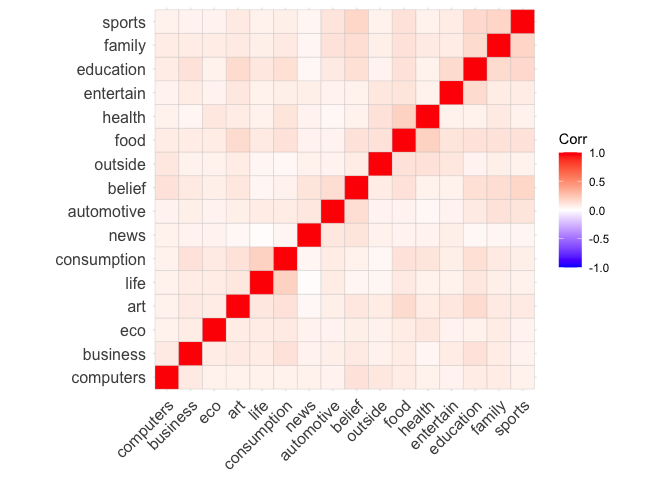
\#\#\#\#\#\# After pre-process the data, we have a look at the data
correlation. After we processing the data, it seems that there are not
columns that are highly correlated. Therefore, we can observe different
aspects of consumers now.

#### Unsupervised Model Construction - PCA

    XX <- sm[,2:17]
    pc_XX = prcomp(XX, rank=17, scale=TRUE)
    summary(pc_XX)

    ## Importance of components:
    ##                           PC1     PC2     PC3     PC4     PC5     PC6     PC7
    ## Standard deviation     1.5167 1.07400 1.05174 1.02345 1.00129 0.98569 0.96123
    ## Proportion of Variance 0.1438 0.07209 0.06913 0.06547 0.06266 0.06072 0.05775
    ## Cumulative Proportion  0.1438 0.21587 0.28500 0.35047 0.41313 0.47385 0.53160
    ##                            PC8     PC9    PC10    PC11    PC12    PC13    PC14
    ## Standard deviation     0.95123 0.94354 0.93874 0.91519 0.91051 0.89956 0.88787
    ## Proportion of Variance 0.05655 0.05564 0.05508 0.05235 0.05181 0.05058 0.04927
    ## Cumulative Proportion  0.58815 0.64380 0.69887 0.75122 0.80303 0.85361 0.90288
    ##                           PC15    PC16
    ## Standard deviation     0.88286 0.88005
    ## Proportion of Variance 0.04872 0.04841
    ## Cumulative Proportion  0.95159 1.00000

    plot(pc_XX, type="l")

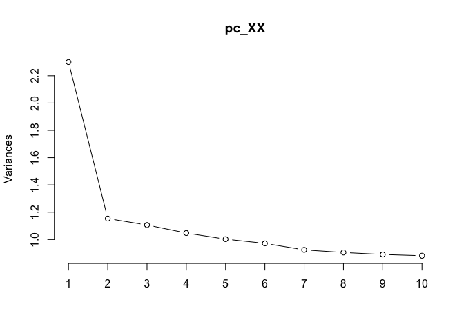

    biplot(pc_XX)

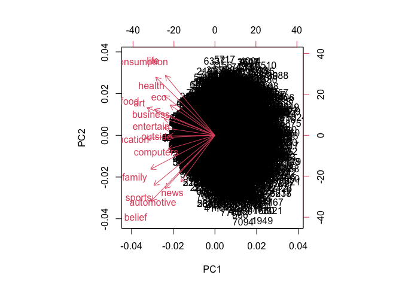
\#\#\#\#\#\# Based on the PCA results, we chose 6 components to explain
47.4% of variation. From the biplot results, we can see that all the
words are on similar direction.

    round(pc_XX$rotation[,1:6],2) 

    ##               PC1   PC2   PC3   PC4   PC5   PC6
    ## food        -0.31  0.18 -0.28  0.23 -0.15  0.04
    ## family      -0.29 -0.22  0.10  0.21 -0.24 -0.15
    ## news        -0.15 -0.30 -0.21 -0.50  0.04  0.47
    ## eco         -0.20  0.19 -0.11 -0.29 -0.26  0.00
    ## computers   -0.21 -0.09 -0.19 -0.25  0.25 -0.64
    ## business    -0.23  0.11  0.16 -0.29  0.36 -0.25
    ## automotive  -0.22 -0.34  0.22 -0.27 -0.16  0.23
    ## art         -0.27  0.17  0.05  0.17  0.14  0.15
    ## education   -0.31 -0.02  0.27  0.28  0.25  0.01
    ## life        -0.22  0.38  0.33 -0.19 -0.09 -0.02
    ## consumption -0.27  0.37  0.28 -0.18 -0.14  0.06
    ## entertain   -0.23  0.05 -0.08  0.19  0.54  0.42
    ## health      -0.23  0.26 -0.44  0.08 -0.37  0.06
    ## sports      -0.28 -0.32  0.15  0.35 -0.20 -0.06
    ## outside     -0.21  0.00 -0.52  0.01  0.21 -0.07
    ## belief      -0.29 -0.42  0.01 -0.07 -0.08 -0.14

    loadings = pc_XX$rotation[,1:6] %>%
      as.data.frame %>%
      rownames_to_column('words')

#### Conclusion

#### From the above results, we can define marketing segments, and also go back to see the original terms before aggregation. According to PC1, we define segment 1 as “food and education” group, they talk about food, cooking, school and college. According to PC2, we define segment 2 as “belief, life and consumption” group, they talk about politics, religion, home, garden, photo sharing, shopping, fashion, beatuty. According to PC3, we define segment 3 as “outside and health” group, they talk about outdoor activites, travelling, health nutrition and personal fitness . According to PC4, we define segment 4 as “news and sports” group, they talk about outdoor activites and travelling. According to PC5, we define segment 5 as “business and entertainment” group, they talk about business, small business, tv\_film, online\_gaming, and dating. According to PC6, we define segment 6 as “conputer” group, they talk about just computers.

### Problem 3 Association rule mining

###### Here are some description for the transaction dataset. We have 9835 observations, with different combination of items. We’ll see to what extent, which products are often purchased together.

    library(tidyverse)
    library(arules)  # has a big ecosystem of packages built around it

    ## 
    ## Attaching package: 'arules'

    ## The following objects are masked from 'package:mosaic':
    ## 
    ##     inspect, lhs, rhs

    ## The following object is masked from 'package:dplyr':
    ## 
    ##     recode

    ## The following objects are masked from 'package:base':
    ## 
    ##     abbreviate, write

    library(arulesViz)

    ## Loading required package: grid

    library(igraph)

    ## 
    ## Attaching package: 'igraph'

    ## The following object is masked from 'package:arules':
    ## 
    ##     union

    ## The following objects are masked from 'package:lubridate':
    ## 
    ##     %--%, union

    ## The following objects are masked from 'package:purrr':
    ## 
    ##     compose, simplify

    ## The following object is masked from 'package:tidyr':
    ## 
    ##     crossing

    ## The following object is masked from 'package:tibble':
    ## 
    ##     as_data_frame

    ## The following object is masked from 'package:mosaic':
    ## 
    ##     compare

    ## The following objects are masked from 'package:dplyr':
    ## 
    ##     as_data_frame, groups, union

    ## The following object is masked from 'package:LICORS':
    ## 
    ##     normalize

    ## The following objects are masked from 'package:stats':
    ## 
    ##     decompose, spectrum

    ## The following object is masked from 'package:base':
    ## 
    ##     union

    ## import traction data
    gc <- read.transactions("~/Downloads/ECO395M-master/data/groceries.txt", sep=",")
    class(gc)

    ## [1] "transactions"
    ## attr(,"package")
    ## [1] "arules"

    inspect(head(gc, 6))

    ##     items                     
    ## [1] {citrus fruit,            
    ##      margarine,               
    ##      ready soups,             
    ##      semi-finished bread}     
    ## [2] {coffee,                  
    ##      tropical fruit,          
    ##      yogurt}                  
    ## [3] {whole milk}              
    ## [4] {cream cheese,            
    ##      meat spreads,            
    ##      pip fruit,               
    ##      yogurt}                  
    ## [5] {condensed milk,          
    ##      long life bakery product,
    ##      other vegetables,        
    ##      whole milk}              
    ## [6] {abrasive cleaner,        
    ##      butter,                  
    ##      rice,                    
    ##      whole milk,              
    ##      yogurt}

    size(head(gc)) 

    ## [1] 4 3 1 4 4 5

    LIST(head(gc, 6)) 

    ## [[1]]
    ## [1] "citrus fruit"        "margarine"           "ready soups"        
    ## [4] "semi-finished bread"
    ## 
    ## [[2]]
    ## [1] "coffee"         "tropical fruit" "yogurt"        
    ## 
    ## [[3]]
    ## [1] "whole milk"
    ## 
    ## [[4]]
    ## [1] "cream cheese" "meat spreads" "pip fruit"    "yogurt"      
    ## 
    ## [[5]]
    ## [1] "condensed milk"           "long life bakery product"
    ## [3] "other vegetables"         "whole milk"              
    ## 
    ## [[6]]
    ## [1] "abrasive cleaner" "butter"           "rice"             "whole milk"      
    ## [5] "yogurt"

    # Most frequently purchased items
    frequentItems <- eclat (gc, parameter = list(supp = 0.07, maxlen = 15)) 

    ## Eclat
    ## 
    ## parameter specification:
    ##  tidLists support minlen maxlen            target  ext
    ##     FALSE    0.07      1     15 frequent itemsets TRUE
    ## 
    ## algorithmic control:
    ##  sparse sort verbose
    ##       7   -2    TRUE
    ## 
    ## Absolute minimum support count: 688 
    ## 
    ## create itemset ... 
    ## set transactions ...[169 item(s), 9835 transaction(s)] done [0.01s].
    ## sorting and recoding items ... [18 item(s)] done [0.00s].
    ## creating sparse bit matrix ... [18 row(s), 9835 column(s)] done [0.00s].
    ## writing  ... [19 set(s)] done [0.00s].
    ## Creating S4 object  ... done [0.00s].

    inspect(frequentItems)

    ##      items                         support    transIdenticalToItemsets count
    ## [1]  {other vegetables,whole milk} 0.07483477  736                      736 
    ## [2]  {whole milk}                  0.25551601 2513                     2513 
    ## [3]  {other vegetables}            0.19349263 1903                     1903 
    ## [4]  {rolls/buns}                  0.18393493 1809                     1809 
    ## [5]  {yogurt}                      0.13950178 1372                     1372 
    ## [6]  {soda}                        0.17437722 1715                     1715 
    ## [7]  {root vegetables}             0.10899847 1072                     1072 
    ## [8]  {tropical fruit}              0.10493137 1032                     1032 
    ## [9]  {bottled water}               0.11052364 1087                     1087 
    ## [10] {sausage}                     0.09395018  924                      924 
    ## [11] {shopping bags}               0.09852567  969                      969 
    ## [12] {citrus fruit}                0.08276563  814                      814 
    ## [13] {pastry}                      0.08896797  875                      875 
    ## [14] {pip fruit}                   0.07564820  744                      744 
    ## [15] {whipped/sour cream}          0.07168277  705                      705 
    ## [16] {fruit/vegetable juice}       0.07229283  711                      711 
    ## [17] {newspapers}                  0.07981698  785                      785 
    ## [18] {bottled beer}                0.08052872  792                      792 
    ## [19] {canned beer}                 0.07768175  764                      764

###### From the below frequency chart, we can see the most frequent purchased products are whole milk and other vagetables, then rolls/buns, soda, yogurt, etc.

    itemFrequencyPlot(gc, topN=10, type="absolute", main="Item Frequency") 

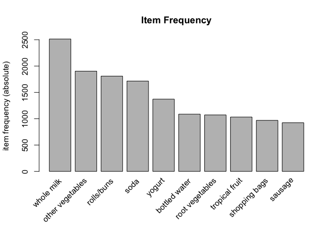

###### In the association rule analysis, we define support level is bigger than 0.01, and the confidence level is greater than 0.1. From below results, we can get more concise results.

    rules = apriori(gc, parameter=list(support=.01, confidence=.1, maxlen=2))

    ## Apriori
    ## 
    ## Parameter specification:
    ##  confidence minval smax arem  aval originalSupport maxtime support minlen
    ##         0.1    0.1    1 none FALSE            TRUE       5    0.01      1
    ##  maxlen target  ext
    ##       2  rules TRUE
    ## 
    ## Algorithmic control:
    ##  filter tree heap memopt load sort verbose
    ##     0.1 TRUE TRUE  FALSE TRUE    2    TRUE
    ## 
    ## Absolute minimum support count: 98 
    ## 
    ## set item appearances ...[0 item(s)] done [0.00s].
    ## set transactions ...[169 item(s), 9835 transaction(s)] done [0.01s].
    ## sorting and recoding items ... [88 item(s)] done [0.00s].
    ## creating transaction tree ... done [0.00s].
    ## checking subsets of size 1 2

    ## Warning in apriori(gc, parameter = list(support = 0.01, confidence = 0.1, :
    ## Mining stopped (maxlen reached). Only patterns up to a length of 2 returned!

    ##  done [0.00s].
    ## writing ... [339 rule(s)] done [0.00s].
    ## creating S4 object  ... done [0.00s].

    inspect(rules)

    ##       lhs                           rhs                     support   
    ## [1]   {}                         => {bottled water}         0.11052364
    ## [2]   {}                         => {tropical fruit}        0.10493137
    ## [3]   {}                         => {root vegetables}       0.10899847
    ## [4]   {}                         => {soda}                  0.17437722
    ## [5]   {}                         => {yogurt}                0.13950178
    ## [6]   {}                         => {rolls/buns}            0.18393493
    ## [7]   {}                         => {other vegetables}      0.19349263
    ## [8]   {}                         => {whole milk}            0.25551601
    ## [9]   {hard cheese}              => {whole milk}            0.01006609
    ## [10]  {butter milk}              => {other vegetables}      0.01037112
    ## [11]  {butter milk}              => {whole milk}            0.01159126
    ## [12]  {ham}                      => {whole milk}            0.01148958
    ## [13]  {sliced cheese}            => {whole milk}            0.01077783
    ## [14]  {oil}                      => {whole milk}            0.01128622
    ## [15]  {onions}                   => {other vegetables}      0.01423488
    ## [16]  {onions}                   => {whole milk}            0.01209964
    ## [17]  {berries}                  => {yogurt}                0.01057448
    ## [18]  {berries}                  => {other vegetables}      0.01026945
    ## [19]  {berries}                  => {whole milk}            0.01179461
    ## [20]  {hamburger meat}           => {other vegetables}      0.01382816
    ## [21]  {hamburger meat}           => {whole milk}            0.01474326
    ## [22]  {hygiene articles}         => {whole milk}            0.01281139
    ## [23]  {salty snack}              => {other vegetables}      0.01077783
    ## [24]  {salty snack}              => {whole milk}            0.01118454
    ## [25]  {sugar}                    => {other vegetables}      0.01077783
    ## [26]  {sugar}                    => {whole milk}            0.01504830
    ## [27]  {waffles}                  => {other vegetables}      0.01006609
    ## [28]  {waffles}                  => {whole milk}            0.01270971
    ## [29]  {long life bakery product} => {other vegetables}      0.01067616
    ## [30]  {long life bakery product} => {whole milk}            0.01352313
    ## [31]  {dessert}                  => {other vegetables}      0.01159126
    ## [32]  {dessert}                  => {whole milk}            0.01372649
    ## [33]  {canned beer}              => {shopping bags}         0.01138790
    ## [34]  {shopping bags}            => {canned beer}           0.01138790
    ## [35]  {canned beer}              => {soda}                  0.01382816
    ## [36]  {canned beer}              => {rolls/buns}            0.01128622
    ## [37]  {cream cheese}             => {yogurt}                0.01240468
    ## [38]  {cream cheese}             => {other vegetables}      0.01372649
    ## [39]  {cream cheese}             => {whole milk}            0.01647178
    ## [40]  {chicken}                  => {root vegetables}       0.01087951
    ## [41]  {chicken}                  => {other vegetables}      0.01789527
    ## [42]  {chicken}                  => {whole milk}            0.01759024
    ## [43]  {white bread}              => {soda}                  0.01026945
    ## [44]  {white bread}              => {other vegetables}      0.01372649
    ## [45]  {white bread}              => {whole milk}            0.01708185
    ## [46]  {chocolate}                => {soda}                  0.01352313
    ## [47]  {chocolate}                => {rolls/buns}            0.01179461
    ## [48]  {chocolate}                => {other vegetables}      0.01270971
    ## [49]  {chocolate}                => {whole milk}            0.01667514
    ## [50]  {coffee}                   => {rolls/buns}            0.01098119
    ## [51]  {coffee}                   => {other vegetables}      0.01342145
    ## [52]  {coffee}                   => {whole milk}            0.01870869
    ## [53]  {frozen vegetables}        => {root vegetables}       0.01159126
    ## [54]  {root vegetables}          => {frozen vegetables}     0.01159126
    ## [55]  {frozen vegetables}        => {yogurt}                0.01240468
    ## [56]  {frozen vegetables}        => {rolls/buns}            0.01016777
    ## [57]  {frozen vegetables}        => {other vegetables}      0.01779359
    ## [58]  {frozen vegetables}        => {whole milk}            0.02043721
    ## [59]  {beef}                     => {root vegetables}       0.01738688
    ## [60]  {root vegetables}          => {beef}                  0.01738688
    ## [61]  {beef}                     => {yogurt}                0.01169293
    ## [62]  {beef}                     => {rolls/buns}            0.01362481
    ## [63]  {beef}                     => {other vegetables}      0.01972547
    ## [64]  {other vegetables}         => {beef}                  0.01972547
    ## [65]  {beef}                     => {whole milk}            0.02125064
    ## [66]  {curd}                     => {whipped/sour cream}    0.01047280
    ## [67]  {whipped/sour cream}       => {curd}                  0.01047280
    ## [68]  {curd}                     => {tropical fruit}        0.01026945
    ## [69]  {curd}                     => {root vegetables}       0.01087951
    ## [70]  {curd}                     => {yogurt}                0.01728521
    ## [71]  {yogurt}                   => {curd}                  0.01728521
    ## [72]  {curd}                     => {rolls/buns}            0.01006609
    ## [73]  {curd}                     => {other vegetables}      0.01718353
    ## [74]  {curd}                     => {whole milk}            0.02613116
    ## [75]  {whole milk}               => {curd}                  0.02613116
    ## [76]  {napkins}                  => {tropical fruit}        0.01006609
    ## [77]  {napkins}                  => {soda}                  0.01199797
    ## [78]  {napkins}                  => {yogurt}                0.01230300
    ## [79]  {napkins}                  => {rolls/buns}            0.01169293
    ## [80]  {napkins}                  => {other vegetables}      0.01443823
    ## [81]  {napkins}                  => {whole milk}            0.01972547
    ## [82]  {pork}                     => {root vegetables}       0.01362481
    ## [83]  {root vegetables}          => {pork}                  0.01362481
    ## [84]  {pork}                     => {soda}                  0.01189629
    ## [85]  {pork}                     => {rolls/buns}            0.01128622
    ## [86]  {pork}                     => {other vegetables}      0.02165735
    ## [87]  {other vegetables}         => {pork}                  0.02165735
    ## [88]  {pork}                     => {whole milk}            0.02216573
    ## [89]  {frankfurter}              => {sausage}               0.01006609
    ## [90]  {sausage}                  => {frankfurter}           0.01006609
    ## [91]  {frankfurter}              => {root vegetables}       0.01016777
    ## [92]  {frankfurter}              => {soda}                  0.01128622
    ## [93]  {frankfurter}              => {yogurt}                0.01118454
    ## [94]  {frankfurter}              => {rolls/buns}            0.01921708
    ## [95]  {rolls/buns}               => {frankfurter}           0.01921708
    ## [96]  {frankfurter}              => {other vegetables}      0.01647178
    ## [97]  {frankfurter}              => {whole milk}            0.02053889
    ## [98]  {bottled beer}             => {bottled water}         0.01576004
    ## [99]  {bottled water}            => {bottled beer}          0.01576004
    ## [100] {bottled beer}             => {soda}                  0.01698017
    ## [101] {bottled beer}             => {rolls/buns}            0.01362481
    ## [102] {bottled beer}             => {other vegetables}      0.01616675
    ## [103] {bottled beer}             => {whole milk}            0.02043721
    ## [104] {brown bread}              => {sausage}               0.01067616
    ## [105] {sausage}                  => {brown bread}           0.01067616
    ## [106] {brown bread}              => {tropical fruit}        0.01067616
    ## [107] {tropical fruit}           => {brown bread}           0.01067616
    ## [108] {brown bread}              => {root vegetables}       0.01016777
    ## [109] {brown bread}              => {soda}                  0.01260803
    ## [110] {brown bread}              => {yogurt}                0.01453991
    ## [111] {yogurt}                   => {brown bread}           0.01453991
    ## [112] {brown bread}              => {rolls/buns}            0.01260803
    ## [113] {brown bread}              => {other vegetables}      0.01870869
    ## [114] {brown bread}              => {whole milk}            0.02521607
    ## [115] {margarine}                => {bottled water}         0.01026945
    ## [116] {margarine}                => {root vegetables}       0.01108287
    ## [117] {root vegetables}          => {margarine}             0.01108287
    ## [118] {margarine}                => {soda}                  0.01016777
    ## [119] {margarine}                => {yogurt}                0.01423488
    ## [120] {yogurt}                   => {margarine}             0.01423488
    ## [121] {margarine}                => {rolls/buns}            0.01474326
    ## [122] {margarine}                => {other vegetables}      0.01972547
    ## [123] {other vegetables}         => {margarine}             0.01972547
    ## [124] {margarine}                => {whole milk}            0.02419929
    ## [125] {butter}                   => {whipped/sour cream}    0.01016777
    ## [126] {whipped/sour cream}       => {butter}                0.01016777
    ## [127] {butter}                   => {root vegetables}       0.01291307
    ## [128] {root vegetables}          => {butter}                0.01291307
    ## [129] {butter}                   => {yogurt}                0.01464159
    ## [130] {yogurt}                   => {butter}                0.01464159
    ## [131] {butter}                   => {rolls/buns}            0.01342145
    ## [132] {butter}                   => {other vegetables}      0.02003050
    ## [133] {other vegetables}         => {butter}                0.02003050
    ## [134] {butter}                   => {whole milk}            0.02755465
    ## [135] {whole milk}               => {butter}                0.02755465
    ## [136] {newspapers}               => {bottled water}         0.01128622
    ## [137] {bottled water}            => {newspapers}            0.01128622
    ## [138] {newspapers}               => {tropical fruit}        0.01179461
    ## [139] {tropical fruit}           => {newspapers}            0.01179461
    ## [140] {newspapers}               => {root vegetables}       0.01148958
    ## [141] {root vegetables}          => {newspapers}            0.01148958
    ## [142] {newspapers}               => {soda}                  0.01464159
    ## [143] {newspapers}               => {yogurt}                0.01535333
    ## [144] {yogurt}                   => {newspapers}            0.01535333
    ## [145] {newspapers}               => {rolls/buns}            0.01972547
    ## [146] {rolls/buns}               => {newspapers}            0.01972547
    ## [147] {newspapers}               => {other vegetables}      0.01931876
    ## [148] {newspapers}               => {whole milk}            0.02735130
    ## [149] {whole milk}               => {newspapers}            0.02735130
    ## [150] {domestic eggs}            => {citrus fruit}          0.01037112
    ## [151] {citrus fruit}             => {domestic eggs}         0.01037112
    ## [152] {domestic eggs}            => {tropical fruit}        0.01138790
    ## [153] {tropical fruit}           => {domestic eggs}         0.01138790
    ## [154] {domestic eggs}            => {root vegetables}       0.01433655
    ## [155] {root vegetables}          => {domestic eggs}         0.01433655
    ## [156] {domestic eggs}            => {soda}                  0.01240468
    ## [157] {domestic eggs}            => {yogurt}                0.01433655
    ## [158] {yogurt}                   => {domestic eggs}         0.01433655
    ## [159] {domestic eggs}            => {rolls/buns}            0.01565836
    ## [160] {domestic eggs}            => {other vegetables}      0.02226741
    ## [161] {other vegetables}         => {domestic eggs}         0.02226741
    ## [162] {domestic eggs}            => {whole milk}            0.02999492
    ## [163] {whole milk}               => {domestic eggs}         0.02999492
    ## [164] {fruit/vegetable juice}    => {citrus fruit}          0.01037112
    ## [165] {citrus fruit}             => {fruit/vegetable juice} 0.01037112
    ## [166] {fruit/vegetable juice}    => {shopping bags}         0.01067616
    ## [167] {shopping bags}            => {fruit/vegetable juice} 0.01067616
    ## [168] {fruit/vegetable juice}    => {sausage}               0.01006609
    ## [169] {sausage}                  => {fruit/vegetable juice} 0.01006609
    ## [170] {fruit/vegetable juice}    => {bottled water}         0.01423488
    ## [171] {bottled water}            => {fruit/vegetable juice} 0.01423488
    ## [172] {fruit/vegetable juice}    => {tropical fruit}        0.01372649
    ## [173] {tropical fruit}           => {fruit/vegetable juice} 0.01372649
    ## [174] {fruit/vegetable juice}    => {root vegetables}       0.01199797
    ## [175] {root vegetables}          => {fruit/vegetable juice} 0.01199797
    ## [176] {fruit/vegetable juice}    => {soda}                  0.01840366
    ## [177] {soda}                     => {fruit/vegetable juice} 0.01840366
    ## [178] {fruit/vegetable juice}    => {yogurt}                0.01870869
    ## [179] {yogurt}                   => {fruit/vegetable juice} 0.01870869
    ## [180] {fruit/vegetable juice}    => {rolls/buns}            0.01453991
    ## [181] {fruit/vegetable juice}    => {other vegetables}      0.02104728
    ## [182] {other vegetables}         => {fruit/vegetable juice} 0.02104728
    ## [183] {fruit/vegetable juice}    => {whole milk}            0.02663955
    ## [184] {whole milk}               => {fruit/vegetable juice} 0.02663955
    ## [185] {whipped/sour cream}       => {citrus fruit}          0.01087951
    ## [186] {citrus fruit}             => {whipped/sour cream}    0.01087951
    ## [187] {whipped/sour cream}       => {tropical fruit}        0.01382816
    ## [188] {tropical fruit}           => {whipped/sour cream}    0.01382816
    ## [189] {whipped/sour cream}       => {root vegetables}       0.01708185
    ## [190] {root vegetables}          => {whipped/sour cream}    0.01708185
    ## [191] {whipped/sour cream}       => {soda}                  0.01159126
    ## [192] {whipped/sour cream}       => {yogurt}                0.02074225
    ## [193] {yogurt}                   => {whipped/sour cream}    0.02074225
    ## [194] {whipped/sour cream}       => {rolls/buns}            0.01464159
    ## [195] {whipped/sour cream}       => {other vegetables}      0.02887646
    ## [196] {other vegetables}         => {whipped/sour cream}    0.02887646
    ## [197] {whipped/sour cream}       => {whole milk}            0.03223183
    ## [198] {whole milk}               => {whipped/sour cream}    0.03223183
    ## [199] {pip fruit}                => {pastry}                0.01067616
    ## [200] {pastry}                   => {pip fruit}             0.01067616
    ## [201] {pip fruit}                => {citrus fruit}          0.01382816
    ## [202] {citrus fruit}             => {pip fruit}             0.01382816
    ## [203] {pip fruit}                => {sausage}               0.01077783
    ## [204] {sausage}                  => {pip fruit}             0.01077783
    ## [205] {pip fruit}                => {bottled water}         0.01057448
    ## [206] {pip fruit}                => {tropical fruit}        0.02043721
    ## [207] {tropical fruit}           => {pip fruit}             0.02043721
    ## [208] {pip fruit}                => {root vegetables}       0.01555669
    ## [209] {root vegetables}          => {pip fruit}             0.01555669
    ## [210] {pip fruit}                => {soda}                  0.01331978
    ## [211] {pip fruit}                => {yogurt}                0.01799695
    ## [212] {yogurt}                   => {pip fruit}             0.01799695
    ## [213] {pip fruit}                => {rolls/buns}            0.01392984
    ## [214] {pip fruit}                => {other vegetables}      0.02613116
    ## [215] {other vegetables}         => {pip fruit}             0.02613116
    ## [216] {pip fruit}                => {whole milk}            0.03009659
    ## [217] {whole milk}               => {pip fruit}             0.03009659
    ## [218] {pastry}                   => {shopping bags}         0.01189629
    ## [219] {shopping bags}            => {pastry}                0.01189629
    ## [220] {pastry}                   => {sausage}               0.01250635
    ## [221] {sausage}                  => {pastry}                0.01250635
    ## [222] {pastry}                   => {tropical fruit}        0.01321810
    ## [223] {tropical fruit}           => {pastry}                0.01321810
    ## [224] {pastry}                   => {root vegetables}       0.01098119
    ## [225] {root vegetables}          => {pastry}                0.01098119
    ## [226] {pastry}                   => {soda}                  0.02104728
    ## [227] {soda}                     => {pastry}                0.02104728
    ## [228] {pastry}                   => {yogurt}                0.01769192
    ## [229] {yogurt}                   => {pastry}                0.01769192
    ## [230] {pastry}                   => {rolls/buns}            0.02094560
    ## [231] {rolls/buns}               => {pastry}                0.02094560
    ## [232] {pastry}                   => {other vegetables}      0.02257245
    ## [233] {other vegetables}         => {pastry}                0.02257245
    ## [234] {pastry}                   => {whole milk}            0.03324860
    ## [235] {whole milk}               => {pastry}                0.03324860
    ## [236] {citrus fruit}             => {sausage}               0.01128622
    ## [237] {sausage}                  => {citrus fruit}          0.01128622
    ## [238] {citrus fruit}             => {bottled water}         0.01352313
    ## [239] {bottled water}            => {citrus fruit}          0.01352313
    ## [240] {citrus fruit}             => {tropical fruit}        0.01992883
    ## [241] {tropical fruit}           => {citrus fruit}          0.01992883
    ## [242] {citrus fruit}             => {root vegetables}       0.01769192
    ## [243] {root vegetables}          => {citrus fruit}          0.01769192
    ## [244] {citrus fruit}             => {soda}                  0.01281139
    ## [245] {citrus fruit}             => {yogurt}                0.02165735
    ## [246] {yogurt}                   => {citrus fruit}          0.02165735
    ## [247] {citrus fruit}             => {rolls/buns}            0.01677682
    ## [248] {citrus fruit}             => {other vegetables}      0.02887646
    ## [249] {other vegetables}         => {citrus fruit}          0.02887646
    ## [250] {citrus fruit}             => {whole milk}            0.03050330
    ## [251] {whole milk}               => {citrus fruit}          0.03050330
    ## [252] {shopping bags}            => {sausage}               0.01565836
    ## [253] {sausage}                  => {shopping bags}         0.01565836
    ## [254] {shopping bags}            => {bottled water}         0.01098119
    ## [255] {shopping bags}            => {tropical fruit}        0.01352313
    ## [256] {tropical fruit}           => {shopping bags}         0.01352313
    ## [257] {shopping bags}            => {root vegetables}       0.01281139
    ## [258] {root vegetables}          => {shopping bags}         0.01281139
    ## [259] {shopping bags}            => {soda}                  0.02460600
    ## [260] {soda}                     => {shopping bags}         0.02460600
    ## [261] {shopping bags}            => {yogurt}                0.01525165
    ## [262] {yogurt}                   => {shopping bags}         0.01525165
    ## [263] {shopping bags}            => {rolls/buns}            0.01952211
    ## [264] {rolls/buns}               => {shopping bags}         0.01952211
    ## [265] {shopping bags}            => {other vegetables}      0.02318251
    ## [266] {other vegetables}         => {shopping bags}         0.02318251
    ## [267] {shopping bags}            => {whole milk}            0.02450432
    ## [268] {sausage}                  => {bottled water}         0.01199797
    ## [269] {bottled water}            => {sausage}               0.01199797
    ## [270] {sausage}                  => {tropical fruit}        0.01392984
    ## [271] {tropical fruit}           => {sausage}               0.01392984
    ## [272] {sausage}                  => {root vegetables}       0.01494662
    ## [273] {root vegetables}          => {sausage}               0.01494662
    ## [274] {sausage}                  => {soda}                  0.02430097
    ## [275] {soda}                     => {sausage}               0.02430097
    ## [276] {sausage}                  => {yogurt}                0.01962379
    ## [277] {yogurt}                   => {sausage}               0.01962379
    ## [278] {sausage}                  => {rolls/buns}            0.03060498
    ## [279] {rolls/buns}               => {sausage}               0.03060498
    ## [280] {sausage}                  => {other vegetables}      0.02694459
    ## [281] {other vegetables}         => {sausage}               0.02694459
    ## [282] {sausage}                  => {whole milk}            0.02989324
    ## [283] {whole milk}               => {sausage}               0.02989324
    ## [284] {bottled water}            => {tropical fruit}        0.01850534
    ## [285] {tropical fruit}           => {bottled water}         0.01850534
    ## [286] {bottled water}            => {root vegetables}       0.01565836
    ## [287] {root vegetables}          => {bottled water}         0.01565836
    ## [288] {bottled water}            => {soda}                  0.02897814
    ## [289] {soda}                     => {bottled water}         0.02897814
    ## [290] {bottled water}            => {yogurt}                0.02297916
    ## [291] {yogurt}                   => {bottled water}         0.02297916
    ## [292] {bottled water}            => {rolls/buns}            0.02419929
    ## [293] {rolls/buns}               => {bottled water}         0.02419929
    ## [294] {bottled water}            => {other vegetables}      0.02480935
    ## [295] {other vegetables}         => {bottled water}         0.02480935
    ## [296] {bottled water}            => {whole milk}            0.03436706
    ## [297] {whole milk}               => {bottled water}         0.03436706
    ## [298] {tropical fruit}           => {root vegetables}       0.02104728
    ## [299] {root vegetables}          => {tropical fruit}        0.02104728
    ## [300] {tropical fruit}           => {soda}                  0.02084392
    ## [301] {soda}                     => {tropical fruit}        0.02084392
    ## [302] {tropical fruit}           => {yogurt}                0.02928317
    ## [303] {yogurt}                   => {tropical fruit}        0.02928317
    ## [304] {tropical fruit}           => {rolls/buns}            0.02460600
    ## [305] {rolls/buns}               => {tropical fruit}        0.02460600
    ## [306] {tropical fruit}           => {other vegetables}      0.03589222
    ## [307] {other vegetables}         => {tropical fruit}        0.03589222
    ## [308] {tropical fruit}           => {whole milk}            0.04229792
    ## [309] {whole milk}               => {tropical fruit}        0.04229792
    ## [310] {root vegetables}          => {soda}                  0.01860702
    ## [311] {soda}                     => {root vegetables}       0.01860702
    ## [312] {root vegetables}          => {yogurt}                0.02582613
    ## [313] {yogurt}                   => {root vegetables}       0.02582613
    ## [314] {root vegetables}          => {rolls/buns}            0.02430097
    ## [315] {rolls/buns}               => {root vegetables}       0.02430097
    ## [316] {root vegetables}          => {other vegetables}      0.04738180
    ## [317] {other vegetables}         => {root vegetables}       0.04738180
    ## [318] {root vegetables}          => {whole milk}            0.04890696
    ## [319] {whole milk}               => {root vegetables}       0.04890696
    ## [320] {soda}                     => {yogurt}                0.02735130
    ## [321] {yogurt}                   => {soda}                  0.02735130
    ## [322] {soda}                     => {rolls/buns}            0.03833249
    ## [323] {rolls/buns}               => {soda}                  0.03833249
    ## [324] {soda}                     => {other vegetables}      0.03274021
    ## [325] {other vegetables}         => {soda}                  0.03274021
    ## [326] {soda}                     => {whole milk}            0.04006101
    ## [327] {whole milk}               => {soda}                  0.04006101
    ## [328] {yogurt}                   => {rolls/buns}            0.03436706
    ## [329] {rolls/buns}               => {yogurt}                0.03436706
    ## [330] {yogurt}                   => {other vegetables}      0.04341637
    ## [331] {other vegetables}         => {yogurt}                0.04341637
    ## [332] {yogurt}                   => {whole milk}            0.05602440
    ## [333] {whole milk}               => {yogurt}                0.05602440
    ## [334] {rolls/buns}               => {other vegetables}      0.04260295
    ## [335] {other vegetables}         => {rolls/buns}            0.04260295
    ## [336] {rolls/buns}               => {whole milk}            0.05663447
    ## [337] {whole milk}               => {rolls/buns}            0.05663447
    ## [338] {other vegetables}         => {whole milk}            0.07483477
    ## [339] {whole milk}               => {other vegetables}      0.07483477
    ##       confidence coverage   lift      count
    ## [1]   0.1105236  1.00000000 1.0000000 1087 
    ## [2]   0.1049314  1.00000000 1.0000000 1032 
    ## [3]   0.1089985  1.00000000 1.0000000 1072 
    ## [4]   0.1743772  1.00000000 1.0000000 1715 
    ## [5]   0.1395018  1.00000000 1.0000000 1372 
    ## [6]   0.1839349  1.00000000 1.0000000 1809 
    ## [7]   0.1934926  1.00000000 1.0000000 1903 
    ## [8]   0.2555160  1.00000000 1.0000000 2513 
    ## [9]   0.4107884  0.02450432 1.6076815   99 
    ## [10]  0.3709091  0.02796136 1.9169159  102 
    ## [11]  0.4145455  0.02796136 1.6223854  114 
    ## [12]  0.4414062  0.02602949 1.7275091  113 
    ## [13]  0.4398340  0.02450432 1.7213560  106 
    ## [14]  0.4021739  0.02806304 1.5739675  111 
    ## [15]  0.4590164  0.03101169 2.3722681  140 
    ## [16]  0.3901639  0.03101169 1.5269647  119 
    ## [17]  0.3180428  0.03324860 2.2798477  104 
    ## [18]  0.3088685  0.03324860 1.5962805  101 
    ## [19]  0.3547401  0.03324860 1.3883281  116 
    ## [20]  0.4159021  0.03324860 2.1494470  136 
    ## [21]  0.4434251  0.03324860 1.7354101  145 
    ## [22]  0.3888889  0.03294357 1.5219746  126 
    ## [23]  0.2849462  0.03782410 1.4726465  106 
    ## [24]  0.2956989  0.03782410 1.1572618  110 
    ## [25]  0.3183183  0.03385867 1.6451186  106 
    ## [26]  0.4444444  0.03385867 1.7393996  148 
    ## [27]  0.2619048  0.03843416 1.3535645   99 
    ## [28]  0.3306878  0.03843416 1.2941961  125 
    ## [29]  0.2853261  0.03741739 1.4746096  105 
    ## [30]  0.3614130  0.03741739 1.4144438  133 
    ## [31]  0.3123288  0.03711235 1.6141636  114 
    ## [32]  0.3698630  0.03711235 1.4475140  135 
    ## [33]  0.1465969  0.07768175 1.4879052  112 
    ## [34]  0.1155831  0.09852567 1.4879052  112 
    ## [35]  0.1780105  0.07768175 1.0208356  136 
    ## [36]  0.1452880  0.07768175 0.7898878  111 
    ## [37]  0.3128205  0.03965430 2.2424123  122 
    ## [38]  0.3461538  0.03965430 1.7889769  135 
    ## [39]  0.4153846  0.03965430 1.6256696  162 
    ## [40]  0.2535545  0.04290798 2.3262206  107 
    ## [41]  0.4170616  0.04290798 2.1554393  176 
    ## [42]  0.4099526  0.04290798 1.6044106  173 
    ## [43]  0.2439614  0.04209456 1.3990437  101 
    ## [44]  0.3260870  0.04209456 1.6852681  135 
    ## [45]  0.4057971  0.04209456 1.5881474  168 
    ## [46]  0.2725410  0.04961871 1.5629391  133 
    ## [47]  0.2377049  0.04961871 1.2923316  116 
    ## [48]  0.2561475  0.04961871 1.3238103  125 
    ## [49]  0.3360656  0.04961871 1.3152427  164 
    ## [50]  0.1891419  0.05805796 1.0283085  108 
    ## [51]  0.2311734  0.05805796 1.1947400  132 
    ## [52]  0.3222417  0.05805796 1.2611408  184 
    ## [53]  0.2410148  0.04809354 2.2111759  114 
    ## [54]  0.1063433  0.10899847 2.2111759  114 
    ## [55]  0.2579281  0.04809354 1.8489235  122 
    ## [56]  0.2114165  0.04809354 1.1494092  100 
    ## [57]  0.3699789  0.04809354 1.9121083  175 
    ## [58]  0.4249471  0.04809354 1.6630940  201 
    ## [59]  0.3313953  0.05246568 3.0403668  171 
    ## [60]  0.1595149  0.10899847 3.0403668  171 
    ## [61]  0.2228682  0.05246568 1.5976012  115 
    ## [62]  0.2596899  0.05246568 1.4118576  134 
    ## [63]  0.3759690  0.05246568 1.9430662  194 
    ## [64]  0.1019443  0.19349263 1.9430662  194 
    ## [65]  0.4050388  0.05246568 1.5851795  209 
    ## [66]  0.1965649  0.05327911 2.7421499  103 
    ## [67]  0.1460993  0.07168277 2.7421499  103 
    ## [68]  0.1927481  0.05327911 1.8368968  101 
    ## [69]  0.2041985  0.05327911 1.8734067  107 
    ## [70]  0.3244275  0.05327911 2.3256154  170 
    ## [71]  0.1239067  0.13950178 2.3256154  170 
    ## [72]  0.1889313  0.05327911 1.0271638   99 
    ## [73]  0.3225191  0.05327911 1.6668288  169 
    ## [74]  0.4904580  0.05327911 1.9194805  257 
    ## [75]  0.1022682  0.25551601 1.9194805  257 
    ## [76]  0.1922330  0.05236401 1.8319880   99 
    ## [77]  0.2291262  0.05236401 1.3139687  118 
    ## [78]  0.2349515  0.05236401 1.6842183  121 
    ## [79]  0.2233010  0.05236401 1.2140216  115 
    ## [80]  0.2757282  0.05236401 1.4250060  142 
    ## [81]  0.3766990  0.05236401 1.4742678  194 
    ## [82]  0.2363316  0.05765125 2.1682099  134 
    ## [83]  0.1250000  0.10899847 2.1682099  134 
    ## [84]  0.2063492  0.05765125 1.1833495  117 
    ## [85]  0.1957672  0.05765125 1.0643286  111 
    ## [86]  0.3756614  0.05765125 1.9414764  213 
    ## [87]  0.1119285  0.19349263 1.9414764  213 
    ## [88]  0.3844797  0.05765125 1.5047187  218 
    ## [89]  0.1706897  0.05897306 1.8168103   99 
    ## [90]  0.1071429  0.09395018 1.8168103   99 
    ## [91]  0.1724138  0.05897306 1.5818001  100 
    ## [92]  0.1913793  0.05897306 1.0975018  111 
    ## [93]  0.1896552  0.05897306 1.3595179  110 
    ## [94]  0.3258621  0.05897306 1.7716161  189 
    ## [95]  0.1044776  0.18393493 1.7716161  189 
    ## [96]  0.2793103  0.05897306 1.4435193  162 
    ## [97]  0.3482759  0.05897306 1.3630295  202 
    ## [98]  0.1957071  0.08052872 1.7707259  155 
    ## [99]  0.1425943  0.11052364 1.7707259  155 
    ## [100] 0.2108586  0.08052872 1.2092094  167 
    ## [101] 0.1691919  0.08052872 0.9198466  134 
    ## [102] 0.2007576  0.08052872 1.0375464  159 
    ## [103] 0.2537879  0.08052872 0.9932367  201 
    ## [104] 0.1645768  0.06487036 1.7517455  105 
    ## [105] 0.1136364  0.09395018 1.7517455  105 
    ## [106] 0.1645768  0.06487036 1.5684233  105 
    ## [107] 0.1017442  0.10493137 1.5684233  105 
    ## [108] 0.1567398  0.06487036 1.4380000  100 
    ## [109] 0.1943574  0.06487036 1.1145800  124 
    ## [110] 0.2241379  0.06487036 1.6067030  143 
    ## [111] 0.1042274  0.13950178 1.6067030  143 
    ## [112] 0.1943574  0.06487036 1.0566637  124 
    ## [113] 0.2884013  0.06487036 1.4905025  184 
    ## [114] 0.3887147  0.06487036 1.5212930  248 
    ## [115] 0.1753472  0.05856634 1.5865133  101 
    ## [116] 0.1892361  0.05856634 1.7361354  109 
    ## [117] 0.1016791  0.10899847 1.7361354  109 
    ## [118] 0.1736111  0.05856634 0.9956066  100 
    ## [119] 0.2430556  0.05856634 1.7423115  140 
    ## [120] 0.1020408  0.13950178 1.7423115  140 
    ## [121] 0.2517361  0.05856634 1.3686151  145 
    ## [122] 0.3368056  0.05856634 1.7406635  194 
    ## [123] 0.1019443  0.19349263 1.7406635  194 
    ## [124] 0.4131944  0.05856634 1.6170980  238 
    ## [125] 0.1834862  0.05541434 2.5596981  100 
    ## [126] 0.1418440  0.07168277 2.5596981  100 
    ## [127] 0.2330275  0.05541434 2.1378971  127 
    ## [128] 0.1184701  0.10899847 2.1378971  127 
    ## [129] 0.2642202  0.05541434 1.8940273  144 
    ## [130] 0.1049563  0.13950178 1.8940273  144 
    ## [131] 0.2422018  0.05541434 1.3167800  132 
    ## [132] 0.3614679  0.05541434 1.8681223  197 
    ## [133] 0.1035208  0.19349263 1.8681223  197 
    ## [134] 0.4972477  0.05541434 1.9460530  271 
    ## [135] 0.1078392  0.25551601 1.9460530  271 
    ## [136] 0.1414013  0.07981698 1.2793758  111 
    ## [137] 0.1021159  0.11052364 1.2793758  111 
    ## [138] 0.1477707  0.07981698 1.4082605  116 
    ## [139] 0.1124031  0.10493137 1.4082605  116 
    ## [140] 0.1439490  0.07981698 1.3206519  113 
    ## [141] 0.1054104  0.10899847 1.3206519  113 
    ## [142] 0.1834395  0.07981698 1.0519693  144 
    ## [143] 0.1923567  0.07981698 1.3788834  151 
    ## [144] 0.1100583  0.13950178 1.3788834  151 
    ## [145] 0.2471338  0.07981698 1.3435934  194 
    ## [146] 0.1072416  0.18393493 1.3435934  194 
    ## [147] 0.2420382  0.07981698 1.2508912  190 
    ## [148] 0.3426752  0.07981698 1.3411103  269 
    ## [149] 0.1070434  0.25551601 1.3411103  269 
    ## [150] 0.1634615  0.06344687 1.9749929  102 
    ## [151] 0.1253071  0.08276563 1.9749929  102 
    ## [152] 0.1794872  0.06344687 1.7105198  112 
    ## [153] 0.1085271  0.10493137 1.7105198  112 
    ## [154] 0.2259615  0.06344687 2.0730706  141 
    ## [155] 0.1315299  0.10899847 2.0730706  141 
    ## [156] 0.1955128  0.06344687 1.1212062  122 
    ## [157] 0.2259615  0.06344687 1.6197753  141 
    ## [158] 0.1027697  0.13950178 1.6197753  141 
    ## [159] 0.2467949  0.06344687 1.3417510  154 
    ## [160] 0.3509615  0.06344687 1.8138238  219 
    ## [161] 0.1150815  0.19349263 1.8138238  219 
    ## [162] 0.4727564  0.06344687 1.8502027  295 
    ## [163] 0.1173896  0.25551601 1.8502027  295 
    ## [164] 0.1434599  0.07229283 1.7333271  102 
    ## [165] 0.1253071  0.08276563 1.7333271  102 
    ## [166] 0.1476793  0.07229283 1.4988918  105 
    ## [167] 0.1083591  0.09852567 1.4988918  105 
    ## [168] 0.1392405  0.07229283 1.4820675   99 
    ## [169] 0.1071429  0.09395018 1.4820675   99 
    ## [170] 0.1969058  0.07229283 1.7815715  140 
    ## [171] 0.1287948  0.11052364 1.7815715  140 
    ## [172] 0.1898734  0.07229283 1.8095010  135 
    ## [173] 0.1308140  0.10493137 1.8095010  135 
    ## [174] 0.1659634  0.07229283 1.5226216  118 
    ## [175] 0.1100746  0.10899847 1.5226216  118 
    ## [176] 0.2545710  0.07229283 1.4598869  181 
    ## [177] 0.1055394  0.17437722 1.4598869  181 
    ## [178] 0.2587904  0.07229283 1.8551049  184 
    ## [179] 0.1341108  0.13950178 1.8551049  184 
    ## [180] 0.2011252  0.07229283 1.0934583  143 
    ## [181] 0.2911392  0.07229283 1.5046529  207 
    ## [182] 0.1087756  0.19349263 1.5046529  207 
    ## [183] 0.3684951  0.07229283 1.4421604  262 
    ## [184] 0.1042579  0.25551601 1.4421604  262 
    ## [185] 0.1517730  0.07168277 1.8337690  107 
    ## [186] 0.1314496  0.08276563 1.8337690  107 
    ## [187] 0.1929078  0.07168277 1.8384188  136 
    ## [188] 0.1317829  0.10493137 1.8384188  136 
    ## [189] 0.2382979  0.07168277 2.1862496  168 
    ## [190] 0.1567164  0.10899847 2.1862496  168 
    ## [191] 0.1617021  0.07168277 0.9273122  114 
    ## [192] 0.2893617  0.07168277 2.0742510  204 
    ## [193] 0.1486880  0.13950178 2.0742510  204 
    ## [194] 0.2042553  0.07168277 1.1104760  144 
    ## [195] 0.4028369  0.07168277 2.0819237  284 
    ## [196] 0.1492380  0.19349263 2.0819237  284 
    ## [197] 0.4496454  0.07168277 1.7597542  317 
    ## [198] 0.1261441  0.25551601 1.7597542  317 
    ## [199] 0.1411290  0.07564820 1.5862903  105 
    ## [200] 0.1200000  0.08896797 1.5862903  105 
    ## [201] 0.1827957  0.07564820 2.2085942  136 
    ## [202] 0.1670762  0.08276563 2.2085942  136 
    ## [203] 0.1424731  0.07564820 1.5164752  106 
    ## [204] 0.1147186  0.09395018 1.5164752  106 
    ## [205] 0.1397849  0.07564820 1.2647516  104 
    ## [206] 0.2701613  0.07564820 2.5746476  201 
    ## [207] 0.1947674  0.10493137 2.5746476  201 
    ## [208] 0.2056452  0.07564820 1.8866793  153 
    ## [209] 0.1427239  0.10899847 1.8866793  153 
    ## [210] 0.1760753  0.07564820 1.0097378  131 
    ## [211] 0.2379032  0.07564820 1.7053777  177 
    ## [212] 0.1290087  0.13950178 1.7053777  177 
    ## [213] 0.1841398  0.07564820 1.0011138  137 
    ## [214] 0.3454301  0.07564820 1.7852365  257 
    ## [215] 0.1350499  0.19349263 1.7852365  257 
    ## [216] 0.3978495  0.07564820 1.5570432  296 
    ## [217] 0.1177875  0.25551601 1.5570432  296 
    ## [218] 0.1337143  0.08896797 1.3571517  117 
    ## [219] 0.1207430  0.09852567 1.3571517  117 
    ## [220] 0.1405714  0.08896797 1.4962338  123 
    ## [221] 0.1331169  0.09395018 1.4962338  123 
    ## [222] 0.1485714  0.08896797 1.4158915  130 
    ## [223] 0.1259690  0.10493137 1.4158915  130 
    ## [224] 0.1234286  0.08896797 1.1323881  108 
    ## [225] 0.1007463  0.10899847 1.1323881  108 
    ## [226] 0.2365714  0.08896797 1.3566647  207 
    ## [227] 0.1206997  0.17437722 1.3566647  207 
    ## [228] 0.1988571  0.08896797 1.4254810  174 
    ## [229] 0.1268222  0.13950178 1.4254810  174 
    ## [230] 0.2354286  0.08896797 1.2799558  206 
    ## [231] 0.1138751  0.18393493 1.2799558  206 
    ## [232] 0.2537143  0.08896797 1.3112349  222 
    ## [233] 0.1166579  0.19349263 1.3112349  222 
    ## [234] 0.3737143  0.08896797 1.4625865  327 
    ## [235] 0.1301234  0.25551601 1.4625865  327 
    ## [236] 0.1363636  0.08276563 1.4514463  111 
    ## [237] 0.1201299  0.09395018 1.4514463  111 
    ## [238] 0.1633907  0.08276563 1.4783323  133 
    ## [239] 0.1223551  0.11052364 1.4783323  133 
    ## [240] 0.2407862  0.08276563 2.2947022  196 
    ## [241] 0.1899225  0.10493137 2.2947022  196 
    ## [242] 0.2137592  0.08276563 1.9611211  174 
    ## [243] 0.1623134  0.10899847 1.9611211  174 
    ## [244] 0.1547912  0.08276563 0.8876799  126 
    ## [245] 0.2616708  0.08276563 1.8757521  213 
    ## [246] 0.1552478  0.13950178 1.8757521  213 
    ## [247] 0.2027027  0.08276563 1.1020349  165 
    ## [248] 0.3488943  0.08276563 1.8031403  284 
    ## [249] 0.1492380  0.19349263 1.8031403  284 
    ## [250] 0.3685504  0.08276563 1.4423768  300 
    ## [251] 0.1193792  0.25551601 1.4423768  300 
    ## [252] 0.1589267  0.09852567 1.6916065  154 
    ## [253] 0.1666667  0.09395018 1.6916065  154 
    ## [254] 0.1114551  0.09852567 1.0084278  108 
    ## [255] 0.1372549  0.09852567 1.3080445  133 
    ## [256] 0.1288760  0.10493137 1.3080445  133 
    ## [257] 0.1300310  0.09852567 1.1929613  126 
    ## [258] 0.1175373  0.10899847 1.1929613  126 
    ## [259] 0.2497420  0.09852567 1.4321939  242 
    ## [260] 0.1411079  0.17437722 1.4321939  242 
    ## [261] 0.1547988  0.09852567 1.1096544  150 
    ## [262] 0.1093294  0.13950178 1.1096544  150 
    ## [263] 0.1981424  0.09852567 1.0772419  192 
    ## [264] 0.1061360  0.18393493 1.0772419  192 
    ## [265] 0.2352941  0.09852567 1.2160366  228 
    ## [266] 0.1198108  0.19349263 1.2160366  228 
    ## [267] 0.2487100  0.09852567 0.9733637  241 
    ## [268] 0.1277056  0.09395018 1.1554598  118 
    ## [269] 0.1085557  0.11052364 1.1554598  118 
    ## [270] 0.1482684  0.09395018 1.4130036  137 
    ## [271] 0.1327519  0.10493137 1.4130036  137 
    ## [272] 0.1590909  0.09395018 1.4595700  147 
    ## [273] 0.1371269  0.10899847 1.4595700  147 
    ## [274] 0.2586580  0.09395018 1.4833245  239 
    ## [275] 0.1393586  0.17437722 1.4833245  239 
    ## [276] 0.2088745  0.09395018 1.4972889  193 
    ## [277] 0.1406706  0.13950178 1.4972889  193 
    ## [278] 0.3257576  0.09395018 1.7710480  301 
    ## [279] 0.1663903  0.18393493 1.7710480  301 
    ## [280] 0.2867965  0.09395018 1.4822091  265 
    ## [281] 0.1392538  0.19349263 1.4822091  265 
    ## [282] 0.3181818  0.09395018 1.2452520  294 
    ## [283] 0.1169916  0.25551601 1.2452520  294 
    ## [284] 0.1674333  0.11052364 1.5956459  182 
    ## [285] 0.1763566  0.10493137 1.5956459  182 
    ## [286] 0.1416743  0.11052364 1.2997827  154 
    ## [287] 0.1436567  0.10899847 1.2997827  154 
    ## [288] 0.2621895  0.11052364 1.5035766  285 
    ## [289] 0.1661808  0.17437722 1.5035766  285 
    ## [290] 0.2079117  0.11052364 1.4903873  226 
    ## [291] 0.1647230  0.13950178 1.4903873  226 
    ## [292] 0.2189512  0.11052364 1.1903734  238 
    ## [293] 0.1315644  0.18393493 1.1903734  238 
    ## [294] 0.2244710  0.11052364 1.1601012  244 
    ## [295] 0.1282186  0.19349263 1.1601012  244 
    ## [296] 0.3109476  0.11052364 1.2169396  338 
    ## [297] 0.1345006  0.25551601 1.2169396  338 
    ## [298] 0.2005814  0.10493137 1.8402220  207 
    ## [299] 0.1930970  0.10899847 1.8402220  207 
    ## [300] 0.1986434  0.10493137 1.1391592  205 
    ## [301] 0.1195335  0.17437722 1.1391592  205 
    ## [302] 0.2790698  0.10493137 2.0004746  288 
    ## [303] 0.2099125  0.13950178 2.0004746  288 
    ## [304] 0.2344961  0.10493137 1.2748863  242 
    ## [305] 0.1337756  0.18393493 1.2748863  242 
    ## [306] 0.3420543  0.10493137 1.7677896  353 
    ## [307] 0.1854966  0.19349263 1.7677896  353 
    ## [308] 0.4031008  0.10493137 1.5775950  416 
    ## [309] 0.1655392  0.25551601 1.5775950  416 
    ## [310] 0.1707090  0.10899847 0.9789636  183 
    ## [311] 0.1067055  0.17437722 0.9789636  183 
    ## [312] 0.2369403  0.10899847 1.6984751  254 
    ## [313] 0.1851312  0.13950178 1.6984751  254 
    ## [314] 0.2229478  0.10899847 1.2121013  239 
    ## [315] 0.1321172  0.18393493 1.2121013  239 
    ## [316] 0.4347015  0.10899847 2.2466049  466 
    ## [317] 0.2448765  0.19349263 2.2466049  466 
    ## [318] 0.4486940  0.10899847 1.7560310  481 
    ## [319] 0.1914047  0.25551601 1.7560310  481 
    ## [320] 0.1568513  0.17437722 1.1243678  269 
    ## [321] 0.1960641  0.13950178 1.1243678  269 
    ## [322] 0.2198251  0.17437722 1.1951242  377 
    ## [323] 0.2084024  0.18393493 1.1951242  377 
    ## [324] 0.1877551  0.17437722 0.9703476  322 
    ## [325] 0.1692065  0.19349263 0.9703476  322 
    ## [326] 0.2297376  0.17437722 0.8991124  394 
    ## [327] 0.1567847  0.25551601 0.8991124  394 
    ## [328] 0.2463557  0.13950178 1.3393633  338 
    ## [329] 0.1868436  0.18393493 1.3393633  338 
    ## [330] 0.3112245  0.13950178 1.6084566  427 
    ## [331] 0.2243826  0.19349263 1.6084566  427 
    ## [332] 0.4016035  0.13950178 1.5717351  551 
    ## [333] 0.2192598  0.25551601 1.5717351  551 
    ## [334] 0.2316197  0.18393493 1.1970465  419 
    ## [335] 0.2201787  0.19349263 1.1970465  419 
    ## [336] 0.3079049  0.18393493 1.2050318  557 
    ## [337] 0.2216474  0.25551601 1.2050318  557 
    ## [338] 0.3867578  0.19349263 1.5136341  736 
    ## [339] 0.2928770  0.25551601 1.5136341  736

###### We got 339 rules from the analysis. For the first 8 rows, we can see some most often purchased items without anyother information. They are bottled watter, tropical fruit, root vegetables, etc.

###### Subset some rules to get specific information

    ## Choose a subset
    inspect(subset(rules, lift > 2))

    ##      lhs                     rhs                  support    confidence
    ## [1]  {onions}             => {other vegetables}   0.01423488 0.4590164 
    ## [2]  {berries}            => {yogurt}             0.01057448 0.3180428 
    ## [3]  {hamburger meat}     => {other vegetables}   0.01382816 0.4159021 
    ## [4]  {cream cheese}       => {yogurt}             0.01240468 0.3128205 
    ## [5]  {chicken}            => {root vegetables}    0.01087951 0.2535545 
    ## [6]  {chicken}            => {other vegetables}   0.01789527 0.4170616 
    ## [7]  {frozen vegetables}  => {root vegetables}    0.01159126 0.2410148 
    ## [8]  {root vegetables}    => {frozen vegetables}  0.01159126 0.1063433 
    ## [9]  {beef}               => {root vegetables}    0.01738688 0.3313953 
    ## [10] {root vegetables}    => {beef}               0.01738688 0.1595149 
    ## [11] {curd}               => {whipped/sour cream} 0.01047280 0.1965649 
    ## [12] {whipped/sour cream} => {curd}               0.01047280 0.1460993 
    ## [13] {curd}               => {yogurt}             0.01728521 0.3244275 
    ## [14] {yogurt}             => {curd}               0.01728521 0.1239067 
    ## [15] {pork}               => {root vegetables}    0.01362481 0.2363316 
    ## [16] {root vegetables}    => {pork}               0.01362481 0.1250000 
    ## [17] {butter}             => {whipped/sour cream} 0.01016777 0.1834862 
    ## [18] {whipped/sour cream} => {butter}             0.01016777 0.1418440 
    ## [19] {butter}             => {root vegetables}    0.01291307 0.2330275 
    ## [20] {root vegetables}    => {butter}             0.01291307 0.1184701 
    ## [21] {domestic eggs}      => {root vegetables}    0.01433655 0.2259615 
    ## [22] {root vegetables}    => {domestic eggs}      0.01433655 0.1315299 
    ## [23] {whipped/sour cream} => {root vegetables}    0.01708185 0.2382979 
    ## [24] {root vegetables}    => {whipped/sour cream} 0.01708185 0.1567164 
    ## [25] {whipped/sour cream} => {yogurt}             0.02074225 0.2893617 
    ## [26] {yogurt}             => {whipped/sour cream} 0.02074225 0.1486880 
    ## [27] {whipped/sour cream} => {other vegetables}   0.02887646 0.4028369 
    ## [28] {other vegetables}   => {whipped/sour cream} 0.02887646 0.1492380 
    ## [29] {pip fruit}          => {citrus fruit}       0.01382816 0.1827957 
    ## [30] {citrus fruit}       => {pip fruit}          0.01382816 0.1670762 
    ## [31] {pip fruit}          => {tropical fruit}     0.02043721 0.2701613 
    ## [32] {tropical fruit}     => {pip fruit}          0.02043721 0.1947674 
    ## [33] {citrus fruit}       => {tropical fruit}     0.01992883 0.2407862 
    ## [34] {tropical fruit}     => {citrus fruit}       0.01992883 0.1899225 
    ## [35] {tropical fruit}     => {yogurt}             0.02928317 0.2790698 
    ## [36] {yogurt}             => {tropical fruit}     0.02928317 0.2099125 
    ## [37] {root vegetables}    => {other vegetables}   0.04738180 0.4347015 
    ## [38] {other vegetables}   => {root vegetables}    0.04738180 0.2448765 
    ##      coverage   lift     count
    ## [1]  0.03101169 2.372268 140  
    ## [2]  0.03324860 2.279848 104  
    ## [3]  0.03324860 2.149447 136  
    ## [4]  0.03965430 2.242412 122  
    ## [5]  0.04290798 2.326221 107  
    ## [6]  0.04290798 2.155439 176  
    ## [7]  0.04809354 2.211176 114  
    ## [8]  0.10899847 2.211176 114  
    ## [9]  0.05246568 3.040367 171  
    ## [10] 0.10899847 3.040367 171  
    ## [11] 0.05327911 2.742150 103  
    ## [12] 0.07168277 2.742150 103  
    ## [13] 0.05327911 2.325615 170  
    ## [14] 0.13950178 2.325615 170  
    ## [15] 0.05765125 2.168210 134  
    ## [16] 0.10899847 2.168210 134  
    ## [17] 0.05541434 2.559698 100  
    ## [18] 0.07168277 2.559698 100  
    ## [19] 0.05541434 2.137897 127  
    ## [20] 0.10899847 2.137897 127  
    ## [21] 0.06344687 2.073071 141  
    ## [22] 0.10899847 2.073071 141  
    ## [23] 0.07168277 2.186250 168  
    ## [24] 0.10899847 2.186250 168  
    ## [25] 0.07168277 2.074251 204  
    ## [26] 0.13950178 2.074251 204  
    ## [27] 0.07168277 2.081924 284  
    ## [28] 0.19349263 2.081924 284  
    ## [29] 0.07564820 2.208594 136  
    ## [30] 0.08276563 2.208594 136  
    ## [31] 0.07564820 2.574648 201  
    ## [32] 0.10493137 2.574648 201  
    ## [33] 0.08276563 2.294702 196  
    ## [34] 0.10493137 2.294702 196  
    ## [35] 0.10493137 2.000475 288  
    ## [36] 0.13950178 2.000475 288  
    ## [37] 0.10899847 2.246605 466  
    ## [38] 0.19349263 2.246605 466

###### In the above subset rules where lift &gt; 2, we can see that given the left handside items are purchased, the probability of the right-handside items are more than twice than you have no given information. Take the example of Row 1: there are 1.42% of customers buy onions and other vegetables at the same time. If you know a person purchased onions, there is a chance of 45.9% that he/she also purchased other vegetables. Given a person buys onions, the probility that this person buys other vegetables is 2.37 times higher than you don’t know anything.

    inspect(subset(rules, confidence > 0.4))

    ##      lhs                     rhs                support    confidence
    ## [1]  {hard cheese}        => {whole milk}       0.01006609 0.4107884 
    ## [2]  {butter milk}        => {whole milk}       0.01159126 0.4145455 
    ## [3]  {ham}                => {whole milk}       0.01148958 0.4414062 
    ## [4]  {sliced cheese}      => {whole milk}       0.01077783 0.4398340 
    ## [5]  {oil}                => {whole milk}       0.01128622 0.4021739 
    ## [6]  {onions}             => {other vegetables} 0.01423488 0.4590164 
    ## [7]  {hamburger meat}     => {other vegetables} 0.01382816 0.4159021 
    ## [8]  {hamburger meat}     => {whole milk}       0.01474326 0.4434251 
    ## [9]  {sugar}              => {whole milk}       0.01504830 0.4444444 
    ## [10] {cream cheese}       => {whole milk}       0.01647178 0.4153846 
    ## [11] {chicken}            => {other vegetables} 0.01789527 0.4170616 
    ## [12] {chicken}            => {whole milk}       0.01759024 0.4099526 
    ## [13] {white bread}        => {whole milk}       0.01708185 0.4057971 
    ## [14] {frozen vegetables}  => {whole milk}       0.02043721 0.4249471 
    ## [15] {beef}               => {whole milk}       0.02125064 0.4050388 
    ## [16] {curd}               => {whole milk}       0.02613116 0.4904580 
    ## [17] {margarine}          => {whole milk}       0.02419929 0.4131944 
    ## [18] {butter}             => {whole milk}       0.02755465 0.4972477 
    ## [19] {domestic eggs}      => {whole milk}       0.02999492 0.4727564 
    ## [20] {whipped/sour cream} => {other vegetables} 0.02887646 0.4028369 
    ## [21] {whipped/sour cream} => {whole milk}       0.03223183 0.4496454 
    ## [22] {tropical fruit}     => {whole milk}       0.04229792 0.4031008 
    ## [23] {root vegetables}    => {other vegetables} 0.04738180 0.4347015 
    ## [24] {root vegetables}    => {whole milk}       0.04890696 0.4486940 
    ## [25] {yogurt}             => {whole milk}       0.05602440 0.4016035 
    ##      coverage   lift     count
    ## [1]  0.02450432 1.607682  99  
    ## [2]  0.02796136 1.622385 114  
    ## [3]  0.02602949 1.727509 113  
    ## [4]  0.02450432 1.721356 106  
    ## [5]  0.02806304 1.573968 111  
    ## [6]  0.03101169 2.372268 140  
    ## [7]  0.03324860 2.149447 136  
    ## [8]  0.03324860 1.735410 145  
    ## [9]  0.03385867 1.739400 148  
    ## [10] 0.03965430 1.625670 162  
    ## [11] 0.04290798 2.155439 176  
    ## [12] 0.04290798 1.604411 173  
    ## [13] 0.04209456 1.588147 168  
    ## [14] 0.04809354 1.663094 201  
    ## [15] 0.05246568 1.585180 209  
    ## [16] 0.05327911 1.919481 257  
    ## [17] 0.05856634 1.617098 238  
    ## [18] 0.05541434 1.946053 271  
    ## [19] 0.06344687 1.850203 295  
    ## [20] 0.07168277 2.081924 284  
    ## [21] 0.07168277 1.759754 317  
    ## [22] 0.10493137 1.577595 416  
    ## [23] 0.10899847 2.246605 466  
    ## [24] 0.10899847 1.756031 481  
    ## [25] 0.13950178 1.571735 551

###### In the above subset rules where confidence level &gt; 0.4, we can see that given the left-handside items are purchased, the probability of the right-handside items are more than 40%. Take the example of Row 1: there are 1% of customers buy hard cheese and whole milk at the same time. If you know a person purchased hard cheese, there is a chance of 41.08% that he/she also purchased whole milk. Given a person buys hard cheese, the probility that this person buys whole milk is 1.61 times higher than you don’t know anything.

    inspect(subset(rules, lift > 3 & confidence > 0.3))

    ##     lhs       rhs               support    confidence coverage   lift     count
    ## [1] {beef} => {root vegetables} 0.01738688 0.3313953  0.05246568 3.040367 171

###### From the results where lift &gt; 3 and confidence &gt;0.3, we can see a strong association between beef and root vagetables. To be specific, there are 1.74% of customers buy beef and root vegetables at the same time. If you know a person purchased beef, there is a chance of 33.14% that he/she also purchased root vegetables. Given a person buys beef, the probility that this person buys root vegetables is 3.04 times higher than you don’t know anything!

    inspect(sort (rules, by="support", decreasing=TRUE))

    ##       lhs                           rhs                     support   
    ## [1]   {}                         => {whole milk}            0.25551601
    ## [2]   {}                         => {other vegetables}      0.19349263
    ## [3]   {}                         => {rolls/buns}            0.18393493
    ## [4]   {}                         => {soda}                  0.17437722
    ## [5]   {}                         => {yogurt}                0.13950178
    ## [6]   {}                         => {bottled water}         0.11052364
    ## [7]   {}                         => {root vegetables}       0.10899847
    ## [8]   {}                         => {tropical fruit}        0.10493137
    ## [9]   {other vegetables}         => {whole milk}            0.07483477
    ## [10]  {whole milk}               => {other vegetables}      0.07483477
    ## [11]  {rolls/buns}               => {whole milk}            0.05663447
    ## [12]  {whole milk}               => {rolls/buns}            0.05663447
    ## [13]  {yogurt}                   => {whole milk}            0.05602440
    ## [14]  {whole milk}               => {yogurt}                0.05602440
    ## [15]  {root vegetables}          => {whole milk}            0.04890696
    ## [16]  {whole milk}               => {root vegetables}       0.04890696
    ## [17]  {root vegetables}          => {other vegetables}      0.04738180
    ## [18]  {other vegetables}         => {root vegetables}       0.04738180
    ## [19]  {yogurt}                   => {other vegetables}      0.04341637
    ## [20]  {other vegetables}         => {yogurt}                0.04341637
    ## [21]  {rolls/buns}               => {other vegetables}      0.04260295
    ## [22]  {other vegetables}         => {rolls/buns}            0.04260295
    ## [23]  {tropical fruit}           => {whole milk}            0.04229792
    ## [24]  {whole milk}               => {tropical fruit}        0.04229792
    ## [25]  {soda}                     => {whole milk}            0.04006101
    ## [26]  {whole milk}               => {soda}                  0.04006101
    ## [27]  {soda}                     => {rolls/buns}            0.03833249
    ## [28]  {rolls/buns}               => {soda}                  0.03833249
    ## [29]  {tropical fruit}           => {other vegetables}      0.03589222
    ## [30]  {other vegetables}         => {tropical fruit}        0.03589222
    ## [31]  {bottled water}            => {whole milk}            0.03436706
    ## [32]  {whole milk}               => {bottled water}         0.03436706
    ## [33]  {yogurt}                   => {rolls/buns}            0.03436706
    ## [34]  {rolls/buns}               => {yogurt}                0.03436706
    ## [35]  {pastry}                   => {whole milk}            0.03324860
    ## [36]  {whole milk}               => {pastry}                0.03324860
    ## [37]  {soda}                     => {other vegetables}      0.03274021
    ## [38]  {other vegetables}         => {soda}                  0.03274021
    ## [39]  {whipped/sour cream}       => {whole milk}            0.03223183
    ## [40]  {whole milk}               => {whipped/sour cream}    0.03223183
    ## [41]  {sausage}                  => {rolls/buns}            0.03060498
    ## [42]  {rolls/buns}               => {sausage}               0.03060498
    ## [43]  {citrus fruit}             => {whole milk}            0.03050330
    ## [44]  {whole milk}               => {citrus fruit}          0.03050330
    ## [45]  {pip fruit}                => {whole milk}            0.03009659
    ## [46]  {whole milk}               => {pip fruit}             0.03009659
    ## [47]  {domestic eggs}            => {whole milk}            0.02999492
    ## [48]  {whole milk}               => {domestic eggs}         0.02999492
    ## [49]  {sausage}                  => {whole milk}            0.02989324
    ## [50]  {whole milk}               => {sausage}               0.02989324
    ## [51]  {tropical fruit}           => {yogurt}                0.02928317
    ## [52]  {yogurt}                   => {tropical fruit}        0.02928317
    ## [53]  {bottled water}            => {soda}                  0.02897814
    ## [54]  {soda}                     => {bottled water}         0.02897814
    ## [55]  {whipped/sour cream}       => {other vegetables}      0.02887646
    ## [56]  {other vegetables}         => {whipped/sour cream}    0.02887646
    ## [57]  {citrus fruit}             => {other vegetables}      0.02887646
    ## [58]  {other vegetables}         => {citrus fruit}          0.02887646
    ## [59]  {butter}                   => {whole milk}            0.02755465
    ## [60]  {whole milk}               => {butter}                0.02755465
    ## [61]  {newspapers}               => {whole milk}            0.02735130
    ## [62]  {whole milk}               => {newspapers}            0.02735130
    ## [63]  {soda}                     => {yogurt}                0.02735130
    ## [64]  {yogurt}                   => {soda}                  0.02735130
    ## [65]  {sausage}                  => {other vegetables}      0.02694459
    ## [66]  {other vegetables}         => {sausage}               0.02694459
    ## [67]  {fruit/vegetable juice}    => {whole milk}            0.02663955
    ## [68]  {whole milk}               => {fruit/vegetable juice} 0.02663955
    ## [69]  {curd}                     => {whole milk}            0.02613116
    ## [70]  {whole milk}               => {curd}                  0.02613116
    ## [71]  {pip fruit}                => {other vegetables}      0.02613116
    ## [72]  {other vegetables}         => {pip fruit}             0.02613116
    ## [73]  {root vegetables}          => {yogurt}                0.02582613
    ## [74]  {yogurt}                   => {root vegetables}       0.02582613
    ## [75]  {brown bread}              => {whole milk}            0.02521607
    ## [76]  {bottled water}            => {other vegetables}      0.02480935
    ## [77]  {other vegetables}         => {bottled water}         0.02480935
    ## [78]  {shopping bags}            => {soda}                  0.02460600
    ## [79]  {soda}                     => {shopping bags}         0.02460600
    ## [80]  {tropical fruit}           => {rolls/buns}            0.02460600
    ## [81]  {rolls/buns}               => {tropical fruit}        0.02460600
    ## [82]  {shopping bags}            => {whole milk}            0.02450432
    ## [83]  {sausage}                  => {soda}                  0.02430097
    ## [84]  {soda}                     => {sausage}               0.02430097
    ## [85]  {root vegetables}          => {rolls/buns}            0.02430097
    ## [86]  {rolls/buns}               => {root vegetables}       0.02430097
    ## [87]  {margarine}                => {whole milk}            0.02419929
    ## [88]  {bottled water}            => {rolls/buns}            0.02419929
    ## [89]  {rolls/buns}               => {bottled water}         0.02419929
    ## [90]  {shopping bags}            => {other vegetables}      0.02318251
    ## [91]  {other vegetables}         => {shopping bags}         0.02318251
    ## [92]  {bottled water}            => {yogurt}                0.02297916
    ## [93]  {yogurt}                   => {bottled water}         0.02297916
    ## [94]  {pastry}                   => {other vegetables}      0.02257245
    ## [95]  {other vegetables}         => {pastry}                0.02257245
    ## [96]  {domestic eggs}            => {other vegetables}      0.02226741
    ## [97]  {other vegetables}         => {domestic eggs}         0.02226741
    ## [98]  {pork}                     => {whole milk}            0.02216573
    ## [99]  {pork}                     => {other vegetables}      0.02165735
    ## [100] {other vegetables}         => {pork}                  0.02165735
    ## [101] {citrus fruit}             => {yogurt}                0.02165735
    ## [102] {yogurt}                   => {citrus fruit}          0.02165735
    ## [103] {beef}                     => {whole milk}            0.02125064
    ## [104] {fruit/vegetable juice}    => {other vegetables}      0.02104728
    ## [105] {other vegetables}         => {fruit/vegetable juice} 0.02104728
    ## [106] {pastry}                   => {soda}                  0.02104728
    ## [107] {soda}                     => {pastry}                0.02104728
    ## [108] {tropical fruit}           => {root vegetables}       0.02104728
    ## [109] {root vegetables}          => {tropical fruit}        0.02104728
    ## [110] {pastry}                   => {rolls/buns}            0.02094560
    ## [111] {rolls/buns}               => {pastry}                0.02094560
    ## [112] {tropical fruit}           => {soda}                  0.02084392
    ## [113] {soda}                     => {tropical fruit}        0.02084392
    ## [114] {whipped/sour cream}       => {yogurt}                0.02074225
    ## [115] {yogurt}                   => {whipped/sour cream}    0.02074225
    ## [116] {frankfurter}              => {whole milk}            0.02053889
    ## [117] {frozen vegetables}        => {whole milk}            0.02043721
    ## [118] {bottled beer}             => {whole milk}            0.02043721
    ## [119] {pip fruit}                => {tropical fruit}        0.02043721
    ## [120] {tropical fruit}           => {pip fruit}             0.02043721
    ## [121] {butter}                   => {other vegetables}      0.02003050
    ## [122] {other vegetables}         => {butter}                0.02003050
    ## [123] {citrus fruit}             => {tropical fruit}        0.01992883
    ## [124] {tropical fruit}           => {citrus fruit}          0.01992883
    ## [125] {beef}                     => {other vegetables}      0.01972547
    ## [126] {other vegetables}         => {beef}                  0.01972547
    ## [127] {napkins}                  => {whole milk}            0.01972547
    ## [128] {margarine}                => {other vegetables}      0.01972547
    ## [129] {other vegetables}         => {margarine}             0.01972547
    ## [130] {newspapers}               => {rolls/buns}            0.01972547
    ## [131] {rolls/buns}               => {newspapers}            0.01972547
    ## [132] {sausage}                  => {yogurt}                0.01962379
    ## [133] {yogurt}                   => {sausage}               0.01962379
    ## [134] {shopping bags}            => {rolls/buns}            0.01952211
    ## [135] {rolls/buns}               => {shopping bags}         0.01952211
    ## [136] {newspapers}               => {other vegetables}      0.01931876
    ## [137] {frankfurter}              => {rolls/buns}            0.01921708
    ## [138] {rolls/buns}               => {frankfurter}           0.01921708
    ## [139] {coffee}                   => {whole milk}            0.01870869
    ## [140] {brown bread}              => {other vegetables}      0.01870869
    ## [141] {fruit/vegetable juice}    => {yogurt}                0.01870869
    ## [142] {yogurt}                   => {fruit/vegetable juice} 0.01870869
    ## [143] {root vegetables}          => {soda}                  0.01860702
    ## [144] {soda}                     => {root vegetables}       0.01860702
    ## [145] {bottled water}            => {tropical fruit}        0.01850534
    ## [146] {tropical fruit}           => {bottled water}         0.01850534
    ## [147] {fruit/vegetable juice}    => {soda}                  0.01840366
    ## [148] {soda}                     => {fruit/vegetable juice} 0.01840366
    ## [149] {pip fruit}                => {yogurt}                0.01799695
    ## [150] {yogurt}                   => {pip fruit}             0.01799695
    ## [151] {chicken}                  => {other vegetables}      0.01789527
    ## [152] {frozen vegetables}        => {other vegetables}      0.01779359
    ## [153] {pastry}                   => {yogurt}                0.01769192
    ## [154] {yogurt}                   => {pastry}                0.01769192
    ## [155] {citrus fruit}             => {root vegetables}       0.01769192
    ## [156] {root vegetables}          => {citrus fruit}          0.01769192
    ## [157] {chicken}                  => {whole milk}            0.01759024
    ## [158] {beef}                     => {root vegetables}       0.01738688
    ## [159] {root vegetables}          => {beef}                  0.01738688
    ## [160] {curd}                     => {yogurt}                0.01728521
    ## [161] {yogurt}                   => {curd}                  0.01728521
    ## [162] {curd}                     => {other vegetables}      0.01718353
    ## [163] {white bread}              => {whole milk}            0.01708185
    ## [164] {whipped/sour cream}       => {root vegetables}       0.01708185
    ## [165] {root vegetables}          => {whipped/sour cream}    0.01708185
    ## [166] {bottled beer}             => {soda}                  0.01698017
    ## [167] {citrus fruit}             => {rolls/buns}            0.01677682
    ## [168] {chocolate}                => {whole milk}            0.01667514
    ## [169] {cream cheese}             => {whole milk}            0.01647178
    ## [170] {frankfurter}              => {other vegetables}      0.01647178
    ## [171] {bottled beer}             => {other vegetables}      0.01616675
    ## [172] {bottled beer}             => {bottled water}         0.01576004
    ## [173] {bottled water}            => {bottled beer}          0.01576004
    ## [174] {domestic eggs}            => {rolls/buns}            0.01565836
    ## [175] {shopping bags}            => {sausage}               0.01565836
    ## [176] {sausage}                  => {shopping bags}         0.01565836
    ## [177] {bottled water}            => {root vegetables}       0.01565836
    ## [178] {root vegetables}          => {bottled water}         0.01565836
    ## [179] {pip fruit}                => {root vegetables}       0.01555669
    ## [180] {root vegetables}          => {pip fruit}             0.01555669
    ## [181] {newspapers}               => {yogurt}                0.01535333
    ## [182] {yogurt}                   => {newspapers}            0.01535333
    ## [183] {shopping bags}            => {yogurt}                0.01525165
    ## [184] {yogurt}                   => {shopping bags}         0.01525165
    ## [185] {sugar}                    => {whole milk}            0.01504830
    ## [186] {sausage}                  => {root vegetables}       0.01494662
    ## [187] {root vegetables}          => {sausage}               0.01494662
    ## [188] {hamburger meat}           => {whole milk}            0.01474326
    ## [189] {margarine}                => {rolls/buns}            0.01474326
    ## [190] {butter}                   => {yogurt}                0.01464159
    ## [191] {yogurt}                   => {butter}                0.01464159
    ## [192] {newspapers}               => {soda}                  0.01464159
    ## [193] {whipped/sour cream}       => {rolls/buns}            0.01464159
    ## [194] {brown bread}              => {yogurt}                0.01453991
    ## [195] {yogurt}                   => {brown bread}           0.01453991
    ## [196] {fruit/vegetable juice}    => {rolls/buns}            0.01453991
    ## [197] {napkins}                  => {other vegetables}      0.01443823
    ## [198] {domestic eggs}            => {root vegetables}       0.01433655
    ## [199] {root vegetables}          => {domestic eggs}         0.01433655
    ## [200] {domestic eggs}            => {yogurt}                0.01433655
    ## [201] {yogurt}                   => {domestic eggs}         0.01433655
    ## [202] {onions}                   => {other vegetables}      0.01423488
    ## [203] {margarine}                => {yogurt}                0.01423488
    ## [204] {yogurt}                   => {margarine}             0.01423488
    ## [205] {fruit/vegetable juice}    => {bottled water}         0.01423488
    ## [206] {bottled water}            => {fruit/vegetable juice} 0.01423488
    ## [207] {pip fruit}                => {rolls/buns}            0.01392984
    ## [208] {sausage}                  => {tropical fruit}        0.01392984
    ## [209] {tropical fruit}           => {sausage}               0.01392984
    ## [210] {hamburger meat}           => {other vegetables}      0.01382816
    ## [211] {canned beer}              => {soda}                  0.01382816
    ## [212] {whipped/sour cream}       => {tropical fruit}        0.01382816
    ## [213] {tropical fruit}           => {whipped/sour cream}    0.01382816
    ## [214] {pip fruit}                => {citrus fruit}          0.01382816
    ## [215] {citrus fruit}             => {pip fruit}             0.01382816
    ## [216] {dessert}                  => {whole milk}            0.01372649
    ## [217] {cream cheese}             => {other vegetables}      0.01372649
    ## [218] {white bread}              => {other vegetables}      0.01372649
    ## [219] {fruit/vegetable juice}    => {tropical fruit}        0.01372649
    ## [220] {tropical fruit}           => {fruit/vegetable juice} 0.01372649
    ## [221] {beef}                     => {rolls/buns}            0.01362481
    ## [222] {pork}                     => {root vegetables}       0.01362481
    ## [223] {root vegetables}          => {pork}                  0.01362481
    ## [224] {bottled beer}             => {rolls/buns}            0.01362481
    ## [225] {long life bakery product} => {whole milk}            0.01352313
    ## [226] {chocolate}                => {soda}                  0.01352313
    ## [227] {citrus fruit}             => {bottled water}         0.01352313
    ## [228] {bottled water}            => {citrus fruit}          0.01352313
    ## [229] {shopping bags}            => {tropical fruit}        0.01352313
    ## [230] {tropical fruit}           => {shopping bags}         0.01352313
    ## [231] {coffee}                   => {other vegetables}      0.01342145
    ## [232] {butter}                   => {rolls/buns}            0.01342145
    ## [233] {pip fruit}                => {soda}                  0.01331978
    ## [234] {pastry}                   => {tropical fruit}        0.01321810
    ## [235] {tropical fruit}           => {pastry}                0.01321810
    ## [236] {butter}                   => {root vegetables}       0.01291307
    ## [237] {root vegetables}          => {butter}                0.01291307
    ## [238] {hygiene articles}         => {whole milk}            0.01281139
    ## [239] {citrus fruit}             => {soda}                  0.01281139
    ## [240] {shopping bags}            => {root vegetables}       0.01281139
    ## [241] {root vegetables}          => {shopping bags}         0.01281139
    ## [242] {waffles}                  => {whole milk}            0.01270971
    ## [243] {chocolate}                => {other vegetables}      0.01270971
    ## [244] {brown bread}              => {soda}                  0.01260803
    ## [245] {brown bread}              => {rolls/buns}            0.01260803
    ## [246] {pastry}                   => {sausage}               0.01250635
    ## [247] {sausage}                  => {pastry}                0.01250635
    ## [248] {cream cheese}             => {yogurt}                0.01240468
    ## [249] {frozen vegetables}        => {yogurt}                0.01240468
    ## [250] {domestic eggs}            => {soda}                  0.01240468
    ## [251] {napkins}                  => {yogurt}                0.01230300
    ## [252] {onions}                   => {whole milk}            0.01209964
    ## [253] {napkins}                  => {soda}                  0.01199797
    ## [254] {fruit/vegetable juice}    => {root vegetables}       0.01199797
    ## [255] {root vegetables}          => {fruit/vegetable juice} 0.01199797
    ## [256] {sausage}                  => {bottled water}         0.01199797
    ## [257] {bottled water}            => {sausage}               0.01199797
    ## [258] {pork}                     => {soda}                  0.01189629
    ## [259] {pastry}                   => {shopping bags}         0.01189629
    ## [260] {shopping bags}            => {pastry}                0.01189629
    ## [261] {berries}                  => {whole milk}            0.01179461
    ## [262] {chocolate}                => {rolls/buns}            0.01179461
    ## [263] {newspapers}               => {tropical fruit}        0.01179461
    ## [264] {tropical fruit}           => {newspapers}            0.01179461
    ## [265] {beef}                     => {yogurt}                0.01169293
    ## [266] {napkins}                  => {rolls/buns}            0.01169293
    ## [267] {butter milk}              => {whole milk}            0.01159126
    ## [268] {dessert}                  => {other vegetables}      0.01159126
    ## [269] {frozen vegetables}        => {root vegetables}       0.01159126
    ## [270] {root vegetables}          => {frozen vegetables}     0.01159126
    ## [271] {whipped/sour cream}       => {soda}                  0.01159126
    ## [272] {ham}                      => {whole milk}            0.01148958
    ## [273] {newspapers}               => {root vegetables}       0.01148958
    ## [274] {root vegetables}          => {newspapers}            0.01148958
    ## [275] {canned beer}              => {shopping bags}         0.01138790
    ## [276] {shopping bags}            => {canned beer}           0.01138790
    ## [277] {domestic eggs}            => {tropical fruit}        0.01138790
    ## [278] {tropical fruit}           => {domestic eggs}         0.01138790
    ## [279] {oil}                      => {whole milk}            0.01128622
    ## [280] {canned beer}              => {rolls/buns}            0.01128622
    ## [281] {pork}                     => {rolls/buns}            0.01128622
    ## [282] {frankfurter}              => {soda}                  0.01128622
    ## [283] {newspapers}               => {bottled water}         0.01128622
    ## [284] {bottled water}            => {newspapers}            0.01128622
    ## [285] {citrus fruit}             => {sausage}               0.01128622
    ## [286] {sausage}                  => {citrus fruit}          0.01128622
    ## [287] {salty snack}              => {whole milk}            0.01118454
    ## [288] {frankfurter}              => {yogurt}                0.01118454
    ## [289] {margarine}                => {root vegetables}       0.01108287
    ## [290] {root vegetables}          => {margarine}             0.01108287
    ## [291] {coffee}                   => {rolls/buns}            0.01098119
    ## [292] {pastry}                   => {root vegetables}       0.01098119
    ## [293] {root vegetables}          => {pastry}                0.01098119
    ## [294] {shopping bags}            => {bottled water}         0.01098119
    ## [295] {chicken}                  => {root vegetables}       0.01087951
    ## [296] {curd}                     => {root vegetables}       0.01087951
    ## [297] {whipped/sour cream}       => {citrus fruit}          0.01087951
    ## [298] {citrus fruit}             => {whipped/sour cream}    0.01087951
    ## [299] {sliced cheese}            => {whole milk}            0.01077783
    ## [300] {salty snack}              => {other vegetables}      0.01077783
    ## [301] {sugar}                    => {other vegetables}      0.01077783
    ## [302] {pip fruit}                => {sausage}               0.01077783
    ## [303] {sausage}                  => {pip fruit}             0.01077783
    ## [304] {long life bakery product} => {other vegetables}      0.01067616
    ## [305] {brown bread}              => {sausage}               0.01067616
    ## [306] {sausage}                  => {brown bread}           0.01067616
    ## [307] {brown bread}              => {tropical fruit}        0.01067616
    ## [308] {tropical fruit}           => {brown bread}           0.01067616
    ## [309] {fruit/vegetable juice}    => {shopping bags}         0.01067616
    ## [310] {shopping bags}            => {fruit/vegetable juice} 0.01067616
    ## [311] {pip fruit}                => {pastry}                0.01067616
    ## [312] {pastry}                   => {pip fruit}             0.01067616
    ## [313] {berries}                  => {yogurt}                0.01057448
    ## [314] {pip fruit}                => {bottled water}         0.01057448
    ## [315] {curd}                     => {whipped/sour cream}    0.01047280
    ## [316] {whipped/sour cream}       => {curd}                  0.01047280
    ## [317] {butter milk}              => {other vegetables}      0.01037112
    ## [318] {domestic eggs}            => {citrus fruit}          0.01037112
    ## [319] {citrus fruit}             => {domestic eggs}         0.01037112
    ## [320] {fruit/vegetable juice}    => {citrus fruit}          0.01037112
    ## [321] {citrus fruit}             => {fruit/vegetable juice} 0.01037112
    ## [322] {berries}                  => {other vegetables}      0.01026945
    ## [323] {white bread}              => {soda}                  0.01026945
    ## [324] {curd}                     => {tropical fruit}        0.01026945
    ## [325] {margarine}                => {bottled water}         0.01026945
    ## [326] {frozen vegetables}        => {rolls/buns}            0.01016777
    ## [327] {frankfurter}              => {root vegetables}       0.01016777
    ## [328] {brown bread}              => {root vegetables}       0.01016777
    ## [329] {margarine}                => {soda}                  0.01016777
    ## [330] {butter}                   => {whipped/sour cream}    0.01016777
    ## [331] {whipped/sour cream}       => {butter}                0.01016777
    ## [332] {hard cheese}              => {whole milk}            0.01006609
    ## [333] {waffles}                  => {other vegetables}      0.01006609
    ## [334] {curd}                     => {rolls/buns}            0.01006609
    ## [335] {napkins}                  => {tropical fruit}        0.01006609
    ## [336] {frankfurter}              => {sausage}               0.01006609
    ## [337] {sausage}                  => {frankfurter}           0.01006609
    ## [338] {fruit/vegetable juice}    => {sausage}               0.01006609
    ## [339] {sausage}                  => {fruit/vegetable juice} 0.01006609
    ##       confidence coverage   lift      count
    ## [1]   0.2555160  1.00000000 1.0000000 2513 
    ## [2]   0.1934926  1.00000000 1.0000000 1903 
    ## [3]   0.1839349  1.00000000 1.0000000 1809 
    ## [4]   0.1743772  1.00000000 1.0000000 1715 
    ## [5]   0.1395018  1.00000000 1.0000000 1372 
    ## [6]   0.1105236  1.00000000 1.0000000 1087 
    ## [7]   0.1089985  1.00000000 1.0000000 1072 
    ## [8]   0.1049314  1.00000000 1.0000000 1032 
    ## [9]   0.3867578  0.19349263 1.5136341  736 
    ## [10]  0.2928770  0.25551601 1.5136341  736 
    ## [11]  0.3079049  0.18393493 1.2050318  557 
    ## [12]  0.2216474  0.25551601 1.2050318  557 
    ## [13]  0.4016035  0.13950178 1.5717351  551 
    ## [14]  0.2192598  0.25551601 1.5717351  551 
    ## [15]  0.4486940  0.10899847 1.7560310  481 
    ## [16]  0.1914047  0.25551601 1.7560310  481 
    ## [17]  0.4347015  0.10899847 2.2466049  466 
    ## [18]  0.2448765  0.19349263 2.2466049  466 
    ## [19]  0.3112245  0.13950178 1.6084566  427 
    ## [20]  0.2243826  0.19349263 1.6084566  427 
    ## [21]  0.2316197  0.18393493 1.1970465  419 
    ## [22]  0.2201787  0.19349263 1.1970465  419 
    ## [23]  0.4031008  0.10493137 1.5775950  416 
    ## [24]  0.1655392  0.25551601 1.5775950  416 
    ## [25]  0.2297376  0.17437722 0.8991124  394 
    ## [26]  0.1567847  0.25551601 0.8991124  394 
    ## [27]  0.2198251  0.17437722 1.1951242  377 
    ## [28]  0.2084024  0.18393493 1.1951242  377 
    ## [29]  0.3420543  0.10493137 1.7677896  353 
    ## [30]  0.1854966  0.19349263 1.7677896  353 
    ## [31]  0.3109476  0.11052364 1.2169396  338 
    ## [32]  0.1345006  0.25551601 1.2169396  338 
    ## [33]  0.2463557  0.13950178 1.3393633  338 
    ## [34]  0.1868436  0.18393493 1.3393633  338 
    ## [35]  0.3737143  0.08896797 1.4625865  327 
    ## [36]  0.1301234  0.25551601 1.4625865  327 
    ## [37]  0.1877551  0.17437722 0.9703476  322 
    ## [38]  0.1692065  0.19349263 0.9703476  322 
    ## [39]  0.4496454  0.07168277 1.7597542  317 
    ## [40]  0.1261441  0.25551601 1.7597542  317 
    ## [41]  0.3257576  0.09395018 1.7710480  301 
    ## [42]  0.1663903  0.18393493 1.7710480  301 
    ## [43]  0.3685504  0.08276563 1.4423768  300 
    ## [44]  0.1193792  0.25551601 1.4423768  300 
    ## [45]  0.3978495  0.07564820 1.5570432  296 
    ## [46]  0.1177875  0.25551601 1.5570432  296 
    ## [47]  0.4727564  0.06344687 1.8502027  295 
    ## [48]  0.1173896  0.25551601 1.8502027  295 
    ## [49]  0.3181818  0.09395018 1.2452520  294 
    ## [50]  0.1169916  0.25551601 1.2452520  294 
    ## [51]  0.2790698  0.10493137 2.0004746  288 
    ## [52]  0.2099125  0.13950178 2.0004746  288 
    ## [53]  0.2621895  0.11052364 1.5035766  285 
    ## [54]  0.1661808  0.17437722 1.5035766  285 
    ## [55]  0.4028369  0.07168277 2.0819237  284 
    ## [56]  0.1492380  0.19349263 2.0819237  284 
    ## [57]  0.3488943  0.08276563 1.8031403  284 
    ## [58]  0.1492380  0.19349263 1.8031403  284 
    ## [59]  0.4972477  0.05541434 1.9460530  271 
    ## [60]  0.1078392  0.25551601 1.9460530  271 
    ## [61]  0.3426752  0.07981698 1.3411103  269 
    ## [62]  0.1070434  0.25551601 1.3411103  269 
    ## [63]  0.1568513  0.17437722 1.1243678  269 
    ## [64]  0.1960641  0.13950178 1.1243678  269 
    ## [65]  0.2867965  0.09395018 1.4822091  265 
    ## [66]  0.1392538  0.19349263 1.4822091  265 
    ## [67]  0.3684951  0.07229283 1.4421604  262 
    ## [68]  0.1042579  0.25551601 1.4421604  262 
    ## [69]  0.4904580  0.05327911 1.9194805  257 
    ## [70]  0.1022682  0.25551601 1.9194805  257 
    ## [71]  0.3454301  0.07564820 1.7852365  257 
    ## [72]  0.1350499  0.19349263 1.7852365  257 
    ## [73]  0.2369403  0.10899847 1.6984751  254 
    ## [74]  0.1851312  0.13950178 1.6984751  254 
    ## [75]  0.3887147  0.06487036 1.5212930  248 
    ## [76]  0.2244710  0.11052364 1.1601012  244 
    ## [77]  0.1282186  0.19349263 1.1601012  244 
    ## [78]  0.2497420  0.09852567 1.4321939  242 
    ## [79]  0.1411079  0.17437722 1.4321939  242 
    ## [80]  0.2344961  0.10493137 1.2748863  242 
    ## [81]  0.1337756  0.18393493 1.2748863  242 
    ## [82]  0.2487100  0.09852567 0.9733637  241 
    ## [83]  0.2586580  0.09395018 1.4833245  239 
    ## [84]  0.1393586  0.17437722 1.4833245  239 
    ## [85]  0.2229478  0.10899847 1.2121013  239 
    ## [86]  0.1321172  0.18393493 1.2121013  239 
    ## [87]  0.4131944  0.05856634 1.6170980  238 
    ## [88]  0.2189512  0.11052364 1.1903734  238 
    ## [89]  0.1315644  0.18393493 1.1903734  238 
    ## [90]  0.2352941  0.09852567 1.2160366  228 
    ## [91]  0.1198108  0.19349263 1.2160366  228 
    ## [92]  0.2079117  0.11052364 1.4903873  226 
    ## [93]  0.1647230  0.13950178 1.4903873  226 
    ## [94]  0.2537143  0.08896797 1.3112349  222 
    ## [95]  0.1166579  0.19349263 1.3112349  222 
    ## [96]  0.3509615  0.06344687 1.8138238  219 
    ## [97]  0.1150815  0.19349263 1.8138238  219 
    ## [98]  0.3844797  0.05765125 1.5047187  218 
    ## [99]  0.3756614  0.05765125 1.9414764  213 
    ## [100] 0.1119285  0.19349263 1.9414764  213 
    ## [101] 0.2616708  0.08276563 1.8757521  213 
    ## [102] 0.1552478  0.13950178 1.8757521  213 
    ## [103] 0.4050388  0.05246568 1.5851795  209 
    ## [104] 0.2911392  0.07229283 1.5046529  207 
    ## [105] 0.1087756  0.19349263 1.5046529  207 
    ## [106] 0.2365714  0.08896797 1.3566647  207 
    ## [107] 0.1206997  0.17437722 1.3566647  207 
    ## [108] 0.2005814  0.10493137 1.8402220  207 
    ## [109] 0.1930970  0.10899847 1.8402220  207 
    ## [110] 0.2354286  0.08896797 1.2799558  206 
    ## [111] 0.1138751  0.18393493 1.2799558  206 
    ## [112] 0.1986434  0.10493137 1.1391592  205 
    ## [113] 0.1195335  0.17437722 1.1391592  205 
    ## [114] 0.2893617  0.07168277 2.0742510  204 
    ## [115] 0.1486880  0.13950178 2.0742510  204 
    ## [116] 0.3482759  0.05897306 1.3630295  202 
    ## [117] 0.4249471  0.04809354 1.6630940  201 
    ## [118] 0.2537879  0.08052872 0.9932367  201 
    ## [119] 0.2701613  0.07564820 2.5746476  201 
    ## [120] 0.1947674  0.10493137 2.5746476  201 
    ## [121] 0.3614679  0.05541434 1.8681223  197 
    ## [122] 0.1035208  0.19349263 1.8681223  197 
    ## [123] 0.2407862  0.08276563 2.2947022  196 
    ## [124] 0.1899225  0.10493137 2.2947022  196 
    ## [125] 0.3759690  0.05246568 1.9430662  194 
    ## [126] 0.1019443  0.19349263 1.9430662  194 
    ## [127] 0.3766990  0.05236401 1.4742678  194 
    ## [128] 0.3368056  0.05856634 1.7406635  194 
    ## [129] 0.1019443  0.19349263 1.7406635  194 
    ## [130] 0.2471338  0.07981698 1.3435934  194 
    ## [131] 0.1072416  0.18393493 1.3435934  194 
    ## [132] 0.2088745  0.09395018 1.4972889  193 
    ## [133] 0.1406706  0.13950178 1.4972889  193 
    ## [134] 0.1981424  0.09852567 1.0772419  192 
    ## [135] 0.1061360  0.18393493 1.0772419  192 
    ## [136] 0.2420382  0.07981698 1.2508912  190 
    ## [137] 0.3258621  0.05897306 1.7716161  189 
    ## [138] 0.1044776  0.18393493 1.7716161  189 
    ## [139] 0.3222417  0.05805796 1.2611408  184 
    ## [140] 0.2884013  0.06487036 1.4905025  184 
    ## [141] 0.2587904  0.07229283 1.8551049  184 
    ## [142] 0.1341108  0.13950178 1.8551049  184 
    ## [143] 0.1707090  0.10899847 0.9789636  183 
    ## [144] 0.1067055  0.17437722 0.9789636  183 
    ## [145] 0.1674333  0.11052364 1.5956459  182 
    ## [146] 0.1763566  0.10493137 1.5956459  182 
    ## [147] 0.2545710  0.07229283 1.4598869  181 
    ## [148] 0.1055394  0.17437722 1.4598869  181 
    ## [149] 0.2379032  0.07564820 1.7053777  177 
    ## [150] 0.1290087  0.13950178 1.7053777  177 
    ## [151] 0.4170616  0.04290798 2.1554393  176 
    ## [152] 0.3699789  0.04809354 1.9121083  175 
    ## [153] 0.1988571  0.08896797 1.4254810  174 
    ## [154] 0.1268222  0.13950178 1.4254810  174 
    ## [155] 0.2137592  0.08276563 1.9611211  174 
    ## [156] 0.1623134  0.10899847 1.9611211  174 
    ## [157] 0.4099526  0.04290798 1.6044106  173 
    ## [158] 0.3313953  0.05246568 3.0403668  171 
    ## [159] 0.1595149  0.10899847 3.0403668  171 
    ## [160] 0.3244275  0.05327911 2.3256154  170 
    ## [161] 0.1239067  0.13950178 2.3256154  170 
    ## [162] 0.3225191  0.05327911 1.6668288  169 
    ## [163] 0.4057971  0.04209456 1.5881474  168 
    ## [164] 0.2382979  0.07168277 2.1862496  168 
    ## [165] 0.1567164  0.10899847 2.1862496  168 
    ## [166] 0.2108586  0.08052872 1.2092094  167 
    ## [167] 0.2027027  0.08276563 1.1020349  165 
    ## [168] 0.3360656  0.04961871 1.3152427  164 
    ## [169] 0.4153846  0.03965430 1.6256696  162 
    ## [170] 0.2793103  0.05897306 1.4435193  162 
    ## [171] 0.2007576  0.08052872 1.0375464  159 
    ## [172] 0.1957071  0.08052872 1.7707259  155 
    ## [173] 0.1425943  0.11052364 1.7707259  155 
    ## [174] 0.2467949  0.06344687 1.3417510  154 
    ## [175] 0.1589267  0.09852567 1.6916065  154 
    ## [176] 0.1666667  0.09395018 1.6916065  154 
    ## [177] 0.1416743  0.11052364 1.2997827  154 
    ## [178] 0.1436567  0.10899847 1.2997827  154 
    ## [179] 0.2056452  0.07564820 1.8866793  153 
    ## [180] 0.1427239  0.10899847 1.8866793  153 
    ## [181] 0.1923567  0.07981698 1.3788834  151 
    ## [182] 0.1100583  0.13950178 1.3788834  151 
    ## [183] 0.1547988  0.09852567 1.1096544  150 
    ## [184] 0.1093294  0.13950178 1.1096544  150 
    ## [185] 0.4444444  0.03385867 1.7393996  148 
    ## [186] 0.1590909  0.09395018 1.4595700  147 
    ## [187] 0.1371269  0.10899847 1.4595700  147 
    ## [188] 0.4434251  0.03324860 1.7354101  145 
    ## [189] 0.2517361  0.05856634 1.3686151  145 
    ## [190] 0.2642202  0.05541434 1.8940273  144 
    ## [191] 0.1049563  0.13950178 1.8940273  144 
    ## [192] 0.1834395  0.07981698 1.0519693  144 
    ## [193] 0.2042553  0.07168277 1.1104760  144 
    ## [194] 0.2241379  0.06487036 1.6067030  143 
    ## [195] 0.1042274  0.13950178 1.6067030  143 
    ## [196] 0.2011252  0.07229283 1.0934583  143 
    ## [197] 0.2757282  0.05236401 1.4250060  142 
    ## [198] 0.2259615  0.06344687 2.0730706  141 
    ## [199] 0.1315299  0.10899847 2.0730706  141 
    ## [200] 0.2259615  0.06344687 1.6197753  141 
    ## [201] 0.1027697  0.13950178 1.6197753  141 
    ## [202] 0.4590164  0.03101169 2.3722681  140 
    ## [203] 0.2430556  0.05856634 1.7423115  140 
    ## [204] 0.1020408  0.13950178 1.7423115  140 
    ## [205] 0.1969058  0.07229283 1.7815715  140 
    ## [206] 0.1287948  0.11052364 1.7815715  140 
    ## [207] 0.1841398  0.07564820 1.0011138  137 
    ## [208] 0.1482684  0.09395018 1.4130036  137 
    ## [209] 0.1327519  0.10493137 1.4130036  137 
    ## [210] 0.4159021  0.03324860 2.1494470  136 
    ## [211] 0.1780105  0.07768175 1.0208356  136 
    ## [212] 0.1929078  0.07168277 1.8384188  136 
    ## [213] 0.1317829  0.10493137 1.8384188  136 
    ## [214] 0.1827957  0.07564820 2.2085942  136 
    ## [215] 0.1670762  0.08276563 2.2085942  136 
    ## [216] 0.3698630  0.03711235 1.4475140  135 
    ## [217] 0.3461538  0.03965430 1.7889769  135 
    ## [218] 0.3260870  0.04209456 1.6852681  135 
    ## [219] 0.1898734  0.07229283 1.8095010  135 
    ## [220] 0.1308140  0.10493137 1.8095010  135 
    ## [221] 0.2596899  0.05246568 1.4118576  134 
    ## [222] 0.2363316  0.05765125 2.1682099  134 
    ## [223] 0.1250000  0.10899847 2.1682099  134 
    ## [224] 0.1691919  0.08052872 0.9198466  134 
    ## [225] 0.3614130  0.03741739 1.4144438  133 
    ## [226] 0.2725410  0.04961871 1.5629391  133 
    ## [227] 0.1633907  0.08276563 1.4783323  133 
    ## [228] 0.1223551  0.11052364 1.4783323  133 
    ## [229] 0.1372549  0.09852567 1.3080445  133 
    ## [230] 0.1288760  0.10493137 1.3080445  133 
    ## [231] 0.2311734  0.05805796 1.1947400  132 
    ## [232] 0.2422018  0.05541434 1.3167800  132 
    ## [233] 0.1760753  0.07564820 1.0097378  131 
    ## [234] 0.1485714  0.08896797 1.4158915  130 
    ## [235] 0.1259690  0.10493137 1.4158915  130 
    ## [236] 0.2330275  0.05541434 2.1378971  127 
    ## [237] 0.1184701  0.10899847 2.1378971  127 
    ## [238] 0.3888889  0.03294357 1.5219746  126 
    ## [239] 0.1547912  0.08276563 0.8876799  126 
    ## [240] 0.1300310  0.09852567 1.1929613  126 
    ## [241] 0.1175373  0.10899847 1.1929613  126 
    ## [242] 0.3306878  0.03843416 1.2941961  125 
    ## [243] 0.2561475  0.04961871 1.3238103  125 
    ## [244] 0.1943574  0.06487036 1.1145800  124 
    ## [245] 0.1943574  0.06487036 1.0566637  124 
    ## [246] 0.1405714  0.08896797 1.4962338  123 
    ## [247] 0.1331169  0.09395018 1.4962338  123 
    ## [248] 0.3128205  0.03965430 2.2424123  122 
    ## [249] 0.2579281  0.04809354 1.8489235  122 
    ## [250] 0.1955128  0.06344687 1.1212062  122 
    ## [251] 0.2349515  0.05236401 1.6842183  121 
    ## [252] 0.3901639  0.03101169 1.5269647  119 
    ## [253] 0.2291262  0.05236401 1.3139687  118 
    ## [254] 0.1659634  0.07229283 1.5226216  118 
    ## [255] 0.1100746  0.10899847 1.5226216  118 
    ## [256] 0.1277056  0.09395018 1.1554598  118 
    ## [257] 0.1085557  0.11052364 1.1554598  118 
    ## [258] 0.2063492  0.05765125 1.1833495  117 
    ## [259] 0.1337143  0.08896797 1.3571517  117 
    ## [260] 0.1207430  0.09852567 1.3571517  117 
    ## [261] 0.3547401  0.03324860 1.3883281  116 
    ## [262] 0.2377049  0.04961871 1.2923316  116 
    ## [263] 0.1477707  0.07981698 1.4082605  116 
    ## [264] 0.1124031  0.10493137 1.4082605  116 
    ## [265] 0.2228682  0.05246568 1.5976012  115 
    ## [266] 0.2233010  0.05236401 1.2140216  115 
    ## [267] 0.4145455  0.02796136 1.6223854  114 
    ## [268] 0.3123288  0.03711235 1.6141636  114 
    ## [269] 0.2410148  0.04809354 2.2111759  114 
    ## [270] 0.1063433  0.10899847 2.2111759  114 
    ## [271] 0.1617021  0.07168277 0.9273122  114 
    ## [272] 0.4414062  0.02602949 1.7275091  113 
    ## [273] 0.1439490  0.07981698 1.3206519  113 
    ## [274] 0.1054104  0.10899847 1.3206519  113 
    ## [275] 0.1465969  0.07768175 1.4879052  112 
    ## [276] 0.1155831  0.09852567 1.4879052  112 
    ## [277] 0.1794872  0.06344687 1.7105198  112 
    ## [278] 0.1085271  0.10493137 1.7105198  112 
    ## [279] 0.4021739  0.02806304 1.5739675  111 
    ## [280] 0.1452880  0.07768175 0.7898878  111 
    ## [281] 0.1957672  0.05765125 1.0643286  111 
    ## [282] 0.1913793  0.05897306 1.0975018  111 
    ## [283] 0.1414013  0.07981698 1.2793758  111 
    ## [284] 0.1021159  0.11052364 1.2793758  111 
    ## [285] 0.1363636  0.08276563 1.4514463  111 
    ## [286] 0.1201299  0.09395018 1.4514463  111 
    ## [287] 0.2956989  0.03782410 1.1572618  110 
    ## [288] 0.1896552  0.05897306 1.3595179  110 
    ## [289] 0.1892361  0.05856634 1.7361354  109 
    ## [290] 0.1016791  0.10899847 1.7361354  109 
    ## [291] 0.1891419  0.05805796 1.0283085  108 
    ## [292] 0.1234286  0.08896797 1.1323881  108 
    ## [293] 0.1007463  0.10899847 1.1323881  108 
    ## [294] 0.1114551  0.09852567 1.0084278  108 
    ## [295] 0.2535545  0.04290798 2.3262206  107 
    ## [296] 0.2041985  0.05327911 1.8734067  107 
    ## [297] 0.1517730  0.07168277 1.8337690  107 
    ## [298] 0.1314496  0.08276563 1.8337690  107 
    ## [299] 0.4398340  0.02450432 1.7213560  106 
    ## [300] 0.2849462  0.03782410 1.4726465  106 
    ## [301] 0.3183183  0.03385867 1.6451186  106 
    ## [302] 0.1424731  0.07564820 1.5164752  106 
    ## [303] 0.1147186  0.09395018 1.5164752  106 
    ## [304] 0.2853261  0.03741739 1.4746096  105 
    ## [305] 0.1645768  0.06487036 1.7517455  105 
    ## [306] 0.1136364  0.09395018 1.7517455  105 
    ## [307] 0.1645768  0.06487036 1.5684233  105 
    ## [308] 0.1017442  0.10493137 1.5684233  105 
    ## [309] 0.1476793  0.07229283 1.4988918  105 
    ## [310] 0.1083591  0.09852567 1.4988918  105 
    ## [311] 0.1411290  0.07564820 1.5862903  105 
    ## [312] 0.1200000  0.08896797 1.5862903  105 
    ## [313] 0.3180428  0.03324860 2.2798477  104 
    ## [314] 0.1397849  0.07564820 1.2647516  104 
    ## [315] 0.1965649  0.05327911 2.7421499  103 
    ## [316] 0.1460993  0.07168277 2.7421499  103 
    ## [317] 0.3709091  0.02796136 1.9169159  102 
    ## [318] 0.1634615  0.06344687 1.9749929  102 
    ## [319] 0.1253071  0.08276563 1.9749929  102 
    ## [320] 0.1434599  0.07229283 1.7333271  102 
    ## [321] 0.1253071  0.08276563 1.7333271  102 
    ## [322] 0.3088685  0.03324860 1.5962805  101 
    ## [323] 0.2439614  0.04209456 1.3990437  101 
    ## [324] 0.1927481  0.05327911 1.8368968  101 
    ## [325] 0.1753472  0.05856634 1.5865133  101 
    ## [326] 0.2114165  0.04809354 1.1494092  100 
    ## [327] 0.1724138  0.05897306 1.5818001  100 
    ## [328] 0.1567398  0.06487036 1.4380000  100 
    ## [329] 0.1736111  0.05856634 0.9956066  100 
    ## [330] 0.1834862  0.05541434 2.5596981  100 
    ## [331] 0.1418440  0.07168277 2.5596981  100 
    ## [332] 0.4107884  0.02450432 1.6076815   99 
    ## [333] 0.2619048  0.03843416 1.3535645   99 
    ## [334] 0.1889313  0.05327911 1.0271638   99 
    ## [335] 0.1922330  0.05236401 1.8319880   99 
    ## [336] 0.1706897  0.05897306 1.8168103   99 
    ## [337] 0.1071429  0.09395018 1.8168103   99 
    ## [338] 0.1392405  0.07229283 1.4820675   99 
    ## [339] 0.1071429  0.09395018 1.4820675   99

    inspect(sort (rules, by="confidence", decreasing=TRUE))

    ##       lhs                           rhs                     support   
    ## [1]   {butter}                   => {whole milk}            0.02755465
    ## [2]   {curd}                     => {whole milk}            0.02613116
    ## [3]   {domestic eggs}            => {whole milk}            0.02999492
    ## [4]   {onions}                   => {other vegetables}      0.01423488
    ## [5]   {whipped/sour cream}       => {whole milk}            0.03223183
    ## [6]   {root vegetables}          => {whole milk}            0.04890696
    ## [7]   {sugar}                    => {whole milk}            0.01504830
    ## [8]   {hamburger meat}           => {whole milk}            0.01474326
    ## [9]   {ham}                      => {whole milk}            0.01148958
    ## [10]  {sliced cheese}            => {whole milk}            0.01077783
    ## [11]  {root vegetables}          => {other vegetables}      0.04738180
    ## [12]  {frozen vegetables}        => {whole milk}            0.02043721
    ## [13]  {chicken}                  => {other vegetables}      0.01789527
    ## [14]  {hamburger meat}           => {other vegetables}      0.01382816
    ## [15]  {cream cheese}             => {whole milk}            0.01647178
    ## [16]  {butter milk}              => {whole milk}            0.01159126
    ## [17]  {margarine}                => {whole milk}            0.02419929
    ## [18]  {hard cheese}              => {whole milk}            0.01006609
    ## [19]  {chicken}                  => {whole milk}            0.01759024
    ## [20]  {white bread}              => {whole milk}            0.01708185
    ## [21]  {beef}                     => {whole milk}            0.02125064
    ## [22]  {tropical fruit}           => {whole milk}            0.04229792
    ## [23]  {whipped/sour cream}       => {other vegetables}      0.02887646
    ## [24]  {oil}                      => {whole milk}            0.01128622
    ## [25]  {yogurt}                   => {whole milk}            0.05602440
    ## [26]  {pip fruit}                => {whole milk}            0.03009659
    ## [27]  {onions}                   => {whole milk}            0.01209964
    ## [28]  {hygiene articles}         => {whole milk}            0.01281139
    ## [29]  {brown bread}              => {whole milk}            0.02521607
    ## [30]  {other vegetables}         => {whole milk}            0.07483477
    ## [31]  {pork}                     => {whole milk}            0.02216573
    ## [32]  {napkins}                  => {whole milk}            0.01972547
    ## [33]  {beef}                     => {other vegetables}      0.01972547
    ## [34]  {pork}                     => {other vegetables}      0.02165735
    ## [35]  {pastry}                   => {whole milk}            0.03324860
    ## [36]  {butter milk}              => {other vegetables}      0.01037112
    ## [37]  {frozen vegetables}        => {other vegetables}      0.01779359
    ## [38]  {dessert}                  => {whole milk}            0.01372649
    ## [39]  {citrus fruit}             => {whole milk}            0.03050330
    ## [40]  {fruit/vegetable juice}    => {whole milk}            0.02663955
    ## [41]  {butter}                   => {other vegetables}      0.02003050
    ## [42]  {long life bakery product} => {whole milk}            0.01352313
    ## [43]  {berries}                  => {whole milk}            0.01179461
    ## [44]  {domestic eggs}            => {other vegetables}      0.02226741
    ## [45]  {citrus fruit}             => {other vegetables}      0.02887646
    ## [46]  {frankfurter}              => {whole milk}            0.02053889
    ## [47]  {cream cheese}             => {other vegetables}      0.01372649
    ## [48]  {pip fruit}                => {other vegetables}      0.02613116
    ## [49]  {newspapers}               => {whole milk}            0.02735130
    ## [50]  {tropical fruit}           => {other vegetables}      0.03589222
    ## [51]  {margarine}                => {other vegetables}      0.01972547
    ## [52]  {chocolate}                => {whole milk}            0.01667514
    ## [53]  {beef}                     => {root vegetables}       0.01738688
    ## [54]  {waffles}                  => {whole milk}            0.01270971
    ## [55]  {white bread}              => {other vegetables}      0.01372649
    ## [56]  {frankfurter}              => {rolls/buns}            0.01921708
    ## [57]  {sausage}                  => {rolls/buns}            0.03060498
    ## [58]  {curd}                     => {yogurt}                0.01728521
    ## [59]  {curd}                     => {other vegetables}      0.01718353
    ## [60]  {coffee}                   => {whole milk}            0.01870869
    ## [61]  {sugar}                    => {other vegetables}      0.01077783
    ## [62]  {sausage}                  => {whole milk}            0.02989324
    ## [63]  {berries}                  => {yogurt}                0.01057448
    ## [64]  {cream cheese}             => {yogurt}                0.01240468
    ## [65]  {dessert}                  => {other vegetables}      0.01159126
    ## [66]  {yogurt}                   => {other vegetables}      0.04341637
    ## [67]  {bottled water}            => {whole milk}            0.03436706
    ## [68]  {berries}                  => {other vegetables}      0.01026945
    ## [69]  {rolls/buns}               => {whole milk}            0.05663447
    ## [70]  {salty snack}              => {whole milk}            0.01118454
    ## [71]  {whole milk}               => {other vegetables}      0.07483477
    ## [72]  {fruit/vegetable juice}    => {other vegetables}      0.02104728
    ## [73]  {whipped/sour cream}       => {yogurt}                0.02074225
    ## [74]  {brown bread}              => {other vegetables}      0.01870869
    ## [75]  {sausage}                  => {other vegetables}      0.02694459
    ## [76]  {long life bakery product} => {other vegetables}      0.01067616
    ## [77]  {salty snack}              => {other vegetables}      0.01077783
    ## [78]  {frankfurter}              => {other vegetables}      0.01647178
    ## [79]  {tropical fruit}           => {yogurt}                0.02928317
    ## [80]  {napkins}                  => {other vegetables}      0.01443823
    ## [81]  {chocolate}                => {soda}                  0.01352313
    ## [82]  {pip fruit}                => {tropical fruit}        0.02043721
    ## [83]  {butter}                   => {yogurt}                0.01464159
    ## [84]  {bottled water}            => {soda}                  0.02897814
    ## [85]  {waffles}                  => {other vegetables}      0.01006609
    ## [86]  {citrus fruit}             => {yogurt}                0.02165735
    ## [87]  {beef}                     => {rolls/buns}            0.01362481
    ## [88]  {fruit/vegetable juice}    => {yogurt}                0.01870869
    ## [89]  {sausage}                  => {soda}                  0.02430097
    ## [90]  {frozen vegetables}        => {yogurt}                0.01240468
    ## [91]  {chocolate}                => {other vegetables}      0.01270971
    ## [92]  {}                         => {whole milk}            0.25551601
    ## [93]  {fruit/vegetable juice}    => {soda}                  0.01840366
    ## [94]  {bottled beer}             => {whole milk}            0.02043721
    ## [95]  {pastry}                   => {other vegetables}      0.02257245
    ## [96]  {chicken}                  => {root vegetables}       0.01087951
    ## [97]  {margarine}                => {rolls/buns}            0.01474326
    ## [98]  {shopping bags}            => {soda}                  0.02460600
    ## [99]  {shopping bags}            => {whole milk}            0.02450432
    ## [100] {newspapers}               => {rolls/buns}            0.01972547
    ## [101] {domestic eggs}            => {rolls/buns}            0.01565836
    ## [102] {yogurt}                   => {rolls/buns}            0.03436706
    ## [103] {other vegetables}         => {root vegetables}       0.04738180
    ## [104] {white bread}              => {soda}                  0.01026945
    ## [105] {margarine}                => {yogurt}                0.01423488
    ## [106] {butter}                   => {rolls/buns}            0.01342145
    ## [107] {newspapers}               => {other vegetables}      0.01931876
    ## [108] {frozen vegetables}        => {root vegetables}       0.01159126
    ## [109] {citrus fruit}             => {tropical fruit}        0.01992883
    ## [110] {whipped/sour cream}       => {root vegetables}       0.01708185
    ## [111] {pip fruit}                => {yogurt}                0.01799695
    ## [112] {chocolate}                => {rolls/buns}            0.01179461
    ## [113] {root vegetables}          => {yogurt}                0.02582613
    ## [114] {pastry}                   => {soda}                  0.02104728
    ## [115] {pork}                     => {root vegetables}       0.01362481
    ## [116] {pastry}                   => {rolls/buns}            0.02094560
    ## [117] {shopping bags}            => {other vegetables}      0.02318251
    ## [118] {napkins}                  => {yogurt}                0.01230300
    ## [119] {tropical fruit}           => {rolls/buns}            0.02460600
    ## [120] {butter}                   => {root vegetables}       0.01291307
    ## [121] {rolls/buns}               => {other vegetables}      0.04260295
    ## [122] {coffee}                   => {other vegetables}      0.01342145
    ## [123] {soda}                     => {whole milk}            0.04006101
    ## [124] {napkins}                  => {soda}                  0.01199797
    ## [125] {domestic eggs}            => {root vegetables}       0.01433655
    ## [126] {domestic eggs}            => {yogurt}                0.01433655
    ## [127] {bottled water}            => {other vegetables}      0.02480935
    ## [128] {other vegetables}         => {yogurt}                0.04341637
    ## [129] {brown bread}              => {yogurt}                0.01453991
    ## [130] {napkins}                  => {rolls/buns}            0.01169293
    ## [131] {root vegetables}          => {rolls/buns}            0.02430097
    ## [132] {beef}                     => {yogurt}                0.01169293
    ## [133] {whole milk}               => {rolls/buns}            0.05663447
    ## [134] {other vegetables}         => {rolls/buns}            0.04260295
    ## [135] {soda}                     => {rolls/buns}            0.03833249
    ## [136] {whole milk}               => {yogurt}                0.05602440
    ## [137] {bottled water}            => {rolls/buns}            0.02419929
    ## [138] {citrus fruit}             => {root vegetables}       0.01769192
    ## [139] {frozen vegetables}        => {rolls/buns}            0.01016777
    ## [140] {bottled beer}             => {soda}                  0.01698017
    ## [141] {yogurt}                   => {tropical fruit}        0.02928317
    ## [142] {sausage}                  => {yogurt}                0.01962379
    ## [143] {rolls/buns}               => {soda}                  0.03833249
    ## [144] {bottled water}            => {yogurt}                0.02297916
    ## [145] {pork}                     => {soda}                  0.01189629
    ## [146] {pip fruit}                => {root vegetables}       0.01555669
    ## [147] {whipped/sour cream}       => {rolls/buns}            0.01464159
    ## [148] {curd}                     => {root vegetables}       0.01087951
    ## [149] {citrus fruit}             => {rolls/buns}            0.01677682
    ## [150] {fruit/vegetable juice}    => {rolls/buns}            0.01453991
    ## [151] {bottled beer}             => {other vegetables}      0.01616675
    ## [152] {tropical fruit}           => {root vegetables}       0.02104728
    ## [153] {pastry}                   => {yogurt}                0.01769192
    ## [154] {tropical fruit}           => {soda}                  0.02084392
    ## [155] {shopping bags}            => {rolls/buns}            0.01952211
    ## [156] {fruit/vegetable juice}    => {bottled water}         0.01423488
    ## [157] {curd}                     => {whipped/sour cream}    0.01047280
    ## [158] {yogurt}                   => {soda}                  0.02735130
    ## [159] {pork}                     => {rolls/buns}            0.01128622
    ## [160] {bottled beer}             => {bottled water}         0.01576004
    ## [161] {domestic eggs}            => {soda}                  0.01240468
    ## [162] {tropical fruit}           => {pip fruit}             0.02043721
    ## [163] {brown bread}              => {soda}                  0.01260803
    ## [164] {brown bread}              => {rolls/buns}            0.01260803
    ## [165] {}                         => {other vegetables}      0.19349263
    ## [166] {root vegetables}          => {tropical fruit}        0.02104728
    ## [167] {whipped/sour cream}       => {tropical fruit}        0.01382816
    ## [168] {curd}                     => {tropical fruit}        0.01026945
    ## [169] {newspapers}               => {yogurt}                0.01535333
    ## [170] {napkins}                  => {tropical fruit}        0.01006609
    ## [171] {whole milk}               => {root vegetables}       0.04890696
    ## [172] {frankfurter}              => {soda}                  0.01128622
    ## [173] {tropical fruit}           => {citrus fruit}          0.01992883
    ## [174] {fruit/vegetable juice}    => {tropical fruit}        0.01372649
    ## [175] {frankfurter}              => {yogurt}                0.01118454
    ## [176] {margarine}                => {root vegetables}       0.01108287
    ## [177] {coffee}                   => {rolls/buns}            0.01098119
    ## [178] {curd}                     => {rolls/buns}            0.01006609
    ## [179] {soda}                     => {other vegetables}      0.03274021
    ## [180] {rolls/buns}               => {yogurt}                0.03436706
    ## [181] {other vegetables}         => {tropical fruit}        0.03589222
    ## [182] {yogurt}                   => {root vegetables}       0.02582613
    ## [183] {pip fruit}                => {rolls/buns}            0.01392984
    ## [184] {}                         => {rolls/buns}            0.18393493
    ## [185] {butter}                   => {whipped/sour cream}    0.01016777
    ## [186] {newspapers}               => {soda}                  0.01464159
    ## [187] {pip fruit}                => {citrus fruit}          0.01382816
    ## [188] {domestic eggs}            => {tropical fruit}        0.01138790
    ## [189] {canned beer}              => {soda}                  0.01382816
    ## [190] {tropical fruit}           => {bottled water}         0.01850534
    ## [191] {pip fruit}                => {soda}                  0.01331978
    ## [192] {margarine}                => {bottled water}         0.01026945
    ## [193] {}                         => {soda}                  0.17437722
    ## [194] {margarine}                => {soda}                  0.01016777
    ## [195] {frankfurter}              => {root vegetables}       0.01016777
    ## [196] {root vegetables}          => {soda}                  0.01860702
    ## [197] {frankfurter}              => {sausage}               0.01006609
    ## [198] {other vegetables}         => {soda}                  0.03274021
    ## [199] {bottled beer}             => {rolls/buns}            0.01362481
    ## [200] {bottled water}            => {tropical fruit}        0.01850534
    ## [201] {citrus fruit}             => {pip fruit}             0.01382816
    ## [202] {sausage}                  => {shopping bags}         0.01565836
    ## [203] {rolls/buns}               => {sausage}               0.03060498
    ## [204] {soda}                     => {bottled water}         0.02897814
    ## [205] {fruit/vegetable juice}    => {root vegetables}       0.01199797
    ## [206] {whole milk}               => {tropical fruit}        0.04229792
    ## [207] {yogurt}                   => {bottled water}         0.02297916
    ## [208] {brown bread}              => {sausage}               0.01067616
    ## [209] {brown bread}              => {tropical fruit}        0.01067616
    ## [210] {domestic eggs}            => {citrus fruit}          0.01037112
    ## [211] {citrus fruit}             => {bottled water}         0.01352313
    ## [212] {root vegetables}          => {citrus fruit}          0.01769192
    ## [213] {whipped/sour cream}       => {soda}                  0.01159126
    ## [214] {root vegetables}          => {beef}                  0.01738688
    ## [215] {sausage}                  => {root vegetables}       0.01494662
    ## [216] {shopping bags}            => {sausage}               0.01565836
    ## [217] {soda}                     => {yogurt}                0.02735130
    ## [218] {whole milk}               => {soda}                  0.04006101
    ## [219] {brown bread}              => {root vegetables}       0.01016777
    ## [220] {root vegetables}          => {whipped/sour cream}    0.01708185
    ## [221] {yogurt}                   => {citrus fruit}          0.02165735
    ## [222] {shopping bags}            => {yogurt}                0.01525165
    ## [223] {citrus fruit}             => {soda}                  0.01281139
    ## [224] {whipped/sour cream}       => {citrus fruit}          0.01087951
    ## [225] {other vegetables}         => {whipped/sour cream}    0.02887646
    ## [226] {other vegetables}         => {citrus fruit}          0.02887646
    ## [227] {yogurt}                   => {whipped/sour cream}    0.02074225
    ## [228] {pastry}                   => {tropical fruit}        0.01321810
    ## [229] {sausage}                  => {tropical fruit}        0.01392984
    ## [230] {newspapers}               => {tropical fruit}        0.01179461
    ## [231] {fruit/vegetable juice}    => {shopping bags}         0.01067616
    ## [232] {canned beer}              => {shopping bags}         0.01138790
    ## [233] {whipped/sour cream}       => {curd}                  0.01047280
    ## [234] {canned beer}              => {rolls/buns}            0.01128622
    ## [235] {newspapers}               => {root vegetables}       0.01148958
    ## [236] {root vegetables}          => {bottled water}         0.01565836
    ## [237] {fruit/vegetable juice}    => {citrus fruit}          0.01037112
    ## [238] {root vegetables}          => {pip fruit}             0.01555669
    ## [239] {bottled water}            => {bottled beer}          0.01576004
    ## [240] {pip fruit}                => {sausage}               0.01077783
    ## [241] {whipped/sour cream}       => {butter}                0.01016777
    ## [242] {bottled water}            => {root vegetables}       0.01565836
    ## [243] {newspapers}               => {bottled water}         0.01128622
    ## [244] {pip fruit}                => {pastry}                0.01067616
    ## [245] {soda}                     => {shopping bags}         0.02460600
    ## [246] {yogurt}                   => {sausage}               0.01962379
    ## [247] {pastry}                   => {sausage}               0.01250635
    ## [248] {pip fruit}                => {bottled water}         0.01057448
    ## [249] {}                         => {yogurt}                0.13950178
    ## [250] {soda}                     => {sausage}               0.02430097
    ## [251] {other vegetables}         => {sausage}               0.02694459
    ## [252] {fruit/vegetable juice}    => {sausage}               0.01006609
    ## [253] {shopping bags}            => {tropical fruit}        0.01352313
    ## [254] {root vegetables}          => {sausage}               0.01494662
    ## [255] {citrus fruit}             => {sausage}               0.01128622
    ## [256] {other vegetables}         => {pip fruit}             0.02613116
    ## [257] {whole milk}               => {bottled water}         0.03436706
    ## [258] {yogurt}                   => {fruit/vegetable juice} 0.01870869
    ## [259] {rolls/buns}               => {tropical fruit}        0.02460600
    ## [260] {pastry}                   => {shopping bags}         0.01189629
    ## [261] {sausage}                  => {pastry}                0.01250635
    ## [262] {tropical fruit}           => {sausage}               0.01392984
    ## [263] {rolls/buns}               => {root vegetables}       0.02430097
    ## [264] {tropical fruit}           => {whipped/sour cream}    0.01382816
    ## [265] {rolls/buns}               => {bottled water}         0.02419929
    ## [266] {root vegetables}          => {domestic eggs}         0.01433655
    ## [267] {citrus fruit}             => {whipped/sour cream}    0.01087951
    ## [268] {tropical fruit}           => {fruit/vegetable juice} 0.01372649
    ## [269] {whole milk}               => {pastry}                0.03324860
    ## [270] {shopping bags}            => {root vegetables}       0.01281139
    ## [271] {yogurt}                   => {pip fruit}             0.01799695
    ## [272] {tropical fruit}           => {shopping bags}         0.01352313
    ## [273] {bottled water}            => {fruit/vegetable juice} 0.01423488
    ## [274] {other vegetables}         => {bottled water}         0.02480935
    ## [275] {sausage}                  => {bottled water}         0.01199797
    ## [276] {yogurt}                   => {pastry}                0.01769192
    ## [277] {whole milk}               => {whipped/sour cream}    0.03223183
    ## [278] {tropical fruit}           => {pastry}                0.01321810
    ## [279] {citrus fruit}             => {domestic eggs}         0.01037112
    ## [280] {citrus fruit}             => {fruit/vegetable juice} 0.01037112
    ## [281] {root vegetables}          => {pork}                  0.01362481
    ## [282] {yogurt}                   => {curd}                  0.01728521
    ## [283] {pastry}                   => {root vegetables}       0.01098119
    ## [284] {bottled water}            => {citrus fruit}          0.01352313
    ## [285] {shopping bags}            => {pastry}                0.01189629
    ## [286] {soda}                     => {pastry}                0.02104728
    ## [287] {sausage}                  => {citrus fruit}          0.01128622
    ## [288] {pastry}                   => {pip fruit}             0.01067616
    ## [289] {other vegetables}         => {shopping bags}         0.02318251
    ## [290] {soda}                     => {tropical fruit}        0.02084392
    ## [291] {whole milk}               => {citrus fruit}          0.03050330
    ## [292] {root vegetables}          => {butter}                0.01291307
    ## [293] {whole milk}               => {pip fruit}             0.03009659
    ## [294] {root vegetables}          => {shopping bags}         0.01281139
    ## [295] {whole milk}               => {domestic eggs}         0.02999492
    ## [296] {whole milk}               => {sausage}               0.02989324
    ## [297] {other vegetables}         => {pastry}                0.02257245
    ## [298] {shopping bags}            => {canned beer}           0.01138790
    ## [299] {other vegetables}         => {domestic eggs}         0.02226741
    ## [300] {sausage}                  => {pip fruit}             0.01077783
    ## [301] {rolls/buns}               => {pastry}                0.02094560
    ## [302] {sausage}                  => {brown bread}           0.01067616
    ## [303] {tropical fruit}           => {newspapers}            0.01179461
    ## [304] {other vegetables}         => {pork}                  0.02165735
    ## [305] {shopping bags}            => {bottled water}         0.01098119
    ## [306] {}                         => {bottled water}         0.11052364
    ## [307] {root vegetables}          => {fruit/vegetable juice} 0.01199797
    ## [308] {yogurt}                   => {newspapers}            0.01535333
    ## [309] {yogurt}                   => {shopping bags}         0.01525165
    ## [310] {}                         => {root vegetables}       0.10899847
    ## [311] {other vegetables}         => {fruit/vegetable juice} 0.02104728
    ## [312] {bottled water}            => {sausage}               0.01199797
    ## [313] {tropical fruit}           => {domestic eggs}         0.01138790
    ## [314] {shopping bags}            => {fruit/vegetable juice} 0.01067616
    ## [315] {whole milk}               => {butter}                0.02755465
    ## [316] {rolls/buns}               => {newspapers}            0.01972547
    ## [317] {sausage}                  => {frankfurter}           0.01006609
    ## [318] {sausage}                  => {fruit/vegetable juice} 0.01006609
    ## [319] {whole milk}               => {newspapers}            0.02735130
    ## [320] {soda}                     => {root vegetables}       0.01860702
    ## [321] {root vegetables}          => {frozen vegetables}     0.01159126
    ## [322] {rolls/buns}               => {shopping bags}         0.01952211
    ## [323] {soda}                     => {fruit/vegetable juice} 0.01840366
    ## [324] {root vegetables}          => {newspapers}            0.01148958
    ## [325] {yogurt}                   => {butter}                0.01464159
    ## [326] {}                         => {tropical fruit}        0.10493137
    ## [327] {rolls/buns}               => {frankfurter}           0.01921708
    ## [328] {whole milk}               => {fruit/vegetable juice} 0.02663955
    ## [329] {yogurt}                   => {brown bread}           0.01453991
    ## [330] {other vegetables}         => {butter}                0.02003050
    ## [331] {yogurt}                   => {domestic eggs}         0.01433655
    ## [332] {whole milk}               => {curd}                  0.02613116
    ## [333] {bottled water}            => {newspapers}            0.01128622
    ## [334] {yogurt}                   => {margarine}             0.01423488
    ## [335] {other vegetables}         => {beef}                  0.01972547
    ## [336] {other vegetables}         => {margarine}             0.01972547
    ## [337] {tropical fruit}           => {brown bread}           0.01067616
    ## [338] {root vegetables}          => {margarine}             0.01108287
    ## [339] {root vegetables}          => {pastry}                0.01098119
    ##       confidence coverage   lift      count
    ## [1]   0.4972477  0.05541434 1.9460530  271 
    ## [2]   0.4904580  0.05327911 1.9194805  257 
    ## [3]   0.4727564  0.06344687 1.8502027  295 
    ## [4]   0.4590164  0.03101169 2.3722681  140 
    ## [5]   0.4496454  0.07168277 1.7597542  317 
    ## [6]   0.4486940  0.10899847 1.7560310  481 
    ## [7]   0.4444444  0.03385867 1.7393996  148 
    ## [8]   0.4434251  0.03324860 1.7354101  145 
    ## [9]   0.4414062  0.02602949 1.7275091  113 
    ## [10]  0.4398340  0.02450432 1.7213560  106 
    ## [11]  0.4347015  0.10899847 2.2466049  466 
    ## [12]  0.4249471  0.04809354 1.6630940  201 
    ## [13]  0.4170616  0.04290798 2.1554393  176 
    ## [14]  0.4159021  0.03324860 2.1494470  136 
    ## [15]  0.4153846  0.03965430 1.6256696  162 
    ## [16]  0.4145455  0.02796136 1.6223854  114 
    ## [17]  0.4131944  0.05856634 1.6170980  238 
    ## [18]  0.4107884  0.02450432 1.6076815   99 
    ## [19]  0.4099526  0.04290798 1.6044106  173 
    ## [20]  0.4057971  0.04209456 1.5881474  168 
    ## [21]  0.4050388  0.05246568 1.5851795  209 
    ## [22]  0.4031008  0.10493137 1.5775950  416 
    ## [23]  0.4028369  0.07168277 2.0819237  284 
    ## [24]  0.4021739  0.02806304 1.5739675  111 
    ## [25]  0.4016035  0.13950178 1.5717351  551 
    ## [26]  0.3978495  0.07564820 1.5570432  296 
    ## [27]  0.3901639  0.03101169 1.5269647  119 
    ## [28]  0.3888889  0.03294357 1.5219746  126 
    ## [29]  0.3887147  0.06487036 1.5212930  248 
    ## [30]  0.3867578  0.19349263 1.5136341  736 
    ## [31]  0.3844797  0.05765125 1.5047187  218 
    ## [32]  0.3766990  0.05236401 1.4742678  194 
    ## [33]  0.3759690  0.05246568 1.9430662  194 
    ## [34]  0.3756614  0.05765125 1.9414764  213 
    ## [35]  0.3737143  0.08896797 1.4625865  327 
    ## [36]  0.3709091  0.02796136 1.9169159  102 
    ## [37]  0.3699789  0.04809354 1.9121083  175 
    ## [38]  0.3698630  0.03711235 1.4475140  135 
    ## [39]  0.3685504  0.08276563 1.4423768  300 
    ## [40]  0.3684951  0.07229283 1.4421604  262 
    ## [41]  0.3614679  0.05541434 1.8681223  197 
    ## [42]  0.3614130  0.03741739 1.4144438  133 
    ## [43]  0.3547401  0.03324860 1.3883281  116 
    ## [44]  0.3509615  0.06344687 1.8138238  219 
    ## [45]  0.3488943  0.08276563 1.8031403  284 
    ## [46]  0.3482759  0.05897306 1.3630295  202 
    ## [47]  0.3461538  0.03965430 1.7889769  135 
    ## [48]  0.3454301  0.07564820 1.7852365  257 
    ## [49]  0.3426752  0.07981698 1.3411103  269 
    ## [50]  0.3420543  0.10493137 1.7677896  353 
    ## [51]  0.3368056  0.05856634 1.7406635  194 
    ## [52]  0.3360656  0.04961871 1.3152427  164 
    ## [53]  0.3313953  0.05246568 3.0403668  171 
    ## [54]  0.3306878  0.03843416 1.2941961  125 
    ## [55]  0.3260870  0.04209456 1.6852681  135 
    ## [56]  0.3258621  0.05897306 1.7716161  189 
    ## [57]  0.3257576  0.09395018 1.7710480  301 
    ## [58]  0.3244275  0.05327911 2.3256154  170 
    ## [59]  0.3225191  0.05327911 1.6668288  169 
    ## [60]  0.3222417  0.05805796 1.2611408  184 
    ## [61]  0.3183183  0.03385867 1.6451186  106 
    ## [62]  0.3181818  0.09395018 1.2452520  294 
    ## [63]  0.3180428  0.03324860 2.2798477  104 
    ## [64]  0.3128205  0.03965430 2.2424123  122 
    ## [65]  0.3123288  0.03711235 1.6141636  114 
    ## [66]  0.3112245  0.13950178 1.6084566  427 
    ## [67]  0.3109476  0.11052364 1.2169396  338 
    ## [68]  0.3088685  0.03324860 1.5962805  101 
    ## [69]  0.3079049  0.18393493 1.2050318  557 
    ## [70]  0.2956989  0.03782410 1.1572618  110 
    ## [71]  0.2928770  0.25551601 1.5136341  736 
    ## [72]  0.2911392  0.07229283 1.5046529  207 
    ## [73]  0.2893617  0.07168277 2.0742510  204 
    ## [74]  0.2884013  0.06487036 1.4905025  184 
    ## [75]  0.2867965  0.09395018 1.4822091  265 
    ## [76]  0.2853261  0.03741739 1.4746096  105 
    ## [77]  0.2849462  0.03782410 1.4726465  106 
    ## [78]  0.2793103  0.05897306 1.4435193  162 
    ## [79]  0.2790698  0.10493137 2.0004746  288 
    ## [80]  0.2757282  0.05236401 1.4250060  142 
    ## [81]  0.2725410  0.04961871 1.5629391  133 
    ## [82]  0.2701613  0.07564820 2.5746476  201 
    ## [83]  0.2642202  0.05541434 1.8940273  144 
    ## [84]  0.2621895  0.11052364 1.5035766  285 
    ## [85]  0.2619048  0.03843416 1.3535645   99 
    ## [86]  0.2616708  0.08276563 1.8757521  213 
    ## [87]  0.2596899  0.05246568 1.4118576  134 
    ## [88]  0.2587904  0.07229283 1.8551049  184 
    ## [89]  0.2586580  0.09395018 1.4833245  239 
    ## [90]  0.2579281  0.04809354 1.8489235  122 
    ## [91]  0.2561475  0.04961871 1.3238103  125 
    ## [92]  0.2555160  1.00000000 1.0000000 2513 
    ## [93]  0.2545710  0.07229283 1.4598869  181 
    ## [94]  0.2537879  0.08052872 0.9932367  201 
    ## [95]  0.2537143  0.08896797 1.3112349  222 
    ## [96]  0.2535545  0.04290798 2.3262206  107 
    ## [97]  0.2517361  0.05856634 1.3686151  145 
    ## [98]  0.2497420  0.09852567 1.4321939  242 
    ## [99]  0.2487100  0.09852567 0.9733637  241 
    ## [100] 0.2471338  0.07981698 1.3435934  194 
    ## [101] 0.2467949  0.06344687 1.3417510  154 
    ## [102] 0.2463557  0.13950178 1.3393633  338 
    ## [103] 0.2448765  0.19349263 2.2466049  466 
    ## [104] 0.2439614  0.04209456 1.3990437  101 
    ## [105] 0.2430556  0.05856634 1.7423115  140 
    ## [106] 0.2422018  0.05541434 1.3167800  132 
    ## [107] 0.2420382  0.07981698 1.2508912  190 
    ## [108] 0.2410148  0.04809354 2.2111759  114 
    ## [109] 0.2407862  0.08276563 2.2947022  196 
    ## [110] 0.2382979  0.07168277 2.1862496  168 
    ## [111] 0.2379032  0.07564820 1.7053777  177 
    ## [112] 0.2377049  0.04961871 1.2923316  116 
    ## [113] 0.2369403  0.10899847 1.6984751  254 
    ## [114] 0.2365714  0.08896797 1.3566647  207 
    ## [115] 0.2363316  0.05765125 2.1682099  134 
    ## [116] 0.2354286  0.08896797 1.2799558  206 
    ## [117] 0.2352941  0.09852567 1.2160366  228 
    ## [118] 0.2349515  0.05236401 1.6842183  121 
    ## [119] 0.2344961  0.10493137 1.2748863  242 
    ## [120] 0.2330275  0.05541434 2.1378971  127 
    ## [121] 0.2316197  0.18393493 1.1970465  419 
    ## [122] 0.2311734  0.05805796 1.1947400  132 
    ## [123] 0.2297376  0.17437722 0.8991124  394 
    ## [124] 0.2291262  0.05236401 1.3139687  118 
    ## [125] 0.2259615  0.06344687 2.0730706  141 
    ## [126] 0.2259615  0.06344687 1.6197753  141 
    ## [127] 0.2244710  0.11052364 1.1601012  244 
    ## [128] 0.2243826  0.19349263 1.6084566  427 
    ## [129] 0.2241379  0.06487036 1.6067030  143 
    ## [130] 0.2233010  0.05236401 1.2140216  115 
    ## [131] 0.2229478  0.10899847 1.2121013  239 
    ## [132] 0.2228682  0.05246568 1.5976012  115 
    ## [133] 0.2216474  0.25551601 1.2050318  557 
    ## [134] 0.2201787  0.19349263 1.1970465  419 
    ## [135] 0.2198251  0.17437722 1.1951242  377 
    ## [136] 0.2192598  0.25551601 1.5717351  551 
    ## [137] 0.2189512  0.11052364 1.1903734  238 
    ## [138] 0.2137592  0.08276563 1.9611211  174 
    ## [139] 0.2114165  0.04809354 1.1494092  100 
    ## [140] 0.2108586  0.08052872 1.2092094  167 
    ## [141] 0.2099125  0.13950178 2.0004746  288 
    ## [142] 0.2088745  0.09395018 1.4972889  193 
    ## [143] 0.2084024  0.18393493 1.1951242  377 
    ## [144] 0.2079117  0.11052364 1.4903873  226 
    ## [145] 0.2063492  0.05765125 1.1833495  117 
    ## [146] 0.2056452  0.07564820 1.8866793  153 
    ## [147] 0.2042553  0.07168277 1.1104760  144 
    ## [148] 0.2041985  0.05327911 1.8734067  107 
    ## [149] 0.2027027  0.08276563 1.1020349  165 
    ## [150] 0.2011252  0.07229283 1.0934583  143 
    ## [151] 0.2007576  0.08052872 1.0375464  159 
    ## [152] 0.2005814  0.10493137 1.8402220  207 
    ## [153] 0.1988571  0.08896797 1.4254810  174 
    ## [154] 0.1986434  0.10493137 1.1391592  205 
    ## [155] 0.1981424  0.09852567 1.0772419  192 
    ## [156] 0.1969058  0.07229283 1.7815715  140 
    ## [157] 0.1965649  0.05327911 2.7421499  103 
    ## [158] 0.1960641  0.13950178 1.1243678  269 
    ## [159] 0.1957672  0.05765125 1.0643286  111 
    ## [160] 0.1957071  0.08052872 1.7707259  155 
    ## [161] 0.1955128  0.06344687 1.1212062  122 
    ## [162] 0.1947674  0.10493137 2.5746476  201 
    ## [163] 0.1943574  0.06487036 1.1145800  124 
    ## [164] 0.1943574  0.06487036 1.0566637  124 
    ## [165] 0.1934926  1.00000000 1.0000000 1903 
    ## [166] 0.1930970  0.10899847 1.8402220  207 
    ## [167] 0.1929078  0.07168277 1.8384188  136 
    ## [168] 0.1927481  0.05327911 1.8368968  101 
    ## [169] 0.1923567  0.07981698 1.3788834  151 
    ## [170] 0.1922330  0.05236401 1.8319880   99 
    ## [171] 0.1914047  0.25551601 1.7560310  481 
    ## [172] 0.1913793  0.05897306 1.0975018  111 
    ## [173] 0.1899225  0.10493137 2.2947022  196 
    ## [174] 0.1898734  0.07229283 1.8095010  135 
    ## [175] 0.1896552  0.05897306 1.3595179  110 
    ## [176] 0.1892361  0.05856634 1.7361354  109 
    ## [177] 0.1891419  0.05805796 1.0283085  108 
    ## [178] 0.1889313  0.05327911 1.0271638   99 
    ## [179] 0.1877551  0.17437722 0.9703476  322 
    ## [180] 0.1868436  0.18393493 1.3393633  338 
    ## [181] 0.1854966  0.19349263 1.7677896  353 
    ## [182] 0.1851312  0.13950178 1.6984751  254 
    ## [183] 0.1841398  0.07564820 1.0011138  137 
    ## [184] 0.1839349  1.00000000 1.0000000 1809 
    ## [185] 0.1834862  0.05541434 2.5596981  100 
    ## [186] 0.1834395  0.07981698 1.0519693  144 
    ## [187] 0.1827957  0.07564820 2.2085942  136 
    ## [188] 0.1794872  0.06344687 1.7105198  112 
    ## [189] 0.1780105  0.07768175 1.0208356  136 
    ## [190] 0.1763566  0.10493137 1.5956459  182 
    ## [191] 0.1760753  0.07564820 1.0097378  131 
    ## [192] 0.1753472  0.05856634 1.5865133  101 
    ## [193] 0.1743772  1.00000000 1.0000000 1715 
    ## [194] 0.1736111  0.05856634 0.9956066  100 
    ## [195] 0.1724138  0.05897306 1.5818001  100 
    ## [196] 0.1707090  0.10899847 0.9789636  183 
    ## [197] 0.1706897  0.05897306 1.8168103   99 
    ## [198] 0.1692065  0.19349263 0.9703476  322 
    ## [199] 0.1691919  0.08052872 0.9198466  134 
    ## [200] 0.1674333  0.11052364 1.5956459  182 
    ## [201] 0.1670762  0.08276563 2.2085942  136 
    ## [202] 0.1666667  0.09395018 1.6916065  154 
    ## [203] 0.1663903  0.18393493 1.7710480  301 
    ## [204] 0.1661808  0.17437722 1.5035766  285 
    ## [205] 0.1659634  0.07229283 1.5226216  118 
    ## [206] 0.1655392  0.25551601 1.5775950  416 
    ## [207] 0.1647230  0.13950178 1.4903873  226 
    ## [208] 0.1645768  0.06487036 1.7517455  105 
    ## [209] 0.1645768  0.06487036 1.5684233  105 
    ## [210] 0.1634615  0.06344687 1.9749929  102 
    ## [211] 0.1633907  0.08276563 1.4783323  133 
    ## [212] 0.1623134  0.10899847 1.9611211  174 
    ## [213] 0.1617021  0.07168277 0.9273122  114 
    ## [214] 0.1595149  0.10899847 3.0403668  171 
    ## [215] 0.1590909  0.09395018 1.4595700  147 
    ## [216] 0.1589267  0.09852567 1.6916065  154 
    ## [217] 0.1568513  0.17437722 1.1243678  269 
    ## [218] 0.1567847  0.25551601 0.8991124  394 
    ## [219] 0.1567398  0.06487036 1.4380000  100 
    ## [220] 0.1567164  0.10899847 2.1862496  168 
    ## [221] 0.1552478  0.13950178 1.8757521  213 
    ## [222] 0.1547988  0.09852567 1.1096544  150 
    ## [223] 0.1547912  0.08276563 0.8876799  126 
    ## [224] 0.1517730  0.07168277 1.8337690  107 
    ## [225] 0.1492380  0.19349263 2.0819237  284 
    ## [226] 0.1492380  0.19349263 1.8031403  284 
    ## [227] 0.1486880  0.13950178 2.0742510  204 
    ## [228] 0.1485714  0.08896797 1.4158915  130 
    ## [229] 0.1482684  0.09395018 1.4130036  137 
    ## [230] 0.1477707  0.07981698 1.4082605  116 
    ## [231] 0.1476793  0.07229283 1.4988918  105 
    ## [232] 0.1465969  0.07768175 1.4879052  112 
    ## [233] 0.1460993  0.07168277 2.7421499  103 
    ## [234] 0.1452880  0.07768175 0.7898878  111 
    ## [235] 0.1439490  0.07981698 1.3206519  113 
    ## [236] 0.1436567  0.10899847 1.2997827  154 
    ## [237] 0.1434599  0.07229283 1.7333271  102 
    ## [238] 0.1427239  0.10899847 1.8866793  153 
    ## [239] 0.1425943  0.11052364 1.7707259  155 
    ## [240] 0.1424731  0.07564820 1.5164752  106 
    ## [241] 0.1418440  0.07168277 2.5596981  100 
    ## [242] 0.1416743  0.11052364 1.2997827  154 
    ## [243] 0.1414013  0.07981698 1.2793758  111 
    ## [244] 0.1411290  0.07564820 1.5862903  105 
    ## [245] 0.1411079  0.17437722 1.4321939  242 
    ## [246] 0.1406706  0.13950178 1.4972889  193 
    ## [247] 0.1405714  0.08896797 1.4962338  123 
    ## [248] 0.1397849  0.07564820 1.2647516  104 
    ## [249] 0.1395018  1.00000000 1.0000000 1372 
    ## [250] 0.1393586  0.17437722 1.4833245  239 
    ## [251] 0.1392538  0.19349263 1.4822091  265 
    ## [252] 0.1392405  0.07229283 1.4820675   99 
    ## [253] 0.1372549  0.09852567 1.3080445  133 
    ## [254] 0.1371269  0.10899847 1.4595700  147 
    ## [255] 0.1363636  0.08276563 1.4514463  111 
    ## [256] 0.1350499  0.19349263 1.7852365  257 
    ## [257] 0.1345006  0.25551601 1.2169396  338 
    ## [258] 0.1341108  0.13950178 1.8551049  184 
    ## [259] 0.1337756  0.18393493 1.2748863  242 
    ## [260] 0.1337143  0.08896797 1.3571517  117 
    ## [261] 0.1331169  0.09395018 1.4962338  123 
    ## [262] 0.1327519  0.10493137 1.4130036  137 
    ## [263] 0.1321172  0.18393493 1.2121013  239 
    ## [264] 0.1317829  0.10493137 1.8384188  136 
    ## [265] 0.1315644  0.18393493 1.1903734  238 
    ## [266] 0.1315299  0.10899847 2.0730706  141 
    ## [267] 0.1314496  0.08276563 1.8337690  107 
    ## [268] 0.1308140  0.10493137 1.8095010  135 
    ## [269] 0.1301234  0.25551601 1.4625865  327 
    ## [270] 0.1300310  0.09852567 1.1929613  126 
    ## [271] 0.1290087  0.13950178 1.7053777  177 
    ## [272] 0.1288760  0.10493137 1.3080445  133 
    ## [273] 0.1287948  0.11052364 1.7815715  140 
    ## [274] 0.1282186  0.19349263 1.1601012  244 
    ## [275] 0.1277056  0.09395018 1.1554598  118 
    ## [276] 0.1268222  0.13950178 1.4254810  174 
    ## [277] 0.1261441  0.25551601 1.7597542  317 
    ## [278] 0.1259690  0.10493137 1.4158915  130 
    ## [279] 0.1253071  0.08276563 1.9749929  102 
    ## [280] 0.1253071  0.08276563 1.7333271  102 
    ## [281] 0.1250000  0.10899847 2.1682099  134 
    ## [282] 0.1239067  0.13950178 2.3256154  170 
    ## [283] 0.1234286  0.08896797 1.1323881  108 
    ## [284] 0.1223551  0.11052364 1.4783323  133 
    ## [285] 0.1207430  0.09852567 1.3571517  117 
    ## [286] 0.1206997  0.17437722 1.3566647  207 
    ## [287] 0.1201299  0.09395018 1.4514463  111 
    ## [288] 0.1200000  0.08896797 1.5862903  105 
    ## [289] 0.1198108  0.19349263 1.2160366  228 
    ## [290] 0.1195335  0.17437722 1.1391592  205 
    ## [291] 0.1193792  0.25551601 1.4423768  300 
    ## [292] 0.1184701  0.10899847 2.1378971  127 
    ## [293] 0.1177875  0.25551601 1.5570432  296 
    ## [294] 0.1175373  0.10899847 1.1929613  126 
    ## [295] 0.1173896  0.25551601 1.8502027  295 
    ## [296] 0.1169916  0.25551601 1.2452520  294 
    ## [297] 0.1166579  0.19349263 1.3112349  222 
    ## [298] 0.1155831  0.09852567 1.4879052  112 
    ## [299] 0.1150815  0.19349263 1.8138238  219 
    ## [300] 0.1147186  0.09395018 1.5164752  106 
    ## [301] 0.1138751  0.18393493 1.2799558  206 
    ## [302] 0.1136364  0.09395018 1.7517455  105 
    ## [303] 0.1124031  0.10493137 1.4082605  116 
    ## [304] 0.1119285  0.19349263 1.9414764  213 
    ## [305] 0.1114551  0.09852567 1.0084278  108 
    ## [306] 0.1105236  1.00000000 1.0000000 1087 
    ## [307] 0.1100746  0.10899847 1.5226216  118 
    ## [308] 0.1100583  0.13950178 1.3788834  151 
    ## [309] 0.1093294  0.13950178 1.1096544  150 
    ## [310] 0.1089985  1.00000000 1.0000000 1072 
    ## [311] 0.1087756  0.19349263 1.5046529  207 
    ## [312] 0.1085557  0.11052364 1.1554598  118 
    ## [313] 0.1085271  0.10493137 1.7105198  112 
    ## [314] 0.1083591  0.09852567 1.4988918  105 
    ## [315] 0.1078392  0.25551601 1.9460530  271 
    ## [316] 0.1072416  0.18393493 1.3435934  194 
    ## [317] 0.1071429  0.09395018 1.8168103   99 
    ## [318] 0.1071429  0.09395018 1.4820675   99 
    ## [319] 0.1070434  0.25551601 1.3411103  269 
    ## [320] 0.1067055  0.17437722 0.9789636  183 
    ## [321] 0.1063433  0.10899847 2.2111759  114 
    ## [322] 0.1061360  0.18393493 1.0772419  192 
    ## [323] 0.1055394  0.17437722 1.4598869  181 
    ## [324] 0.1054104  0.10899847 1.3206519  113 
    ## [325] 0.1049563  0.13950178 1.8940273  144 
    ## [326] 0.1049314  1.00000000 1.0000000 1032 
    ## [327] 0.1044776  0.18393493 1.7716161  189 
    ## [328] 0.1042579  0.25551601 1.4421604  262 
    ## [329] 0.1042274  0.13950178 1.6067030  143 
    ## [330] 0.1035208  0.19349263 1.8681223  197 
    ## [331] 0.1027697  0.13950178 1.6197753  141 
    ## [332] 0.1022682  0.25551601 1.9194805  257 
    ## [333] 0.1021159  0.11052364 1.2793758  111 
    ## [334] 0.1020408  0.13950178 1.7423115  140 
    ## [335] 0.1019443  0.19349263 1.9430662  194 
    ## [336] 0.1019443  0.19349263 1.7406635  194 
    ## [337] 0.1017442  0.10493137 1.5684233  105 
    ## [338] 0.1016791  0.10899847 1.7361354  109 
    ## [339] 0.1007463  0.10899847 1.1323881  108

    inspect(sort (rules, by="lift", decreasing=TRUE))

    ##       lhs                           rhs                     support   
    ## [1]   {root vegetables}          => {beef}                  0.01738688
    ## [2]   {beef}                     => {root vegetables}       0.01738688
    ## [3]   {whipped/sour cream}       => {curd}                  0.01047280
    ## [4]   {curd}                     => {whipped/sour cream}    0.01047280
    ## [5]   {tropical fruit}           => {pip fruit}             0.02043721
    ## [6]   {pip fruit}                => {tropical fruit}        0.02043721
    ## [7]   {butter}                   => {whipped/sour cream}    0.01016777
    ## [8]   {whipped/sour cream}       => {butter}                0.01016777
    ## [9]   {onions}                   => {other vegetables}      0.01423488
    ## [10]  {chicken}                  => {root vegetables}       0.01087951
    ## [11]  {curd}                     => {yogurt}                0.01728521
    ## [12]  {yogurt}                   => {curd}                  0.01728521
    ## [13]  {tropical fruit}           => {citrus fruit}          0.01992883
    ## [14]  {citrus fruit}             => {tropical fruit}        0.01992883
    ## [15]  {berries}                  => {yogurt}                0.01057448
    ## [16]  {root vegetables}          => {other vegetables}      0.04738180
    ## [17]  {other vegetables}         => {root vegetables}       0.04738180
    ## [18]  {cream cheese}             => {yogurt}                0.01240468
    ## [19]  {frozen vegetables}        => {root vegetables}       0.01159126
    ## [20]  {root vegetables}          => {frozen vegetables}     0.01159126
    ## [21]  {pip fruit}                => {citrus fruit}          0.01382816
    ## [22]  {citrus fruit}             => {pip fruit}             0.01382816
    ## [23]  {whipped/sour cream}       => {root vegetables}       0.01708185
    ## [24]  {root vegetables}          => {whipped/sour cream}    0.01708185
    ## [25]  {pork}                     => {root vegetables}       0.01362481
    ## [26]  {root vegetables}          => {pork}                  0.01362481
    ## [27]  {chicken}                  => {other vegetables}      0.01789527
    ## [28]  {hamburger meat}           => {other vegetables}      0.01382816
    ## [29]  {butter}                   => {root vegetables}       0.01291307
    ## [30]  {root vegetables}          => {butter}                0.01291307
    ## [31]  {whipped/sour cream}       => {other vegetables}      0.02887646
    ## [32]  {other vegetables}         => {whipped/sour cream}    0.02887646
    ## [33]  {yogurt}                   => {whipped/sour cream}    0.02074225
    ## [34]  {whipped/sour cream}       => {yogurt}                0.02074225
    ## [35]  {domestic eggs}            => {root vegetables}       0.01433655
    ## [36]  {root vegetables}          => {domestic eggs}         0.01433655
    ## [37]  {tropical fruit}           => {yogurt}                0.02928317
    ## [38]  {yogurt}                   => {tropical fruit}        0.02928317
    ## [39]  {citrus fruit}             => {domestic eggs}         0.01037112
    ## [40]  {domestic eggs}            => {citrus fruit}          0.01037112
    ## [41]  {citrus fruit}             => {root vegetables}       0.01769192
    ## [42]  {root vegetables}          => {citrus fruit}          0.01769192
    ## [43]  {butter}                   => {whole milk}            0.02755465
    ## [44]  {whole milk}               => {butter}                0.02755465
    ## [45]  {beef}                     => {other vegetables}      0.01972547
    ## [46]  {other vegetables}         => {beef}                  0.01972547
    ## [47]  {pork}                     => {other vegetables}      0.02165735
    ## [48]  {other vegetables}         => {pork}                  0.02165735
    ## [49]  {curd}                     => {whole milk}            0.02613116
    ## [50]  {whole milk}               => {curd}                  0.02613116
    ## [51]  {butter milk}              => {other vegetables}      0.01037112
    ## [52]  {frozen vegetables}        => {other vegetables}      0.01779359
    ## [53]  {butter}                   => {yogurt}                0.01464159
    ## [54]  {yogurt}                   => {butter}                0.01464159
    ## [55]  {pip fruit}                => {root vegetables}       0.01555669
    ## [56]  {root vegetables}          => {pip fruit}             0.01555669
    ## [57]  {citrus fruit}             => {yogurt}                0.02165735
    ## [58]  {yogurt}                   => {citrus fruit}          0.02165735
    ## [59]  {curd}                     => {root vegetables}       0.01087951
    ## [60]  {butter}                   => {other vegetables}      0.02003050
    ## [61]  {other vegetables}         => {butter}                0.02003050
    ## [62]  {fruit/vegetable juice}    => {yogurt}                0.01870869
    ## [63]  {yogurt}                   => {fruit/vegetable juice} 0.01870869
    ## [64]  {domestic eggs}            => {whole milk}            0.02999492
    ## [65]  {whole milk}               => {domestic eggs}         0.02999492
    ## [66]  {frozen vegetables}        => {yogurt}                0.01240468
    ## [67]  {tropical fruit}           => {root vegetables}       0.02104728
    ## [68]  {root vegetables}          => {tropical fruit}        0.02104728
    ## [69]  {tropical fruit}           => {whipped/sour cream}    0.01382816
    ## [70]  {whipped/sour cream}       => {tropical fruit}        0.01382816
    ## [71]  {curd}                     => {tropical fruit}        0.01026945
    ## [72]  {whipped/sour cream}       => {citrus fruit}          0.01087951
    ## [73]  {citrus fruit}             => {whipped/sour cream}    0.01087951
    ## [74]  {napkins}                  => {tropical fruit}        0.01006609
    ## [75]  {frankfurter}              => {sausage}               0.01006609
    ## [76]  {sausage}                  => {frankfurter}           0.01006609
    ## [77]  {other vegetables}         => {domestic eggs}         0.02226741
    ## [78]  {domestic eggs}            => {other vegetables}      0.02226741
    ## [79]  {fruit/vegetable juice}    => {tropical fruit}        0.01372649
    ## [80]  {tropical fruit}           => {fruit/vegetable juice} 0.01372649
    ## [81]  {citrus fruit}             => {other vegetables}      0.02887646
    ## [82]  {other vegetables}         => {citrus fruit}          0.02887646
    ## [83]  {cream cheese}             => {other vegetables}      0.01372649
    ## [84]  {pip fruit}                => {other vegetables}      0.02613116
    ## [85]  {other vegetables}         => {pip fruit}             0.02613116
    ## [86]  {bottled water}            => {fruit/vegetable juice} 0.01423488
    ## [87]  {fruit/vegetable juice}    => {bottled water}         0.01423488
    ## [88]  {frankfurter}              => {rolls/buns}            0.01921708
    ## [89]  {rolls/buns}               => {frankfurter}           0.01921708
    ## [90]  {sausage}                  => {rolls/buns}            0.03060498
    ## [91]  {rolls/buns}               => {sausage}               0.03060498
    ## [92]  {bottled beer}             => {bottled water}         0.01576004
    ## [93]  {bottled water}            => {bottled beer}          0.01576004
    ## [94]  {tropical fruit}           => {other vegetables}      0.03589222
    ## [95]  {other vegetables}         => {tropical fruit}        0.03589222
    ## [96]  {whipped/sour cream}       => {whole milk}            0.03223183
    ## [97]  {whole milk}               => {whipped/sour cream}    0.03223183
    ## [98]  {whole milk}               => {root vegetables}       0.04890696
    ## [99]  {root vegetables}          => {whole milk}            0.04890696
    ## [100] {brown bread}              => {sausage}               0.01067616
    ## [101] {sausage}                  => {brown bread}           0.01067616
    ## [102] {yogurt}                   => {margarine}             0.01423488
    ## [103] {margarine}                => {yogurt}                0.01423488
    ## [104] {margarine}                => {other vegetables}      0.01972547
    ## [105] {other vegetables}         => {margarine}             0.01972547
    ## [106] {sugar}                    => {whole milk}            0.01504830
    ## [107] {margarine}                => {root vegetables}       0.01108287
    ## [108] {root vegetables}          => {margarine}             0.01108287
    ## [109] {hamburger meat}           => {whole milk}            0.01474326
    ## [110] {fruit/vegetable juice}    => {citrus fruit}          0.01037112
    ## [111] {citrus fruit}             => {fruit/vegetable juice} 0.01037112
    ## [112] {ham}                      => {whole milk}            0.01148958
    ## [113] {sliced cheese}            => {whole milk}            0.01077783
    ## [114] {domestic eggs}            => {tropical fruit}        0.01138790
    ## [115] {tropical fruit}           => {domestic eggs}         0.01138790
    ## [116] {pip fruit}                => {yogurt}                0.01799695
    ## [117] {yogurt}                   => {pip fruit}             0.01799695
    ## [118] {root vegetables}          => {yogurt}                0.02582613
    ## [119] {yogurt}                   => {root vegetables}       0.02582613
    ## [120] {shopping bags}            => {sausage}               0.01565836
    ## [121] {sausage}                  => {shopping bags}         0.01565836
    ## [122] {white bread}              => {other vegetables}      0.01372649
    ## [123] {napkins}                  => {yogurt}                0.01230300
    ## [124] {curd}                     => {other vegetables}      0.01718353
    ## [125] {frozen vegetables}        => {whole milk}            0.02043721
    ## [126] {sugar}                    => {other vegetables}      0.01077783
    ## [127] {cream cheese}             => {whole milk}            0.01647178
    ## [128] {butter milk}              => {whole milk}            0.01159126
    ## [129] {domestic eggs}            => {yogurt}                0.01433655
    ## [130] {yogurt}                   => {domestic eggs}         0.01433655
    ## [131] {margarine}                => {whole milk}            0.02419929
    ## [132] {dessert}                  => {other vegetables}      0.01159126
    ## [133] {yogurt}                   => {other vegetables}      0.04341637
    ## [134] {other vegetables}         => {yogurt}                0.04341637
    ## [135] {hard cheese}              => {whole milk}            0.01006609
    ## [136] {yogurt}                   => {brown bread}           0.01453991
    ## [137] {brown bread}              => {yogurt}                0.01453991
    ## [138] {chicken}                  => {whole milk}            0.01759024
    ## [139] {beef}                     => {yogurt}                0.01169293
    ## [140] {berries}                  => {other vegetables}      0.01026945
    ## [141] {tropical fruit}           => {bottled water}         0.01850534
    ## [142] {bottled water}            => {tropical fruit}        0.01850534
    ## [143] {white bread}              => {whole milk}            0.01708185
    ## [144] {margarine}                => {bottled water}         0.01026945
    ## [145] {pip fruit}                => {pastry}                0.01067616
    ## [146] {pastry}                   => {pip fruit}             0.01067616
    ## [147] {beef}                     => {whole milk}            0.02125064
    ## [148] {frankfurter}              => {root vegetables}       0.01016777
    ## [149] {tropical fruit}           => {whole milk}            0.04229792
    ## [150] {whole milk}               => {tropical fruit}        0.04229792
    ## [151] {oil}                      => {whole milk}            0.01128622
    ## [152] {yogurt}                   => {whole milk}            0.05602440
    ## [153] {whole milk}               => {yogurt}                0.05602440
    ## [154] {brown bread}              => {tropical fruit}        0.01067616
    ## [155] {tropical fruit}           => {brown bread}           0.01067616
    ## [156] {chocolate}                => {soda}                  0.01352313
    ## [157] {pip fruit}                => {whole milk}            0.03009659
    ## [158] {whole milk}               => {pip fruit}             0.03009659
    ## [159] {onions}                   => {whole milk}            0.01209964
    ## [160] {fruit/vegetable juice}    => {root vegetables}       0.01199797
    ## [161] {root vegetables}          => {fruit/vegetable juice} 0.01199797
    ## [162] {hygiene articles}         => {whole milk}            0.01281139
    ## [163] {brown bread}              => {whole milk}            0.02521607
    ## [164] {pip fruit}                => {sausage}               0.01077783
    ## [165] {sausage}                  => {pip fruit}             0.01077783
    ## [166] {other vegetables}         => {whole milk}            0.07483477
    ## [167] {whole milk}               => {other vegetables}      0.07483477
    ## [168] {pork}                     => {whole milk}            0.02216573
    ## [169] {fruit/vegetable juice}    => {other vegetables}      0.02104728
    ## [170] {other vegetables}         => {fruit/vegetable juice} 0.02104728
    ## [171] {bottled water}            => {soda}                  0.02897814
    ## [172] {soda}                     => {bottled water}         0.02897814
    ## [173] {fruit/vegetable juice}    => {shopping bags}         0.01067616
    ## [174] {shopping bags}            => {fruit/vegetable juice} 0.01067616
    ## [175] {sausage}                  => {yogurt}                0.01962379
    ## [176] {yogurt}                   => {sausage}               0.01962379
    ## [177] {pastry}                   => {sausage}               0.01250635
    ## [178] {sausage}                  => {pastry}                0.01250635
    ## [179] {brown bread}              => {other vegetables}      0.01870869
    ## [180] {yogurt}                   => {bottled water}         0.02297916
    ## [181] {bottled water}            => {yogurt}                0.02297916
    ## [182] {shopping bags}            => {canned beer}           0.01138790
    ## [183] {canned beer}              => {shopping bags}         0.01138790
    ## [184] {sausage}                  => {soda}                  0.02430097
    ## [185] {soda}                     => {sausage}               0.02430097
    ## [186] {sausage}                  => {other vegetables}      0.02694459
    ## [187] {other vegetables}         => {sausage}               0.02694459
    ## [188] {sausage}                  => {fruit/vegetable juice} 0.01006609
    ## [189] {fruit/vegetable juice}    => {sausage}               0.01006609
    ## [190] {citrus fruit}             => {bottled water}         0.01352313
    ## [191] {bottled water}            => {citrus fruit}          0.01352313
    ## [192] {long life bakery product} => {other vegetables}      0.01067616
    ## [193] {napkins}                  => {whole milk}            0.01972547
    ## [194] {salty snack}              => {other vegetables}      0.01077783
    ## [195] {pastry}                   => {whole milk}            0.03324860
    ## [196] {whole milk}               => {pastry}                0.03324860
    ## [197] {fruit/vegetable juice}    => {soda}                  0.01840366
    ## [198] {soda}                     => {fruit/vegetable juice} 0.01840366
    ## [199] {sausage}                  => {root vegetables}       0.01494662
    ## [200] {root vegetables}          => {sausage}               0.01494662
    ## [201] {sausage}                  => {citrus fruit}          0.01128622
    ## [202] {citrus fruit}             => {sausage}               0.01128622
    ## [203] {dessert}                  => {whole milk}            0.01372649
    ## [204] {frankfurter}              => {other vegetables}      0.01647178
    ## [205] {citrus fruit}             => {whole milk}            0.03050330
    ## [206] {whole milk}               => {citrus fruit}          0.03050330
    ## [207] {fruit/vegetable juice}    => {whole milk}            0.02663955
    ## [208] {whole milk}               => {fruit/vegetable juice} 0.02663955
    ## [209] {brown bread}              => {root vegetables}       0.01016777
    ## [210] {shopping bags}            => {soda}                  0.02460600
    ## [211] {soda}                     => {shopping bags}         0.02460600
    ## [212] {yogurt}                   => {pastry}                0.01769192
    ## [213] {pastry}                   => {yogurt}                0.01769192
    ## [214] {napkins}                  => {other vegetables}      0.01443823
    ## [215] {pastry}                   => {tropical fruit}        0.01321810
    ## [216] {tropical fruit}           => {pastry}                0.01321810
    ## [217] {long life bakery product} => {whole milk}            0.01352313
    ## [218] {sausage}                  => {tropical fruit}        0.01392984
    ## [219] {tropical fruit}           => {sausage}               0.01392984
    ## [220] {beef}                     => {rolls/buns}            0.01362481
    ## [221] {newspapers}               => {tropical fruit}        0.01179461
    ## [222] {tropical fruit}           => {newspapers}            0.01179461
    ## [223] {white bread}              => {soda}                  0.01026945
    ## [224] {berries}                  => {whole milk}            0.01179461
    ## [225] {newspapers}               => {yogurt}                0.01535333
    ## [226] {yogurt}                   => {newspapers}            0.01535333
    ## [227] {margarine}                => {rolls/buns}            0.01474326
    ## [228] {frankfurter}              => {whole milk}            0.02053889
    ## [229] {frankfurter}              => {yogurt}                0.01118454
    ## [230] {shopping bags}            => {pastry}                0.01189629
    ## [231] {pastry}                   => {shopping bags}         0.01189629
    ## [232] {pastry}                   => {soda}                  0.02104728
    ## [233] {soda}                     => {pastry}                0.02104728
    ## [234] {waffles}                  => {other vegetables}      0.01006609
    ## [235] {newspapers}               => {rolls/buns}            0.01972547
    ## [236] {rolls/buns}               => {newspapers}            0.01972547
    ## [237] {domestic eggs}            => {rolls/buns}            0.01565836
    ## [238] {newspapers}               => {whole milk}            0.02735130
    ## [239] {whole milk}               => {newspapers}            0.02735130
    ## [240] {rolls/buns}               => {yogurt}                0.03436706
    ## [241] {yogurt}                   => {rolls/buns}            0.03436706
    ## [242] {chocolate}                => {other vegetables}      0.01270971
    ## [243] {root vegetables}          => {newspapers}            0.01148958
    ## [244] {newspapers}               => {root vegetables}       0.01148958
    ## [245] {butter}                   => {rolls/buns}            0.01342145
    ## [246] {chocolate}                => {whole milk}            0.01667514
    ## [247] {napkins}                  => {soda}                  0.01199797
    ## [248] {other vegetables}         => {pastry}                0.02257245
    ## [249] {pastry}                   => {other vegetables}      0.02257245
    ## [250] {shopping bags}            => {tropical fruit}        0.01352313
    ## [251] {tropical fruit}           => {shopping bags}         0.01352313
    ## [252] {bottled water}            => {root vegetables}       0.01565836
    ## [253] {root vegetables}          => {bottled water}         0.01565836
    ## [254] {waffles}                  => {whole milk}            0.01270971
    ## [255] {chocolate}                => {rolls/buns}            0.01179461
    ## [256] {pastry}                   => {rolls/buns}            0.02094560
    ## [257] {rolls/buns}               => {pastry}                0.02094560
    ## [258] {newspapers}               => {bottled water}         0.01128622
    ## [259] {bottled water}            => {newspapers}            0.01128622
    ## [260] {tropical fruit}           => {rolls/buns}            0.02460600
    ## [261] {rolls/buns}               => {tropical fruit}        0.02460600
    ## [262] {pip fruit}                => {bottled water}         0.01057448
    ## [263] {coffee}                   => {whole milk}            0.01870869
    ## [264] {newspapers}               => {other vegetables}      0.01931876
    ## [265] {sausage}                  => {whole milk}            0.02989324
    ## [266] {whole milk}               => {sausage}               0.02989324
    ## [267] {bottled water}            => {whole milk}            0.03436706
    ## [268] {whole milk}               => {bottled water}         0.03436706
    ## [269] {shopping bags}            => {other vegetables}      0.02318251
    ## [270] {other vegetables}         => {shopping bags}         0.02318251
    ## [271] {napkins}                  => {rolls/buns}            0.01169293
    ## [272] {root vegetables}          => {rolls/buns}            0.02430097
    ## [273] {rolls/buns}               => {root vegetables}       0.02430097
    ## [274] {bottled beer}             => {soda}                  0.01698017
    ## [275] {rolls/buns}               => {whole milk}            0.05663447
    ## [276] {whole milk}               => {rolls/buns}            0.05663447
    ## [277] {rolls/buns}               => {other vegetables}      0.04260295
    ## [278] {other vegetables}         => {rolls/buns}            0.04260295
    ## [279] {soda}                     => {rolls/buns}            0.03833249
    ## [280] {rolls/buns}               => {soda}                  0.03833249
    ## [281] {coffee}                   => {other vegetables}      0.01342145
    ## [282] {shopping bags}            => {root vegetables}       0.01281139
    ## [283] {root vegetables}          => {shopping bags}         0.01281139
    ## [284] {rolls/buns}               => {bottled water}         0.02419929
    ## [285] {bottled water}            => {rolls/buns}            0.02419929
    ## [286] {pork}                     => {soda}                  0.01189629
    ## [287] {bottled water}            => {other vegetables}      0.02480935
    ## [288] {other vegetables}         => {bottled water}         0.02480935
    ## [289] {salty snack}              => {whole milk}            0.01118454
    ## [290] {sausage}                  => {bottled water}         0.01199797
    ## [291] {bottled water}            => {sausage}               0.01199797
    ## [292] {frozen vegetables}        => {rolls/buns}            0.01016777
    ## [293] {tropical fruit}           => {soda}                  0.02084392
    ## [294] {soda}                     => {tropical fruit}        0.02084392
    ## [295] {pastry}                   => {root vegetables}       0.01098119
    ## [296] {root vegetables}          => {pastry}                0.01098119
    ## [297] {soda}                     => {yogurt}                0.02735130
    ## [298] {yogurt}                   => {soda}                  0.02735130
    ## [299] {domestic eggs}            => {soda}                  0.01240468
    ## [300] {brown bread}              => {soda}                  0.01260803
    ## [301] {whipped/sour cream}       => {rolls/buns}            0.01464159
    ## [302] {shopping bags}            => {yogurt}                0.01525165
    ## [303] {yogurt}                   => {shopping bags}         0.01525165
    ## [304] {citrus fruit}             => {rolls/buns}            0.01677682
    ## [305] {frankfurter}              => {soda}                  0.01128622
    ## [306] {fruit/vegetable juice}    => {rolls/buns}            0.01453991
    ## [307] {shopping bags}            => {rolls/buns}            0.01952211
    ## [308] {rolls/buns}               => {shopping bags}         0.01952211
    ## [309] {pork}                     => {rolls/buns}            0.01128622
    ## [310] {brown bread}              => {rolls/buns}            0.01260803
    ## [311] {newspapers}               => {soda}                  0.01464159
    ## [312] {bottled beer}             => {other vegetables}      0.01616675
    ## [313] {coffee}                   => {rolls/buns}            0.01098119
    ## [314] {curd}                     => {rolls/buns}            0.01006609
    ## [315] {canned beer}              => {soda}                  0.01382816
    ## [316] {pip fruit}                => {soda}                  0.01331978
    ## [317] {shopping bags}            => {bottled water}         0.01098119
    ## [318] {pip fruit}                => {rolls/buns}            0.01392984
    ## [319] {}                         => {yogurt}                0.13950178
    ## [320] {}                         => {rolls/buns}            0.18393493
    ## [321] {}                         => {bottled water}         0.11052364
    ## [322] {}                         => {tropical fruit}        0.10493137
    ## [323] {}                         => {root vegetables}       0.10899847
    ## [324] {}                         => {soda}                  0.17437722
    ## [325] {}                         => {other vegetables}      0.19349263
    ## [326] {}                         => {whole milk}            0.25551601
    ## [327] {margarine}                => {soda}                  0.01016777
    ## [328] {bottled beer}             => {whole milk}            0.02043721
    ## [329] {root vegetables}          => {soda}                  0.01860702
    ## [330] {soda}                     => {root vegetables}       0.01860702
    ## [331] {shopping bags}            => {whole milk}            0.02450432
    ## [332] {soda}                     => {other vegetables}      0.03274021
    ## [333] {other vegetables}         => {soda}                  0.03274021
    ## [334] {whipped/sour cream}       => {soda}                  0.01159126
    ## [335] {bottled beer}             => {rolls/buns}            0.01362481
    ## [336] {soda}                     => {whole milk}            0.04006101
    ## [337] {whole milk}               => {soda}                  0.04006101
    ## [338] {citrus fruit}             => {soda}                  0.01281139
    ## [339] {canned beer}              => {rolls/buns}            0.01128622
    ##       confidence coverage   lift      count
    ## [1]   0.1595149  0.10899847 3.0403668  171 
    ## [2]   0.3313953  0.05246568 3.0403668  171 
    ## [3]   0.1460993  0.07168277 2.7421499  103 
    ## [4]   0.1965649  0.05327911 2.7421499  103 
    ## [5]   0.1947674  0.10493137 2.5746476  201 
    ## [6]   0.2701613  0.07564820 2.5746476  201 
    ## [7]   0.1834862  0.05541434 2.5596981  100 
    ## [8]   0.1418440  0.07168277 2.5596981  100 
    ## [9]   0.4590164  0.03101169 2.3722681  140 
    ## [10]  0.2535545  0.04290798 2.3262206  107 
    ## [11]  0.3244275  0.05327911 2.3256154  170 
    ## [12]  0.1239067  0.13950178 2.3256154  170 
    ## [13]  0.1899225  0.10493137 2.2947022  196 
    ## [14]  0.2407862  0.08276563 2.2947022  196 
    ## [15]  0.3180428  0.03324860 2.2798477  104 
    ## [16]  0.4347015  0.10899847 2.2466049  466 
    ## [17]  0.2448765  0.19349263 2.2466049  466 
    ## [18]  0.3128205  0.03965430 2.2424123  122 
    ## [19]  0.2410148  0.04809354 2.2111759  114 
    ## [20]  0.1063433  0.10899847 2.2111759  114 
    ## [21]  0.1827957  0.07564820 2.2085942  136 
    ## [22]  0.1670762  0.08276563 2.2085942  136 
    ## [23]  0.2382979  0.07168277 2.1862496  168 
    ## [24]  0.1567164  0.10899847 2.1862496  168 
    ## [25]  0.2363316  0.05765125 2.1682099  134 
    ## [26]  0.1250000  0.10899847 2.1682099  134 
    ## [27]  0.4170616  0.04290798 2.1554393  176 
    ## [28]  0.4159021  0.03324860 2.1494470  136 
    ## [29]  0.2330275  0.05541434 2.1378971  127 
    ## [30]  0.1184701  0.10899847 2.1378971  127 
    ## [31]  0.4028369  0.07168277 2.0819237  284 
    ## [32]  0.1492380  0.19349263 2.0819237  284 
    ## [33]  0.1486880  0.13950178 2.0742510  204 
    ## [34]  0.2893617  0.07168277 2.0742510  204 
    ## [35]  0.2259615  0.06344687 2.0730706  141 
    ## [36]  0.1315299  0.10899847 2.0730706  141 
    ## [37]  0.2790698  0.10493137 2.0004746  288 
    ## [38]  0.2099125  0.13950178 2.0004746  288 
    ## [39]  0.1253071  0.08276563 1.9749929  102 
    ## [40]  0.1634615  0.06344687 1.9749929  102 
    ## [41]  0.2137592  0.08276563 1.9611211  174 
    ## [42]  0.1623134  0.10899847 1.9611211  174 
    ## [43]  0.4972477  0.05541434 1.9460530  271 
    ## [44]  0.1078392  0.25551601 1.9460530  271 
    ## [45]  0.3759690  0.05246568 1.9430662  194 
    ## [46]  0.1019443  0.19349263 1.9430662  194 
    ## [47]  0.3756614  0.05765125 1.9414764  213 
    ## [48]  0.1119285  0.19349263 1.9414764  213 
    ## [49]  0.4904580  0.05327911 1.9194805  257 
    ## [50]  0.1022682  0.25551601 1.9194805  257 
    ## [51]  0.3709091  0.02796136 1.9169159  102 
    ## [52]  0.3699789  0.04809354 1.9121083  175 
    ## [53]  0.2642202  0.05541434 1.8940273  144 
    ## [54]  0.1049563  0.13950178 1.8940273  144 
    ## [55]  0.2056452  0.07564820 1.8866793  153 
    ## [56]  0.1427239  0.10899847 1.8866793  153 
    ## [57]  0.2616708  0.08276563 1.8757521  213 
    ## [58]  0.1552478  0.13950178 1.8757521  213 
    ## [59]  0.2041985  0.05327911 1.8734067  107 
    ## [60]  0.3614679  0.05541434 1.8681223  197 
    ## [61]  0.1035208  0.19349263 1.8681223  197 
    ## [62]  0.2587904  0.07229283 1.8551049  184 
    ## [63]  0.1341108  0.13950178 1.8551049  184 
    ## [64]  0.4727564  0.06344687 1.8502027  295 
    ## [65]  0.1173896  0.25551601 1.8502027  295 
    ## [66]  0.2579281  0.04809354 1.8489235  122 
    ## [67]  0.2005814  0.10493137 1.8402220  207 
    ## [68]  0.1930970  0.10899847 1.8402220  207 
    ## [69]  0.1317829  0.10493137 1.8384188  136 
    ## [70]  0.1929078  0.07168277 1.8384188  136 
    ## [71]  0.1927481  0.05327911 1.8368968  101 
    ## [72]  0.1517730  0.07168277 1.8337690  107 
    ## [73]  0.1314496  0.08276563 1.8337690  107 
    ## [74]  0.1922330  0.05236401 1.8319880   99 
    ## [75]  0.1706897  0.05897306 1.8168103   99 
    ## [76]  0.1071429  0.09395018 1.8168103   99 
    ## [77]  0.1150815  0.19349263 1.8138238  219 
    ## [78]  0.3509615  0.06344687 1.8138238  219 
    ## [79]  0.1898734  0.07229283 1.8095010  135 
    ## [80]  0.1308140  0.10493137 1.8095010  135 
    ## [81]  0.3488943  0.08276563 1.8031403  284 
    ## [82]  0.1492380  0.19349263 1.8031403  284 
    ## [83]  0.3461538  0.03965430 1.7889769  135 
    ## [84]  0.3454301  0.07564820 1.7852365  257 
    ## [85]  0.1350499  0.19349263 1.7852365  257 
    ## [86]  0.1287948  0.11052364 1.7815715  140 
    ## [87]  0.1969058  0.07229283 1.7815715  140 
    ## [88]  0.3258621  0.05897306 1.7716161  189 
    ## [89]  0.1044776  0.18393493 1.7716161  189 
    ## [90]  0.3257576  0.09395018 1.7710480  301 
    ## [91]  0.1663903  0.18393493 1.7710480  301 
    ## [92]  0.1957071  0.08052872 1.7707259  155 
    ## [93]  0.1425943  0.11052364 1.7707259  155 
    ## [94]  0.3420543  0.10493137 1.7677896  353 
    ## [95]  0.1854966  0.19349263 1.7677896  353 
    ## [96]  0.4496454  0.07168277 1.7597542  317 
    ## [97]  0.1261441  0.25551601 1.7597542  317 
    ## [98]  0.1914047  0.25551601 1.7560310  481 
    ## [99]  0.4486940  0.10899847 1.7560310  481 
    ## [100] 0.1645768  0.06487036 1.7517455  105 
    ## [101] 0.1136364  0.09395018 1.7517455  105 
    ## [102] 0.1020408  0.13950178 1.7423115  140 
    ## [103] 0.2430556  0.05856634 1.7423115  140 
    ## [104] 0.3368056  0.05856634 1.7406635  194 
    ## [105] 0.1019443  0.19349263 1.7406635  194 
    ## [106] 0.4444444  0.03385867 1.7393996  148 
    ## [107] 0.1892361  0.05856634 1.7361354  109 
    ## [108] 0.1016791  0.10899847 1.7361354  109 
    ## [109] 0.4434251  0.03324860 1.7354101  145 
    ## [110] 0.1434599  0.07229283 1.7333271  102 
    ## [111] 0.1253071  0.08276563 1.7333271  102 
    ## [112] 0.4414062  0.02602949 1.7275091  113 
    ## [113] 0.4398340  0.02450432 1.7213560  106 
    ## [114] 0.1794872  0.06344687 1.7105198  112 
    ## [115] 0.1085271  0.10493137 1.7105198  112 
    ## [116] 0.2379032  0.07564820 1.7053777  177 
    ## [117] 0.1290087  0.13950178 1.7053777  177 
    ## [118] 0.2369403  0.10899847 1.6984751  254 
    ## [119] 0.1851312  0.13950178 1.6984751  254 
    ## [120] 0.1589267  0.09852567 1.6916065  154 
    ## [121] 0.1666667  0.09395018 1.6916065  154 
    ## [122] 0.3260870  0.04209456 1.6852681  135 
    ## [123] 0.2349515  0.05236401 1.6842183  121 
    ## [124] 0.3225191  0.05327911 1.6668288  169 
    ## [125] 0.4249471  0.04809354 1.6630940  201 
    ## [126] 0.3183183  0.03385867 1.6451186  106 
    ## [127] 0.4153846  0.03965430 1.6256696  162 
    ## [128] 0.4145455  0.02796136 1.6223854  114 
    ## [129] 0.2259615  0.06344687 1.6197753  141 
    ## [130] 0.1027697  0.13950178 1.6197753  141 
    ## [131] 0.4131944  0.05856634 1.6170980  238 
    ## [132] 0.3123288  0.03711235 1.6141636  114 
    ## [133] 0.3112245  0.13950178 1.6084566  427 
    ## [134] 0.2243826  0.19349263 1.6084566  427 
    ## [135] 0.4107884  0.02450432 1.6076815   99 
    ## [136] 0.1042274  0.13950178 1.6067030  143 
    ## [137] 0.2241379  0.06487036 1.6067030  143 
    ## [138] 0.4099526  0.04290798 1.6044106  173 
    ## [139] 0.2228682  0.05246568 1.5976012  115 
    ## [140] 0.3088685  0.03324860 1.5962805  101 
    ## [141] 0.1763566  0.10493137 1.5956459  182 
    ## [142] 0.1674333  0.11052364 1.5956459  182 
    ## [143] 0.4057971  0.04209456 1.5881474  168 
    ## [144] 0.1753472  0.05856634 1.5865133  101 
    ## [145] 0.1411290  0.07564820 1.5862903  105 
    ## [146] 0.1200000  0.08896797 1.5862903  105 
    ## [147] 0.4050388  0.05246568 1.5851795  209 
    ## [148] 0.1724138  0.05897306 1.5818001  100 
    ## [149] 0.4031008  0.10493137 1.5775950  416 
    ## [150] 0.1655392  0.25551601 1.5775950  416 
    ## [151] 0.4021739  0.02806304 1.5739675  111 
    ## [152] 0.4016035  0.13950178 1.5717351  551 
    ## [153] 0.2192598  0.25551601 1.5717351  551 
    ## [154] 0.1645768  0.06487036 1.5684233  105 
    ## [155] 0.1017442  0.10493137 1.5684233  105 
    ## [156] 0.2725410  0.04961871 1.5629391  133 
    ## [157] 0.3978495  0.07564820 1.5570432  296 
    ## [158] 0.1177875  0.25551601 1.5570432  296 
    ## [159] 0.3901639  0.03101169 1.5269647  119 
    ## [160] 0.1659634  0.07229283 1.5226216  118 
    ## [161] 0.1100746  0.10899847 1.5226216  118 
    ## [162] 0.3888889  0.03294357 1.5219746  126 
    ## [163] 0.3887147  0.06487036 1.5212930  248 
    ## [164] 0.1424731  0.07564820 1.5164752  106 
    ## [165] 0.1147186  0.09395018 1.5164752  106 
    ## [166] 0.3867578  0.19349263 1.5136341  736 
    ## [167] 0.2928770  0.25551601 1.5136341  736 
    ## [168] 0.3844797  0.05765125 1.5047187  218 
    ## [169] 0.2911392  0.07229283 1.5046529  207 
    ## [170] 0.1087756  0.19349263 1.5046529  207 
    ## [171] 0.2621895  0.11052364 1.5035766  285 
    ## [172] 0.1661808  0.17437722 1.5035766  285 
    ## [173] 0.1476793  0.07229283 1.4988918  105 
    ## [174] 0.1083591  0.09852567 1.4988918  105 
    ## [175] 0.2088745  0.09395018 1.4972889  193 
    ## [176] 0.1406706  0.13950178 1.4972889  193 
    ## [177] 0.1405714  0.08896797 1.4962338  123 
    ## [178] 0.1331169  0.09395018 1.4962338  123 
    ## [179] 0.2884013  0.06487036 1.4905025  184 
    ## [180] 0.1647230  0.13950178 1.4903873  226 
    ## [181] 0.2079117  0.11052364 1.4903873  226 
    ## [182] 0.1155831  0.09852567 1.4879052  112 
    ## [183] 0.1465969  0.07768175 1.4879052  112 
    ## [184] 0.2586580  0.09395018 1.4833245  239 
    ## [185] 0.1393586  0.17437722 1.4833245  239 
    ## [186] 0.2867965  0.09395018 1.4822091  265 
    ## [187] 0.1392538  0.19349263 1.4822091  265 
    ## [188] 0.1071429  0.09395018 1.4820675   99 
    ## [189] 0.1392405  0.07229283 1.4820675   99 
    ## [190] 0.1633907  0.08276563 1.4783323  133 
    ## [191] 0.1223551  0.11052364 1.4783323  133 
    ## [192] 0.2853261  0.03741739 1.4746096  105 
    ## [193] 0.3766990  0.05236401 1.4742678  194 
    ## [194] 0.2849462  0.03782410 1.4726465  106 
    ## [195] 0.3737143  0.08896797 1.4625865  327 
    ## [196] 0.1301234  0.25551601 1.4625865  327 
    ## [197] 0.2545710  0.07229283 1.4598869  181 
    ## [198] 0.1055394  0.17437722 1.4598869  181 
    ## [199] 0.1590909  0.09395018 1.4595700  147 
    ## [200] 0.1371269  0.10899847 1.4595700  147 
    ## [201] 0.1201299  0.09395018 1.4514463  111 
    ## [202] 0.1363636  0.08276563 1.4514463  111 
    ## [203] 0.3698630  0.03711235 1.4475140  135 
    ## [204] 0.2793103  0.05897306 1.4435193  162 
    ## [205] 0.3685504  0.08276563 1.4423768  300 
    ## [206] 0.1193792  0.25551601 1.4423768  300 
    ## [207] 0.3684951  0.07229283 1.4421604  262 
    ## [208] 0.1042579  0.25551601 1.4421604  262 
    ## [209] 0.1567398  0.06487036 1.4380000  100 
    ## [210] 0.2497420  0.09852567 1.4321939  242 
    ## [211] 0.1411079  0.17437722 1.4321939  242 
    ## [212] 0.1268222  0.13950178 1.4254810  174 
    ## [213] 0.1988571  0.08896797 1.4254810  174 
    ## [214] 0.2757282  0.05236401 1.4250060  142 
    ## [215] 0.1485714  0.08896797 1.4158915  130 
    ## [216] 0.1259690  0.10493137 1.4158915  130 
    ## [217] 0.3614130  0.03741739 1.4144438  133 
    ## [218] 0.1482684  0.09395018 1.4130036  137 
    ## [219] 0.1327519  0.10493137 1.4130036  137 
    ## [220] 0.2596899  0.05246568 1.4118576  134 
    ## [221] 0.1477707  0.07981698 1.4082605  116 
    ## [222] 0.1124031  0.10493137 1.4082605  116 
    ## [223] 0.2439614  0.04209456 1.3990437  101 
    ## [224] 0.3547401  0.03324860 1.3883281  116 
    ## [225] 0.1923567  0.07981698 1.3788834  151 
    ## [226] 0.1100583  0.13950178 1.3788834  151 
    ## [227] 0.2517361  0.05856634 1.3686151  145 
    ## [228] 0.3482759  0.05897306 1.3630295  202 
    ## [229] 0.1896552  0.05897306 1.3595179  110 
    ## [230] 0.1207430  0.09852567 1.3571517  117 
    ## [231] 0.1337143  0.08896797 1.3571517  117 
    ## [232] 0.2365714  0.08896797 1.3566647  207 
    ## [233] 0.1206997  0.17437722 1.3566647  207 
    ## [234] 0.2619048  0.03843416 1.3535645   99 
    ## [235] 0.2471338  0.07981698 1.3435934  194 
    ## [236] 0.1072416  0.18393493 1.3435934  194 
    ## [237] 0.2467949  0.06344687 1.3417510  154 
    ## [238] 0.3426752  0.07981698 1.3411103  269 
    ## [239] 0.1070434  0.25551601 1.3411103  269 
    ## [240] 0.1868436  0.18393493 1.3393633  338 
    ## [241] 0.2463557  0.13950178 1.3393633  338 
    ## [242] 0.2561475  0.04961871 1.3238103  125 
    ## [243] 0.1054104  0.10899847 1.3206519  113 
    ## [244] 0.1439490  0.07981698 1.3206519  113 
    ## [245] 0.2422018  0.05541434 1.3167800  132 
    ## [246] 0.3360656  0.04961871 1.3152427  164 
    ## [247] 0.2291262  0.05236401 1.3139687  118 
    ## [248] 0.1166579  0.19349263 1.3112349  222 
    ## [249] 0.2537143  0.08896797 1.3112349  222 
    ## [250] 0.1372549  0.09852567 1.3080445  133 
    ## [251] 0.1288760  0.10493137 1.3080445  133 
    ## [252] 0.1416743  0.11052364 1.2997827  154 
    ## [253] 0.1436567  0.10899847 1.2997827  154 
    ## [254] 0.3306878  0.03843416 1.2941961  125 
    ## [255] 0.2377049  0.04961871 1.2923316  116 
    ## [256] 0.2354286  0.08896797 1.2799558  206 
    ## [257] 0.1138751  0.18393493 1.2799558  206 
    ## [258] 0.1414013  0.07981698 1.2793758  111 
    ## [259] 0.1021159  0.11052364 1.2793758  111 
    ## [260] 0.2344961  0.10493137 1.2748863  242 
    ## [261] 0.1337756  0.18393493 1.2748863  242 
    ## [262] 0.1397849  0.07564820 1.2647516  104 
    ## [263] 0.3222417  0.05805796 1.2611408  184 
    ## [264] 0.2420382  0.07981698 1.2508912  190 
    ## [265] 0.3181818  0.09395018 1.2452520  294 
    ## [266] 0.1169916  0.25551601 1.2452520  294 
    ## [267] 0.3109476  0.11052364 1.2169396  338 
    ## [268] 0.1345006  0.25551601 1.2169396  338 
    ## [269] 0.2352941  0.09852567 1.2160366  228 
    ## [270] 0.1198108  0.19349263 1.2160366  228 
    ## [271] 0.2233010  0.05236401 1.2140216  115 
    ## [272] 0.2229478  0.10899847 1.2121013  239 
    ## [273] 0.1321172  0.18393493 1.2121013  239 
    ## [274] 0.2108586  0.08052872 1.2092094  167 
    ## [275] 0.3079049  0.18393493 1.2050318  557 
    ## [276] 0.2216474  0.25551601 1.2050318  557 
    ## [277] 0.2316197  0.18393493 1.1970465  419 
    ## [278] 0.2201787  0.19349263 1.1970465  419 
    ## [279] 0.2198251  0.17437722 1.1951242  377 
    ## [280] 0.2084024  0.18393493 1.1951242  377 
    ## [281] 0.2311734  0.05805796 1.1947400  132 
    ## [282] 0.1300310  0.09852567 1.1929613  126 
    ## [283] 0.1175373  0.10899847 1.1929613  126 
    ## [284] 0.1315644  0.18393493 1.1903734  238 
    ## [285] 0.2189512  0.11052364 1.1903734  238 
    ## [286] 0.2063492  0.05765125 1.1833495  117 
    ## [287] 0.2244710  0.11052364 1.1601012  244 
    ## [288] 0.1282186  0.19349263 1.1601012  244 
    ## [289] 0.2956989  0.03782410 1.1572618  110 
    ## [290] 0.1277056  0.09395018 1.1554598  118 
    ## [291] 0.1085557  0.11052364 1.1554598  118 
    ## [292] 0.2114165  0.04809354 1.1494092  100 
    ## [293] 0.1986434  0.10493137 1.1391592  205 
    ## [294] 0.1195335  0.17437722 1.1391592  205 
    ## [295] 0.1234286  0.08896797 1.1323881  108 
    ## [296] 0.1007463  0.10899847 1.1323881  108 
    ## [297] 0.1568513  0.17437722 1.1243678  269 
    ## [298] 0.1960641  0.13950178 1.1243678  269 
    ## [299] 0.1955128  0.06344687 1.1212062  122 
    ## [300] 0.1943574  0.06487036 1.1145800  124 
    ## [301] 0.2042553  0.07168277 1.1104760  144 
    ## [302] 0.1547988  0.09852567 1.1096544  150 
    ## [303] 0.1093294  0.13950178 1.1096544  150 
    ## [304] 0.2027027  0.08276563 1.1020349  165 
    ## [305] 0.1913793  0.05897306 1.0975018  111 
    ## [306] 0.2011252  0.07229283 1.0934583  143 
    ## [307] 0.1981424  0.09852567 1.0772419  192 
    ## [308] 0.1061360  0.18393493 1.0772419  192 
    ## [309] 0.1957672  0.05765125 1.0643286  111 
    ## [310] 0.1943574  0.06487036 1.0566637  124 
    ## [311] 0.1834395  0.07981698 1.0519693  144 
    ## [312] 0.2007576  0.08052872 1.0375464  159 
    ## [313] 0.1891419  0.05805796 1.0283085  108 
    ## [314] 0.1889313  0.05327911 1.0271638   99 
    ## [315] 0.1780105  0.07768175 1.0208356  136 
    ## [316] 0.1760753  0.07564820 1.0097378  131 
    ## [317] 0.1114551  0.09852567 1.0084278  108 
    ## [318] 0.1841398  0.07564820 1.0011138  137 
    ## [319] 0.1395018  1.00000000 1.0000000 1372 
    ## [320] 0.1839349  1.00000000 1.0000000 1809 
    ## [321] 0.1105236  1.00000000 1.0000000 1087 
    ## [322] 0.1049314  1.00000000 1.0000000 1032 
    ## [323] 0.1089985  1.00000000 1.0000000 1072 
    ## [324] 0.1743772  1.00000000 1.0000000 1715 
    ## [325] 0.1934926  1.00000000 1.0000000 1903 
    ## [326] 0.2555160  1.00000000 1.0000000 2513 
    ## [327] 0.1736111  0.05856634 0.9956066  100 
    ## [328] 0.2537879  0.08052872 0.9932367  201 
    ## [329] 0.1707090  0.10899847 0.9789636  183 
    ## [330] 0.1067055  0.17437722 0.9789636  183 
    ## [331] 0.2487100  0.09852567 0.9733637  241 
    ## [332] 0.1877551  0.17437722 0.9703476  322 
    ## [333] 0.1692065  0.19349263 0.9703476  322 
    ## [334] 0.1617021  0.07168277 0.9273122  114 
    ## [335] 0.1691919  0.08052872 0.9198466  134 
    ## [336] 0.2297376  0.17437722 0.8991124  394 
    ## [337] 0.1567847  0.25551601 0.8991124  394 
    ## [338] 0.1547912  0.08276563 0.8876799  126 
    ## [339] 0.1452880  0.07768175 0.7898878  111

###### From the above sorted rules, we can see the associated items with highest confidence level and lift separately. We can infer that when people buy whole milk with a high likelihood if we know they buy butter, curd, domestic eggs, onions, etc. Form the sorted lift results, we can also see that these item are mutually lifted, although not always. For example, how beef lifts the chance of root vagetables is the same about how root vegetable lifts the chance of beef purchases. These results are very interesting and helpful for marketers.

###### Below is a visualized rules with relatively high lift, confidence and support. We can see some key items in the whole transaction.

    # graph-based visualization
    sub1 = subset(rules, lift > 1.5 & confidence > 0.05 & support > 0.03)
    summary(sub1)

    ## set of 20 rules
    ## 
    ## rule length distribution (lhs + rhs):sizes
    ##  2 
    ## 20 
    ## 
    ##    Min. 1st Qu.  Median    Mean 3rd Qu.    Max. 
    ##       2       2       2       2       2       2 
    ## 
    ## summary of quality measures:
    ##     support          confidence        coverage            lift      
    ##  Min.   :0.03010   Min.   :0.1178   Min.   :0.07168   Min.   :1.514  
    ##  1st Qu.:0.03223   1st Qu.:0.1899   1st Qu.:0.10798   1st Qu.:1.572  
    ##  Median :0.04286   Median :0.3021   Median :0.18871   Median :1.682  
    ##  Mean   :0.04417   Mean   :0.2918   Mean   :0.17196   Mean   :1.713  
    ##  3rd Qu.:0.04891   3rd Qu.:0.3988   3rd Qu.:0.25552   3rd Qu.:1.768  
    ##  Max.   :0.07483   Max.   :0.4496   Max.   :0.25552   Max.   :2.247  
    ##      count      
    ##  Min.   :296.0  
    ##  1st Qu.:317.0  
    ##  Median :421.5  
    ##  Mean   :434.4  
    ##  3rd Qu.:481.0  
    ##  Max.   :736.0  
    ## 
    ## mining info:
    ##  data ntransactions support confidence
    ##    gc          9835    0.01        0.1

    plot(sub1, method='graph')

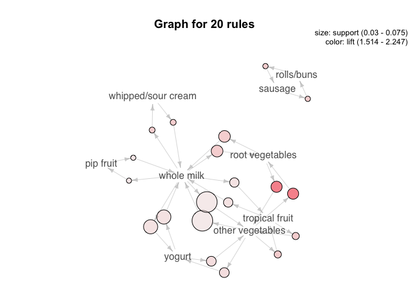

### Problem 4 Text Mining: supervised model

##### - For text analysis, it is always important to go back to the text content, and check if the quantitative analysis make sense and whether it does solve the question we are interested in!

###### The main idea for this problem could be described in several steps: (1) Clean the text data, extract main terms in each corpus, and generate a large dataframe from the texts. (2) Do PCA model to reduce the dimension of the large dataset. (3) Since the outcome is a multinomial variable, the supervised model will be a classification problem. So we build multinomial model and naive bayesian model in the training dataset, based on the PAC results, namely the scores on each components. (4) Apply the classification model in the training dataset to predict the author of the text.

    library(tidyverse)
    library(tm)

    ## Loading required package: NLP

    ## 
    ## Attaching package: 'NLP'

    ## The following object is masked from 'package:ggplot2':
    ## 
    ##     annotate

    ## 
    ## Attaching package: 'tm'

    ## The following object is masked from 'package:arules':
    ## 
    ##     inspect

    ## The following object is masked from 'package:mosaic':
    ## 
    ##     inspect

    library(gamlr)
    library(SnowballC)

###### Clean text data: including training data and testing data. The goal is to extract and covert the main words/terms in the text data into quantitative data. So we need to process the text data by removing stop words, and count each words in each corpus, then get a very large dataset.

    readerPlain = function(fname){
      readPlain(elem=list(content=readLines(fname)), 
                id=fname, language='en') }

    # Rolling directories together into a single training corpus
    train_dirs = Sys.glob('~/Downloads/ECO395M-master/data/ReutersC50/C50train/*')
    file_list = NULL
    labels_train = NULL
    for(author in train_dirs) {
      author_name = substring(author, first=66)
      files_to_add = Sys.glob(paste0(author, '/*.txt'))
      file_list = append(file_list, files_to_add)
      labels_train = append(labels_train, rep(author_name, length(files_to_add)))
    }
    corpus_train =  Corpus(DirSource(train_dirs)) 

    # Remove stop words, numbers, change capital letter to lower case
    corpus_train = corpus_train %>% tm_map(., content_transformer(tolower)) %>% 
      tm_map(., content_transformer(removeNumbers)) %>% 
      tm_map(., content_transformer(removeNumbers)) %>% 
      tm_map(., content_transformer(removePunctuation)) %>%
      tm_map(., content_transformer(stripWhitespace)) %>%
      tm_map(., content_transformer(removeWords), stopwords("SMART"))

    # Same operations with the testing corpus
    test_dirs = Sys.glob('~/Downloads/ECO395M-master/data/ReutersC50/C50test/*')
    file_list = NULL
    labels_test = NULL
    for(author in test_dirs) {
      author_name = substring(author, first=66)
      files_to_add = Sys.glob(paste0(author, '/*.txt'))
      file_list = append(file_list, files_to_add)
      labels_test = append(labels_test, rep(author_name, length(files_to_add)))
    }
    corpus_test = Corpus(DirSource(test_dirs)) 

    corpus_test = corpus_test %>% tm_map(., content_transformer(tolower)) %>% 
      tm_map(., content_transformer(removeNumbers)) %>% 
      tm_map(., content_transformer(removePunctuation)) %>%
      tm_map(., content_transformer(stripWhitespace)) %>%
      tm_map(., content_transformer(removeWords), stopwords("SMART")) 

    # create training and testing feature matrices
    DTM_train = DocumentTermMatrix(corpus_train)
    #DTM_train # some basic summary statistics (documents: 2500, terms: 31423)

    # restrict test-set vocabulary to the terms in DTM_train
    DTM_test = DocumentTermMatrix(corpus_test,
                                  control = list(dictionary=Terms(DTM_train)))
    #DTM_test# (documents: 2500, terms: 31423)

    class(DTM_train)  # a special kind of sparse matrix format

    ## [1] "DocumentTermMatrix"    "simple_triplet_matrix"

    ## You can inspect its entries...
    #inspect(DTM_train[1:10,1:20])

    ## ...find words with greater than a min count...
    #findFreqTerms(DTM_train, 50)

    ## ...or find words whose count correlates with a specified word.
    #findAssocs(DTM_train, "genetic", .5) 

    ## Finally, drop those terms that only occur in one documents
    ## Below removes those terms that have count 0 in >95% of docs.  
    DTM_train = removeSparseTerms(DTM_train, 0.95)
    #DTM_train # now ~ 641\ terms (versus ~2243 before)

    class(DTM_test)  # a special kind of sparse matrix format

    ## [1] "DocumentTermMatrix"    "simple_triplet_matrix"

    #inspect(DTM_test[1:10,1:20])
    #findFreqTerms(DTM_test, 50)
    #findAssocs(DTM_test, "genetic", .5) 

    DTM_test = removeSparseTerms(DTM_test, 0.95)
    #DTM_test # now ~ 658 terms (versus ~2270 before)

    # construct TF IDF weights for bothe training and testing set. Then keep term showing up in both sets.
    tfidf_train = weightTfIdf(DTM_train)
    traincol <- colnames(DTM_train)

    tfidf_test = weightTfIdf(DTM_test)
    testcol <- colnames(DTM_test)

    elem <- is.element(traincol, testcol)
    train.ele <- cbind(traincol, elem)

    ele.share <- subset(train.ele, elem = TRUE) 

    elem2 <- is.element(testcol, traincol)
    train.ele2 <- cbind(testcol, elem2)

    ele.share2 <- subset(train.ele2, elem2 = TRUE) 

    # 641 terms in training set. 658 in the testing set. We extract 590 common terms in both set.
    tfidf_train <- tfidf_train[,which(colnames(tfidf_train) %in% ele.share2)]
    #tfidf_train 

    tfidf_test <- tfidf_test[,which(colnames(tfidf_test) %in% ele.share)]
    #tfidf_test 

\#\#\#\#\#\#As a result of cleaning the text data, we obtain a large
dataset with 2500 observations linked to 50 authors and 590 different
columns which means the same 590 main terms in both training set and
test set.

### PCA - Since there are so many columns, we want to use PCA to reduce the dimension. We do the same process for the training dataset and testing set. After check the loadings and visulized results, we decided to use the first 6 components representing the the 590 terms, which is much more efficient. To check if we can apply the components in different datasets, we go back to see the literal meanings of each components. The results shows that in both training set and testing set, the first six components have very similar meaning. Therefore, we can use PC 1-6 in the supervised learning model after PCA.

    # Take PCA for training
    X1 = as.matrix(tfidf_train)
    summary(colSums(X1))

    ##    Min. 1st Qu.  Median    Mean 3rd Qu.    Max. 
    ##   4.704   7.383   9.936  11.137  12.857  46.413

    pca_train = prcomp(X1, rank=10, scale=TRUE)
    plot(pca_train,type="l") 

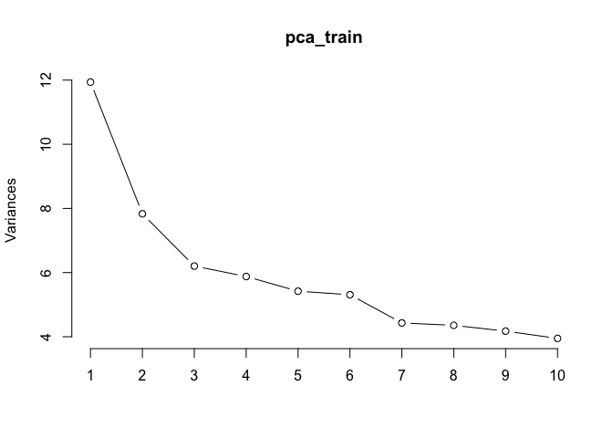

    summary(pca_train)

    ## Importance of first k=10 (out of 590) components:
    ##                            PC1     PC2     PC3     PC4     PC5     PC6     PC7
    ## Standard deviation     3.45521 2.79866 2.49069 2.42442 2.32793 2.30407 2.10465
    ## Proportion of Variance 0.02023 0.01328 0.01051 0.00996 0.00919 0.00900 0.00751
    ## Cumulative Proportion  0.02023 0.03351 0.04402 0.05399 0.06317 0.07217 0.07968
    ##                            PC8     PC9    PC10
    ## Standard deviation     2.08698 2.04314 1.98695
    ## Proportion of Variance 0.00738 0.00708 0.00669
    ## Cumulative Proportion  0.08706 0.09414 0.10083

    # Look at the loadings
    round(pca_train$rotation[,1:6],2) 

    ##                      PC1   PC2   PC3   PC4   PC5   PC6
    ## access              0.00  0.08  0.06 -0.03  0.06 -0.02
    ## announced           0.01  0.06 -0.03 -0.02 -0.03  0.00
    ## authorities        -0.07 -0.03 -0.01  0.04  0.00 -0.05
    ## business            0.06  0.06  0.02 -0.07 -0.02 -0.05
    ## called             -0.05  0.04  0.03 -0.02  0.00 -0.03
    ## commission         -0.03  0.04 -0.02  0.03  0.03 -0.02
    ## computer            0.04  0.09  0.18  0.00  0.02 -0.07
    ## consumer            0.04  0.04  0.08  0.01  0.05 -0.04
    ## consumers           0.02  0.05  0.10  0.00  0.07 -0.03
    ## director            0.00  0.01 -0.04 -0.04  0.03  0.02
    ## early              -0.01  0.00  0.02  0.03  0.00  0.05
    ## february           -0.01 -0.01 -0.01  0.00  0.04  0.06
    ## federal            -0.02  0.08  0.03  0.06  0.05 -0.03
    ## fund                0.00  0.02 -0.08  0.01  0.04 -0.05
    ## group               0.04  0.04 -0.11 -0.12 -0.03  0.01
    ## home               -0.02  0.02  0.03 -0.03  0.00  0.00
    ## information        -0.01  0.07  0.07 -0.01  0.05 -0.04
    ## initial             0.02  0.04  0.00 -0.01  0.00 -0.01
    ## internet            0.00  0.10  0.12 -0.02  0.06 -0.04
    ## investors           0.04 -0.03 -0.06  0.14  0.03 -0.11
    ## law                -0.07  0.01  0.01 -0.01 -0.01 -0.06
    ## local              -0.03  0.05  0.04  0.05  0.03  0.06
    ## lower               0.03 -0.08  0.01  0.05  0.01  0.01
    ## major              -0.01  0.03  0.00 -0.01  0.02  0.01
    ## million             0.12 -0.07 -0.03 -0.08 -0.07  0.03
    ## money              -0.01  0.01 -0.03  0.02  0.07 -0.04
    ## month              -0.02 -0.02  0.03  0.00  0.05  0.03
    ## national           -0.03  0.02 -0.02  0.04 -0.01  0.08
    ## net                 0.09 -0.09  0.03 -0.04 -0.03  0.00
    ## offer               0.03  0.09 -0.10  0.00 -0.01 -0.04
    ## paid                0.01  0.01 -0.02 -0.01  0.04  0.03
    ## place              -0.04  0.01 -0.01  0.01  0.00  0.02
    ## quality             0.01 -0.01  0.01  0.00  0.08  0.04
    ## reports            -0.02  0.00  0.00  0.01 -0.01 -0.02
    ## run                -0.01  0.04  0.02  0.00 -0.02  0.00
    ## sale                0.02  0.03 -0.04  0.00 -0.03  0.03
    ## sell                0.02  0.06 -0.03  0.04  0.00  0.03
    ## services            0.04  0.09  0.04 -0.05  0.05 -0.04
    ## set                -0.03  0.02  0.01  0.03  0.04  0.06
    ## shares              0.09  0.00 -0.14  0.12 -0.06 -0.10
    ## state              -0.08 -0.02  0.00  0.03  0.05 -0.01
    ## technology          0.01  0.08  0.11 -0.01  0.05 -0.04
    ## times               0.00  0.00  0.00  0.00 -0.01 -0.01
    ## top                -0.02  0.02  0.01 -0.01 -0.01  0.00
    ## trade              -0.06 -0.04  0.01  0.02  0.06 -0.01
    ## tuesday            -0.03  0.00  0.02  0.05 -0.06  0.02
    ## wednesday          -0.04  0.00  0.00  0.05 -0.07  0.03
    ## working            -0.03  0.04  0.03  0.00 -0.01  0.05
    ## world              -0.04  0.00  0.03  0.00  0.05  0.06
    ## area               -0.01  0.01  0.02 -0.01  0.03  0.03
    ## boost               0.01 -0.03  0.02 -0.01  0.04  0.00
    ## businesses          0.05  0.03  0.00 -0.04 -0.04 -0.01
    ## buying              0.03  0.00 -0.01  0.04  0.05 -0.01
    ## change             -0.02 -0.01  0.00 -0.02  0.04 -0.01
    ## charges            -0.03  0.00  0.02 -0.02 -0.02  0.00
    ## communications      0.01  0.12  0.08 -0.03  0.07 -0.04
    ## compared            0.05 -0.07  0.05  0.00  0.03  0.00
    ## corp                0.06  0.14  0.13  0.07 -0.02 -0.03
    ## create             -0.01  0.06 -0.03 -0.03  0.01 -0.01
    ## day                -0.03 -0.01  0.03  0.08 -0.06  0.03
    ## earlier             0.02  0.00 -0.01  0.01 -0.04 -0.01
    ## expand              0.02  0.03  0.00 -0.05  0.02  0.00
    ## job                 0.00  0.05  0.02  0.04 -0.10  0.10
    ## networks            0.01  0.09  0.10 -0.02  0.04 -0.04
    ## office             -0.02  0.02  0.04 -0.02 -0.02  0.00
    ## parts              -0.01  0.05  0.02  0.10 -0.10  0.20
    ## people             -0.08 -0.02  0.06 -0.06 -0.03 -0.05
    ## plan               -0.01  0.03 -0.02  0.00  0.03  0.00
    ## plans               0.01  0.08  0.01 -0.06  0.00  0.00
    ## post               -0.01 -0.03  0.04 -0.03 -0.06 -0.02
    ## posted              0.06 -0.08  0.01  0.00 -0.04 -0.01
    ## president          -0.07  0.05  0.09  0.05 -0.04  0.05
    ## private            -0.02  0.01 -0.01  0.00  0.04  0.00
    ## public             -0.05  0.02  0.01 -0.02  0.00 -0.05
    ## rates               0.02 -0.03  0.00  0.03  0.10  0.01
    ## sector              0.04 -0.03 -0.06  0.02  0.09 -0.01
    ## security           -0.04  0.02  0.04  0.01 -0.02  0.01
    ## selling             0.02  0.03 -0.01  0.02  0.00 -0.02
    ## service            -0.01  0.08  0.07 -0.04  0.06  0.00
    ## software            0.03  0.09  0.15 -0.01  0.01 -0.06
    ## system             -0.01  0.06  0.07 -0.01  0.05 -0.03
    ## today               0.00  0.00  0.00  0.08 -0.02 -0.02
    ## trading             0.04 -0.03 -0.04  0.11  0.01 -0.08
    ## vice               -0.02  0.06  0.08  0.01 -0.01  0.01
    ## war                -0.08 -0.02  0.02  0.00 -0.01  0.00
    ## association        -0.02  0.03  0.02 -0.02  0.04  0.02
    ## city               -0.03  0.02  0.01  0.00 -0.02  0.02
    ## executive           0.02  0.07 -0.02 -0.11 -0.09 -0.02
    ## great              -0.03  0.00  0.02 -0.02 -0.02 -0.01
    ## large               0.01  0.01 -0.01 -0.01  0.08  0.02
    ## michael             0.01  0.02  0.01  0.02 -0.04  0.00
    ## positive            0.01 -0.03  0.01  0.01  0.00 -0.01
    ## research            0.01  0.04  0.06  0.01  0.01 -0.03
    ## ahead               0.00 -0.01 -0.02 -0.02  0.00  0.00
    ## board               0.01  0.05 -0.04 -0.02 -0.05  0.02
    ## central            -0.04 -0.05 -0.04  0.05  0.08 -0.02
    ## committee          -0.07 -0.01  0.01 -0.04 -0.06 -0.05
    ## companies           0.02  0.11  0.00  0.00  0.09 -0.03
    ## concerns           -0.02  0.00 -0.03  0.02 -0.02  0.01
    ## control            -0.03  0.01 -0.02  0.01  0.00  0.01
    ## decided            -0.02  0.00 -0.01  0.02 -0.02  0.02
    ## develop             0.00  0.05  0.02  0.01  0.02 -0.01
    ## employees           0.00  0.04  0.03  0.01 -0.02  0.04
    ## end                 0.00 -0.03 -0.02  0.03  0.04  0.05
    ## expansion           0.01  0.00 -0.01 -0.04  0.01  0.04
    ## forward             0.00  0.01 -0.03 -0.02 -0.02  0.02
    ## global              0.02  0.05  0.00 -0.04  0.04  0.00
    ## good                0.02 -0.05  0.01 -0.02  0.01  0.02
    ## government         -0.10 -0.02 -0.04  0.03  0.01  0.01
    ## growing             0.01  0.01  0.04 -0.03  0.04  0.00
    ## include             0.00  0.04  0.02 -0.02  0.02  0.01
    ## including          -0.01  0.04  0.05 -0.01 -0.02  0.04
    ## increasing          0.01  0.00  0.02 -0.01  0.00  0.04
    ## international      -0.01  0.03  0.03 -0.05  0.05  0.01
    ## issue              -0.04  0.01 -0.02  0.04  0.00 -0.03
    ## issues             -0.04  0.01  0.00  0.13 -0.06  0.01
    ## june               -0.04 -0.07  0.01 -0.04 -0.05 -0.01
    ## level               0.01 -0.03  0.00  0.01  0.04  0.00
    ## life               -0.01 -0.01 -0.04 -0.04 -0.01 -0.02
    ## market              0.07  0.02 -0.03  0.04  0.10 -0.05
    ## meet               -0.04 -0.02  0.01  0.00 -0.01  0.04
    ## member             -0.08 -0.02  0.00 -0.02 -0.05  0.00
    ## members            -0.06  0.01  0.00  0.01 -0.07  0.06
    ## months              0.02 -0.05  0.02 -0.06  0.00  0.01
    ## moving              0.00  0.00  0.00  0.01  0.01  0.02
    ## needed             -0.02  0.01 -0.02 -0.01  0.05  0.00
    ## network             0.01  0.09  0.09 -0.04  0.04 -0.02
    ## number             -0.01  0.01  0.02  0.00  0.02  0.04
    ## open               -0.03  0.02  0.00  0.04  0.01  0.04
    ## operating           0.07  0.02  0.09 -0.06 -0.05  0.00
    ## planned             0.01  0.03 -0.02 -0.03 -0.02  0.01
    ## products            0.03  0.04  0.10  0.01  0.02 -0.03
    ## raised              0.00 -0.01 -0.01  0.00  0.00  0.00
    ## reach               0.00  0.02  0.03  0.03  0.02  0.05
    ## telephone          -0.02  0.05  0.05 -0.04  0.03 -0.02
    ## union              -0.03  0.04  0.00  0.08 -0.06  0.16
    ## week               -0.05 -0.02  0.00  0.09 -0.02  0.06
    ## work               -0.04  0.05  0.04  0.05 -0.06  0.12
    ## year                0.08 -0.13  0.05 -0.09  0.04  0.04
    ## continued           0.03 -0.05  0.01  0.03 -0.04  0.06
    ## interest            0.02 -0.01 -0.10  0.06  0.04 -0.04
    ## statement           0.00  0.01 -0.04 -0.03 -0.06  0.02
    ## aimed              -0.02  0.03  0.03  0.00  0.01  0.02
    ## david               0.02  0.02  0.01 -0.01 -0.03  0.03
    ## interview           0.01  0.02  0.01 -0.07 -0.02  0.02
    ## leading            -0.01  0.02  0.00 -0.01 -0.01 -0.02
    ## analyst             0.11 -0.01  0.02  0.06 -0.04 -0.05
    ## areas               0.01  0.00  0.02 -0.02  0.06  0.04
    ## asked              -0.04  0.02 -0.03 -0.01 -0.01 -0.01
    ## banking             0.02  0.02 -0.06  0.01  0.06 -0.05
    ## banks               0.01 -0.01 -0.07  0.07  0.09 -0.07
    ## buy                 0.04  0.04 -0.04  0.06  0.01 -0.03
    ## canada              0.01  0.00 -0.01  0.10 -0.02  0.01
    ## clear              -0.05 -0.01 -0.01  0.00 -0.01  0.02
    ## commercial         -0.01  0.03 -0.02 -0.02  0.04  0.01
    ## company             0.08  0.12 -0.03 -0.05 -0.08  0.00
    ## continue            0.01 -0.02  0.03  0.01 -0.02  0.04
    ## credit              0.00  0.01  0.00  0.03  0.04 -0.02
    ## data                0.02  0.03  0.08  0.00  0.07 -0.01
    ## department         -0.03  0.01  0.02  0.02  0.01  0.01
    ## exchange            0.02 -0.01 -0.03  0.11  0.01 -0.06
    ## existing            0.00  0.06  0.02 -0.04  0.04 -0.01
    ## financial           0.03  0.04 -0.07  0.02  0.04 -0.08
    ## groups             -0.01  0.01 -0.04 -0.05 -0.01  0.02
    ## grow                0.04  0.00  0.04 -0.04  0.03  0.01
    ## held               -0.04  0.01 -0.01 -0.01 -0.02  0.02
    ## hope               -0.03 -0.01  0.00 -0.03 -0.03  0.00
    ## john                0.03  0.01  0.00 -0.02 -0.04  0.00
    ## legal              -0.06  0.02  0.00 -0.01 -0.02 -0.04
    ## longer             -0.02  0.01  0.00  0.00  0.02  0.00
    ## lot                 0.02  0.01  0.02 -0.01  0.04  0.00
    ## officials          -0.10 -0.01  0.05  0.04  0.00  0.01
    ## personal            0.02  0.05  0.11 -0.01  0.01 -0.06
    ## policy             -0.04 -0.02  0.00 -0.01  0.06 -0.05
    ## potential           0.01  0.06 -0.03 -0.01  0.00  0.00
    ## product             0.02  0.02  0.07 -0.02  0.03  0.01
    ## reached            -0.02  0.00  0.02  0.07 -0.02  0.08
    ## real               -0.01 -0.02 -0.02  0.03  0.05 -0.02
    ## role               -0.06  0.00  0.02 -0.02 -0.03 -0.01
    ## rules              -0.03  0.05  0.01  0.03  0.07 -0.02
    ## sales               0.08 -0.05  0.11 -0.03 -0.04  0.01
    ## securities          0.03 -0.01 -0.04  0.11  0.04 -0.10
    ## special            -0.02  0.01 -0.05 -0.04 -0.03 -0.04
    ## states             -0.08 -0.01  0.04  0.01  0.01  0.00
    ## step               -0.04  0.02 -0.01 -0.02 -0.01 -0.03
    ## tax                 0.01 -0.02 -0.03 -0.01  0.04 -0.01
    ## action             -0.03  0.01 -0.03  0.02  0.00 -0.01
    ## agreed              0.00  0.05 -0.05  0.04 -0.03  0.06
    ## began              -0.02  0.01  0.03  0.04 -0.04  0.07
    ## big                 0.02  0.02  0.00  0.05  0.03  0.02
    ## bill               -0.03  0.04  0.03  0.00  0.01 -0.03
    ## billion             0.08 -0.01 -0.08  0.01  0.02 -0.03
    ## case               -0.04  0.02  0.00  0.02 -0.02 -0.01
    ## chicago             0.02  0.01  0.03  0.03 -0.02 -0.01
    ## considered         -0.01  0.02 -0.01  0.03  0.02 -0.02
    ## court              -0.06  0.02  0.01  0.01 -0.02 -0.03
    ## decision           -0.03  0.05 -0.03  0.00  0.01  0.02
    ## expected            0.07 -0.04  0.07 -0.01 -0.02  0.02
    ## firms               0.00  0.02 -0.03  0.03  0.09 -0.04
    ## force              -0.03  0.00  0.01  0.01 -0.02  0.01
    ## foreign            -0.07 -0.05 -0.04  0.06  0.08 -0.06
    ## future             -0.04  0.01 -0.02 -0.07 -0.03 -0.02
    ## general            -0.01  0.03  0.01  0.02 -0.03  0.07
    ## independent         0.00  0.04 -0.06 -0.03 -0.03 -0.01
    ## investment          0.02  0.01 -0.10 -0.01  0.08 -0.05
    ## lost                0.00 -0.03 -0.02  0.12 -0.03  0.01
    ## manager             0.00  0.02 -0.01 -0.01  0.06  0.01
    ## mark                0.01  0.00 -0.01  0.03 -0.03  0.00
    ## markets             0.02 -0.02 -0.05  0.06  0.09 -0.07
    ## move               -0.01  0.03 -0.01 -0.01 -0.01 -0.02
    ## november            0.00 -0.04  0.01  0.01  0.03  0.04
    ## operations          0.04  0.02  0.01 -0.02 -0.05  0.09
    ## part               -0.03  0.04  0.02 -0.04  0.00  0.01
    ## problem            -0.01 -0.01 -0.02  0.03  0.07 -0.01
    ## put                -0.03  0.00 -0.01 -0.01  0.03  0.04
    ## significant         0.03  0.03  0.00  0.00 -0.01  0.02
    ## told               -0.07 -0.02 -0.05 -0.04 -0.02  0.12
    ## united             -0.06  0.00  0.02  0.00 -0.03  0.04
    ## wanted             -0.02  0.02 -0.04  0.00  0.01  0.01
    ## warned             -0.02 -0.05  0.02 -0.02  0.00 -0.04
    ## added               0.02 -0.01 -0.03 -0.01  0.07  0.07
    ## allowed            -0.05  0.00 -0.01  0.01  0.02 -0.02
    ## chief              -0.01  0.04  0.00 -0.11 -0.13 -0.04
    ## comment            -0.01  0.05 -0.03  0.02 -0.06 -0.01
    ## concern            -0.01 -0.02  0.01  0.01 -0.02 -0.03
    ## declined           -0.01  0.05  0.01  0.02 -0.04  0.02
    ## direct             -0.03  0.00  0.01 -0.01  0.02 -0.02
    ## governments        -0.04 -0.01 -0.02  0.01  0.05  0.00
    ## investments         0.02  0.01 -0.01  0.00  0.04 -0.03
    ## made               -0.03  0.02 -0.02 -0.01 -0.01  0.03
    ## position           -0.02  0.01 -0.02 -0.03 -0.02  0.00
    ## recent             -0.01 -0.03  0.02  0.02  0.00 -0.04
    ## side               -0.01 -0.01 -0.01  0.02  0.00  0.01
    ## stock               0.08  0.02 -0.04  0.16 -0.06 -0.12
    ## street              0.06  0.02  0.04  0.07 -0.11 -0.08
    ## support            -0.05 -0.02 -0.01  0.01  0.01 -0.03
    ## wall                0.06  0.01  0.06  0.08 -0.11 -0.09
    ## years              -0.06 -0.02  0.03 -0.06 -0.02  0.00
    ## america             0.01  0.04  0.05 -0.02  0.03  0.01
    ## april               0.00 -0.01 -0.01 -0.01  0.04  0.01
    ## average             0.04 -0.06  0.02  0.03  0.05  0.03
    ## back               -0.02 -0.02 -0.01  0.01 -0.05  0.05
    ## based               0.02  0.07  0.06  0.01  0.01 -0.03
    ## chairman            0.01  0.07 -0.02 -0.04 -0.08  0.03
    ## competition         0.02  0.05  0.02 -0.03  0.06  0.00
    ## customers           0.03  0.09  0.09 -0.04  0.06 -0.03
    ## estimated           0.00  0.01  0.03  0.00  0.01  0.04
    ## figures             0.02 -0.10  0.01 -0.02  0.08  0.05
    ## found              -0.04  0.00  0.03  0.00  0.01  0.00
    ## friday             -0.02 -0.01 -0.01  0.08 -0.05  0.05
    ## half                0.06 -0.09  0.00 -0.06 -0.01  0.04
    ## high                0.03 -0.04 -0.02  0.04  0.04 -0.02
    ## january            -0.01 -0.04  0.02 -0.01  0.05  0.08
    ## late               -0.03 -0.01  0.01  0.03 -0.02  0.04
    ## points              0.02 -0.05 -0.04  0.18 -0.01 -0.06
    ## provide            -0.01  0.06  0.03 -0.02  0.05  0.00
    ## results             0.08 -0.09  0.03 -0.02 -0.05  0.00
    ## revenue             0.06  0.00  0.06 -0.03 -0.02 -0.03
    ## september           0.04 -0.08  0.04 -0.03  0.02  0.04
    ## source             -0.03  0.00 -0.01  0.01  0.04  0.02
    ## time               -0.01  0.01 -0.01 -0.03 -0.02  0.01
    ## bad                 0.00 -0.03 -0.01  0.01  0.04  0.01
    ## conference         -0.02  0.04  0.02  0.03  0.00  0.02
    ## development        -0.02  0.02  0.03 -0.03  0.04 -0.01
    ## export             -0.02 -0.02  0.02  0.01  0.11  0.05
    ## free               -0.03  0.03  0.04 -0.01  0.04 -0.02
    ## growth              0.09 -0.05  0.04 -0.06  0.01 -0.01
    ## key                 0.01  0.00 -0.01  0.07  0.04 -0.04
    ## making             -0.01  0.03  0.00 -0.02  0.04 -0.01
    ## monday             -0.01  0.02 -0.02  0.07 -0.07  0.05
    ## news               -0.01  0.02  0.01 -0.01 -0.03  0.00
    ## officer             0.03  0.05  0.04 -0.01 -0.08 -0.02
    ## order              -0.01  0.02  0.02  0.00  0.02  0.00
    ## partner             0.00  0.04 -0.06  0.01  0.02  0.01
    ## senior             -0.06 -0.01  0.00  0.01  0.01 -0.04
    ## sold                0.02  0.01 -0.01 -0.01  0.02  0.01
    ## strong              0.07 -0.07  0.05  0.03 -0.03 -0.03
    ## washington         -0.07 -0.01  0.04  0.01 -0.01 -0.02
    ## worldwide           0.02  0.01  0.04 -0.03  0.00  0.01
    ## bank                0.02 -0.02 -0.10  0.08  0.08 -0.07
    ## bit                 0.04 -0.03  0.04 -0.02  0.00  0.02
    ## countries          -0.05 -0.02 -0.01 -0.01  0.04  0.01
    ## current             0.02 -0.03  0.01  0.01  0.01  0.03
    ## deal                0.02  0.12 -0.09  0.03 -0.05  0.02
    ## dont               -0.02 -0.01  0.00  0.02  0.00  0.00
    ## economic           -0.08 -0.08  0.01 -0.01  0.05 -0.04
    ## head               -0.05  0.01  0.00 -0.02 -0.01  0.01
    ## income              0.06 -0.06  0.03  0.01 -0.02 -0.03
    ## point               0.00  0.00  0.02  0.07 -0.01  0.01
    ## released           -0.02 -0.02  0.04  0.02 -0.01 -0.01
    ## report              0.03 -0.02  0.05  0.04 -0.04 -0.02
    ## sources            -0.03 -0.01 -0.01  0.03  0.05  0.01
    ## thursday           -0.02 -0.01  0.00  0.05 -0.05  0.02
    ## announcement        0.01  0.04 -0.02  0.01  0.01 -0.02
    ## companys            0.07  0.04  0.06 -0.03 -0.08  0.00
    ## demand              0.02 -0.05  0.05 -0.01  0.08  0.06
    ## difficult          -0.01 -0.01  0.00 -0.02  0.02  0.01
    ## domestic            0.00 -0.05 -0.02  0.03  0.12  0.01
    ## final              -0.02  0.01 -0.03  0.03 -0.01  0.05
    ## hard               -0.01  0.01  0.02  0.01  0.03 -0.01
    ## industry            0.02  0.08  0.04  0.00  0.10  0.00
    ## jobs               -0.01  0.03  0.02  0.01 -0.03  0.06
    ## make                0.00  0.07  0.00 -0.01  0.03 -0.01
    ## means              -0.01  0.02 -0.03 -0.02  0.05  0.00
    ## october             0.01 -0.04  0.02  0.00  0.05  0.06
    ## process            -0.04  0.03 -0.01  0.00 -0.01 -0.02
    ## agency             -0.05 -0.01  0.01  0.01  0.02 -0.01
    ## american            0.00  0.03  0.01  0.03 -0.03  0.03
    ## basis               0.02 -0.02 -0.02 -0.01  0.02  0.00
    ## competitive         0.03  0.04  0.01 -0.03  0.02  0.03
    ## conditions          0.01 -0.02 -0.02 -0.03  0.02  0.05
    ## interests          -0.02  0.02 -0.07 -0.03 -0.01 -0.01
    ## issued             -0.05  0.00  0.00  0.02  0.00 -0.02
    ## july               -0.04 -0.06  0.00 -0.06 -0.04 -0.04
    ## latest             -0.01  0.01  0.03  0.01 -0.03 -0.02
    ## loss                0.04 -0.05  0.05 -0.01 -0.07 -0.02
    ## north               0.01  0.00  0.01  0.02 -0.01  0.07
    ## result              0.04 -0.08  0.01 -0.02 -0.01  0.02
    ## share               0.12 -0.02 -0.03  0.03 -0.09 -0.08
    ## weeks              -0.01  0.00 -0.01  0.05 -0.02  0.02
    ## workers            -0.03  0.04  0.04  0.11 -0.10  0.23
    ## economy            -0.01 -0.07 -0.01  0.02  0.08 -0.03
    ## failed             -0.03  0.00 -0.01  0.01 -0.01  0.01
    ## huge               -0.01  0.03  0.00  0.03  0.03 -0.02
    ## increase            0.06 -0.07  0.01 -0.05  0.03  0.05
    ## noted               0.02  0.03  0.00  0.04 -0.01 -0.03
    ## reuters            -0.01 -0.02 -0.04 -0.06  0.03  0.10
    ## things             -0.01  0.02  0.02 -0.02  0.01  0.01
    ## approval           -0.01  0.04 -0.03 -0.01  0.00  0.00
    ## long               -0.03  0.01  0.02 -0.01  0.03 -0.02
    ## meeting            -0.04  0.00 -0.02 -0.01 -0.06  0.02
    ## official           -0.11 -0.06  0.02  0.01  0.03 -0.02
    ## progress           -0.02  0.00  0.01  0.02 -0.05  0.07
    ## telecommunications  0.01  0.10  0.01 -0.03  0.05 -0.02
    ## building           -0.01  0.01 -0.02 -0.05  0.00  0.02
    ## closed              0.04 -0.02 -0.04  0.09 -0.04 -0.05
    ## corporate           0.03  0.07  0.05  0.01  0.02 -0.05
    ## finance             0.01  0.00 -0.08  0.03  0.05 -0.01
    ## funds              -0.01 -0.01 -0.06  0.02  0.07 -0.06
    ## gain                0.02 -0.02  0.02  0.04 -0.03  0.00
    ## included            0.01 -0.02  0.01  0.05 -0.02  0.01
    ## march              -0.02 -0.02  0.01 -0.01  0.02  0.02
    ## past               -0.01 -0.02  0.00  0.03  0.01 -0.01
    ## power              -0.02  0.00 -0.01 -0.01  0.00 -0.02
    ## previously          0.00  0.02  0.01 -0.01 -0.05  0.00
    ## quickly             0.00  0.03  0.02  0.03  0.00  0.03
    ## recently           -0.01  0.00  0.02  0.00  0.02 -0.01
    ## spokesman          -0.04  0.05 -0.01  0.03 -0.05  0.08
    ## analysts            0.12 -0.02  0.03  0.07 -0.04 -0.07
    ## begin              -0.01  0.02  0.04 -0.02  0.02  0.01
    ## charge              0.00  0.01  0.04 -0.02 -0.06 -0.02
    ## deals               0.01  0.04 -0.03  0.01  0.02 -0.02
    ## industries          0.01  0.02 -0.01  0.00  0.03  0.00
    ## insurance           0.00  0.02 -0.04 -0.02  0.03 -0.01
    ## led                -0.01 -0.01 -0.02  0.06 -0.04 -0.02
    ## percent             0.11 -0.11 -0.02 -0.01  0.05  0.04
    ## pressure           -0.01  0.00 -0.01  0.01  0.01  0.04
    ## problems           -0.01  0.00  0.00  0.02  0.04  0.01
    ## raise               0.01 -0.01 -0.05 -0.01  0.02 -0.01
    ## reporters          -0.07 -0.02  0.01 -0.01 -0.04  0.03
    ## venture             0.01  0.04 -0.02 -0.03  0.04  0.01
    ## amp                 0.03  0.05 -0.02  0.00 -0.02 -0.03
    ## coming              0.02 -0.02  0.02  0.00  0.03  0.00
    ## firm                0.03  0.05 -0.05  0.03 -0.01 -0.04
    ## house              -0.03 -0.04 -0.01  0.04  0.00  0.00
    ## largest             0.01  0.04 -0.06  0.04  0.00 -0.01
    ## lead               -0.02  0.01  0.00  0.01  0.00  0.00
    ## managing            0.02  0.01 -0.05 -0.04  0.04  0.02
    ## nations            -0.05  0.00  0.01  0.02  0.03 -0.03
    ## previous            0.02 -0.03  0.01  0.01  0.00  0.01
    ## revenues            0.07  0.00  0.09 -0.02 -0.04 -0.04
    ## rule               -0.10 -0.05  0.01 -0.07 -0.08 -0.10
    ## face               -0.04 -0.01 -0.01  0.00 -0.01 -0.02
    ## proposed            0.00  0.07 -0.04 -0.01 -0.02 -0.01
    ## small               0.00  0.01  0.02  0.02  0.04  0.04
    ## view               -0.01  0.00  0.00 -0.01  0.02 -0.03
    ## bring              -0.01  0.00 -0.02  0.03  0.01  0.01
    ## full                0.02 -0.03 -0.01 -0.05 -0.01  0.05
    ## giant               0.02  0.05 -0.01 -0.01 -0.01  0.01
    ## similar            -0.01  0.03  0.02 -0.01  0.02  0.00
    ## total               0.03 -0.07  0.00 -0.01  0.09  0.07
    ## benefit             0.01  0.00 -0.01 -0.03  0.02  0.02
    ## days               -0.05 -0.02  0.02  0.02 -0.04  0.06
    ## effect             -0.01 -0.01  0.01  0.01  0.03  0.00
    ## stocks              0.05 -0.04 -0.02  0.19  0.01 -0.08
    ## costs               0.06  0.00  0.03 -0.04  0.00  0.05
    ## cut                 0.01 -0.02  0.01  0.02  0.04  0.06
    ## due                 0.02 -0.04 -0.01  0.01  0.01  0.06
    ## levels              0.04 -0.06  0.01  0.02  0.06  0.05
    ## lines               0.02  0.02  0.04  0.00  0.03  0.01
    ## offering            0.02  0.04  0.02 -0.02  0.03 -0.01
    ## pay                 0.00  0.05 -0.03  0.00  0.00  0.03
    ## price               0.06 -0.01 -0.06  0.02  0.03 -0.01
    ## prices              0.04 -0.07  0.00  0.04  0.10  0.03
    ## rate                0.03 -0.05  0.02  0.00  0.08  0.02
    ## regional            0.00  0.02 -0.03 -0.02  0.04  0.01
    ## give               -0.02  0.03 -0.01 -0.03  0.00  0.01
    ## involved           -0.02  0.04 -0.03  0.00 -0.01  0.03
    ## question           -0.01  0.02  0.00  0.00 -0.01  0.00
    ## record              0.02 -0.08  0.01  0.05 -0.01  0.00
    ## thing              -0.01  0.02  0.01 -0.02 -0.02 -0.01
    ## ago                 0.04 -0.02  0.09 -0.02 -0.03 -0.01
    ## build               0.00  0.04  0.03 -0.02  0.03  0.03
    ## management          0.03  0.05 -0.07 -0.03  0.01 -0.04
    ## remains            -0.01 -0.01  0.02  0.01 -0.01  0.00
    ## television          0.00  0.05  0.01 -0.05 -0.01  0.00
    ## daily              -0.06 -0.05  0.01  0.00  0.01 -0.02
    ## hold               -0.01  0.01 -0.01  0.02 -0.02 -0.01
    ## holding            -0.01  0.03 -0.03  0.00  0.01  0.00
    ## merger              0.02  0.08 -0.09  0.00 -0.01 -0.02
    ## turn                0.00 -0.02 -0.01  0.00  0.01  0.03
    ## york                0.03  0.07  0.02  0.05 -0.04 -0.03
    ## remain              0.00  0.01  0.00  0.01  0.00  0.03
    ## rights             -0.09 -0.03  0.02 -0.02 -0.06 -0.04
    ## important          -0.03  0.00 -0.01  0.00  0.01 -0.03
    ## makes               0.01  0.03  0.01  0.03 -0.02  0.04
    ## running            -0.01  0.02  0.03 -0.02 -0.02  0.02
    ## scheduled          -0.02  0.01  0.03  0.04 -0.02  0.08
    ## smaller             0.01  0.02 -0.02  0.01  0.03  0.03
    ## taking              0.00  0.01 -0.01  0.01  0.00  0.02
    ## term               -0.01 -0.03 -0.01 -0.03  0.00 -0.02
    ## capacity            0.01  0.00  0.01 -0.04  0.07  0.06
    ## cost                0.04  0.04  0.01 -0.05  0.02  0.05
    ## december           -0.01 -0.06  0.04 -0.01  0.00  0.04
    ## executives          0.01  0.07  0.07 -0.02  0.00 -0.02
    ## impact              0.03 -0.02 -0.01  0.01  0.00  0.01
    ## increased           0.04 -0.04  0.00 -0.04  0.04  0.02
    ## profit              0.11 -0.11  0.02 -0.07 -0.06  0.04
    ## rest                0.00 -0.02 -0.01 -0.01  0.02  0.01
    ## seeking            -0.02  0.02 -0.02  0.00  0.01 -0.01
    ## show                0.00 -0.02  0.06 -0.03  0.04  0.01
    ## agreement          -0.03  0.07 -0.01  0.08 -0.06  0.14
    ## amount              0.01  0.01 -0.02  0.00  0.03  0.00
    ## left               -0.04 -0.01  0.00  0.02 -0.02  0.00
    ## owned               0.02  0.04 -0.04 -0.04  0.00  0.01
    ## reported            0.05 -0.06  0.05 -0.02 -0.07  0.00
    ## weve                0.02  0.01  0.01 -0.01 -0.02  0.02
    ## capital            -0.01 -0.02 -0.06  0.00  0.04 -0.02
    ## country            -0.06 -0.04  0.02  0.00  0.03  0.02
    ## expect              0.05 -0.02  0.03 -0.02  0.01  0.02
    ## systems             0.02  0.07  0.11 -0.01  0.00 -0.03
    ## unit                0.04  0.06  0.02 -0.01  0.00  0.01
    ## division            0.04  0.00  0.02 -0.04 -0.02  0.03
    ## japan              -0.01 -0.02 -0.01  0.00  0.06  0.00
    ## peter               0.01  0.02 -0.05 -0.06 -0.03 -0.02
    ## received           -0.02  0.01 -0.01  0.01 -0.01  0.02
    ## won                -0.03 -0.02 -0.01  0.00 -0.01  0.03
    ## food                0.02 -0.01  0.02 -0.02 -0.01  0.02
    ## details            -0.04  0.02 -0.03  0.00  0.00  0.01
    ## start               0.00  0.00  0.01 -0.02  0.03  0.06
    ## offered             0.00  0.05 -0.01  0.00  0.02 -0.01
    ## remained            0.01 -0.03 -0.01  0.01 -0.03  0.03
    ## tough               0.00 -0.01  0.04 -0.01 -0.01  0.02
    ## losses              0.03 -0.03 -0.02  0.03  0.01 -0.02
    ## period              0.06 -0.09  0.03 -0.02  0.02  0.03
    ## retail              0.04 -0.02  0.01  0.00  0.02 -0.02
    ## centre             -0.02 -0.01  0.01 -0.03  0.01  0.00
    ## air                -0.01  0.00 -0.01 -0.03  0.03  0.06
    ## czech              -0.03 -0.06 -0.02  0.07  0.03  0.07
    ## european            0.00  0.00 -0.03 -0.05  0.04  0.04
    ## london              0.01  0.01 -0.09 -0.07  0.01  0.01
    ## showed             -0.02 -0.06  0.02 -0.03 -0.01  0.01
    ## success            -0.01  0.00  0.00 -0.03  0.01  0.00
    ## base                0.01  0.01  0.01  0.01  0.01  0.01
    ## biggest             0.01  0.03 -0.01  0.02  0.01 -0.02
    ## close               0.01  0.00 -0.06  0.12 -0.04 -0.01
    ## earnings            0.12 -0.06  0.07  0.04 -0.09 -0.05
    ## east                0.01  0.00 -0.06 -0.02  0.00  0.00
    ## fact               -0.01 -0.01 -0.01  0.00  0.01  0.00
    ## fell                0.06 -0.05  0.01  0.10 -0.05 -0.05
    ## higher              0.07 -0.07 -0.02  0.01  0.02  0.00
    ## low                 0.02 -0.05 -0.02  0.02  0.05  0.03
    ## return             -0.02 -0.02 -0.01  0.00 -0.04  0.02
    ## rise                0.07 -0.11  0.00 -0.05  0.04  0.04
    ## rose                0.09 -0.07  0.01  0.07 -0.04 -0.04
    ## sign               -0.04  0.00  0.01  0.03 -0.02  0.03
    ## slightly            0.05 -0.07  0.03  0.01  0.00  0.01
    ## expectations        0.07 -0.06  0.04 -0.01 -0.05  0.00
    ## hit                 0.03 -0.06  0.02  0.05  0.00  0.02
    ## started             0.00  0.00  0.01  0.00 -0.01  0.05
    ## europe              0.02 -0.01 -0.01 -0.06  0.04  0.04
    ## britain            -0.03 -0.02 -0.03 -0.12 -0.06 -0.03
    ## british            -0.01  0.03 -0.10 -0.14 -0.05 -0.01
    ## sunday             -0.05  0.01  0.01  0.05 -0.07  0.11
    ## worlds              0.00  0.05  0.00  0.00  0.03  0.01
    ## account             0.01 -0.03  0.00  0.00  0.07 -0.02
    ## jumped              0.05 -0.02  0.01  0.09 -0.04 -0.07
    ## line                0.04 -0.04  0.05 -0.02 -0.02  0.00
    ## main               -0.01 -0.01 -0.02 -0.02  0.03  0.05
    ## ministry           -0.05 -0.01 -0.03  0.04  0.04  0.00
    ## performance         0.06 -0.05  0.00 -0.05 -0.03  0.02
    ## range               0.04 -0.01  0.00 -0.04 -0.01  0.02
    ## supply              0.00  0.00 -0.01  0.01  0.03  0.06
    ## western            -0.04 -0.03  0.00 -0.01  0.03 -0.02
    ## worth               0.02  0.02 -0.07  0.06  0.00 -0.04
    ## britains            0.01  0.03 -0.10 -0.09 -0.03 -0.01
    ## australian          0.03 -0.02 -0.03 -0.03  0.00  0.03
    ## fourth              0.07 -0.04  0.10  0.04 -0.07 -0.04
    ## south              -0.02 -0.01 -0.02 -0.01  0.02  0.04
    ## forced             -0.04 -0.01  0.00  0.04 -0.01  0.02
    ## bid                 0.01  0.05 -0.14  0.00 -0.06 -0.02
    ## ended               0.04 -0.04  0.05  0.06 -0.07 -0.02
    ## beijing            -0.16 -0.10  0.04 -0.01 -0.04 -0.11
    ## opportunity         0.00  0.02  0.00  0.00  0.00 -0.01
    ## helped              0.00 -0.05  0.00 -0.02 -0.02 -0.02
    ## media              -0.02  0.01 -0.02 -0.01 -0.05 -0.03
    ## rising              0.03 -0.07  0.01  0.01  0.04  0.02
    ## gave               -0.05 -0.03  0.00  0.01  0.00  0.01
    ## short               0.00 -0.02 -0.01  0.01  0.02  0.00
    ## equity              0.03  0.01 -0.07  0.02  0.01 -0.02
    ## minister           -0.08 -0.04 -0.03  0.06  0.01  0.04
    ## newsroom            0.01 -0.06 -0.02 -0.06  0.12  0.10
    ## stake               0.02  0.05 -0.11 -0.01  0.00  0.02
    ## estimates           0.06 -0.04  0.07  0.02 -0.02 -0.01
    ## figure              0.00 -0.04  0.01 -0.01  0.04  0.03
    ## target              0.02  0.00 -0.02 -0.01 -0.02  0.02
    ## forecast            0.07 -0.12  0.02 -0.02  0.02  0.05
    ## fall                0.04 -0.07  0.01  0.00  0.02  0.01
    ## industrial          0.02 -0.03 -0.03  0.03  0.02  0.02
    ## restructuring       0.04  0.00 -0.03 -0.02 -0.02 -0.01
    ## improve             0.02 -0.03  0.01 -0.01  0.01  0.03
    ## political          -0.11 -0.06  0.01  0.00 -0.05 -0.05
    ## bought              0.02  0.02 -0.04 -0.01  0.02  0.00
    ## dividend            0.06 -0.04 -0.07 -0.06 -0.05  0.02
    ## margins             0.06 -0.05  0.04 -0.03 -0.02  0.02
    ## profits             0.11 -0.09 -0.03 -0.08 -0.06  0.04
    ## quarter             0.11 -0.06  0.15  0.02 -0.09 -0.05
    ## forecasts           0.07 -0.09  0.01 -0.05 -0.02  0.02
    ## assets              0.03  0.02 -0.10 -0.01  0.02 -0.02
    ## contract           -0.02  0.03  0.02  0.08 -0.06  0.18
    ## debt                0.02 -0.01 -0.07  0.00  0.00 -0.01
    ## programme          -0.01  0.01  0.01 -0.02  0.03  0.03
    ## find               -0.03  0.02  0.00  0.00  0.00  0.01
    ## holdings            0.02  0.01 -0.05  0.02  0.02 -0.03
    ## region             -0.06 -0.03  0.01 -0.04  0.01 -0.02
    ## shareholder         0.03  0.04 -0.09 -0.02 -0.05 -0.01
    ## takeover            0.03  0.04 -0.11  0.00 -0.04 -0.03
    ## annual              0.03 -0.03  0.01 -0.05 -0.03  0.03
    ## maker               0.04  0.04  0.06  0.02 -0.03 -0.01
    ## pretax              0.07 -0.06 -0.04 -0.10 -0.04  0.05
    ## adding             -0.01 -0.02 -0.01 -0.01  0.00  0.01
    ## leader             -0.12 -0.05  0.03 -0.06 -0.11 -0.07
    ## leaders            -0.09 -0.04  0.02  0.01 -0.05  0.02
    ## party              -0.10 -0.06  0.00 -0.01 -0.06 -0.04
    ## prime              -0.04 -0.02 -0.04  0.04  0.02  0.03
    ## situation          -0.03 -0.03 -0.03  0.03  0.01  0.02
    ## longterm            0.02 -0.01 -0.04  0.00  0.02 -0.03
    ## speculation         0.01  0.03 -0.06  0.01 -0.05 -0.03
    ## focus               0.03  0.01  0.03 -0.03 -0.02 -0.01
    ## acquisition         0.05  0.05 -0.04 -0.02 -0.05 -0.02
    ## drop                0.04 -0.02  0.02  0.02 -0.01  0.01
    ## expects             0.04  0.02  0.06 -0.03  0.00  0.01
    ## rival               0.00  0.06 -0.02 -0.02 -0.02 -0.03
    ## terms              -0.01  0.02 -0.02  0.01 -0.01  0.01
    ## call                0.03  0.01  0.07  0.02 -0.05 -0.04
    ## heavy              -0.01 -0.03  0.02  0.06 -0.01 -0.01
    ## shareholders        0.03  0.05 -0.13 -0.01 -0.07  0.00
    ## joint              -0.01  0.03 -0.04 -0.03  0.02  0.02
    ## launch              0.00  0.03  0.01 -0.04  0.01  0.01
    ## pound               0.05  0.01 -0.14 -0.11 -0.04  0.02
    ## pounds              0.06 -0.01 -0.12 -0.13 -0.04  0.03
    ## asset               0.02 -0.01 -0.06  0.01  0.04 -0.04
    ## cash                0.05  0.04 -0.08  0.00 -0.04 -0.03
    ## newspaper          -0.04 -0.02 -0.03 -0.03 -0.02 -0.03
    ## pence               0.05  0.00 -0.13 -0.08 -0.05  0.00
    ## plc                 0.04  0.05 -0.10 -0.09 -0.02  0.03
    ## talks              -0.06  0.04 -0.02  0.06 -0.07  0.13
    ## marketing           0.03  0.02  0.05 -0.03  0.08  0.04
    ## acquisitions        0.05  0.01 -0.04 -0.04 -0.04  0.00
    ## asia                0.00 -0.01 -0.02 -0.04  0.05  0.02
    ## confirmed          -0.02  0.00 -0.02  0.00 -0.01  0.03
    ## fiscal              0.06 -0.02  0.08  0.01 -0.05 -0.04
    ## partners            0.00  0.06 -0.01 -0.01  0.02  0.03
    ## strategy            0.04  0.07  0.03 -0.05  0.00  0.00
    ## hong               -0.12 -0.08  0.00 -0.12 -0.07 -0.10
    ## kong               -0.11 -0.07  0.00 -0.11 -0.06 -0.09
    ## kongs              -0.10 -0.06  0.00 -0.11 -0.09 -0.10
    ## china              -0.16 -0.10  0.03 -0.04  0.00 -0.08
    ## production          0.00 -0.01  0.01  0.02  0.04  0.11
    ## launched           -0.01  0.03  0.01 -0.03  0.00 -0.01
    ## rivals             -0.01  0.04  0.01 -0.03  0.01 -0.02
    ## beijings           -0.12 -0.07  0.03 -0.02 -0.05 -0.09
    ## chinas             -0.13 -0.11  0.03 -0.03  0.00 -0.10
    ## chinese            -0.14 -0.09  0.03 -0.02 -0.02 -0.09
    ## communist          -0.11 -0.07  0.03 -0.03 -0.05 -0.07
    ## canadian            0.01  0.00 -0.01  0.13 -0.04  0.05
    ## french              0.00  0.04 -0.06 -0.03  0.01  0.04
    ## cents               0.08 -0.04  0.05  0.03 -0.07 -0.04
    ## tonnes             -0.01 -0.07  0.01  0.00  0.13  0.09
    ## negotiations       -0.03  0.05 -0.02  0.07 -0.07  0.14

    loadings = pca_train$rotation[order(abs(pca_train$rotation[,1]),decreasing=TRUE)][1:6] %>%
      as.data.frame %>%
      rownames_to_column('words')

###### Now we check the first 166 terms in each components, in order to see if the Principal Components have the same meaning as them in the testing data set.

\#\#\#\#\#\#PC1 million, government, analyst - quantitative
\#\#\#\#\#\#PC2 company year companies corp communications internet -
firm \#\#\#\#\#\#PC3 interest products software networks technology
shares offer internet computer - technolodgy \#\#\#\#\#\#PC4 group
investors trading executive issues canada exchange - operation and
trading \#\#\#\#\#\#PC5 job parts rates market - market \#\#\#\#\#\#PC6
work union parts - unclear

    # add components to original dataset
    tfidf_train.m <- as.matrix(tfidf_train)
    tfidf_train.df<-as.data.frame(tfidf_train.m)
    tfidf_train <- cbind(labels_train,tfidf_train.df,pca_train$x[,1:6])
    #head(tfidf_train,10)

## PCA for testing set

    X2 = tfidf_test[,2:590]
    pca_test = prcomp(X2, rank=10, scale=TRUE)
    plot(pca_test, type="l") 

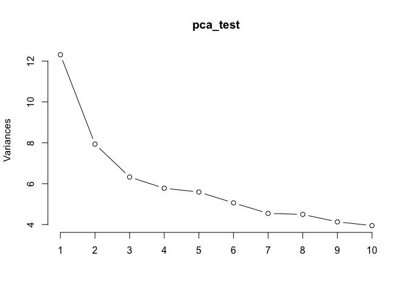

    summary(pca_test)

    ## Importance of first k=10 (out of 589) components:
    ##                           PC1     PC2     PC3     PC4     PC5     PC6     PC7
    ## Standard deviation     3.5087 2.81714 2.51519 2.40325 2.36470 2.24968 2.13217
    ## Proportion of Variance 0.0209 0.01347 0.01074 0.00981 0.00949 0.00859 0.00772
    ## Cumulative Proportion  0.0209 0.03438 0.04512 0.05492 0.06442 0.07301 0.08073
    ##                            PC8     PC9   PC10
    ## Standard deviation     2.12025 2.03279 1.9871
    ## Proportion of Variance 0.00763 0.00702 0.0067
    ## Cumulative Proportion  0.08836 0.09537 0.1021

    tfidf_test.m <- as.matrix(tfidf_test)
    tfidf_test.df<-as.data.frame(tfidf_test.m)

    tfidf_test <- cbind(labels_test,tfidf_test.df,pca_test$x[,1:6])
    #head(tfidf_test,10)

    # Look at the loadings
    round(pca_test$rotation[,1:6],2) 

    ##                      PC1   PC2   PC3   PC4   PC5   PC6
    ## added              -0.03  0.03  0.02 -0.02  0.09 -0.03
    ## agency              0.05 -0.02 -0.01  0.02  0.00  0.02
    ## america            -0.02 -0.03 -0.04 -0.01  0.01 -0.02
    ## amp                -0.05 -0.05  0.03  0.03 -0.05  0.00
    ## banking            -0.01 -0.03  0.09  0.03  0.06  0.17
    ## based              -0.03 -0.06 -0.06  0.03 -0.03  0.02
    ## board              -0.01 -0.06  0.05  0.04 -0.04 -0.05
    ## business           -0.06 -0.05 -0.02 -0.05 -0.02  0.08
    ## case                0.03 -0.03  0.01  0.02  0.00 -0.03
    ## charge             -0.03  0.00 -0.03 -0.02 -0.04 -0.02
    ## chief              -0.03 -0.04 -0.02 -0.06 -0.11  0.02
    ## coming              0.00  0.03 -0.01  0.03  0.02  0.00
    ## commission          0.02 -0.07  0.06  0.03  0.03  0.00
    ## companies          -0.01 -0.12 -0.02  0.00  0.06  0.03
    ## concern             0.02  0.02  0.00  0.02  0.00  0.02
    ## concerns            0.00  0.00  0.02  0.00 -0.01  0.02
    ## corporate          -0.03 -0.06 -0.01  0.00  0.01  0.06
    ## decided             0.02 -0.03  0.02  0.01  0.00 -0.01
    ## decision            0.04 -0.04  0.04 -0.03  0.01 -0.05
    ## dont                0.02 -0.01 -0.04 -0.01 -0.01  0.01
    ## earlier            -0.03  0.04  0.01  0.01 -0.02 -0.04
    ## earnings           -0.11  0.05 -0.09  0.05 -0.11  0.01
    ## exchange           -0.03  0.00  0.03  0.10 -0.07  0.02
    ## executive          -0.05 -0.07  0.00 -0.07 -0.08  0.02
    ## executives         -0.02 -0.08 -0.04  0.01 -0.01  0.01
    ## fact                0.00  0.00  0.01  0.01 -0.02  0.01
    ## figure             -0.02  0.07  0.00  0.01  0.06 -0.01
    ## financial          -0.03 -0.05  0.07  0.03  0.03  0.13
    ## focus              -0.02 -0.04  0.00 -0.03 -0.01  0.01
    ## government          0.09 -0.01  0.05  0.03  0.05 -0.03
    ## impact             -0.02  0.04 -0.02  0.03  0.00  0.03
    ## industry           -0.02 -0.09 -0.04  0.01  0.07 -0.03
    ## investments        -0.02 -0.03  0.04 -0.01  0.02  0.04
    ## investors          -0.04  0.00  0.07  0.14 -0.04  0.07
    ## involved            0.02 -0.05  0.05  0.04  0.01  0.01
    ## issued              0.03  0.01  0.01  0.05  0.00  0.01
    ## law                 0.07 -0.02 -0.01 -0.02 -0.04  0.06
    ## losses             -0.03  0.02  0.05  0.00  0.00  0.03
    ## made                0.05 -0.01  0.02  0.00 -0.03 -0.06
    ## make                0.01 -0.06 -0.01 -0.01  0.02  0.00
    ## makes              -0.02 -0.05 -0.02  0.00  0.00 -0.09
    ## management         -0.02 -0.06  0.08  0.00  0.00  0.05
    ## million            -0.14  0.06  0.04 -0.07 -0.06 -0.04
    ## month               0.01  0.02 -0.03  0.03  0.05 -0.06
    ## months             -0.03  0.04  0.00 -0.02  0.03 -0.02
    ## north               0.04  0.02 -0.01  0.00 -0.02 -0.09
    ## people              0.10  0.02 -0.04  0.00 -0.04  0.02
    ## plan                0.00 -0.06 -0.01  0.00  0.03  0.01
    ## potential          -0.02 -0.05  0.02 -0.02  0.02  0.00
    ## power               0.06  0.01  0.01 -0.02 -0.04  0.01
    ## previous           -0.03  0.06  0.00  0.04  0.02 -0.04
    ## price              -0.06  0.02  0.02  0.01  0.02 -0.03
    ## private             0.02  0.01  0.02  0.03  0.07 -0.01
    ## problem             0.01  0.00  0.00  0.04  0.04  0.04
    ## problems            0.02  0.01  0.00  0.05  0.05  0.02
    ## proposed            0.01 -0.06  0.03 -0.01 -0.04 -0.03
    ## public              0.07 -0.03  0.00  0.00 -0.03  0.03
    ## recent              0.02  0.03 -0.03  0.05 -0.02  0.01
    ## rule                0.10  0.04 -0.02 -0.07 -0.10  0.08
    ## rules               0.02 -0.03  0.02  0.02  0.02  0.05
    ## securities         -0.01 -0.03  0.07  0.11  0.00  0.10
    ## stock              -0.08 -0.04  0.02  0.17 -0.15  0.02
    ## time                0.03 -0.03 -0.02  0.02  0.02 -0.03
    ## tuesday             0.03 -0.02  0.01  0.05 -0.04 -0.04
    ## working             0.02 -0.05 -0.02 -0.01  0.04  0.01
    ## action              0.04 -0.03  0.03  0.02  0.01 -0.04
    ## asked               0.04 -0.01  0.02 -0.01 -0.02 -0.02
    ## bank               -0.01  0.01  0.11  0.09  0.08  0.17
    ## called              0.05 -0.03 -0.02 -0.01 -0.01 -0.01
    ## central             0.04  0.06  0.04  0.08  0.07  0.06
    ## chairman           -0.02 -0.08  0.02 -0.04 -0.05  0.02
    ## clear               0.04  0.00  0.01 -0.01 -0.01  0.01
    ## comment             0.00 -0.07  0.04  0.04 -0.06 -0.06
    ## court               0.03 -0.03  0.01  0.02 -0.03 -0.03
    ## current            -0.01  0.01 -0.01 -0.02  0.03  0.05
    ## declined            0.00 -0.05  0.00  0.01 -0.04 -0.08
    ## employees          -0.01 -0.04 -0.01  0.01 -0.02 -0.04
    ## federal             0.01 -0.06 -0.01  0.08  0.02  0.04
    ## important           0.04  0.00 -0.02 -0.02  0.02  0.02
    ## increasing         -0.01  0.01  0.00 -0.03  0.02  0.02
    ## january             0.00  0.06 -0.01  0.04  0.07 -0.07
    ## leader              0.13  0.05 -0.03 -0.03 -0.10  0.02
    ## low                -0.02  0.03  0.01  0.05  0.03  0.00
    ## making              0.02 -0.02 -0.02  0.00  0.01  0.01
    ## members             0.04 -0.02  0.01 -0.02 -0.02 -0.02
    ## nations             0.04 -0.01 -0.02  0.04  0.00 -0.01
    ## noted              -0.03 -0.03 -0.01 -0.01 -0.02  0.00
    ## number              0.01 -0.02 -0.02 -0.01  0.02  0.01
    ## paid               -0.01 -0.02  0.03  0.00 -0.01  0.01
    ## past                0.02  0.02 -0.04  0.02  0.00  0.00
    ## record             -0.01  0.07 -0.02  0.03  0.03 -0.01
    ## remains             0.00  0.01  0.00  0.02  0.00  0.00
    ## report             -0.01  0.02 -0.01  0.07 -0.04 -0.01
    ## rights              0.08  0.03 -0.02 -0.03 -0.07  0.01
    ## show                0.01  0.04 -0.06  0.01  0.05 -0.02
    ## spokesman           0.04 -0.03  0.02  0.02  0.01 -0.07
    ## step                0.03 -0.02  0.01  0.01 -0.01  0.02
    ## system              0.02 -0.05 -0.07  0.00  0.05  0.08
    ## term                0.00  0.03  0.01 -0.03  0.03  0.01
    ## thursday            0.01  0.00  0.02  0.06 -0.05 -0.02
    ## top                 0.04 -0.02  0.00  0.01 -0.04  0.01
    ## won                 0.03 -0.02  0.02 -0.01  0.01 -0.04
    ## years               0.05  0.02 -0.05 -0.06  0.01  0.02
    ## access              0.01 -0.06 -0.08  0.00  0.05 -0.01
    ## adding              0.00  0.01  0.02  0.00  0.06 -0.03
    ## amount              0.00 -0.01  0.03  0.02  0.04  0.03
    ## announced          -0.02 -0.06  0.06 -0.03 -0.01  0.01
    ## april              -0.01  0.03 -0.01  0.05  0.06 -0.02
    ## average            -0.03  0.07 -0.03  0.00  0.05 -0.01
    ## back                0.03  0.03  0.02 -0.04 -0.05  0.00
    ## begin              -0.01 -0.02 -0.02  0.03  0.02 -0.02
    ## capacity           -0.01  0.02 -0.01 -0.03  0.09 -0.03
    ## communications     -0.02 -0.12 -0.09 -0.02  0.04  0.05
    ## company            -0.10 -0.12 -0.02 -0.02 -0.06 -0.05
    ## computer           -0.04 -0.10 -0.16  0.02  0.00  0.06
    ## create              0.00 -0.07  0.01 -0.03  0.01  0.00
    ## data               -0.02 -0.02 -0.09  0.03  0.07  0.01
    ## day                 0.05  0.00 -0.02  0.03 -0.01 -0.07
    ## demand             -0.02  0.05 -0.03  0.02  0.08  0.00
    ## development         0.01 -0.01 -0.03 -0.01  0.04  0.03
    ## director           -0.01 -0.01  0.02 -0.04  0.06  0.03
    ## due                -0.02  0.02  0.02  0.04  0.00 -0.03
    ## east                0.02  0.02  0.02  0.00  0.02 -0.04
    ## economy             0.02  0.07  0.00  0.02  0.05  0.05
    ## end                 0.01  0.02  0.00 -0.01  0.03 -0.05
    ## firm               -0.02 -0.06  0.07  0.03  0.01  0.03
    ## force               0.03  0.01 -0.02  0.01 -0.01 -0.03
    ## foreign             0.08  0.04  0.03  0.03  0.00  0.05
    ## free                0.03 -0.02 -0.01 -0.02  0.00 -0.02
    ## gain               -0.03  0.01  0.02 -0.01 -0.01  0.00
    ## global             -0.01 -0.04  0.01 -0.04  0.03  0.02
    ## great               0.04  0.01 -0.03  0.00 -0.05  0.01
    ## head                0.02 -0.02  0.04 -0.01  0.01  0.03
    ## high               -0.01  0.06  0.00  0.04  0.00  0.01
    ## hold                0.02 -0.02  0.01  0.01 -0.01  0.00
    ## holding            -0.01 -0.01  0.06  0.01  0.00  0.00
    ## huge                0.02 -0.02 -0.02  0.02  0.01  0.01
    ## increase           -0.06  0.07 -0.01 -0.03  0.05  0.00
    ## increased          -0.05  0.05 -0.02 -0.04  0.03  0.01
    ## information         0.01 -0.07 -0.06  0.01  0.03  0.04
    ## international       0.02 -0.04 -0.05 -0.04  0.03  0.01
    ## internet           -0.01 -0.10 -0.12  0.00  0.05  0.06
    ## japan               0.02  0.01 -0.02  0.00  0.05  0.00
    ## late                0.03  0.03 -0.01  0.07 -0.02 -0.06
    ## life                0.01  0.00  0.03 -0.01 -0.01  0.05
    ## lines              -0.01 -0.04 -0.06 -0.01  0.02 -0.02
    ## long                0.03  0.00 -0.03  0.00  0.03  0.00
    ## lot                -0.02 -0.02 -0.02  0.02  0.01  0.00
    ## main                0.02  0.04 -0.01  0.01  0.08 -0.05
    ## major               0.00 -0.01  0.02  0.01  0.05  0.05
    ## march              -0.01  0.04 -0.01  0.07  0.04 -0.03
    ## mark                0.00  0.01  0.00  0.01 -0.01  0.00
    ## moving              0.01  0.00 -0.03  0.01  0.01  0.01
    ## national            0.04  0.00  0.02  0.01  0.05  0.02
    ## net                -0.08  0.09 -0.01 -0.04 -0.03  0.00
    ## network            -0.03 -0.09 -0.09 -0.01  0.03  0.04
    ## networks           -0.02 -0.07 -0.10 -0.01  0.03  0.04
    ## offer              -0.02 -0.11  0.07  0.00 -0.05 -0.07
    ## open                0.02 -0.03  0.00 -0.01  0.04 -0.03
    ## pay                -0.01 -0.05  0.00 -0.01  0.02 -0.03
    ## percent            -0.12  0.11  0.02 -0.01  0.05 -0.02
    ## performance        -0.05  0.04 -0.02 -0.04 -0.01 -0.01
    ## point               0.00  0.03 -0.03  0.03  0.03  0.02
    ## points             -0.03  0.06  0.03  0.15 -0.04  0.06
    ## programme          -0.01 -0.02  0.00 -0.02  0.04  0.01
    ## provide            -0.01 -0.07 -0.04 -0.02  0.05  0.03
    ## put                 0.00 -0.01  0.02  0.01  0.04  0.00
    ## quality             0.00  0.02 -0.01  0.01  0.10 -0.03
    ## rate               -0.03  0.06 -0.01  0.05  0.07  0.04
    ## real                0.00  0.01  0.01  0.05  0.02  0.04
    ## recently            0.01  0.00 -0.01  0.02  0.03  0.03
    ## remain             -0.01  0.03  0.01 -0.01  0.01  0.01
    ## reports             0.02  0.00  0.04  0.04 -0.02 -0.02
    ## research           -0.03 -0.03 -0.06  0.00  0.02  0.03
    ## rising             -0.02  0.07  0.00  0.02  0.03  0.00
    ## run                 0.00 -0.03 -0.03 -0.01  0.00  0.05
    ## service            -0.01 -0.09 -0.08 -0.02  0.04  0.01
    ## services           -0.03 -0.08 -0.04 -0.02  0.02  0.04
    ## set                 0.03 -0.01  0.02  0.00  0.04  0.01
    ## small               0.01 -0.04 -0.03  0.01  0.05  0.03
    ## smaller            -0.01  0.00  0.00  0.01  0.05  0.01
    ## software           -0.03 -0.08 -0.14  0.01  0.00  0.06
    ## supply              0.00  0.02  0.02  0.01  0.08 -0.07
    ## systems            -0.02 -0.06 -0.09  0.00 -0.01  0.05
    ## technology         -0.01 -0.09 -0.11 -0.01  0.04  0.04
    ## telecommunications  0.00 -0.05 -0.02 -0.03  0.04  0.00
    ## times               0.01 -0.02 -0.01 -0.02  0.01  0.01
    ## work                0.03 -0.04 -0.04 -0.01  0.01 -0.03
    ## world               0.04 -0.01 -0.03 -0.02  0.07 -0.04
    ## york               -0.04 -0.07 -0.05  0.07 -0.06 -0.01
    ## american            0.01 -0.05 -0.01 -0.01  0.01 -0.08
    ## association         0.04  0.00 -0.03 -0.01  0.04  0.04
    ## bill                0.04 -0.02 -0.05 -0.01  0.00  0.07
    ## committee           0.05 -0.02 -0.01  0.00  0.00  0.07
    ## competitive        -0.02 -0.03 -0.03 -0.03  0.04  0.00
    ## corp               -0.07 -0.15 -0.10  0.03 -0.01  0.00
    ## domestic            0.01  0.04  0.00  0.03  0.08  0.02
    ## export              0.01  0.00 -0.04  0.02  0.09  0.01
    ## house               0.04 -0.02  0.01  0.00  0.00  0.05
    ## including           0.00 -0.05 -0.04  0.00 -0.01  0.01
    ## industries          0.00 -0.03  0.01 -0.01  0.02 -0.01
    ## key                -0.01 -0.02  0.00  0.06  0.02  0.04
    ## president           0.06 -0.06 -0.06  0.03 -0.03 -0.02
    ## september          -0.01  0.01 -0.01  0.00  0.00 -0.06
    ## situation           0.04  0.02  0.02  0.03  0.01  0.01
    ## sold               -0.03 -0.02  0.01 -0.02  0.01 -0.02
    ## states              0.06 -0.03 -0.06 -0.03 -0.01 -0.10
    ## support             0.05 -0.01  0.00  0.00  0.00  0.03
    ## tough               0.00  0.02 -0.02 -0.01 -0.02  0.00
    ## trade               0.05  0.03 -0.02  0.01  0.04 -0.07
    ## united              0.05 -0.01 -0.05 -0.04 -0.02 -0.11
    ## week                0.03  0.00  0.02  0.09  0.00 -0.04
    ## air                 0.02  0.02 -0.03 -0.05  0.09 -0.03
    ## area                0.02 -0.01 -0.01  0.00  0.03 -0.01
    ## capital             0.01  0.00  0.08  0.00  0.02  0.03
    ## difficult           0.01  0.02 -0.01  0.01  0.03  0.01
    ## expect             -0.05  0.04 -0.03  0.00  0.02 -0.01
    ## find                0.02 -0.03  0.03  0.05 -0.03 -0.02
    ## give                0.04 -0.02  0.01 -0.01  0.04 -0.06
    ## group              -0.04 -0.04  0.10 -0.12 -0.01 -0.03
    ## groups              0.01 -0.02  0.04 -0.05 -0.01  0.01
    ## helped             -0.03  0.05  0.00 -0.04 -0.02  0.00
    ## home                0.00 -0.03 -0.03 -0.02  0.01  0.02
    ## issue               0.05 -0.01  0.01  0.03 -0.01  0.04
    ## issues              0.02  0.01  0.03  0.09 -0.02  0.01
    ## media               0.03  0.01  0.03  0.01 -0.05  0.03
    ## move                0.00 -0.03  0.01 -0.03  0.01  0.04
    ## office              0.03 -0.02 -0.01 -0.01 -0.01  0.03
    ## operations         -0.05 -0.02  0.00 -0.03  0.00  0.02
    ## part                0.01 -0.06 -0.01 -0.02  0.00 -0.01
    ## party               0.11  0.05 -0.01 -0.02 -0.09  0.04
    ## personal           -0.01 -0.06 -0.10  0.00  0.01  0.06
    ## place               0.03 -0.01  0.02 -0.02  0.01  0.02
    ## post                0.01  0.03 -0.03  0.00 -0.05  0.02
    ## posted             -0.06  0.05 -0.01 -0.01 -0.05  0.00
    ## products           -0.06 -0.05 -0.10  0.01  0.00  0.03
    ## question            0.02  0.00  0.01 -0.01  0.02  0.04
    ## showed              0.00  0.05 -0.01  0.04  0.04 -0.03
    ## sources             0.02  0.00  0.06  0.07  0.05 -0.02
    ## special             0.03  0.01 -0.01 -0.03 -0.04  0.03
    ## start               0.01  0.02  0.00  0.01  0.07 -0.05
    ## state               0.07  0.01  0.02  0.06  0.02  0.00
    ## strategy           -0.03 -0.04 -0.02 -0.05  0.00  0.02
    ## told                0.06  0.03  0.02 -0.05  0.05 -0.01
    ## washington          0.07  0.00 -0.05  0.01 -0.02 -0.07
    ## asset              -0.03 -0.01  0.09  0.00  0.01  0.07
    ## banks               0.00 -0.01  0.08  0.08  0.10  0.18
    ## businesses         -0.06 -0.02  0.01 -0.07 -0.03  0.01
    ## commercial          0.00 -0.02  0.05  0.01  0.05  0.08
    ## consumer           -0.05 -0.02 -0.02  0.04  0.03  0.06
    ## continued          -0.05  0.06  0.00  0.04 -0.04  0.00
    ## country             0.07  0.02 -0.02  0.01  0.01  0.00
    ## equity             -0.02 -0.02  0.06  0.01  0.02  0.05
    ## firms               0.00 -0.05  0.06  0.02  0.07  0.09
    ## found               0.02 -0.03  0.01  0.05 -0.01  0.00
    ## fourth             -0.07  0.04 -0.10  0.02 -0.08 -0.02
    ## include            -0.01 -0.07 -0.03 -0.03  0.02  0.01
    ## investment         -0.03 -0.02  0.09  0.00  0.04  0.11
    ## large               0.00  0.00  0.02  0.01  0.05  0.00
    ## largest            -0.01 -0.03  0.03  0.05  0.03  0.00
    ## market             -0.07  0.02  0.02  0.04  0.06  0.04
    ## markets            -0.02  0.01  0.04  0.05  0.04  0.07
    ## offered             0.01 -0.05  0.01 -0.01  0.00 -0.01
    ## previously         -0.01 -0.03  0.00  0.00 -0.02  0.01
    ## sector             -0.01  0.01  0.06  0.03  0.05  0.03
    ## side                0.03  0.00  0.00  0.00 -0.01 -0.02
    ## total              -0.03  0.06  0.00 -0.01  0.10 -0.05
    ## wednesday           0.02 -0.01  0.01  0.05 -0.04 -0.01
    ## areas               0.00  0.01 -0.03  0.00  0.08 -0.01
    ## began               0.03 -0.01 -0.02  0.05 -0.01 -0.03
    ## billion            -0.09  0.01  0.05  0.02 -0.03  0.00
    ## compared           -0.06  0.08 -0.05 -0.01  0.02 -0.03
    ## consumers          -0.02 -0.04 -0.05  0.00  0.06  0.05
    ## control             0.03 -0.02  0.04  0.00 -0.01  0.00
    ## credit             -0.01 -0.01  0.03  0.03  0.03  0.08
    ## days                0.04  0.02 -0.01  0.04  0.01 -0.04
    ## debt               -0.02  0.00  0.06  0.04  0.01  0.06
    ## drop               -0.03  0.03  0.00  0.03  0.00 -0.02
    ## expected           -0.05  0.04 -0.01  0.02  0.01 -0.04
    ## grow               -0.05  0.00 -0.05 -0.04  0.01  0.02
    ## growing            -0.02  0.02 -0.05 -0.01  0.05  0.01
    ## growth             -0.08  0.08 -0.05 -0.02  0.03  0.04
    ## improve            -0.02  0.01  0.01 -0.03  0.00  0.00
    ## jumped             -0.05  0.03  0.01  0.12 -0.07  0.04
    ## latest              0.01  0.00 -0.03  0.00  0.00 -0.03
    ## level              -0.02  0.05  0.00  0.00  0.04 -0.01
    ## levels             -0.03  0.07  0.00  0.00  0.07 -0.03
    ## meeting             0.04 -0.03  0.03  0.01 -0.04 -0.04
    ## period             -0.05  0.07 -0.01  0.00  0.00  0.00
    ## positive           -0.02  0.03  0.00 -0.02 -0.02  0.00
    ## process             0.01 -0.04  0.01  0.00  0.01 -0.01
    ## quarter            -0.11  0.06 -0.15  0.04 -0.10 -0.01
    ## raise              -0.02 -0.01  0.05  0.02  0.01  0.01
    ## rates              -0.03  0.07  0.00  0.05  0.07  0.06
    ## reported           -0.06  0.07 -0.03  0.00 -0.07 -0.03
    ## result             -0.05  0.06  0.03 -0.04  0.00  0.01
    ## role                0.04 -0.02  0.03 -0.02 -0.02  0.00
    ## sign                0.04  0.01  0.00  0.01 -0.02 -0.02
    ## started             0.01  0.00 -0.01  0.00  0.04  0.01
    ## year               -0.08  0.12 -0.06 -0.07  0.06 -0.02
    ## allowed             0.05 -0.01  0.02  0.00  0.02  0.06
    ## david              -0.03 -0.01  0.02 -0.01 -0.04 -0.01
    ## department          0.01 -0.01 -0.03  0.02  0.03 -0.01
    ## division           -0.03 -0.01  0.00 -0.04  0.00  0.00
    ## effect              0.00  0.01  0.00 -0.01  0.03  0.03
    ## forward             0.01 -0.02  0.01 -0.02  0.00  0.01
    ## full               -0.01  0.05  0.00 -0.04  0.02 -0.03
    ## john               -0.02 -0.03  0.01  0.01 -0.05  0.00
    ## member              0.06  0.01 -0.02 -0.03 -0.02  0.02
    ## monday              0.02 -0.03  0.03  0.08 -0.05 -0.04
    ## negotiations        0.04 -0.03  0.00  0.00  0.01 -0.13
    ## november           -0.01  0.03 -0.01 -0.01  0.04 -0.04
    ## officials           0.10  0.00 -0.04  0.06 -0.01 -0.08
    ## order               0.03  0.01  0.01  0.00  0.01 -0.02
    ## plans               0.01 -0.06 -0.03 -0.07  0.02  0.02
    ## policy              0.04  0.01 -0.01  0.00  0.03  0.08
    ## position            0.00 -0.01  0.02 -0.04 -0.01  0.03
    ## raised             -0.01  0.01  0.02  0.00 -0.01  0.00
    ## return              0.02  0.02  0.00 -0.04 -0.06  0.03
    ## running             0.00 -0.01 -0.02 -0.02  0.02 -0.01
    ## security            0.05 -0.02 -0.02  0.00 -0.01 -0.01
    ## seeking             0.01 -0.05  0.00  0.02 -0.01 -0.05
    ## statement          -0.01 -0.03  0.07  0.00 -0.03 -0.07
    ## strong             -0.05  0.07 -0.02  0.01 -0.01  0.02
    ## centre              0.04  0.00 -0.01 -0.01  0.03  0.03
    ## analysts           -0.09  0.05 -0.04  0.07 -0.06  0.00
    ## costs              -0.06  0.03 -0.02 -0.06  0.01  0.00
    ## customers          -0.04 -0.07 -0.09 -0.01  0.03  0.03
    ## december           -0.02  0.07 -0.02  0.01  0.01 -0.06
    ## governments         0.03 -0.01  0.04  0.00  0.04 -0.03
    ## insurance          -0.01 -0.03  0.06 -0.01  0.05  0.09
    ## interest           -0.03  0.04  0.07  0.10  0.03  0.08
    ## regional            0.01 -0.02  0.00 -0.03  0.04 -0.02
    ## warned              0.02  0.03  0.00 -0.02 -0.02  0.03
    ## worldwide          -0.03 -0.02 -0.04 -0.03  0.00 -0.02
    ## buy                -0.03 -0.06  0.05  0.04 -0.03 -0.03
    ## close              -0.01  0.01  0.04  0.10 -0.07 -0.01
    ## hard                0.02  0.00 -0.02  0.00  0.02 -0.02
    ## legal               0.03 -0.02  0.01 -0.02 -0.03  0.00
    ## product            -0.04 -0.04 -0.11 -0.02  0.02  0.02
    ## quickly             0.01 -0.02  0.01  0.02  0.02 -0.01
    ## received            0.01 -0.03  0.01  0.01 -0.02 -0.03
    ## sell               -0.03 -0.05  0.03  0.00  0.01 -0.04
    ## telephone           0.00 -0.05 -0.05 -0.01  0.01 -0.01
    ## ago                -0.03  0.01 -0.06 -0.01 -0.04 -0.01
    ## big                -0.01 -0.04 -0.01  0.01  0.04  0.03
    ## cents              -0.08  0.02 -0.06  0.05 -0.09 -0.01
    ## competition        -0.02 -0.03  0.00 -0.04  0.05  0.03
    ## conference         -0.01 -0.03 -0.06  0.01 -0.01  0.03
    ## future              0.05  0.02 -0.02 -0.10 -0.02  0.08
    ## money               0.00 -0.02  0.01  0.05  0.06  0.06
    ## news                0.02 -0.01  0.03  0.01 -0.04  0.02
    ## october            -0.01  0.04  0.02  0.01  0.06 -0.08
    ## prices             -0.03  0.07 -0.01  0.04  0.09 -0.02
    ## rise               -0.06  0.11  0.01 -0.03  0.06  0.02
    ## similar             0.01 -0.02 -0.01  0.00  0.02 -0.01
    ## south               0.06  0.02  0.01  0.01 -0.02 -0.10
    ## union               0.03 -0.03  0.01  0.01  0.02 -0.11
    ## agreed              0.02 -0.04  0.01  0.00  0.00 -0.07
    ## analyst            -0.10  0.02 -0.03  0.05 -0.08  0.00
    ## change              0.03  0.01 -0.02 -0.01  0.01  0.03
    ## considered          0.02 -0.02  0.01  0.03  0.00  0.01
    ## cost               -0.03 -0.03 -0.04 -0.04  0.06 -0.03
    ## develop            -0.01 -0.07 -0.03 -0.01  0.03  0.02
    ## early               0.00  0.03 -0.01  0.04  0.04 -0.07
    ## fund               -0.01 -0.03  0.10  0.01  0.01  0.07
    ## funds               0.00 -0.01  0.09  0.05  0.03  0.10
    ## higher             -0.06  0.07  0.02  0.04  0.00 -0.01
    ## initial            -0.02 -0.02  0.03 -0.02  0.01  0.00
    ## parts               0.00 -0.02 -0.01 -0.01  0.01 -0.04
    ## senior              0.05 -0.01  0.00  0.03 -0.03  0.02
    ## call               -0.03  0.00 -0.09  0.04 -0.05 -0.01
    ## deals               0.00 -0.05  0.04  0.03  0.02  0.01
    ## economic            0.07  0.07 -0.01  0.01  0.01  0.03
    ## friday              0.02 -0.01  0.06  0.07 -0.04 -0.05
    ## general             0.00 -0.04 -0.03 -0.01  0.02 -0.03
    ## good               -0.02  0.05 -0.01 -0.01  0.02 -0.02
    ## vice                0.00 -0.07 -0.08  0.00  0.01  0.00
    ## acquisition        -0.06 -0.05  0.01 -0.01 -0.05  0.01
    ## basis              -0.01  0.04  0.03  0.00  0.03  0.02
    ## biggest            -0.01 -0.04  0.01  0.02  0.01 -0.02
    ## continue           -0.01  0.03 -0.02 -0.03  0.00  0.02
    ## cut                -0.02  0.03 -0.02  0.02  0.03  0.01
    ## deal               -0.01 -0.09  0.06  0.02 -0.04 -0.09
    ## estimated          -0.02 -0.02 -0.02  0.01  0.02 -0.03
    ## held                0.02  0.00  0.02 -0.01 -0.01 -0.02
    ## hope                0.04  0.02  0.00 -0.03  0.01 -0.02
    ## interests           0.02 -0.04  0.06 -0.03 -0.02  0.02
    ## longer              0.01  0.00  0.00  0.00  0.02  0.00
    ## managing           -0.03  0.00  0.04 -0.04  0.04  0.02
    ## merger             -0.03 -0.08  0.06  0.01 -0.04 -0.02
    ## offering           -0.02 -0.06  0.00 -0.01  0.01  0.00
    ## officer            -0.04 -0.05 -0.07 -0.01 -0.06  0.01
    ## progress            0.02  0.02 -0.01 -0.03 -0.01 -0.07
    ## reach               0.00 -0.01 -0.03  0.01  0.03 -0.05
    ## reporters           0.05  0.01 -0.01 -0.02 -0.04  0.01
    ## restructuring      -0.04  0.00  0.03 -0.02 -0.02 -0.01
    ## revenue            -0.06  0.01 -0.08 -0.01 -0.01  0.02
    ## revenues           -0.08  0.00 -0.12  0.01 -0.06  0.01
    ## sunday              0.05  0.01  0.01  0.03 -0.03 -0.03
    ## taking              0.01  0.00  0.02  0.01  0.03  0.01
    ## thing               0.01 -0.01 -0.01  0.00 -0.01  0.01
    ## today               0.01 -0.01 -0.01  0.03  0.00 -0.01
    ## range              -0.03  0.02 -0.04 -0.02  0.05 -0.01
    ## stocks             -0.03  0.04  0.04  0.16 -0.02  0.04
    ## estimates          -0.06  0.03 -0.08  0.07 -0.05 -0.01
    ## february            0.01  0.05 -0.01  0.07  0.04 -0.05
    ## interview          -0.03 -0.01 -0.04 -0.06  0.01 -0.02
    ## job                 0.02 -0.02  0.01 -0.02 -0.01 -0.03
    ## launch             -0.01 -0.04 -0.03 -0.05  0.02  0.00
    ## needed              0.02 -0.02  0.01  0.00  0.04  0.01
    ## operating          -0.07 -0.02 -0.09 -0.05 -0.02  0.03
    ## political           0.12  0.05 -0.02 -0.03 -0.08  0.05
    ## reuters             0.00  0.04  0.02 -0.04  0.09 -0.03
    ## scheduled           0.03 -0.01 -0.02  0.01  0.01 -0.09
    ## slightly           -0.04  0.06 -0.03  0.00 -0.01 -0.02
    ## stake              -0.03 -0.05  0.10 -0.03 -0.01 -0.04
    ## war                 0.07  0.03 -0.01  0.02 -0.03 -0.08
    ## weve               -0.01 -0.02 -0.02 -0.01  0.00 -0.02
    ## charges             0.00  0.01 -0.02 -0.02 -0.01 -0.02
    ## contract            0.01 -0.03  0.01  0.02  0.02 -0.12
    ## existing            0.00 -0.04 -0.01 -0.05  0.04  0.03
    ## maker              -0.04 -0.04 -0.04  0.03 -0.03 -0.05
    ## unit               -0.03 -0.07  0.00 -0.03  0.01 -0.04
    ## details             0.03 -0.03  0.02  0.00  0.00 -0.03
    ## gave                0.04  0.00  0.00  0.01  0.00 -0.01
    ## companys           -0.07 -0.05 -0.06  0.00 -0.06 -0.03
    ## expand             -0.02 -0.03 -0.01 -0.04  0.03  0.01
    ## means               0.01 -0.02 -0.01 -0.02  0.02 -0.01
    ## official            0.10  0.05 -0.01  0.05 -0.02 -0.03
    ## prime               0.04  0.00  0.04  0.04  0.03 -0.01
    ## expects            -0.06  0.00 -0.06 -0.02 -0.02 -0.02
    ## failed              0.02 -0.01  0.03  0.00 -0.02 -0.03
    ## leading             0.02 -0.02 -0.01 -0.01 -0.01 -0.01
    ## planned            -0.01 -0.04  0.03 -0.02  0.00 -0.04
    ## chicago            -0.04 -0.04 -0.05  0.03 -0.02  0.00
    ## closed             -0.03  0.01  0.02  0.07 -0.05  0.01
    ## final               0.03  0.00  0.05  0.00  0.01 -0.07
    ## bad                 0.01  0.02  0.00  0.01  0.01  0.04
    ## local               0.03 -0.03 -0.03  0.00  0.05  0.04
    ## sales              -0.09  0.05 -0.07 -0.04 -0.02 -0.04
    ## short               0.00  0.04  0.00  0.01  0.00  0.01
    ## weeks               0.00  0.03  0.03  0.06  0.01 -0.03
    ## bit                -0.03  0.04 -0.02  0.01  0.02  0.00
    ## included           -0.02  0.02  0.02  0.06 -0.02  0.01
    ## led                 0.01  0.02  0.04  0.09 -0.04  0.03
    ## tax                -0.02  0.03  0.01 -0.02  0.02  0.01
    ## ahead               0.00  0.03  0.02 -0.04  0.01 -0.01
    ## fell               -0.07  0.06  0.00  0.08 -0.08 -0.01
    ## peter              -0.02 -0.01  0.05 -0.02  0.00  0.03
    ## reached             0.02  0.01 -0.02  0.03  0.04 -0.10
    ## finance            -0.01 -0.01  0.09  0.05  0.04  0.04
    ## holdings           -0.02 -0.01  0.04 -0.01 -0.01  0.00
    ## newsroom           -0.01  0.07  0.01 -0.03  0.17 -0.05
    ## profit             -0.10  0.11  0.02 -0.09 -0.04 -0.01
    ## view                0.01 -0.01 -0.01 -0.02  0.00  0.01
    ## announcement       -0.01 -0.02  0.03  0.02 -0.02  0.00
    ## jobs                0.01 -0.01  0.00 -0.01  0.01 -0.02
    ## pressure            0.01  0.03 -0.01  0.01  0.00  0.02
    ## june                0.04  0.05  0.00 -0.04 -0.04  0.03
    ## owned              -0.02 -0.04  0.07 -0.05  0.01 -0.03
    ## benefit            -0.02 -0.01  0.00 -0.03  0.03  0.02
    ## marketing          -0.03 -0.03 -0.06 -0.01  0.05 -0.03
    ## meet                0.00  0.00  0.00 -0.01  0.02 -0.03
    ## released            0.02  0.02 -0.03  0.06 -0.02  0.00
    ## boost              -0.03  0.02  0.00  0.00  0.04  0.01
    ## buying             -0.02  0.00  0.04  0.03  0.02 -0.01
    ## success             0.02 -0.01  0.00 -0.03  0.01  0.02
    ## left                0.04  0.01  0.01  0.02 -0.01 -0.02
    ## turn                0.00 -0.01  0.01 -0.01  0.01 -0.01
    ## build              -0.01 -0.04 -0.01 -0.03  0.04 -0.02
    ## building            0.00  0.01  0.02 -0.03  0.00  0.01
    ## lead                0.02 -0.02 -0.01  0.00  0.02 -0.01
    ## remained            0.01  0.04  0.02 -0.01  0.00 -0.05
    ## significant        -0.02 -0.01 -0.02 -0.02  0.02 -0.02
    ## source              0.03  0.01  0.02  0.05  0.03 -0.03
    ## things              0.01 -0.01 -0.01 -0.02  0.01 -0.01
    ## line               -0.04  0.01 -0.06 -0.04  0.02  0.00
    ## worlds              0.00 -0.03 -0.02  0.01  0.03 -0.05
    ## china               0.16  0.09 -0.04 -0.04 -0.07  0.03
    ## leaders             0.09  0.03 -0.02  0.02 -0.06 -0.01
    ## workers             0.03 -0.02 -0.01  0.02  0.02 -0.12
    ## agreement           0.04 -0.04  0.00  0.02  0.02 -0.14
    ## authorities         0.07  0.02  0.01  0.03 -0.03  0.02
    ## july                0.07  0.06 -0.02 -0.09 -0.07  0.06
    ## britain             0.05  0.02  0.02 -0.15 -0.05  0.05
    ## canada              0.01  0.00 -0.01  0.04  0.00 -0.03
    ## countries           0.05  0.00 -0.02 -0.01  0.05 -0.07
    ## direct              0.03  0.01 -0.01 -0.01 -0.01  0.01
    ## ended              -0.01  0.04 -0.02  0.07 -0.04 -0.05
    ## figures            -0.02  0.10  0.00  0.01  0.10 -0.05
    ## forced              0.02  0.00  0.02  0.02 -0.01 -0.02
    ## giant              -0.02 -0.05  0.00 -0.03 -0.01 -0.02
    ## hit                -0.03  0.05  0.02  0.00  0.02 -0.01
    ## income             -0.06  0.06 -0.03 -0.01 -0.03  0.03
    ## loss               -0.04  0.02  0.00 -0.01 -0.06 -0.01
    ## profits            -0.10  0.08  0.05 -0.11 -0.03 -0.01
    ## share              -0.13  0.03 -0.01  0.02 -0.14 -0.02
    ## street             -0.04 -0.03 -0.05  0.07 -0.09 -0.02
    ## wall               -0.04 -0.02 -0.06  0.07 -0.09 -0.01
    ## rose               -0.09  0.07 -0.01  0.05 -0.07  0.00
    ## bring               0.01 -0.04 -0.02 -0.02  0.01 -0.01
    ## czech               0.03  0.01  0.04  0.03  0.06 -0.04
    ## europe             -0.02  0.01  0.01 -0.08  0.03 -0.05
    ## half               -0.06  0.09  0.01 -0.07  0.00 -0.01
    ## lost               -0.02  0.01  0.02  0.09 -0.06 -0.02
    ## lower              -0.05  0.07  0.00  0.00  0.03  0.00
    ## minister            0.08  0.01  0.05  0.05  0.03 -0.03
    ## shareholders       -0.04 -0.08  0.10  0.01 -0.09 -0.05
    ## shares             -0.09 -0.01  0.13  0.07 -0.13 -0.01
    ## trading            -0.04  0.03  0.07  0.12 -0.05  0.04
    ## daily               0.05  0.04 -0.01  0.00  0.01  0.00
    ## independent         0.00 -0.04  0.06  0.00 -0.03 -0.01
    ## target             -0.02  0.00  0.00  0.00  0.01 -0.04
    ## base               -0.01  0.01 -0.01  0.01 -0.01  0.02
    ## food               -0.02  0.01 -0.01 -0.02  0.00 -0.04
    ## forecast           -0.06  0.11 -0.01  0.00  0.03 -0.03
    ## industrial         -0.02  0.01  0.05  0.02  0.02  0.01
    ## conditions         -0.01  0.01  0.04 -0.03  0.02 -0.04
    ## longterm           -0.01  0.00  0.02  0.00  0.02  0.02
    ## manager             0.01 -0.01  0.02  0.01  0.07  0.04
    ## ministry            0.05 -0.01  0.05  0.05  0.03 -0.05
    ## results            -0.09  0.07 -0.03  0.00 -0.07 -0.02
    ## partner            -0.01 -0.04  0.05  0.01  0.00 -0.03
    ## production         -0.01  0.00  0.00 -0.01  0.06 -0.11
    ## european            0.00 -0.02  0.04 -0.06  0.05 -0.05
    ## fall               -0.04  0.05  0.00 -0.03  0.02 -0.03
    ## shareholder        -0.03 -0.06  0.07 -0.01 -0.06 -0.05
    ## britains            0.00 -0.02  0.09 -0.11 -0.01  0.04
    ## british             0.02  0.00  0.10 -0.18 -0.05  0.02
    ## expansion          -0.02 -0.01  0.01 -0.05  0.02  0.00
    ## newspaper           0.05  0.02  0.02  0.00 -0.06 -0.02
    ## opportunity        -0.01 -0.04  0.00 -0.03 -0.01  0.01
    ## plc                -0.06 -0.02  0.10 -0.16  0.00 -0.03
    ## pound              -0.05  0.01  0.13 -0.11 -0.03 -0.01
    ## pounds             -0.07  0.03  0.12 -0.15 -0.03  0.01
    ## television          0.01 -0.04  0.00 -0.05  0.00  0.01
    ## western             0.05  0.02  0.01  0.01  0.01 -0.03
    ## worth              -0.03 -0.02  0.09  0.06 -0.05 -0.02
    ## bought             -0.03 -0.03  0.03 -0.01  0.00 -0.01
    ## city                0.04 -0.01  0.01  0.00 -0.01 -0.01
    ## sale               -0.02 -0.05  0.08 -0.03  0.00 -0.05
    ## cash               -0.05 -0.04  0.04  0.00 -0.03 -0.03
    ## annual             -0.03 -0.01  0.00 -0.03 -0.01 -0.02
    ## forecasts          -0.06  0.10  0.02 -0.06  0.02 -0.04
    ## rest               -0.01 -0.01  0.00  0.00 -0.01  0.00
    ## heavy              -0.01  0.04  0.01  0.08  0.01 -0.01
    ## joint               0.01 -0.04  0.05 -0.07  0.01 -0.04
    ## fiscal             -0.05  0.02 -0.09  0.02 -0.05  0.00
    ## aimed               0.01 -0.02 -0.04  0.00  0.03 -0.04
    ## approval            0.01 -0.03  0.04 -0.01  0.01 -0.03
    ## region              0.06  0.03 -0.02 -0.01  0.00 -0.01
    ## bid                -0.01 -0.05  0.13 -0.03 -0.07 -0.08
    ## french              0.00 -0.04  0.08 -0.03  0.02 -0.06
    ## expectations       -0.08  0.07 -0.02 -0.03 -0.04  0.01
    ## confirmed           0.01 -0.03  0.05  0.02 -0.02 -0.01
    ## london             -0.01 -0.01  0.10 -0.08  0.01  0.00
    ## speculation        -0.02 -0.02  0.03  0.00 -0.04  0.02
    ## terms               0.00 -0.03  0.05  0.00 -0.01 -0.08
    ## launched            0.01 -0.02 -0.01 -0.02 -0.03 -0.01
    ## retail             -0.03  0.01  0.00 -0.02 -0.02  0.02
    ## communist           0.12  0.06 -0.03  0.01 -0.10  0.01
    ## face                0.05  0.01  0.00  0.01 -0.03 -0.02
    ## selling            -0.03 -0.03 -0.03  0.03 -0.01  0.00
    ## partners           -0.01 -0.06  0.00 -0.03  0.03 -0.02
    ## rivals             -0.01 -0.03 -0.04 -0.01 -0.01  0.00
    ## assets             -0.03 -0.05  0.08  0.00 -0.02  0.05
    ## wanted              0.03 -0.02  0.03 -0.02 -0.01 -0.03
    ## rival               0.00 -0.05  0.01 -0.04 -0.03 -0.05
    ## talks               0.05 -0.04  0.03  0.00  0.00 -0.18
    ## margins            -0.06  0.05 -0.01 -0.06  0.00  0.00
    ## pence              -0.05  0.02  0.11 -0.11 -0.05 -0.04
    ## acquisitions       -0.05 -0.02  0.01 -0.04 -0.02  0.00
    ## takeover           -0.02 -0.04  0.11  0.00 -0.07 -0.02
    ## asia                0.00  0.02  0.01 -0.04  0.05 -0.01
    ## venture            -0.01 -0.06  0.02 -0.06  0.03 -0.02
    ## canadian            0.00  0.00  0.01  0.06 -0.02 -0.01
    ## dividend           -0.07  0.05  0.07 -0.09 -0.04 -0.01
    ## pretax             -0.08  0.06  0.06 -0.14 -0.03 -0.02
    ## hong                0.12  0.08 -0.04 -0.13 -0.08  0.13
    ## kong                0.12  0.08 -0.04 -0.12 -0.07  0.12
    ## michael            -0.01 -0.02 -0.03 -0.01 -0.04 -0.02
    ## beijing             0.15  0.07 -0.04  0.00 -0.11 -0.03
    ## beijings            0.11  0.06 -0.03 -0.04 -0.10  0.03
    ## chinese             0.14  0.09 -0.04  0.00 -0.07  0.00
    ## chinas              0.14  0.09 -0.03  0.00 -0.08  0.04
    ## kongs               0.10  0.06 -0.03 -0.12 -0.09  0.12
    ## tonnes              0.01  0.09 -0.01  0.05  0.16 -0.09
    ## australian         -0.01  0.01  0.05 -0.01  0.02  0.03

    loadings = pca_test$rotation[order(abs(pca_test$rotation[,1]),decreasing=TRUE)][1:6] %>%
      as.data.frame %>%
      rownames_to_column('words')

###### Check the meanings of components by extracting important words.

\#\#\#\#\#\#PC1 percent leader rule people million earnings -
quantitative \#\#\#\#\#\#PC2 offer computer company communications
companies - firm \#\#\#\#\#\#PC3 computer internet networks data - tech
\#\#\#\#\#\#PC4 exchange investors securities stock poin -operation and
trading \#\#\#\#\#\#PC5 chief rule demand capacity - market
\#\#\#\#\#\#PC6 banking financial bank - unclear \#\#\#\#\#\# By
comparing the PC meanings in the training set, we can see these PC’s in
the testing set have very similar words in each components. We can match
the components in the training data and testing data. It is resonable to
use these components for prediction.

    # Corrections: R cannot detect factor correctly, so convert the author names to factors of numbers
    author <- unique(tfidf_train$labels_train)
    num <- (1:50)
    authornum <- cbind(author,num)
    authornum <- as.data.frame(authornum)
    authornum <- cbind(authornum,num)
    names(authornum)[names(authornum) =="author"] <-"labels_train"
    tfidf_train <- merge(tfidf_train, authornum, by="labels_train", all.x=TRUE)
    names(authornum)[names(authornum) =="labels_train"] <-"labels_test"
    tfidf_test <- merge(tfidf_test, authornum, by="labels_test", all.x=TRUE)

###### Supervied Learning Model 1: Naive Bayesian Model

    library(e1071)

    ## Registered S3 methods overwritten by 'proxy':
    ##   method               from    
    ##   print.registry_field registry
    ##   print.registry_entry registry

    #numhat <- predict(bayes_model, tfidf_test[,592:598],type = "raw")
    #tfidf_test_pred <- cbind(tfidf_test,numhat)
    bayes <- naiveBayes(num ~ PC1+PC2+PC3+PC4+PC5+PC6, data = tfidf_train)
    numhat <- predict(bayes,tfidf_test[,592:598],type = "raw")
    #numhat <- ifelse(numhat>=0.5,1,0)
    head(numhat,10)

    ##                  1           10           11           12           13
    ##  [1,] 5.160878e-06 5.136249e-12 4.465250e-06 6.959348e-04 0.0027809267
    ##  [2,] 2.042106e-04 4.884381e-08 7.291903e-03 1.766287e-02 0.0123390560
    ##  [3,] 7.585797e-05 1.927108e-09 1.139862e-03 8.112849e-03 0.0354747778
    ##  [4,] 2.000171e-08 5.508409e-05 1.083216e-03 1.768346e-03 0.0149441181
    ##  [5,] 3.133541e-03 9.001354e-11 2.327221e-04 1.373683e-03 0.0023739723
    ##  [6,] 1.031615e-08 4.501350e-06 3.402151e-02 2.352495e-02 0.0002048001
    ##  [7,] 1.983421e-05 8.696135e-10 3.447412e-05 1.682001e-05 0.3577421770
    ##  [8,] 1.539413e-04 1.052000e-07 5.819007e-03 1.488249e-02 0.0388062089
    ##  [9,] 1.948479e-04 1.039625e-07 6.760602e-03 1.663398e-02 0.0341220315
    ## [10,] 3.600615e-06 9.513961e-11 1.018481e-04 3.541887e-03 0.0015619065
    ##                 14         15           16          17         18           19
    ##  [1,] 6.365952e-11 0.21402036 1.085448e-07 0.022379260 0.08705742 1.077539e-03
    ##  [2,] 2.334377e-05 0.02701912 5.658054e-04 0.129783313 0.05243416 8.453404e-03
    ##  [3,] 1.176148e-06 0.21047622 1.917567e-06 0.107753549 0.16283963 1.514962e-03
    ##  [4,] 1.374577e-05 0.03094579 2.148293e-03 0.006916935 0.03441373 8.722348e-02
    ##  [5,] 2.781896e-10 0.01463440 2.409995e-06 0.146544296 0.01269501 9.464690e-04
    ##  [6,] 9.911974e-05 0.04548687 7.010965e-03 0.020251496 0.11954132 8.113959e-03
    ##  [7,] 7.958925e-06 0.22236379 2.129971e-07 0.020951333 0.08812548 1.644491e-05
    ##  [8,] 2.239857e-03 0.01875110 7.615859e-05 0.105968413 0.05393683 3.756522e-04
    ##  [9,] 2.265669e-03 0.01627566 1.237894e-04 0.115057842 0.05051988 4.511390e-04
    ## [10,] 2.392210e-10 0.37316464 7.692794e-08 0.042423312 0.13410371 1.371472e-03
    ##                  2           20           21           22           23
    ##  [1,] 0.0045557119 5.812914e-05 1.376634e-05 0.0001502035 2.708655e-07
    ##  [2,] 0.0179317145 6.098165e-04 3.408979e-03 0.0122057906 5.362700e-05
    ##  [3,] 0.0146502343 6.469542e-05 3.480301e-03 0.0011391382 2.686270e-05
    ##  [4,] 0.0417205594 5.444298e-03 8.949069e-05 0.0028026236 1.531565e-03
    ##  [5,] 0.0007474522 1.266582e-04 1.671618e-05 0.0009459382 3.137885e-07
    ##  [6,] 0.1429574434 8.996594e-04 4.950300e-06 0.0050560271 2.312646e-04
    ##  [7,] 0.0002812355 1.139029e-07 1.223180e-02 0.0001733865 1.307785e-05
    ##  [8,] 0.0121055341 2.103763e-05 6.091222e-02 0.0020654338 1.998799e-04
    ##  [9,] 0.0124243394 2.337557e-05 5.426698e-02 0.0025427239 1.795352e-04
    ## [10,] 0.0103574310 1.536914e-04 4.691770e-06 0.0001626397 2.210799e-06
    ##                 24           25           26           27           28
    ##  [1,] 0.0069568442 1.066902e-04 2.301340e-11 1.441967e-09 4.567484e-13
    ##  [2,] 0.0104425151 4.091873e-03 4.892043e-08 8.916381e-07 5.672594e-05
    ##  [3,] 0.0029027651 3.669392e-04 8.603197e-09 8.424435e-08 1.088766e-07
    ##  [4,] 0.1526040605 3.718720e-04 1.655692e-05 9.218366e-05 6.692626e-03
    ##  [5,] 0.0065334603 7.551101e-03 7.978390e-11 1.907312e-09 5.489820e-12
    ##  [6,] 0.0694902396 2.723075e-03 1.105278e-06 9.873290e-07 4.902092e-04
    ##  [7,] 0.0001092267 2.248215e-05 1.697720e-07 9.763360e-14 8.111411e-11
    ##  [8,] 0.0010154357 5.788435e-04 9.590766e-07 1.373032e-07 2.976881e-04
    ##  [9,] 0.0011493986 7.877964e-04 8.587813e-07 1.335643e-07 4.070099e-04
    ## [10,] 0.0106020635 3.909523e-04 1.434529e-10 3.879058e-08 6.402169e-12
    ##                29           3         30          31           32           33
    ##  [1,] 0.001672486 0.023208844 0.45252163 0.014965689 0.0002966976 1.322894e-05
    ##  [2,] 0.079177773 0.045075521 0.25347832 0.023445534 0.0009264232 8.573601e-04
    ##  [3,] 0.021190154 0.021588620 0.12684122 0.008830226 0.0012909320 6.442637e-05
    ##  [4,] 0.017302541 0.009137467 0.06985214 0.193049832 0.0061588204 3.253360e-02
    ##  [5,] 0.004499482 0.067145051 0.50749299 0.004433378 0.0001489613 7.312407e-06
    ##  [6,] 0.058737304 0.024140992 0.04796326 0.138806229 0.0011518182 3.173684e-03
    ##  [7,] 0.001156523 0.002155548 0.01683227 0.001351779 0.0037671889 8.547016e-07
    ##  [8,] 0.010017103 0.008879737 0.01890418 0.005657541 0.0032516957 2.499769e-05
    ##  [9,] 0.011627596 0.009907231 0.02476624 0.006346639 0.0029502894 3.217593e-05
    ## [10,] 0.004476514 0.030346842 0.22628735 0.012784072 0.0004104731 1.607281e-05
    ##                 34           35           36           37           38
    ##  [1,] 0.0008270964 1.959340e-08 4.653368e-07 0.0020361343 1.342635e-26
    ##  [2,] 0.0065304733 1.387366e-04 1.578155e-04 0.0039713496 6.516746e-16
    ##  [3,] 0.0083675171 2.341194e-05 2.556950e-05 0.0122417919 5.119393e-17
    ##  [4,] 0.0084680783 1.132655e-05 3.909123e-04 0.0056263047 3.816020e-34
    ##  [5,] 0.0035179288 6.305674e-08 4.504061e-05 0.0006295984 2.178642e-27
    ##  [6,] 0.0004282237 6.740559e-04 1.944669e-05 0.0009432136 2.758268e-23
    ##  [7,] 0.1201633562 5.168827e-05 8.147592e-06 0.0805280662 2.841185e-25
    ##  [8,] 0.0214632695 9.472235e-03 1.148803e-04 0.0214826812 4.835247e-08
    ##  [9,] 0.0204058960 9.468286e-03 1.189894e-04 0.0184588003 4.158384e-08
    ## [10,] 0.0007586655 7.433907e-08 3.145152e-06 0.0020542826 1.172770e-26
    ##                39            4           40           41           42
    ##  [1,] 0.087725858 4.342897e-18 2.642477e-13 1.156027e-09 3.962826e-07
    ##  [2,] 0.128235834 6.494768e-08 3.932518e-10 2.114958e-06 4.761270e-05
    ##  [3,] 0.091201901 1.251810e-10 4.675231e-10 4.630130e-07 1.126586e-05
    ##  [4,] 0.035858219 5.994046e-08 5.351839e-09 7.072038e-07 5.250868e-04
    ##  [5,] 0.094516231 1.042231e-16 6.523934e-09 3.277260e-07 6.362102e-06
    ##  [6,] 0.009211983 1.327790e-06 2.865085e-21 1.446222e-09 8.510325e-05
    ##  [7,] 0.009491235 1.576432e-10 1.141253e-07 9.027036e-05 1.365205e-05
    ##  [8,] 0.017739431 1.122615e-04 1.994252e-09 1.611400e-05 1.011559e-04
    ##  [9,] 0.021046568 1.212872e-04 1.424445e-09 1.680740e-05 1.022019e-04
    ## [10,] 0.061624823 7.911622e-17 1.473139e-14 6.533852e-10 1.770806e-06
    ##                 43           44          45           46           47
    ##  [1,] 1.524123e-03 1.265479e-11 0.037951000 3.718239e-12 1.234343e-16
    ##  [2,] 1.434246e-02 8.035709e-06 0.046747257 2.114930e-05 2.467737e-10
    ##  [3,] 2.312338e-02 2.611208e-07 0.062326995 2.144390e-07 3.427898e-12
    ##  [4,] 4.183413e-05 4.587680e-06 0.004629793 1.658789e-05 3.556883e-07
    ##  [5,] 1.305740e-02 2.992180e-11 0.041865595 4.933043e-11 1.732357e-14
    ##  [6,] 6.190784e-02 2.093992e-05 0.009460462 1.447992e-04 1.989671e-08
    ##  [7,] 6.409403e-03 6.573269e-08 0.024457713 8.669319e-08 1.753197e-10
    ##  [8,] 2.391774e-01 8.764869e-04 0.035900872 2.200162e-03 1.390426e-08
    ##  [9,] 2.302067e-01 9.164347e-04 0.038246934 2.387748e-03 1.456559e-08
    ## [10,] 1.487112e-02 3.982040e-11 0.038013666 1.404238e-11 2.686116e-15
    ##                 48           49           5          50            6
    ##  [1,] 2.414648e-07 1.598878e-09 0.007499023 0.002713132 0.0003861328
    ##  [2,] 3.792031e-05 5.014057e-06 0.014802221 0.038309900 0.0009181268
    ##  [3,] 2.994113e-07 5.608021e-07 0.006793535 0.041183871 0.0012938852
    ##  [4,] 3.918895e-02 1.396289e-03 0.133649150 0.001465754 0.0121422343
    ##  [5,] 2.835093e-07 3.926476e-09 0.005169830 0.003456459 0.0001293974
    ##  [6,] 1.126002e-03 2.309593e-05 0.119586898 0.013144695 0.0032333932
    ##  [7,] 2.336942e-10 3.445043e-05 0.001814359 0.003252079 0.0006786739
    ##  [8,] 1.240738e-07 3.805135e-05 0.005435626 0.256222533 0.0012255433
    ##  [9,] 1.875600e-07 3.657072e-05 0.005691863 0.259602717 0.0010804581
    ## [10,] 3.296997e-07 2.091554e-09 0.010424615 0.005634025 0.0010075822
    ##                 7            8            9
    ##  [1,] 0.002494712 1.616074e-14 0.0243002904
    ##  [2,] 0.007633735 3.963458e-09 0.0305500168
    ##  [3,] 0.016170849 4.560326e-10 0.0074067046
    ##  [4,] 0.018567003 2.995306e-06 0.0191007653
    ##  [5,] 0.001028310 1.142576e-13 0.0549918485
    ##  [6,] 0.021480799 1.480634e-10 0.0044199466
    ##  [7,] 0.024722331 1.735654e-06 0.0009083839
    ##  [8,] 0.019224153 3.494676e-07 0.0042544190
    ##  [9,] 0.017174921 2.863449e-07 0.0050984172
    ## [10,] 0.006082340 9.508629e-15 0.0072560551

    #confus <- table(numhat,tfidf_test$num)

###### From the model results, we can choose a particular probability as a threshold to decide if that is the author for each corpus or not.

###### Supervied Learning Model 2: Multinomial Model

    library(nnet)

    tfidf_train$num <-factor(tfidf_train$num)
    ml1 <- multinom(num ~ PC1+PC2+PC3+PC4+PC5+PC6, data=tfidf_train)

    ## # weights:  400 (343 variable)
    ## initial  value 9780.057514 
    ## iter  10 value 6328.280592
    ## iter  20 value 6033.935269
    ## iter  30 value 5921.677656
    ## iter  40 value 5725.829256
    ## iter  50 value 5551.466929
    ## iter  60 value 5467.804524
    ## iter  70 value 5394.702602
    ## iter  80 value 5324.061536
    ## iter  90 value 5278.556358
    ## iter 100 value 5216.489877
    ## final  value 5216.489877 
    ## stopped after 100 iterations

    coef(ml1) %>% round(2)

    ##    (Intercept)   PC1   PC2   PC3   PC4   PC5   PC6
    ## 10       -2.04  1.34  0.65  0.36  0.53 -0.87  0.51
    ## 11        1.81  0.73 -0.65 -1.12 -0.30  0.05  0.61
    ## 12        0.37  0.13 -1.28 -0.65 -0.25 -0.07 -0.25
    ## 13        2.57  0.95 -0.16 -0.92  0.10 -0.87  1.63
    ## 14        0.72 -0.24 -1.24 -0.07 -0.42 -0.28  0.29
    ## 15       -0.34 -0.06 -1.64 -2.10 -0.18 -0.33  1.99
    ## 16       -1.81 -0.20 -1.03 -0.82 -2.61 -0.12  2.15
    ## 17        0.76  0.60 -0.90 -2.08 -1.71 -0.27  0.49
    ## 18       -0.46 -0.19 -1.80 -2.12 -0.19 -0.46  1.82
    ## 19        1.22  0.93 -0.45 -1.49 -1.65 -0.70  1.56
    ## 2        -0.53  0.27 -1.73 -1.77  0.33 -0.65  1.92
    ## 20       -0.42  1.06 -0.54 -2.11 -1.71 -0.75  0.79
    ## 21        1.32 -0.12 -0.91 -1.04 -0.81 -0.88  1.96
    ## 22        1.55  0.71 -0.36 -1.38 -1.87 -0.99  1.05
    ## 23        0.90  1.51  0.25 -0.23  0.03 -0.97  1.23
    ## 24        1.64  1.27 -0.40 -1.36 -1.08 -0.34  1.53
    ## 25       -0.67  1.43  0.15 -1.65 -1.74 -0.26  1.15
    ## 26       -1.37  0.86  0.47  0.62  0.18 -1.23  0.35
    ## 27        1.17  0.85 -0.42 -0.59  0.61 -0.80  0.84
    ## 28        0.71 -0.16 -1.34 -0.31 -0.37  0.10  0.63
    ## 29        0.83  0.14 -0.70 -1.48 -0.39  0.22  1.75
    ## 3         0.26  0.54 -0.67 -2.11 -1.98 -0.27  0.97
    ## 30        1.38  0.71 -0.26 -1.66 -1.21 -0.30  1.87
    ## 31        3.06  0.64 -0.84 -1.16 -0.89 -0.85  1.57
    ## 32        0.81  1.13  0.25  0.10 -0.14 -1.11  1.04
    ## 33       -1.58 -0.14 -0.98 -1.36 -0.76  0.35  2.47
    ## 34        2.36  0.91  0.14 -0.47 -0.49 -1.04  1.10
    ## 35       -1.58 -0.58 -1.40 -0.06 -0.76  0.17  0.11
    ## 36        1.21  1.41  0.45 -0.40 -0.47 -0.69  0.96
    ## 37        2.72  0.94 -0.06 -0.45 -0.43 -1.29  1.23
    ## 38       -1.85 -0.13 -1.06 -1.66 -1.61 -0.86 -0.33
    ## 39        2.44  0.80 -0.28 -1.40 -0.89 -0.58  1.70
    ## 4        -0.80 -0.47 -1.68 -0.69 -0.66 -0.29  0.30
    ## 40       -1.10  1.51  0.94 -0.91 -0.15 -1.24  1.11
    ## 41       -0.91  0.12  0.53 -0.06  0.43 -0.02  0.80
    ## 42       -0.09  1.00  0.28  0.29 -0.09 -0.70  0.41
    ## 43        0.39  0.36 -1.33 -1.48 -1.70  0.01 -0.50
    ## 44       -0.75 -0.41 -1.48 -0.04 -0.60 -0.14  0.17
    ## 45        0.84  0.70 -0.54 -1.86 -1.90 -0.59  0.74
    ## 46       -0.92 -0.33 -1.52 -1.26 -2.10 -0.29  0.72
    ## 47       -1.53  1.18  0.36  0.56  0.08 -0.66  0.44
    ## 48        0.16  1.13 -0.65 -1.47 -1.68 -0.59  1.79
    ## 49        1.36  0.92 -0.13 -0.02 -0.40 -1.03  2.01
    ## 5         2.31  0.90 -0.73 -1.39 -0.98 -0.91  1.31
    ## 50        0.51 -0.41 -1.21 -0.72 -0.78  0.10  0.37
    ## 6         2.03  1.23  0.01 -0.48 -0.11 -1.03  1.11
    ## 7         2.54  0.89 -0.45 -0.93  0.23 -0.80  1.26
    ## 8         0.32  1.24  0.07 -0.29  0.15 -0.98  2.12
    ## 9         0.23  0.61 -0.54 -1.96 -1.85 -0.66  1.85

    predict(ml1, tfidf_test, type='prob') %>%
      head(5) %>%
      round(3)

    ##   1 10    11    12    13    14    15    16    17    18    19     2    20    21
    ## 1 0  0 0.000 0.000 0.000 0.000 0.377 0.000 0.002 0.594 0.000 0.013 0.000 0.001
    ## 2 0  0 0.003 0.001 0.001 0.001 0.287 0.003 0.049 0.365 0.005 0.030 0.003 0.018
    ## 3 0  0 0.000 0.000 0.000 0.000 0.338 0.000 0.007 0.564 0.000 0.038 0.000 0.010
    ## 4 0  0 0.022 0.000 0.051 0.000 0.006 0.000 0.006 0.003 0.038 0.007 0.004 0.002
    ## 5 0  0 0.001 0.000 0.000 0.000 0.211 0.003 0.118 0.211 0.004 0.003 0.005 0.004
    ##      22    23    24   25 26    27    28    29     3    30    31    32    33
    ## 1 0.000 0.000 0.000 0.00  0 0.000 0.000 0.002 0.003 0.001 0.000 0.000 0.002
    ## 2 0.004 0.000 0.002 0.00  0 0.000 0.002 0.030 0.040 0.014 0.024 0.000 0.012
    ## 3 0.001 0.000 0.000 0.00  0 0.000 0.000 0.009 0.005 0.002 0.005 0.000 0.002
    ## 4 0.004 0.011 0.324 0.02  0 0.002 0.000 0.015 0.006 0.062 0.079 0.001 0.003
    ## 5 0.003 0.000 0.001 0.00  0 0.000 0.000 0.045 0.213 0.032 0.003 0.000 0.022
    ##      34 35    36    37    38    39     4 40 41 42    43 44    45    46 47    48
    ## 1 0.000  0 0.000 0.000 0.000 0.000 0.000  0  0  0 0.000  0 0.000 0.001  0 0.000
    ## 2 0.000  0 0.000 0.000 0.002 0.010 0.003  0  0  0 0.013  0 0.013 0.022  0 0.002
    ## 3 0.000  0 0.000 0.000 0.001 0.002 0.001  0  0  0 0.001  0 0.002 0.002  0 0.000
    ## 4 0.005  0 0.009 0.008 0.000 0.093 0.000  0  0  0 0.001  0 0.004 0.000  0 0.071
    ## 5 0.000  0 0.000 0.000 0.001 0.006 0.000  0  0  0 0.006  0 0.025 0.013  0 0.001
    ##      49     5    50     6     7     8     9
    ## 1 0.000 0.000 0.000 0.000 0.000 0.000 0.003
    ## 2 0.000 0.009 0.007 0.000 0.001 0.000 0.022
    ## 3 0.000 0.002 0.001 0.000 0.000 0.000 0.004
    ## 4 0.011 0.055 0.000 0.014 0.034 0.015 0.013
    ## 5 0.000 0.002 0.001 0.000 0.000 0.000 0.065

    yhat_test = predict(ml1, newdata=tfidf_test[,592:598], type='class')
    conf_mat=table(tfidf_test$num, yhat_test)
    #conf_mat
    sum(diag(conf_mat))/sum(conf_mat)

    ## [1] NaN

###### Although we just get a NaN from the model evaluation. But we also get a clear results about the predictions in the test set.

#### Random Forest Model

    #row.has.na <- apply(tfidf_train, 1, function(x){any(is.na(x))})
    #predictors_no_NA <- gb_train[!row.has.na, ]
    rf = randomForest(num ~ PC1+PC2+PC3+PC4+PC5+PC6,
                             data=tfidf_train, importance = TRUE) 
    plot(rf)

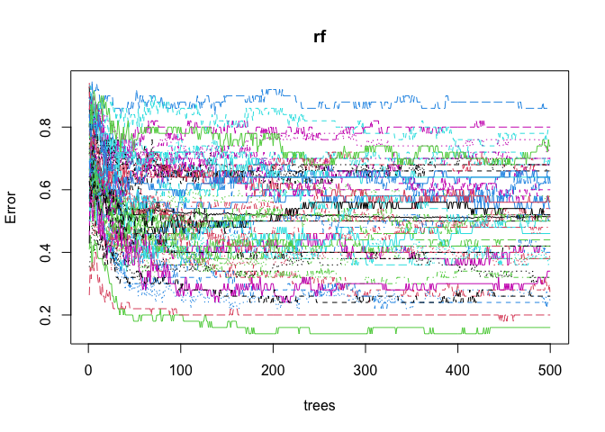

    varImpPlot(rf, type=1)

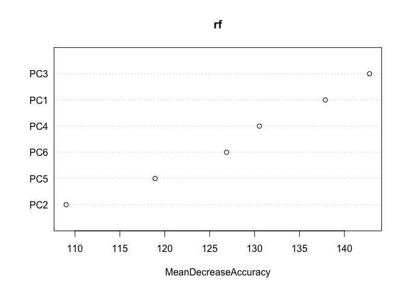
\#\#\#\#\#\# From the random forest result, we can see PC3, PC4, PC1,
PC6 are more important than PC5 and PC2 for the prediction. However, it
cannot do the root mean square error test because the outcome is
multinomial variable. I also tried use LASSO, for some reason, the model
doesn’t work.

###### Based on all of my analysis, I concluded that PCA is an efficient way to reduce the dimension of the data. From the random forest model, we know PC3, PC4, PC1 and PC6 are more important for prediction. Furthermore, we can use Multinomial model and Naive Beyasian model to predict the author of the text.
