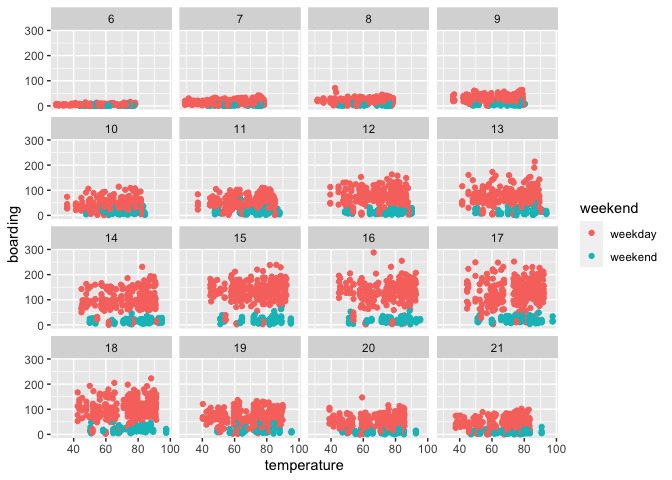

### Problem 1 Visualization

##### Visual Task - 1

    cap = mutate(cap,day_of_week = factor(day_of_week, levels=c("Mon", "Tue", "Wed","Thu", "Fri", "Sat", "Sun")),
                         month = factor(month,levels=c("Sep", "Oct","Nov")))
    hourfreq <- cap %>% 
      group_by(hour_of_day,day_of_week,month) %>%
      summarise(hourmean=mean(boarding))

    ## `summarise()` has grouped output by 'hour_of_day', 'day_of_week'. You can override using the `.groups` argument.

    ggplot(hourfreq) +
      geom_line(aes(x=hour_of_day,y=hourmean,color=month)) +
      facet_wrap(~day_of_week)

###### From the graph, we can see that the peaks are not always the same from day to day. From Monday to Friday, there is a clear peak, but in Saturday and Sunday, there is no obvious peak. This result makes sense, since people go by bus to campus on weekdays more than weekend.

###### The average value on Mondays in September are lower than other months. The reason is that the first Monday in September is labor day, most people don’t go to campus. Thus, it lowers the entire average on Monday in Sep. In Novemver there is a three-day holiday for Thanks Giving Festival, which are just Wed, Thu, Fri. This holiday lowers the average on W/TH/F in November as well.

##### Visual Task - 2

    ggplot(cap) +
      geom_point(aes(x=temperature,y=boarding,color=weekend)) +
      facet_wrap(~hour_of_day)

###### From the scatter plot, we can see when temperature is higher there are relatively more data points than lower teperature. This would be helpful for the bus company to make better strategy.

### Problem 2

    SaratogaHouses$price<-as.numeric(SaratogaHouses$price)
    SaratogaHouses$lotSize <-as.numeric(SaratogaHouses$lotSize)
    SaratogaHouses$age <-as.numeric(SaratogaHouses$age)
    SaratogaHouses$landValue <-as.numeric(SaratogaHouses$landValue)
    SaratogaHouses$livingArea <-as.numeric(SaratogaHouses$livingArea)
    SaratogaHouses$pctCollege <-as.numeric(SaratogaHouses$pctCollege)
    SaratogaHouses$bedrooms <-as.numeric(SaratogaHouses$bedrooms)
    SaratogaHouses$fireplaces <-as.numeric(SaratogaHouses$fireplaces)
    SaratogaHouses$bathrooms <-as.numeric(SaratogaHouses$bathrooms)
    SaratogaHouses$rooms <-as.numeric(SaratogaHouses$rooms)
    # In order to better compare the two models, I scale all the numeric variables at first.
    saratoga_scale = SaratogaHouses %>%
      mutate(across(where(is.double),scale))

##### Task 1: Linear Model (stepwise)

    saratoga_split = initial_split(saratoga_scale, prop = 0.8)
    saratoga_train = training(saratoga_split)
    saratoga_test = testing(saratoga_split)
    # baseline medium model with 11 main effects
    lm_medium = lm(price ~ lotSize + age + livingArea + pctCollege + bedrooms + 
                     fireplaces + bathrooms + rooms + heating + fuel + centralAir, data=saratoga_train)
    AIC(lm_medium) # 2844.872

    ## [1] 2888.313

    lm_step = step(lm_medium, 
                   scope=~(.)^2)
    getCall(lm_step)

    # Result:
    lm_best1 <- lm(formula = price ~ lotSize + age + livingArea + pctCollege + 
         bedrooms + fireplaces + bathrooms + rooms + heating + fuel + 
         centralAir + livingArea:centralAir + age:pctCollege + age:heating + 
         pctCollege:fireplaces + livingArea:fireplaces + livingArea:fuel + 
         bedrooms:bathrooms + pctCollege:fuel + bathrooms:fuel + age:centralAir + 
         rooms:heating + rooms:fuel + age:fuel + bedrooms:centralAir + 
         lotSize:fireplaces + age:bathrooms + fuel:centralAir, data = saratoga_train)
    summary(lm_best1)

    ## 
    ## Call:
    ## lm(formula = price ~ lotSize + age + livingArea + pctCollege + 
    ##     bedrooms + fireplaces + bathrooms + rooms + heating + fuel + 
    ##     centralAir + livingArea:centralAir + age:pctCollege + age:heating + 
    ##     pctCollege:fireplaces + livingArea:fireplaces + livingArea:fuel + 
    ##     bedrooms:bathrooms + pctCollege:fuel + bathrooms:fuel + age:centralAir + 
    ##     rooms:heating + rooms:fuel + age:fuel + bedrooms:centralAir + 
    ##     lotSize:fireplaces + age:bathrooms + fuel:centralAir, data = saratoga_train)
    ## 
    ## Residuals:
    ##     Min      1Q  Median      3Q     Max 
    ## -2.4995 -0.3919 -0.0642  0.2859  5.1099 
    ## 
    ## Coefficients:
    ##                                Estimate Std. Error t value Pr(>|t|)    
    ## (Intercept)                   8.175e-02  4.327e-02   1.889 0.059095 .  
    ## lotSize                       6.179e-02  1.883e-02   3.281 0.001062 ** 
    ## age                          -9.312e-02  6.863e-02  -1.357 0.175037    
    ## livingArea                    7.175e-01  5.420e-02  13.238  < 2e-16 ***
    ## pctCollege                    5.992e-02  2.504e-02   2.393 0.016845 *  
    ## bedrooms                     -1.478e-01  4.344e-02  -3.401 0.000690 ***
    ## fireplaces                    5.847e-03  2.092e-02   0.280 0.779896    
    ## bathrooms                     1.824e-01  3.367e-02   5.416 7.20e-08 ***
    ## rooms                         9.192e-02  3.454e-02   2.661 0.007874 ** 
    ## heatinghot water/steam       -1.125e-01  5.874e-02  -1.915 0.055646 .  
    ## heatingelectric              -1.939e-01  1.893e-01  -1.024 0.305906    
    ## fuelelectric                  1.645e-03  1.955e-01   0.008 0.993289    
    ## fueloil                       9.981e-02  1.341e-01   0.744 0.456796    
    ## centralAirNo                 -8.931e-02  5.435e-02  -1.643 0.100555    
    ## livingArea:centralAirNo      -2.427e-01  5.806e-02  -4.180 3.10e-05 ***
    ## age:pctCollege                6.517e-02  1.875e-02   3.476 0.000526 ***
    ## age:heatinghot water/steam    1.192e-01  4.225e-02   2.822 0.004842 ** 
    ## age:heatingelectric           2.048e-01  2.725e-01   0.752 0.452387    
    ## pctCollege:fireplaces        -7.766e-02  1.892e-02  -4.105 4.28e-05 ***
    ## livingArea:fireplaces         3.943e-02  1.445e-02   2.729 0.006427 ** 
    ## livingArea:fuelelectric       9.097e-02  8.995e-02   1.011 0.312047    
    ## livingArea:fueloil           -3.232e-01  9.483e-02  -3.408 0.000673 ***
    ## bedrooms:bathrooms           -3.820e-02  1.997e-02  -1.913 0.055924 .  
    ## pctCollege:fuelelectric      -1.388e-01  5.104e-02  -2.720 0.006615 ** 
    ## pctCollege:fueloil           -4.947e-02  4.776e-02  -1.036 0.300482    
    ## bathrooms:fuelelectric       -1.408e-01  7.596e-02  -1.854 0.063995 .  
    ## bathrooms:fueloil            -4.884e-03  7.877e-02  -0.062 0.950565    
    ## age:centralAirNo              1.430e-01  7.348e-02   1.946 0.051858 .  
    ## rooms:heatinghot water/steam -1.347e-01  5.298e-02  -2.542 0.011142 *  
    ## rooms:heatingelectric        -4.448e-01  1.687e-01  -2.637 0.008452 ** 
    ## rooms:fuelelectric            3.858e-01  1.694e-01   2.278 0.022892 *  
    ## rooms:fueloil                 1.086e-01  8.174e-02   1.328 0.184298    
    ## age:fuelelectric             -9.151e-02  2.913e-01  -0.314 0.753487    
    ## age:fueloil                  -1.171e-01  4.671e-02  -2.507 0.012295 *  
    ## bedrooms:centralAirNo         4.773e-02  5.482e-02   0.871 0.384170    
    ## lotSize:fireplaces           -3.100e-02  1.534e-02  -2.020 0.043580 *  
    ## age:bathrooms                 5.909e-03  1.947e-02   0.304 0.761528    
    ## fuelelectric:centralAirNo    -2.448e-05  1.264e-01   0.000 0.999845    
    ## fueloil:centralAirNo         -1.889e-01  1.553e-01  -1.216 0.224154    
    ## ---
    ## Signif. codes:  0 '***' 0.001 '**' 0.01 '*' 0.05 '.' 0.1 ' ' 1
    ## 
    ## Residual standard error: 0.6509 on 1344 degrees of freedom
    ## Multiple R-squared:  0.5874, Adjusted R-squared:  0.5758 
    ## F-statistic: 50.36 on 38 and 1344 DF,  p-value: < 2.2e-16

    AIC(lm_best1)

    ## [1] 2777.531

    rmse(lm_best1,saratoga_test) 

    ## [1] 0.5980871

##### Task 2: KNN

    make_knn_pred = function(k=1, training, predicting){
      pred = caret::knnreg(price ~ lotSize + age + livingArea + pctCollege + bedrooms + 
                             fireplaces + bathrooms + rooms, data=saratoga_train, k=k)
      rmse(pred, saratoga_test)
    }
    #count(saratoga_train)
    k = c(1:300)
    knn_train_rmse = sapply(k, make_knn_pred, 
                            training = saratoga_train, 
                            predicting = saratoga_pred)
    knn_test_rmse = sapply(k, make_knn_pred, 
                           training = saratoga_train, 
                           predicting = saratoga_test)
    best_k = k[which.min(knn_test_rmse)]
    knn_best = knnreg(price ~ lotSize + age + livingArea + pctCollege + bedrooms + 
                     fireplaces + bathrooms + rooms + heating + fuel + centralAir, data=saratoga_train, k = best_k)
    rmse(knn_best, saratoga_test)  

    ## [1] 0.6103434

###### To ensure the accuracy of the comparison and the models, we scaled all of the numeric variables at first. Then, we use a stepwise method and get the best linear model with a higher AIC than medium model. Then we apply the KNN method, choose the best k, and get our best KNN model. Afterthat, we compare the two model’s out-of-sample prediction performance by calculating the RMSE of different models. Since the KNN model has a RMSE of 0.6734326, and the best linear model has RMSE of 0.6418865, therefore, we maintain that the linear model has better performance.

### Problem 3

##### Task 1 - Bar Plot

    # colnames(gc)
    d = gc %>%
      group_by(history) %>%
      summarize(pct=sum(Default=="1")/n())
    ggplot(data=d) +
      geom_col(mapping = aes(x=history,y=pct))

###### From this graph, we can see that the probability of Default is higher when the credit history is better. This result looks not reasonable. It means this sample might not be a good sample. Therefore, it is not good for predicting. It’s highly possible that it cannot represent the whole population.

    gc_glm = glm(Default~ duration + amount + installment + age + history + purpose + foreign, data=gc, family='binomial')
    summary(gc_glm)

    ## 
    ## Call:
    ## glm(formula = Default ~ duration + amount + installment + age + 
    ##     history + purpose + foreign, family = "binomial", data = gc)
    ## 
    ## Deviance Residuals: 
    ##     Min       1Q   Median       3Q      Max  
    ## -2.3464  -0.8050  -0.5751   1.0250   2.4767  
    ## 
    ## Coefficients:
    ##                       Estimate Std. Error z value Pr(>|z|)    
    ## (Intercept)         -7.075e-01  4.726e-01  -1.497  0.13435    
    ## duration             2.526e-02  8.100e-03   3.118  0.00182 ** 
    ## amount               9.596e-05  3.650e-05   2.629  0.00856 ** 
    ## installment          2.216e-01  7.626e-02   2.906  0.00366 ** 
    ## age                 -2.018e-02  7.224e-03  -2.794  0.00521 ** 
    ## historypoor         -1.108e+00  2.473e-01  -4.479 7.51e-06 ***
    ## historyterrible     -1.885e+00  2.822e-01  -6.679 2.41e-11 ***
    ## purposeedu           7.248e-01  3.707e-01   1.955  0.05058 .  
    ## purposegoods/repair  1.049e-01  2.573e-01   0.408  0.68346    
    ## purposenewcar        8.545e-01  2.773e-01   3.081  0.00206 ** 
    ## purposeusedcar      -7.959e-01  3.598e-01  -2.212  0.02694 *  
    ## foreigngerman       -1.265e+00  5.773e-01  -2.191  0.02849 *  
    ## ---
    ## Signif. codes:  0 '***' 0.001 '**' 0.01 '*' 0.05 '.' 0.1 ' ' 1
    ## 
    ## (Dispersion parameter for binomial family taken to be 1)
    ## 
    ##     Null deviance: 1221.7  on 999  degrees of freedom
    ## Residual deviance: 1070.0  on 988  degrees of freedom
    ## AIC: 1094
    ## 
    ## Number of Fisher Scoring iterations: 4

###### Here the model shows similar results as the graph. Terrible and poor credit history imply lower probability of being default. Yes, the bank need to change sampling process. A much Larger sample or other sampling technology is needed.

### Problem 4

##### Task 1 - Model building

    hd$date=ymd(hd$arrival_date)
    hd = mutate(hd,
                year=year(date)%>%factor(),
                wday=wday(date)%>%factor(),
                month=month(date)%>%factor())
    # head(hd)
    hd_split = initial_split(hd,prop=0.8)
    hd_train = training(hd_split)
    hd_test = testing(hd_split)

###### Small liear model

    lm_small = lm( children ~ market_segment + adults + customer_type + is_repeated_guest , data=hd_train)
    summary(lm_small)

    ## 
    ## Call:
    ## lm(formula = children ~ market_segment + adults + customer_type + 
    ##     is_repeated_guest, data = hd_train)
    ## 
    ## Residuals:
    ##      Min       1Q   Median       3Q      Max 
    ## -0.17955 -0.11246 -0.09211 -0.02668  1.02990 
    ## 
    ## Coefficients:
    ##                               Estimate Std. Error t value Pr(>|t|)    
    ## (Intercept)                  -0.019472   0.028874  -0.674   0.5001    
    ## market_segmentComplementary   0.077087   0.031441   2.452   0.0142 *  
    ## market_segmentCorporate       0.013372   0.028206   0.474   0.6354    
    ## market_segmentDirect          0.114587   0.027959   4.098 4.17e-05 ***
    ## market_segmentGroups          0.008413   0.028288   0.297   0.7662    
    ## market_segmentOffline_TA/TO   0.023524   0.027943   0.842   0.3999    
    ## market_segmentOnline_TA       0.080791   0.027829   2.903   0.0037 ** 
    ## adults                        0.016647   0.002997   5.554 2.81e-08 ***
    ## customer_typeGroup           -0.014433   0.018585  -0.777   0.4374    
    ## customer_typeTransient        0.017844   0.007713   2.313   0.0207 *  
    ## customer_typeTransient-Party -0.010671   0.008197  -1.302   0.1930    
    ## is_repeated_guest            -0.041463   0.007548  -5.494 3.97e-08 ***
    ## ---
    ## Signif. codes:  0 '***' 0.001 '**' 0.01 '*' 0.05 '.' 0.1 ' ' 1
    ## 
    ## Residual standard error: 0.2685 on 35989 degrees of freedom
    ## Multiple R-squared:  0.03066,    Adjusted R-squared:  0.03036 
    ## F-statistic: 103.5 on 11 and 35989 DF,  p-value: < 2.2e-16

###### Big linear Model

    lm_big = lm( children ~ .-arrival_date, data=hd_train)
    summary(lm_big)

    ## 
    ## Call:
    ## lm(formula = children ~ . - arrival_date, data = hd_train)
    ## 
    ## Residuals:
    ##      Min       1Q   Median       3Q      Max 
    ## -0.93024 -0.08663 -0.03765  0.01296  1.08011 
    ## 
    ## Coefficients:
    ##                                      Estimate Std. Error t value Pr(>|t|)    
    ## (Intercept)                        -5.582e+00  2.303e+00  -2.424 0.015351 *  
    ## hotelResort_Hotel                  -3.493e-02  3.245e-03 -10.766  < 2e-16 ***
    ## lead_time                           7.951e-05  1.770e-05   4.491 7.10e-06 ***
    ## stays_in_weekend_nights            -4.495e-04  2.144e-03  -0.210 0.833957    
    ## stays_in_week_nights                3.774e-04  9.992e-04   0.378 0.705672    
    ## adults                             -4.417e-02  2.838e-03 -15.566  < 2e-16 ***
    ## mealFB                              1.254e-02  1.917e-02   0.654 0.513055    
    ## mealHB                             -4.428e-03  4.150e-03  -1.067 0.286017    
    ## mealSC                             -5.403e-02  4.771e-03 -11.324  < 2e-16 ***
    ## mealUndefined                       1.422e-03  1.209e-02   0.118 0.906411    
    ## market_segmentComplementary         5.504e-02  2.929e-02   1.879 0.060199 .  
    ## market_segmentCorporate             3.848e-02  2.464e-02   1.562 0.118413    
    ## market_segmentDirect                4.550e-02  2.671e-02   1.703 0.088502 .  
    ## market_segmentGroups                6.426e-02  2.590e-02   2.481 0.013092 *  
    ## market_segmentOffline_TA/TO         7.458e-02  2.597e-02   2.872 0.004077 ** 
    ## market_segmentOnline_TA             6.408e-02  2.591e-02   2.473 0.013410 *  
    ## distribution_channelDirect          1.015e-02  1.155e-02   0.879 0.379427    
    ## distribution_channelGDS            -7.252e-02  2.819e-02  -2.572 0.010107 *  
    ## distribution_channelTA/TO          -8.383e-03  9.621e-03  -0.871 0.383562    
    ## is_repeated_guest                  -2.715e-02  7.163e-03  -3.791 0.000150 ***
    ## previous_cancellations             -9.504e-04  4.601e-03  -0.207 0.836356    
    ## previous_bookings_not_canceled     -2.283e-03  8.723e-04  -2.618 0.008857 ** 
    ## reserved_room_typeB                 1.946e-01  1.490e-02  13.061  < 2e-16 ***
    ## reserved_room_typeC                 5.138e-01  1.603e-02  32.059  < 2e-16 ***
    ## reserved_room_typeD                -6.847e-02  4.818e-03 -14.210  < 2e-16 ***
    ## reserved_room_typeE                -3.355e-02  8.658e-03  -3.876 0.000107 ***
    ## reserved_room_typeF                 2.927e-01  1.287e-02  22.753  < 2e-16 ***
    ## reserved_room_typeG                 4.244e-01  1.732e-02  24.503  < 2e-16 ***
    ## reserved_room_typeH                 5.502e-01  3.401e-02  16.177  < 2e-16 ***
    ## reserved_room_typeL                -9.847e-02  1.645e-01  -0.599 0.549442    
    ## assigned_room_typeB                 1.892e-02  9.972e-03   1.897 0.057850 .  
    ## assigned_room_typeC                 9.796e-02  9.309e-03  10.523  < 2e-16 ***
    ## assigned_room_typeD                 6.150e-02  4.186e-03  14.690  < 2e-16 ***
    ## assigned_room_typeE                 5.692e-02  7.748e-03   7.347 2.08e-13 ***
    ## assigned_room_typeF                 6.484e-02  1.103e-02   5.877 4.22e-09 ***
    ## assigned_room_typeG                 1.014e-01  1.510e-02   6.717 1.89e-11 ***
    ## assigned_room_typeH                 1.120e-01  2.984e-02   3.755 0.000174 ***
    ## assigned_room_typeI                 1.013e-01  1.806e-02   5.609 2.05e-08 ***
    ## assigned_room_typeK                 3.724e-02  2.080e-02   1.790 0.073442 .  
    ## booking_changes                     2.080e-02  1.707e-03  12.184  < 2e-16 ***
    ## deposit_typeNon_Refund              3.010e-02  3.360e-02   0.896 0.370295    
    ## deposit_typeRefundable              1.017e-02  2.877e-02   0.353 0.723747    
    ## days_in_waiting_list                2.319e-06  8.887e-05   0.026 0.979186    
    ## customer_typeGroup                 -6.346e-03  1.621e-02  -0.391 0.695525    
    ## customer_typeTransient              1.802e-03  6.983e-03   0.258 0.796396    
    ## customer_typeTransient-Party       -4.196e-02  7.477e-03  -5.612 2.02e-08 ***
    ## average_daily_rate                  9.415e-04  4.002e-05  23.524  < 2e-16 ***
    ## required_car_parking_spacesparking -3.336e-03  4.358e-03  -0.766 0.443970    
    ## total_of_special_requests           3.469e-02  1.679e-03  20.663  < 2e-16 ***
    ## date                                3.385e-04  1.400e-04   2.418 0.015590 *  
    ## year2016                           -1.168e-01  5.133e-02  -2.275 0.022931 *  
    ## year2017                           -2.567e-01  1.023e-01  -2.509 0.012117 *  
    ## wday2                              -8.640e-03  5.054e-03  -1.709 0.087369 .  
    ## wday3                              -1.113e-02  6.502e-03  -1.712 0.086828 .  
    ## wday4                              -1.372e-02  6.311e-03  -2.173 0.029764 *  
    ## wday5                              -1.163e-02  5.876e-03  -1.978 0.047883 *  
    ## wday6                              -1.520e-02  5.399e-03  -2.816 0.004871 ** 
    ## wday7                               3.100e-03  4.906e-03   0.632 0.527461    
    ## month2                              9.364e-03  8.153e-03   1.149 0.250768    
    ## month3                             -2.470e-02  1.068e-02  -2.313 0.020733 *  
    ## month4                             -3.713e-02  1.430e-02  -2.596 0.009438 ** 
    ## month5                             -8.328e-02  1.811e-02  -4.599 4.26e-06 ***
    ## month6                             -8.875e-02  2.218e-02  -4.001 6.33e-05 ***
    ## month7                             -5.352e-02  2.627e-02  -2.037 0.041611 *  
    ## month8                             -6.736e-02  3.047e-02  -2.211 0.027066 *  
    ## month9                             -1.307e-01  3.472e-02  -3.766 0.000166 ***
    ## month10                            -1.231e-01  3.883e-02  -3.171 0.001523 ** 
    ## month11                            -1.330e-01  4.310e-02  -3.086 0.002031 ** 
    ## month12                            -1.078e-01  4.741e-02  -2.273 0.023017 *  
    ## ---
    ## Signif. codes:  0 '***' 0.001 '**' 0.01 '*' 0.05 '.' 0.1 ' ' 1
    ## 
    ## Residual standard error: 0.2323 on 35932 degrees of freedom
    ## Multiple R-squared:  0.2752, Adjusted R-squared:  0.2739 
    ## F-statistic: 200.7 on 68 and 35932 DF,  p-value: < 2.2e-16

###### Stepwise Selection

    # Stepwise selection: we start with a reasonable guess
    lm_step = step(lm_small, 
                   scope=~(hotel+adults+meal+market_segment
                           +distribution_channel+is_repeated_guest+reserved_room_type+assigned_room_type
                           +customer_type+required_car_parking_spaces+total_of_special_requests+wday+month)^2)
    # what variables are included?
    getCall(lm_step)

    lm_best2 <- lm(children ~ market_segment + adults + customer_type + is_repeated_guest +
                    reserved_room_type + total_of_special_requests + month +
                    assigned_room_type + market_segment:reserved_room_type +
                    adults:reserved_room_type + reserved_room_type:month, data=hd)
    summary(lm_best2)

    ## 
    ## Call:
    ## lm(formula = children ~ market_segment + adults + customer_type + 
    ##     is_repeated_guest + reserved_room_type + total_of_special_requests + 
    ##     month + assigned_room_type + market_segment:reserved_room_type + 
    ##     adults:reserved_room_type + reserved_room_type:month, data = hd)
    ## 
    ## Residuals:
    ##      Min       1Q   Median       3Q      Max 
    ## -1.13478 -0.07701 -0.03856 -0.00028  1.08859 
    ## 
    ## Coefficients: (25 not defined because of singularities)
    ##                                                   Estimate Std. Error t value
    ## (Intercept)                                     -0.0253436  0.0308999  -0.820
    ## market_segmentComplementary                     -0.0062593  0.0332584  -0.188
    ## market_segmentCorporate                         -0.0078298  0.0300465  -0.261
    ## market_segmentDirect                             0.0190220  0.0300031   0.634
    ## market_segmentGroups                            -0.0055844  0.0300946  -0.186
    ## market_segmentOffline_TA/TO                     -0.0003520  0.0299152  -0.012
    ## market_segmentOnline_TA                          0.0017879  0.0298676   0.060
    ## adults                                           0.0022596  0.0029092   0.777
    ## customer_typeGroup                              -0.0016631  0.0138882  -0.120
    ## customer_typeTransient                           0.0263686  0.0060335   4.370
    ## customer_typeTransient-Party                     0.0040864  0.0064596   0.633
    ## is_repeated_guest                               -0.0470849  0.0058462  -8.054
    ## reserved_room_typeB                              0.8744628  0.0487027  17.955
    ## reserved_room_typeC                              1.1527441  0.1032050  11.169
    ## reserved_room_typeD                              0.0013648  0.0461625   0.030
    ## reserved_room_typeE                             -0.0919745  0.2309686  -0.398
    ## reserved_room_typeF                              0.8236698  0.0510448  16.136
    ## reserved_room_typeG                              0.6920352  0.0548485  12.617
    ## reserved_room_typeH                              0.8539910  0.1023227   8.346
    ## reserved_room_typeL                             -0.0112927  0.5087608  -0.022
    ## total_of_special_requests                        0.0368443  0.0014500  25.410
    ## month2                                           0.0169337  0.0070202   2.412
    ## month3                                           0.0023858  0.0067250   0.355
    ## month4                                           0.0138924  0.0068553   2.027
    ## month5                                          -0.0001828  0.0067483  -0.027
    ## month6                                           0.0057994  0.0069220   0.838
    ## month7                                           0.0535338  0.0067483   7.933
    ## month8                                           0.0556457  0.0066621   8.353
    ## month9                                          -0.0034595  0.0068444  -0.505
    ## month10                                          0.0009881  0.0066829   0.148
    ## month11                                         -0.0112711  0.0071230  -1.582
    ## month12                                          0.0044849  0.0074574   0.601
    ## assigned_room_typeB                              0.0299404  0.0089123   3.359
    ## assigned_room_typeC                              0.0699377  0.0079951   8.748
    ## assigned_room_typeD                              0.0500603  0.0036186  13.834
    ## assigned_room_typeE                              0.0414985  0.0067038   6.190
    ## assigned_room_typeF                              0.0601763  0.0096306   6.248
    ## assigned_room_typeG                              0.0930326  0.0133567   6.965
    ## assigned_room_typeH                              0.0307216  0.0246245   1.248
    ## assigned_room_typeI                              0.0157102  0.0159428   0.985
    ## assigned_room_typeK                              0.0122328  0.0179642   0.681
    ## market_segmentComplementary:reserved_room_typeB  0.1369818  0.0644508   2.125
    ## market_segmentCorporate:reserved_room_typeB      0.2518079  0.1383142   1.821
    ## market_segmentDirect:reserved_room_typeB         0.0004879  0.0262537   0.019
    ## market_segmentGroups:reserved_room_typeB         0.1258620  0.1179421   1.067
    ## market_segmentOffline_TA/TO:reserved_room_typeB -0.1075533  0.0518641  -2.074
    ## market_segmentOnline_TA:reserved_room_typeB             NA         NA      NA
    ## market_segmentComplementary:reserved_room_typeC -0.8120931  0.1229224  -6.607
    ## market_segmentCorporate:reserved_room_typeC      0.2818278  0.0992132   2.841
    ## market_segmentDirect:reserved_room_typeC         0.0355414  0.0265944   1.336
    ## market_segmentGroups:reserved_room_typeC         0.0022249  0.0787896   0.028
    ## market_segmentOffline_TA/TO:reserved_room_typeC -0.0620735  0.0455857  -1.362
    ## market_segmentOnline_TA:reserved_room_typeC             NA         NA      NA
    ## market_segmentComplementary:reserved_room_typeD  0.0478428  0.0578797   0.827
    ## market_segmentCorporate:reserved_room_typeD      0.0274783  0.0482688   0.569
    ## market_segmentDirect:reserved_room_typeD         0.0789045  0.0444110   1.777
    ## market_segmentGroups:reserved_room_typeD         0.0406988  0.0457123   0.890
    ## market_segmentOffline_TA/TO:reserved_room_typeD  0.0661304  0.0442028   1.496
    ## market_segmentOnline_TA:reserved_room_typeD      0.0331075  0.0439946   0.753
    ## market_segmentComplementary:reserved_room_typeE  0.0995471  0.2345490   0.424
    ## market_segmentCorporate:reserved_room_typeE      0.0104078  0.2309281   0.045
    ## market_segmentDirect:reserved_room_typeE         0.1085289  0.2301330   0.472
    ## market_segmentGroups:reserved_room_typeE         0.0157682  0.2306816   0.068
    ## market_segmentOffline_TA/TO:reserved_room_typeE  0.0153869  0.2301959   0.067
    ## market_segmentOnline_TA:reserved_room_typeE     -0.0223570  0.2300463  -0.097
    ## market_segmentComplementary:reserved_room_typeF -0.4305937  0.0488151  -8.821
    ## market_segmentCorporate:reserved_room_typeF     -0.3461607  0.1323694  -2.615
    ## market_segmentDirect:reserved_room_typeF        -0.5126944  0.0147465 -34.767
    ## market_segmentGroups:reserved_room_typeF        -0.3523210  0.0962214  -3.662
    ## market_segmentOffline_TA/TO:reserved_room_typeF -0.3855921  0.0438264  -8.798
    ## market_segmentOnline_TA:reserved_room_typeF             NA         NA      NA
    ## market_segmentComplementary:reserved_room_typeG -0.5281739  0.0426134 -12.395
    ## market_segmentCorporate:reserved_room_typeG     -0.5878669  0.0887192  -6.626
    ## market_segmentDirect:reserved_room_typeG        -0.1144038  0.0183400  -6.238
    ## market_segmentGroups:reserved_room_typeG        -0.5405747  0.0688898  -7.847
    ## market_segmentOffline_TA/TO:reserved_room_typeG  0.0739988  0.0673255   1.099
    ## market_segmentOnline_TA:reserved_room_typeG             NA         NA      NA
    ## market_segmentComplementary:reserved_room_typeH -0.9002447  0.2350566  -3.830
    ## market_segmentCorporate:reserved_room_typeH             NA         NA      NA
    ## market_segmentDirect:reserved_room_typeH        -0.3859212  0.0360453 -10.707
    ## market_segmentGroups:reserved_room_typeH                NA         NA      NA
    ## market_segmentOffline_TA/TO:reserved_room_typeH         NA         NA      NA
    ## market_segmentOnline_TA:reserved_room_typeH             NA         NA      NA
    ## market_segmentComplementary:reserved_room_typeL         NA         NA      NA
    ## market_segmentCorporate:reserved_room_typeL             NA         NA      NA
    ## market_segmentDirect:reserved_room_typeL                NA         NA      NA
    ## market_segmentGroups:reserved_room_typeL                NA         NA      NA
    ## market_segmentOffline_TA/TO:reserved_room_typeL         NA         NA      NA
    ## market_segmentOnline_TA:reserved_room_typeL             NA         NA      NA
    ## adults:reserved_room_typeB                      -0.4150071  0.0146270 -28.373
    ## adults:reserved_room_typeC                      -0.2740539  0.0297768  -9.204
    ## adults:reserved_room_typeD                      -0.0508952  0.0061004  -8.343
    ## adults:reserved_room_typeE                       0.0130920  0.0110623   1.183
    ## adults:reserved_room_typeF                      -0.1327357  0.0204932  -6.477
    ## adults:reserved_room_typeG                      -0.0932301  0.0185674  -5.021
    ## adults:reserved_room_typeH                      -0.0067475  0.0298433  -0.226
    ## adults:reserved_room_typeL                      -0.0645477  0.3218379  -0.201
    ## reserved_room_typeB:month2                       0.0251938  0.0550316   0.458
    ## reserved_room_typeC:month2                       0.2273863  0.0913887   2.488
    ## reserved_room_typeD:month2                       0.0201969  0.0187460   1.077
    ## reserved_room_typeE:month2                      -0.0056789  0.0260276  -0.218
    ## reserved_room_typeF:month2                      -0.0220105  0.0408588  -0.539
    ## reserved_room_typeG:month2                       0.0743263  0.0483569   1.537
    ## reserved_room_typeH:month2                      -0.1171529  0.0853370  -1.373
    ## reserved_room_typeL:month2                              NA         NA      NA
    ## reserved_room_typeB:month3                      -0.0185656  0.0623916  -0.298
    ## reserved_room_typeC:month3                      -0.2357651  0.0891952  -2.643
    ## reserved_room_typeD:month3                       0.0229498  0.0177561   1.293
    ## reserved_room_typeE:month3                       0.0226528  0.0249514   0.908
    ## reserved_room_typeF:month3                      -0.0327350  0.0399199  -0.820
    ## reserved_room_typeG:month3                       0.0128421  0.0486127   0.264
    ## reserved_room_typeH:month3                      -0.0436954  0.0971779  -0.450
    ## reserved_room_typeL:month3                              NA         NA      NA
    ## reserved_room_typeB:month4                      -0.0366783  0.0586668  -0.625
    ## reserved_room_typeC:month4                       0.0902923  0.0920425   0.981
    ## reserved_room_typeD:month4                       0.0076146  0.0176119   0.432
    ## reserved_room_typeE:month4                       0.0350964  0.0244934   1.433
    ## reserved_room_typeF:month4                       0.0533046  0.0375755   1.419
    ## reserved_room_typeG:month4                      -0.0009194  0.0466991  -0.020
    ## reserved_room_typeH:month4                       0.1375614  0.0897308   1.533
    ## reserved_room_typeL:month4                              NA         NA      NA
    ## reserved_room_typeB:month5                       0.0477294  0.0690043   0.692
    ## reserved_room_typeC:month5                      -0.1494200  0.0905220  -1.651
    ## reserved_room_typeD:month5                       0.0035961  0.0172403   0.209
    ## reserved_room_typeE:month5                       0.0342822  0.0242251   1.415
    ## reserved_room_typeF:month5                      -0.0881769  0.0383905  -2.297
    ## reserved_room_typeG:month5                      -0.1141172  0.0458944  -2.487
    ## reserved_room_typeH:month5                      -0.1754875  0.0868028  -2.022
    ## reserved_room_typeL:month5                              NA         NA      NA
    ## reserved_room_typeB:month6                      -0.0930781  0.0680266  -1.368
    ## reserved_room_typeC:month6                      -0.2466762  0.0829790  -2.973
    ## reserved_room_typeD:month6                       0.0062544  0.0176539   0.354
    ## reserved_room_typeE:month6                       0.0288913  0.0253927   1.138
    ## reserved_room_typeF:month6                      -0.0319505  0.0391492  -0.816
    ## reserved_room_typeG:month6                       0.0204166  0.0483230   0.423
    ## reserved_room_typeH:month6                       0.0124955  0.0785203   0.159
    ## reserved_room_typeL:month6                              NA         NA      NA
    ## reserved_room_typeB:month7                      -0.0258983  0.0496746  -0.521
    ## reserved_room_typeC:month7                       0.0607307  0.0774992   0.784
    ## reserved_room_typeD:month7                      -0.0019476  0.0171799  -0.113
    ## reserved_room_typeE:month7                       0.0906397  0.0233821   3.876
    ## reserved_room_typeF:month7                       0.0494126  0.0355582   1.390
    ## reserved_room_typeG:month7                       0.1918160  0.0433718   4.423
    ## reserved_room_typeH:month7                      -0.0516601  0.0748602  -0.690
    ## reserved_room_typeL:month7                              NA         NA      NA
    ## reserved_room_typeB:month8                      -0.0512972  0.0491577  -1.044
    ## reserved_room_typeC:month8                       0.0221967  0.0766418   0.290
    ## reserved_room_typeD:month8                       0.0170276  0.0169772   1.003
    ## reserved_room_typeE:month8                       0.0406735  0.0235355   1.728
    ## reserved_room_typeF:month8                       0.1068533  0.0351075   3.044
    ## reserved_room_typeG:month8                       0.1389743  0.0431073   3.224
    ## reserved_room_typeH:month8                      -0.0731681  0.0771457  -0.948
    ## reserved_room_typeL:month8                              NA         NA      NA
    ## reserved_room_typeB:month9                       0.0346453  0.0663494   0.522
    ## reserved_room_typeC:month9                      -0.3424684  0.0922315  -3.713
    ## reserved_room_typeD:month9                       0.0038754  0.0181305   0.214
    ## reserved_room_typeE:month9                      -0.0049040  0.0256192  -0.191
    ## reserved_room_typeF:month9                       0.0071728  0.0399586   0.180
    ## reserved_room_typeG:month9                      -0.0846057  0.0480238  -1.762
    ## reserved_room_typeH:month9                      -0.0906222  0.0880253  -1.030
    ## reserved_room_typeL:month9                              NA         NA      NA
    ## reserved_room_typeB:month10                      0.0397445  0.0565793   0.702
    ## reserved_room_typeC:month10                     -0.0995428  0.0985823  -1.010
    ## reserved_room_typeD:month10                      0.0031196  0.0179191   0.174
    ## reserved_room_typeE:month10                      0.0140259  0.0256656   0.546
    ## reserved_room_typeF:month10                     -0.0563067  0.0388023  -1.451
    ## reserved_room_typeG:month10                     -0.0093876  0.0493615  -0.190
    ## reserved_room_typeH:month10                      0.0216547  0.0996186   0.217
    ## reserved_room_typeL:month10                             NA         NA      NA
    ## reserved_room_typeB:month11                      0.0537887  0.0695614   0.773
    ## reserved_room_typeC:month11                      0.1395787  0.1054572   1.324
    ## reserved_room_typeD:month11                     -0.0022826  0.0194988  -0.117
    ## reserved_room_typeE:month11                      0.0092901  0.0279685   0.332
    ## reserved_room_typeF:month11                     -0.0162270  0.0434407  -0.374
    ## reserved_room_typeG:month11                     -0.0753283  0.0575739  -1.308
    ## reserved_room_typeH:month11                     -0.1050961  0.0901481  -1.166
    ## reserved_room_typeL:month11                             NA         NA      NA
    ## reserved_room_typeB:month12                      0.0055447  0.0529803   0.105
    ## reserved_room_typeC:month12                      0.1533325  0.0923634   1.660
    ## reserved_room_typeD:month12                      0.0419372  0.0193437   2.168
    ## reserved_room_typeE:month12                      0.0070763  0.0265511   0.267
    ## reserved_room_typeF:month12                      0.0665461  0.0406982   1.635
    ## reserved_room_typeG:month12                      0.1562732  0.0512745   3.048
    ## reserved_room_typeH:month12                      0.1204728  0.0844622   1.426
    ## reserved_room_typeL:month12                             NA         NA      NA
    ##                                                 Pr(>|t|)    
    ## (Intercept)                                     0.412116    
    ## market_segmentComplementary                     0.850720    
    ## market_segmentCorporate                         0.794410    
    ## market_segmentDirect                            0.526082    
    ## market_segmentGroups                            0.852790    
    ## market_segmentOffline_TA/TO                     0.990613    
    ## market_segmentOnline_TA                         0.952267    
    ## adults                                          0.437340    
    ## customer_typeGroup                              0.904683    
    ## customer_typeTransient                          1.24e-05 ***
    ## customer_typeTransient-Party                    0.526994    
    ## is_repeated_guest                               8.22e-16 ***
    ## reserved_room_typeB                              < 2e-16 ***
    ## reserved_room_typeC                              < 2e-16 ***
    ## reserved_room_typeD                             0.976414    
    ## reserved_room_typeE                             0.690476    
    ## reserved_room_typeF                              < 2e-16 ***
    ## reserved_room_typeG                              < 2e-16 ***
    ## reserved_room_typeH                              < 2e-16 ***
    ## reserved_room_typeL                             0.982291    
    ## total_of_special_requests                        < 2e-16 ***
    ## month2                                          0.015863 *  
    ## month3                                          0.722762    
    ## month4                                          0.042716 *  
    ## month5                                          0.978389    
    ## month6                                          0.402137    
    ## month7                                          2.19e-15 ***
    ## month8                                           < 2e-16 ***
    ## month9                                          0.613252    
    ## month10                                         0.882456    
    ## month11                                         0.113573    
    ## month12                                         0.547577    
    ## assigned_room_typeB                             0.000782 ***
    ## assigned_room_typeC                              < 2e-16 ***
    ## assigned_room_typeD                              < 2e-16 ***
    ## assigned_room_typeE                             6.06e-10 ***
    ## assigned_room_typeF                             4.18e-10 ***
    ## assigned_room_typeG                             3.32e-12 ***
    ## assigned_room_typeH                             0.212184    
    ## assigned_room_typeI                             0.324426    
    ## assigned_room_typeK                             0.495904    
    ## market_segmentComplementary:reserved_room_typeB 0.033561 *  
    ## market_segmentCorporate:reserved_room_typeB     0.068682 .  
    ## market_segmentDirect:reserved_room_typeB        0.985172    
    ## market_segmentGroups:reserved_room_typeB        0.285909    
    ## market_segmentOffline_TA/TO:reserved_room_typeB 0.038108 *  
    ## market_segmentOnline_TA:reserved_room_typeB           NA    
    ## market_segmentComplementary:reserved_room_typeC 3.98e-11 ***
    ## market_segmentCorporate:reserved_room_typeC     0.004505 ** 
    ## market_segmentDirect:reserved_room_typeC        0.181417    
    ## market_segmentGroups:reserved_room_typeC        0.977472    
    ## market_segmentOffline_TA/TO:reserved_room_typeC 0.173303    
    ## market_segmentOnline_TA:reserved_room_typeC           NA    
    ## market_segmentComplementary:reserved_room_typeD 0.408474    
    ## market_segmentCorporate:reserved_room_typeD     0.569172    
    ## market_segmentDirect:reserved_room_typeD        0.075626 .  
    ## market_segmentGroups:reserved_room_typeD        0.373296    
    ## market_segmentOffline_TA/TO:reserved_room_typeD 0.134643    
    ## market_segmentOnline_TA:reserved_room_typeD     0.451733    
    ## market_segmentComplementary:reserved_room_typeE 0.671262    
    ## market_segmentCorporate:reserved_room_typeE     0.964052    
    ## market_segmentDirect:reserved_room_typeE        0.637220    
    ## market_segmentGroups:reserved_room_typeE        0.945503    
    ## market_segmentOffline_TA/TO:reserved_room_typeE 0.946707    
    ## market_segmentOnline_TA:reserved_room_typeE     0.922580    
    ## market_segmentComplementary:reserved_room_typeF  < 2e-16 ***
    ## market_segmentCorporate:reserved_room_typeF     0.008923 ** 
    ## market_segmentDirect:reserved_room_typeF         < 2e-16 ***
    ## market_segmentGroups:reserved_room_typeF        0.000251 ***
    ## market_segmentOffline_TA/TO:reserved_room_typeF  < 2e-16 ***
    ## market_segmentOnline_TA:reserved_room_typeF           NA    
    ## market_segmentComplementary:reserved_room_typeG  < 2e-16 ***
    ## market_segmentCorporate:reserved_room_typeG     3.48e-11 ***
    ## market_segmentDirect:reserved_room_typeG        4.47e-10 ***
    ## market_segmentGroups:reserved_room_typeG        4.36e-15 ***
    ## market_segmentOffline_TA/TO:reserved_room_typeG 0.271722    
    ## market_segmentOnline_TA:reserved_room_typeG           NA    
    ## market_segmentComplementary:reserved_room_typeH 0.000128 ***
    ## market_segmentCorporate:reserved_room_typeH           NA    
    ## market_segmentDirect:reserved_room_typeH         < 2e-16 ***
    ## market_segmentGroups:reserved_room_typeH              NA    
    ## market_segmentOffline_TA/TO:reserved_room_typeH       NA    
    ## market_segmentOnline_TA:reserved_room_typeH           NA    
    ## market_segmentComplementary:reserved_room_typeL       NA    
    ## market_segmentCorporate:reserved_room_typeL           NA    
    ## market_segmentDirect:reserved_room_typeL              NA    
    ## market_segmentGroups:reserved_room_typeL              NA    
    ## market_segmentOffline_TA/TO:reserved_room_typeL       NA    
    ## market_segmentOnline_TA:reserved_room_typeL           NA    
    ## adults:reserved_room_typeB                       < 2e-16 ***
    ## adults:reserved_room_typeC                       < 2e-16 ***
    ## adults:reserved_room_typeD                       < 2e-16 ***
    ## adults:reserved_room_typeE                      0.236625    
    ## adults:reserved_room_typeF                      9.45e-11 ***
    ## adults:reserved_room_typeG                      5.16e-07 ***
    ## adults:reserved_room_typeH                      0.821127    
    ## adults:reserved_room_typeL                      0.841044    
    ## reserved_room_typeB:month2                      0.647094    
    ## reserved_room_typeC:month2                      0.012846 *  
    ## reserved_room_typeD:month2                      0.281309    
    ## reserved_room_typeE:month2                      0.827285    
    ## reserved_room_typeF:month2                      0.590098    
    ## reserved_room_typeG:month2                      0.124292    
    ## reserved_room_typeH:month2                      0.169813    
    ## reserved_room_typeL:month2                            NA    
    ## reserved_room_typeB:month3                      0.766036    
    ## reserved_room_typeC:month3                      0.008214 ** 
    ## reserved_room_typeD:month3                      0.196189    
    ## reserved_room_typeE:month3                      0.363949    
    ## reserved_room_typeF:month3                      0.412210    
    ## reserved_room_typeG:month3                      0.791649    
    ## reserved_room_typeH:month3                      0.652970    
    ## reserved_room_typeL:month3                            NA    
    ## reserved_room_typeB:month4                      0.531845    
    ## reserved_room_typeC:month4                      0.326605    
    ## reserved_room_typeD:month4                      0.665483    
    ## reserved_room_typeE:month4                      0.151896    
    ## reserved_room_typeF:month4                      0.156022    
    ## reserved_room_typeG:month4                      0.984292    
    ## reserved_room_typeH:month4                      0.125272    
    ## reserved_room_typeL:month4                            NA    
    ## reserved_room_typeB:month5                      0.489137    
    ## reserved_room_typeC:month5                      0.098817 .  
    ## reserved_room_typeD:month5                      0.834771    
    ## reserved_room_typeE:month5                      0.157031    
    ## reserved_room_typeF:month5                      0.021632 *  
    ## reserved_room_typeG:month5                      0.012904 *  
    ## reserved_room_typeH:month5                      0.043215 *  
    ## reserved_room_typeL:month5                            NA    
    ## reserved_room_typeB:month6                      0.171238    
    ## reserved_room_typeC:month6                      0.002953 ** 
    ## reserved_room_typeD:month6                      0.723131    
    ## reserved_room_typeE:month6                      0.255218    
    ## reserved_room_typeF:month6                      0.414434    
    ## reserved_room_typeG:month6                      0.672660    
    ## reserved_room_typeH:month6                      0.873562    
    ## reserved_room_typeL:month6                            NA    
    ## reserved_room_typeB:month7                      0.602119    
    ## reserved_room_typeC:month7                      0.433261    
    ## reserved_room_typeD:month7                      0.909742    
    ## reserved_room_typeE:month7                      0.000106 ***
    ## reserved_room_typeF:month7                      0.164650    
    ## reserved_room_typeG:month7                      9.78e-06 ***
    ## reserved_room_typeH:month7                      0.490143    
    ## reserved_room_typeL:month7                            NA    
    ## reserved_room_typeB:month8                      0.296711    
    ## reserved_room_typeC:month8                      0.772111    
    ## reserved_room_typeD:month8                      0.315884    
    ## reserved_room_typeE:month8                      0.083964 .  
    ## reserved_room_typeF:month8                      0.002339 ** 
    ## reserved_room_typeG:month8                      0.001265 ** 
    ## reserved_room_typeH:month8                      0.342910    
    ## reserved_room_typeL:month8                            NA    
    ## reserved_room_typeB:month9                      0.601559    
    ## reserved_room_typeC:month9                      0.000205 ***
    ## reserved_room_typeD:month9                      0.830741    
    ## reserved_room_typeE:month9                      0.848197    
    ## reserved_room_typeF:month9                      0.857542    
    ## reserved_room_typeG:month9                      0.078119 .  
    ## reserved_room_typeH:month9                      0.303249    
    ## reserved_room_typeL:month9                            NA    
    ## reserved_room_typeB:month10                     0.482398    
    ## reserved_room_typeC:month10                     0.312624    
    ## reserved_room_typeD:month10                     0.861791    
    ## reserved_room_typeE:month10                     0.584736    
    ## reserved_room_typeF:month10                     0.146755    
    ## reserved_room_typeG:month10                     0.849168    
    ## reserved_room_typeH:month10                     0.827917    
    ## reserved_room_typeL:month10                           NA    
    ## reserved_room_typeB:month11                     0.439375    
    ## reserved_room_typeC:month11                     0.185657    
    ## reserved_room_typeD:month11                     0.906811    
    ## reserved_room_typeE:month11                     0.739767    
    ## reserved_room_typeF:month11                     0.708746    
    ## reserved_room_typeG:month11                     0.190753    
    ## reserved_room_typeH:month11                     0.243695    
    ## reserved_room_typeL:month11                           NA    
    ## reserved_room_typeB:month12                     0.916649    
    ## reserved_room_typeC:month12                     0.096901 .  
    ## reserved_room_typeD:month12                     0.030163 *  
    ## reserved_room_typeE:month12                     0.789842    
    ## reserved_room_typeF:month12                     0.102033    
    ## reserved_room_typeG:month12                     0.002307 ** 
    ## reserved_room_typeH:month12                     0.153774    
    ## reserved_room_typeL:month12                           NA    
    ## ---
    ## Signif. codes:  0 '***' 0.001 '**' 0.01 '*' 0.05 '.' 0.1 ' ' 1
    ## 
    ## Residual standard error: 0.2274 on 44840 degrees of freedom
    ## Multiple R-squared:  0.3059, Adjusted R-squared:  0.3034 
    ## F-statistic: 124.3 on 159 and 44840 DF,  p-value: < 2.2e-16

    rmse(lm_small, hd_test)

    ## [1] 0.267461

    rmse(lm_best2, hd_test)

    ## Warning in predict.lm(model, data): prediction from a rank-deficient fit may be
    ## misleading

    ## [1] 0.2265919

##### Task 2: Model validation - step 1 (ROC)

    hv$date=ymd(hv$arrival_date)
    hv = mutate(hv,
                year=year(date)%>%factor(),
                wday=wday(date)%>%factor(),
                month=month(date)%>%factor())
    phat_test_lm = predict(lm_best2, hv, type='response')

    ## Warning in predict.lm(lm_best2, hv, type = "response"): prediction from a rank-
    ## deficient fit may be misleading

    thresh_grid = seq(0.95, 0.05, by=-0.005)
    roc_curve = foreach(thresh = thresh_grid, .combine='rbind') %do% {
      yhat_test_lm = ifelse(phat_test_lm >= thresh, 1, 0)
      # FPR, TPR for linear model
      confusion_out_linear = table(children = hv$children, yhat = yhat_test_lm)
      out_lin = data.frame(model = "linear",
                           TPR = confusion_out_linear[2,2]/sum(hv$children==1),
                           FPR = confusion_out_linear[1,2]/sum(hv$children==0))
    } %>% as.data.frame()
    ggplot(roc_curve) +
      geom_line(aes(x=FPR, y=TPR, color=model)) +
      labs(title="ROC curves: linear model") +
      theme_bw(base_size = 10)

##### Task 3: Model validation - step 2 (K folds)

    K_folds = 20
    # create specific fold IDs for each row
    # the default behavior of sample actually gives a permutation
    hv = hv %>%
      mutate(fold_id = rep(1:K_folds, length=nrow(hv)) %>% sample)
    #head(hv)
    # now loop over folds

    rmse <- foreach(fold = 1:K_folds, .combine='rbind') %do% {
      lm_best = lm(children ~ market_segment + adults + customer_type + is_repeated_guest +
           reserved_room_type + total_of_special_requests + month +
           assigned_room_type + market_segment:reserved_room_type +
           adults:reserved_room_type + reserved_room_type:month, data=filter(hv, fold_id != fold))
      rmse =rmse(lm_best, data=filter(hv, fold_id == fold))
    } 

    ## Warning in predict.lm(model, data): prediction from a rank-deficient fit may be
    ## misleading

    ## Warning in predict.lm(model, data): prediction from a rank-deficient fit may be
    ## misleading

    ## Warning in predict.lm(model, data): prediction from a rank-deficient fit may be
    ## misleading

    ## Warning in predict.lm(model, data): prediction from a rank-deficient fit may be
    ## misleading

    ## Warning in predict.lm(model, data): prediction from a rank-deficient fit may be
    ## misleading

    ## Warning in predict.lm(model, data): prediction from a rank-deficient fit may be
    ## misleading

    ## Warning in predict.lm(model, data): prediction from a rank-deficient fit may be
    ## misleading

    ## Warning in predict.lm(model, data): prediction from a rank-deficient fit may be
    ## misleading

    ## Warning in predict.lm(model, data): prediction from a rank-deficient fit may be
    ## misleading

    ## Warning in predict.lm(model, data): prediction from a rank-deficient fit may be
    ## misleading

    ## Warning in predict.lm(model, data): prediction from a rank-deficient fit may be
    ## misleading

    ## Warning in predict.lm(model, data): prediction from a rank-deficient fit may be
    ## misleading

    ## Warning in predict.lm(model, data): prediction from a rank-deficient fit may be
    ## misleading

    ## Warning in predict.lm(model, data): prediction from a rank-deficient fit may be
    ## misleading

    ## Warning in predict.lm(model, data): prediction from a rank-deficient fit may be
    ## misleading

    ## Warning in predict.lm(model, data): prediction from a rank-deficient fit may be
    ## misleading

    ## Warning in predict.lm(model, data): prediction from a rank-deficient fit may be
    ## misleading

    ## Warning in predict.lm(model, data): prediction from a rank-deficient fit may be
    ## misleading

    ## Warning in predict.lm(model, data): prediction from a rank-deficient fit may be
    ## misleading

    ## Warning in predict.lm(model, data): prediction from a rank-deficient fit may be
    ## misleading

    pred <- foreach(fold = 1:K_folds, .combine='rbind') %do% {
      lm_best = lm(children ~ market_segment + adults + customer_type + is_repeated_guest +
           reserved_room_type + total_of_special_requests + month +
           assigned_room_type + market_segment:reserved_room_type +
           adults:reserved_room_type + reserved_room_type:month, data=filter(hv, fold_id != fold))
      pred = sum(predict(lm_best, filter(hv, fold_id == fold)))
    } 

    ## Warning in predict.lm(lm_best, filter(hv, fold_id == fold)): prediction from a
    ## rank-deficient fit may be misleading

    ## Warning in predict.lm(lm_best, filter(hv, fold_id == fold)): prediction from a
    ## rank-deficient fit may be misleading

    ## Warning in predict.lm(lm_best, filter(hv, fold_id == fold)): prediction from a
    ## rank-deficient fit may be misleading

    ## Warning in predict.lm(lm_best, filter(hv, fold_id == fold)): prediction from a
    ## rank-deficient fit may be misleading

    ## Warning in predict.lm(lm_best, filter(hv, fold_id == fold)): prediction from a
    ## rank-deficient fit may be misleading

    ## Warning in predict.lm(lm_best, filter(hv, fold_id == fold)): prediction from a
    ## rank-deficient fit may be misleading

    ## Warning in predict.lm(lm_best, filter(hv, fold_id == fold)): prediction from a
    ## rank-deficient fit may be misleading

    ## Warning in predict.lm(lm_best, filter(hv, fold_id == fold)): prediction from a
    ## rank-deficient fit may be misleading

    ## Warning in predict.lm(lm_best, filter(hv, fold_id == fold)): prediction from a
    ## rank-deficient fit may be misleading

    ## Warning in predict.lm(lm_best, filter(hv, fold_id == fold)): prediction from a
    ## rank-deficient fit may be misleading

    ## Warning in predict.lm(lm_best, filter(hv, fold_id == fold)): prediction from a
    ## rank-deficient fit may be misleading

    ## Warning in predict.lm(lm_best, filter(hv, fold_id == fold)): prediction from a
    ## rank-deficient fit may be misleading

    ## Warning in predict.lm(lm_best, filter(hv, fold_id == fold)): prediction from a
    ## rank-deficient fit may be misleading

    ## Warning in predict.lm(lm_best, filter(hv, fold_id == fold)): prediction from a
    ## rank-deficient fit may be misleading

    ## Warning in predict.lm(lm_best, filter(hv, fold_id == fold)): prediction from a
    ## rank-deficient fit may be misleading

    ## Warning in predict.lm(lm_best, filter(hv, fold_id == fold)): prediction from a
    ## rank-deficient fit may be misleading

    ## Warning in predict.lm(lm_best, filter(hv, fold_id == fold)): prediction from a
    ## rank-deficient fit may be misleading

    ## Warning in predict.lm(lm_best, filter(hv, fold_id == fold)): prediction from a
    ## rank-deficient fit may be misleading

    ## Warning in predict.lm(lm_best, filter(hv, fold_id == fold)): prediction from a
    ## rank-deficient fit may be misleading

    ## Warning in predict.lm(lm_best, filter(hv, fold_id == fold)): prediction from a
    ## rank-deficient fit may be misleading

     true_n <- foreach(fold = 1:K_folds, .combine='rbind') %do% {
      lm_best = lm(children ~ market_segment + adults + customer_type + is_repeated_guest +
           reserved_room_type + total_of_special_requests + month +
           assigned_room_type + market_segment:reserved_room_type +
           adults:reserved_room_type + reserved_room_type:month, data=filter(hv, fold_id != fold))
      true_n = sum(as.numeric(filter(hv, fold_id == fold)$children))
    } 

    table <- cbind(pred,true_n,pred/250)
    colnames(table) <- c("predicted_n","true_prob","predict_probability")
    print(table)

    ##           predicted_n true_prob predict_probability
    ## result.1     18.76814        26          0.07507257
    ## result.2     26.07228        30          0.10428912
    ## result.3     21.74332        25          0.08697330
    ## result.4     15.59719        17          0.06238878
    ## result.5     18.74155        18          0.07496620
    ## result.6     21.23768        18          0.08495071
    ## result.7     20.15443        23          0.08061770
    ## result.8     20.32538        17          0.08130153
    ## result.9     20.21202        23          0.08084809
    ## result.10    15.33531        17          0.06134125
    ## result.11    22.84628        17          0.09138513
    ## result.12    18.14557        11          0.07258228
    ## result.13    21.83195        24          0.08732780
    ## result.14    24.42112        15          0.09768446
    ## result.15    20.70865        21          0.08283458
    ## result.16    22.60913        26          0.09043653
    ## result.17    18.62452        21          0.07449810
    ## result.18    16.20437        14          0.06481749
    ## result.19    20.13553        18          0.08054212
    ## result.20    22.67082        21          0.09068327

    mean(rmse)  

    ## [1] 0.2386357

    sd(rmse)/sqrt(K_folds)

    ## [1] 0.004633148

###### From the result table of the 20 folds, we can see the prediction is quite good. Only in the first fold, the difference is larger. Overall, it is quite good. We can also see the mean of rmse in all folds is 0.2382634.
