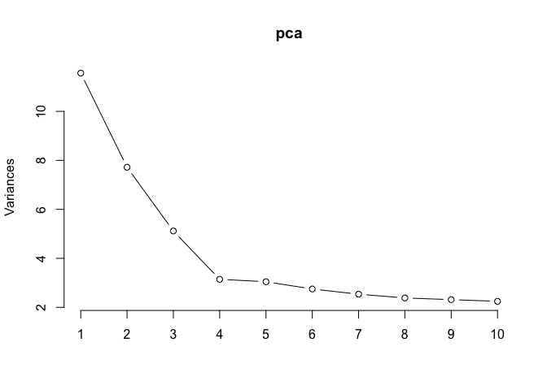

Wei Zhou, 5/13/2021 EID: wz4563

\#\#\#Abstract Growth is almost the most important topic for any firms.
Many firms set growth positions in order to realize growth. Do these
positions function well as people expected? Do they drive growth
effectively in a long term? This paper constructed both supervised
learning model and unsupervised models to answer this question. The
combination of text analysis and PCA is used to explain the practical
role of growth positions. A LASSO model was constructed to solve
collinearity problem, although Random Forest model finally win. By
comparing results from different models, we concluded that growth
positions didn’t drive firms’ growth significantly. What’s more, it is
sales positions corresponding to firms’ revenue but in an opposite way.
However, we need to point out our model is built on datasets only
including public companies. Those startups might have a different story.

\#\#\#Introduction For any firm in competitive markets, growth is key
for survival. In a recent decade, firms tend to hire growth
professionals, build growth teams, even set positions in top management
team, either of which is an expensive cost. They have invested in growth
positions continuously, and other departments are also involved when
collaboration is needed. Whether these growth positions drove firms’
growth highly and effectively become more and more important. In
addition, some traditional departments such as marketing and sales are
still there, even become larger. What is their role when growth
positions have overlap responsibilities? When firms have growth
positions, how does sales and marketing department drive growth? To
answer those questions, we collected some job ads data from job
recruitment websites and also collected data of public companies from
Wharton Research Database. Baes on these datasets, we built both
supervised learning model and unsupervised models. On one hand, we
combined text analysis and PCA model to explore real functions of growth
positions. On the other hand, we constructed a LASSO model to figure out
the collinearity in traditional fixed effects model. By comparing our
presented model with four other models, we concluded that it was sales
positions truly correspond to firms’ revenue in an opposite way.
Marketing positions and growth positions don’t have a straightforward
relationship with firms’ performance. However, we need to point out that
this paper is based on public database only including publish companies.
A different story is possible for those startups.

\#\#\#Study 1: Unsupervised Learning of Growth Positions In previous
literature regarding marketing research, we have seen large amounts of
topics covering marketing and sales. But growth never got the same
amount of attention as sales and marketing. If we analyze google trends
data which reflects people’s search interests, we can see how much
people are interested in different terms, “firm growth”, “firm
marketing”, “firm sales”. Although people search more about the term of
“firm marketing” years ago, and even now, we still can see the rising
trend of “firm growth” in the recent decade. Indeed, growth is
attracting more and more attentions. But what does “firm growth” mean?

Figure 1: Search Trends from Google data.

    googleTrends$Time<-paste(googleTrends$Time, "01", sep = "-")
    googleTrends$Time <- as.Date(googleTrends$Time,"%Y-%m-%d")
    class(googleTrends$Time)

    ## [1] "Date"

    googleTrends$date <- as.character(googleTrends$Time)

    ggplot(googleTrends) +
      geom_line(aes(x=Time,y=Freq, color=Term)) +
      theme(legend.position = "right")

      scale_x_datetime(labels = date_format("%Y-%M"))

    ## <ScaleContinuousDatetime>
    ##  Range:  
    ##  Limits:    0 --    1

Firms define growth quite differently. Growth is not a word with clear
function similar as terms of “marketing” or “sales”. We cannot get a
literal meaning easily, since it could be revenue growth, brand growth,
etc. As a result, growth positions also become different from firms to
firms. For instance, in our text data of job ads, some growth positions
are focusing on growth strategy, some are focusing on customer
acquisition, and some might be about revenue.

The best way to understand firms’ growth position is to explore the job
ads which usually contain qualifications, responsibilities and
compensations. During June 2020, we collected job ads data from several
recruitment websites once per week. In order to focus on each position’s
responsibility, we segmented each job text manually and extract
responsibility part to manipulate text analysis. After removing 22 texts
without responsibilities’ part, we get a complete dataset with 804 job
ads with growth in their titles. Then we extracted the main words with
more than 10% frequency in the text dataset by using a professional text
mining tool, Meaning Extraction Helper (MEH). Since we preferred to
focus on whether any functions mentioned in the ads, we didn’t want to
see repeated words in the same texts and overweighted results.
Therefore, we choose to use binary variable for each term.

Figure2: Screen Plot of PCA

    X1 = as.matrix(dtm[,-(1:4)])
    summary(colSums(X1))

    ##    Min. 1st Qu.  Median    Mean 3rd Qu.    Max. 
    ##    81.0   103.0   148.0   181.5   212.2   725.0

    pca = prcomp(X1, rank=20, scale=TRUE)
    plot(pca,type="l") 

    #summary(pca)

With the binary dataset with large amounts of terms, we do the Principal
Component Analysis. According to the loadings and the screen plot graph,
we chose 6 compressed components, in order to see more terms and
functions. Below is the table of terms each component is related to.

    ## In either PCA, it looks six components are a good one

    # Look at the loadings
    pca$rotation[order(abs(pca$rotation[,1]),decreasing=TRUE),1][1:20]

    ##    strategy       drive         key      market     develop        plan 
    ##  0.13846258  0.12383516  0.12256676  0.12198332  0.12177545  0.12124475 
    ##   strategic     execute     digital     partner   execution performance 
    ##  0.11102189  0.10768822  0.10731059  0.10683717  0.10606172  0.10524746 
    ##     channel        team    optimize        test      ensure    analytic 
    ##  0.10362193  0.10360092  0.10340491  0.10239507  0.10187924  0.10008697 
    ##        goal     insight 
    ##  0.09923307  0.09855393

    pca$rotation[order(abs(pca$rotation[,2]),decreasing=TRUE),1][1:20]

    ##         paid         test      channel  acquisition     optimize     campaign 
    ##  0.059134584  0.102395072  0.103621931  0.080414558  0.103404906  0.087086477 
    ##     creative relationship       social   conversion      service     business 
    ##  0.088470285  0.045483191  0.075348214  0.074263418  0.028366279  0.097009038 
    ##      account   management       funnel optimization     solution       client 
    ##  0.006231899  0.067482692  0.071358521  0.089014635  0.037776128 -0.007135990 
    ##          seo    financial 
    ##  0.056957558  0.027695671

    pca$rotation[order(abs(pca$rotation[,3]),decreasing=TRUE),1][1:20]

    ##     feature        user engineering    engineer  experiment     product 
    ##  0.02405008  0.04311349  0.03980906 -0.00700680  0.03320582  0.09080297 
    ##    campaign      budget      define      social      design        data 
    ##  0.08708648  0.08563920  0.09344491  0.07534821  0.06519248  0.09427401 
    ##       media      manage      impact      report        paid    director 
    ##  0.07236292  0.09837033  0.05999160  0.09486736  0.05913458  0.07064444 
    ##     channel     roadmap 
    ##  0.10362193  0.09546891

    pca$rotation[order(abs(pca$rotation[,4]),decreasing=TRUE),1][1:20]

    ##            skill             look           strong             time 
    ##      0.058855232      0.025657274      0.081181082      0.020077757 
    ##          monitor         external           client             join 
    ##      0.058775709      0.066869903     -0.007135990      0.005701245 
    ##        candidate           excite      partnership cross.functional 
    ##      0.065692522      0.035862331      0.084882980      0.077599078 
    ##          partner    communication         analysis            ideal 
    ##      0.106837169      0.059521227      0.079158266      0.072262139 
    ##         strategy            level        financial            learn 
    ##      0.138462579      0.035943266      0.027695671      0.045225106

    pca$rotation[order(abs(pca$rotation[,5]),decreasing=TRUE),1][1:20]

    ## recommendation       analysis           sale          trend        insight 
    ##    0.041340606    0.079158266    0.026480900    0.074933859    0.098553929 
    ##        monitor        analyze         change        problem        account 
    ##    0.058775709    0.065693821    0.073069875    0.057654688    0.006231899 
    ##    improvement         assist          drive        revenue        product 
    ##    0.052405572    0.022352506    0.123835162    0.094327024    0.090802974 
    ##        ability       internal        measure             ad        conduct 
    ##    0.066056942    0.066881453    0.079819126    0.017194134    0.046135345

    pca$rotation[order(abs(pca$rotation[,6]),decreasing=TRUE),1][1:20]

    ##      email    conduct   generate     leader     engage    oversee   activity 
    ## 0.04365810 0.04613534 0.01820529 0.07716885 0.04831352 0.06560621 0.04953540 
    ##   consumer   pipeline       sale       seek  candidate   building engagement 
    ## 0.05415830 0.02946964 0.02648090 0.02694078 0.06569252 0.06465602 0.06137710 
    ##      scale   audience   creative    message  financial  strategic 
    ## 0.05196724 0.08746627 0.08847028 0.06569117 0.02769567 0.11102189

Table 1: Related Term To Each Component Components Important words for
each dimension Summary Component 1 strategy drive key market develop
plan strategic execute digital partner Strategies and marketing
Component 2 paid test channel acquisition optimize campaign creative
relationship social conversion Channel and customers Component 3 feature
user engineering engineer experiment product campaign budget define
social Product and technique Component 4 skill look strong time monitor
external client join candidate excite Client Component 5 recommendation
analysis sale trend insight monitor analyze change problem account Sales
and analysis Component 6 email conduct generate leader engage oversee
activity consumer pipeline sale Leadership and sales

From the above tables, we focus on positions’ functional terms and see
that growth is a comprehensive combination of many functions such as
channel, customers, product, technique, leadership, analysis,
strategies, etc. The next question would be: do growth positions drive
growth?

\#\#\#Study 2: Supervised Learning of Firm Growth

\#\#\#\#Data Construction Our main data source is from a public database
Compustat on Wharton Research Database. We merged different tables with
same firms and different variables. To focus on firm growth within
target years, we selected the time period from 2016 to 2019. The public
data has many missing problems, we exclude those observations with
missing values and get a data set with 6525 observations, linked to 1854
firms and 63 different 2-digit SIC code. Then we merged the data with
some meaningful constructed variables. Since some constructed industrial
variables generated more missing values, our final dataset contains 4339
observations linked to 1379 firms and 36 2-digit SIC code (industries).
Important variables are explained as below.

Position Title Variables: in Compstat raw dataset, there is a top
management title variable, which reports titles of top management team.
We construct three new variables of marketing title number, sales title
number and growth title number for each firm in each year. We are going
to see whether these job positions drive firms’ growth and how. Industry
Variables: we have five industry variables in the dataset.

1.  Industry sales growth: we use sales in current year subtract sales
    in the previous year to represent a firm’s sale growth. Then we take
    average over same industries with the same 2-digit SIC code.
    (Panagopoulos et al Table 1 or Raghu et al Table 1)

2.  Competitive intensity: Calculate market share by dividing net sales
    over sum of net sales for all the companies with the same SIC. Then
    we sum the square of the market share of the top four companies with
    the highest market share in each SIC code. This is the competitive
    intensity of that industry. (Saboo & Grewal, 2013)

3.  Technological Turbulence: we average the existing variable R&D/sales
    for all companies in the same SIC. (Saboo and Grewal, 2013).

4.  Industry volatility: standard deviations of the sales of all the
    companies in the same SIC represents the Industry volatility.
    (Panagopoulos, 2018)

5.  Market turbulence: average the ratio of selling and general
    administrative expenses to sales of all the firms with the same SIC.
    Since there are lots of 0 in the denominator, we use (sales+1) to
    replace the original denominator sales. (Saboo and Grewal, 2013)
    Missing value problem: These is large amounts of missing values for
    these five industrial variables, and the average missing percentage
    is around 30%. But there is some missing pattern due to how these
    variables were generated. All the missing is linked to some specific
    industry 2-digital SIC. We decide to discard these observations
    since we are doing analysis only focusing on a group of industries.
    When we drop these observations, it just means we choose a smaller
    number of industries. Department Power Variables: we calculate three
    types of department power, marketing department power, sales
    department power and growth department power, in a consistent way.
    The basic method is to calculate below variables representing
    different criteria of department power, and then manipulate PCA for
    a one-factor latent variable representing the final department
    power.

6.  Marketing department power: a compressed variable of PCA results
    from below 5 variables. We also calculate a compressed variable from
    4 variables which are a-d.

<!-- -->

1.  Percentage of numbers of marketing titles in top management team.
2.  Percentage of compensation of marketing titles in top management
    team.
3.  Hierarchical score of highest marketing title
4.  Cumulative hierarchical scores of highest marketing title
5.  Number of additional responsibilities of marketing executives,
    reflected in the job title.

<!-- -->

1.  Sales department power: a compressed variable of PCA results from 5
    variables similar as the above marketing department power. Likewise,
    we also generate two compressed variables from both 4 and 5
    variables.
2.  Growth department power: a compressed variable of PCA results from
    below 4 variables. In the dataset, we find that all the growth
    titles are very concise, and don’t contain any additional functions.
    Thus, we calculate the compressed variable from 4 department
    variables.

<!-- -->

1.  Percentage of numbers of marketing titles in top management team.
2.  Percentage of compensation of marketing titles in top management
    team.
3.  Hierarchical score of highest marketing title
4.  Cumulative hierarchical scores of highest marketing title Other
    Related Variables: For variable of Fiscal Year, we narrow down the
    time period to be from 2016 to 2019. Total assets, total marketing
    value, number of employees and industry with 2-digit SIC code are
    four variables we want to control. All these variables come from
    Compstat database. Outcome Variable: Firm growth is the first
    variables that we want to predict. We constructed this variable by
    using the net sales in the current year subtract the net sales in
    the previous year. It reflects how the firms grow in a
    straightforward manner. However, the price is more missing values.
    If we discard those observations with missing net sales growth, we
    get 3790 observations at the end. We also have other variables
    reflecting firms’ performance from different aspects without any
    missing values. Balance sheet, income statement and cash flow, these
    are three financial statements that every firm has to look at.
    Regarding these statements, we have total revenue, net sales, cash
    dividends (cash flow), income before extraordinary Items (cash
    flow), total dividends. Among these five variables, income before
    extraordinary Items (cash flow) is treated as the most important
    variable reflecting firms’ performance. The reason is that income
    cash flow belongs to both of income statement and cash flow
    statements. Therefore, we use income cash flow as another outcome
    without any concern about missing values. Then we can use other
    dependent variables to test our model, and further see how those
    independent variables influence firm performance.

Data Description Transformed Outcomes: Below is the distribution of
several outcome variables. Through the original density distribution, we
can see some of them are skewed. As long as the values are larger than
0, we take log algorithm, then they are closer to normal as the below
figures show. Thus, in the models we’ll use log values of revenue and
net sales/turnover. But for net sale growth and income cash flow, there
are negative numbers, we cannot take log. Figure 3: Density of Outcome
Variables

    firm <- read.csv("~/Documents/**2021spring course/DM/final proj/dp_rmna_industry copy.csv")
    ind <- firm[,29:33]
    ind<-na.omit(firm)

    ## add variable about net sales growth (existing previou year)
    dd4sic2_4y_rmna <- read.csv("~/Documents/**2021spring course/DM/final proj/dd4sic2_4y_rmna.csv")
    #colnames(dd4sic2_4y_rmna)
    firmGrow <- dd4sic2_4y_rmna[,c(4,5,15)]
    names(firmGrow)[names(firmGrow) =="Ticker.Symbol"] <-"TickerSymbol"
    colnames(firm)

    ##  [1] "X"                                            
    ##  [2] "SIC2"                                         
    ##  [3] "Fiscal.Year"                                  
    ##  [4] "TickerSymbol"                                 
    ##  [5] "c_mkt"                                        
    ##  [6] "c_sal"                                        
    ##  [7] "c_grw"                                        
    ##  [8] "Company.Name"                                 
    ##  [9] "Assets...Total"                               
    ## [10] "Cash.Dividends..Cash.Flow."                   
    ## [11] "Income.Before.Extraordinary.Items..Cash.Flow."
    ## [12] "Sales.Turnover..Net."                         
    ## [13] "Standard.Industry.Classification.Code"        
    ## [14] "State.Province"                               
    ## [15] "Industry.Format.x"                            
    ## [16] "Dividends...Total"                            
    ## [17] "Employees"                                    
    ## [18] "Market.Value...Total...Fiscal"                
    ## [19] "Postal.Code"                                  
    ## [20] "Revenue...Total"                              
    ## [21] "Industry.Format.y"                            
    ## [22] "Data.Format"                                  
    ## [23] "mdp_fa_5v"                                    
    ## [24] "mdp_fa_4v"                                    
    ## [25] "sdp_fa_5v"                                    
    ## [26] "sdp_fa_4v"                                    
    ## [27] "gdp_fa_4v"                                    
    ## [28] "SIC.Code"                                     
    ## [29] "Compet_Inten"                                 
    ## [30] "Industry_Grow"                                
    ## [31] "IndusVolat"                                   
    ## [32] "MktTurb"                                      
    ## [33] "TechTurb"

    colnames(firmGrow)

    ## [1] "Fiscal.Year"  "TickerSymbol" "grow"

    firm2 <- merge(ind,firmGrow, by=c("TickerSymbol","Fiscal.Year"),all.x=TRUE)

    ### add the sales net growth manually
    dd4sic2_5y <- read.csv("~/Documents/**2021spring course/DM/final proj/dd4sic2_5y.csv")
    colnames(dd4sic2_5y)

    ##  [1] "X"                                              
    ##  [2] "Global.Company.Key"                             
    ##  [3] "Data.Date"                                      
    ##  [4] "Fiscal.Year"                                    
    ##  [5] "Ticker.Symbol"                                  
    ##  [6] "Company.Name"                                   
    ##  [7] "Fiscal.Year.end.Month"                          
    ##  [8] "Sales.Turnover..Net."                           
    ##  [9] "Pro.Forma.Net.Sales...Current.Year"             
    ## [10] "Pro.Forma.Net.Sales...Prior.Year"               
    ## [11] "Selling..General.and.Administrative.Expense"    
    ## [12] "Standard.Industrial.Classification...Historical"
    ## [13] "SIC2"                                           
    ## [14] "if_SIC_Main_2"

    sales2015<- subset(dd4sic2_5y, Fiscal.Year=="2015")
    sales2016<- subset(dd4sic2_5y, Fiscal.Year=="2016")
    sales2017<- subset(dd4sic2_5y, Fiscal.Year=="2017")
    sales2018<- subset(dd4sic2_5y, Fiscal.Year=="2018")
    sales2019<- subset(dd4sic2_5y, Fiscal.Year=="2019")

    sales2015$pre2016 <- sales2015$Sales.Turnover..Net.
    sales2016$pre2017 <- sales2016$Sales.Turnover..Net.
    sales2017$pre2018 <- sales2017$Sales.Turnover..Net.
    sales2018$pre2019 <- sales2018$Sales.Turnover..Net.

    colnames(sales2015)

    ##  [1] "X"                                              
    ##  [2] "Global.Company.Key"                             
    ##  [3] "Data.Date"                                      
    ##  [4] "Fiscal.Year"                                    
    ##  [5] "Ticker.Symbol"                                  
    ##  [6] "Company.Name"                                   
    ##  [7] "Fiscal.Year.end.Month"                          
    ##  [8] "Sales.Turnover..Net."                           
    ##  [9] "Pro.Forma.Net.Sales...Current.Year"             
    ## [10] "Pro.Forma.Net.Sales...Prior.Year"               
    ## [11] "Selling..General.and.Administrative.Expense"    
    ## [12] "Standard.Industrial.Classification...Historical"
    ## [13] "SIC2"                                           
    ## [14] "if_SIC_Main_2"                                  
    ## [15] "pre2016"

    pre2016 <- sales2015[,c(5,8)]
    pre2017 <- sales2016[,c(5,8)]
    pre2018 <- sales2017[,c(5,8)]
    pre2019 <- sales2018[,c(5,8)]
    names(pre2016)[names(pre2016) =="Sales.Turnover..Net."] <-"sale.pre.y"
    names(pre2017)[names(pre2017) =="Sales.Turnover..Net."] <-"sale.pre.y"
    names(pre2018)[names(pre2018) =="Sales.Turnover..Net."] <-"sale.pre.y"
    names(pre2019)[names(pre2019) =="Sales.Turnover..Net."] <-"sale.pre.y"

    sales2019 <- merge(sales2019,pre2019,by='Ticker.Symbol',all.x=TRUE)
    sales2018 <- merge(sales2018,pre2018,by='Ticker.Symbol',all.x=TRUE)
    sales2017 <- merge(sales2017,pre2017,by='Ticker.Symbol',all.x=TRUE)
    sales2016 <- merge(sales2016,pre2016,by='Ticker.Symbol',all.x=TRUE)

    sales2015$salesGrow <- NA
    sales2016$salesGrow <- sales2016$Sales.Turnover..Net.-sales2016$sale.pre.y
    sales2017$salesGrow <- sales2017$Sales.Turnover..Net.-sales2017$sale.pre.y
    sales2018$salesGrow <- sales2018$Sales.Turnover..Net.-sales2018$sale.pre.y
    sales2019$salesGrow <- sales2019$Sales.Turnover..Net.-sales2019$sale.pre.y

    sales2015 <- sales2015[,-15]
    sales2016 <- sales2016[,-(15:16)]
    sales2017 <- sales2017[,-(15:16)]
    sales2018 <- sales2018[,-(15:16)]
    sales2019 <- sales2019[,-15]

    salesGrow <- rbind(sales2015,sales2016,sales2017,sales2018,sales2019)
    salesGrow <- salesGrow[,c(4,5,15)]
    names(salesGrow)[names(salesGrow) =="Ticker.Symbol"] <-"TickerSymbol"

    salesGrow2 <- subset(salesGrow,Fiscal.Year=="2016"|Fiscal.Year=="2017"|Fiscal.Year=="2018"|Fiscal.Year=="2019")

    firm3 <- merge(firm2,salesGrow2, by=c('Fiscal.Year','TickerSymbol'), all.x=TRUE)

    firm3_remd=firm3[!duplicated(firm3),] 

    firm3_final <- subset(firm3_remd, !is.na(salesGrow)) 

    ### data description
    par(mfcol=c(2,3))

    hist(firm3_final$Revenue...Total, freq=F, breaks=10, col="#33CCCC", main="Hist of Revenue", xlab = "Revenue")
    firm3_final$Rlog <- log(firm3_final$'Revenue...Total'+1)
    hist(firm3_final$Rlog, freq=F, breaks=10, col="#33CCCC", main="Hist of log(Revenue)", xlab = "log(Revenue)")

    hist(firm3_final$Sales.Turnover..Net., freq=F, breaks=10, col="#F6ea8c", main="Hist of Sales/Turnover", xlab = "Sales/Turnover")
    firm3_final$STlog <- log(firm3_final$'Sales.Turnover..Net.'+1)
    hist(firm3_final$STlog, freq=F, breaks=10, col="#F6ea8c", main="Hist of log(Sales/Turnover)", xlab = "log(Sales/Turnover)")

    hist(firm3_final$salesGrow, freq=F, breaks=10, col="#AAABD3", main="Hist of Net Sales Growth", xlab = "Net Sales Growth")
    #firm3_final$Slog <- log(firm3_final$'salesGrow')
    #hist(firm3_final$Slog, freq=F, breaks=10, col="#AAABD3", main="Hist of log(Net Sales Growth)", xlab ="log(Net Sales Growth")

    hist(firm3_final$Income.Before.Extraordinary.Items..Cash.Flow., freq=F, breaks=10, col="#47b8e0", main="Hist of Income Cash Flow", xlab = "Income Cash Flow")

    #firm3_final$Clog <- log(firm3_final$'Income.Before.Extraordinary.Items..Cash.Flow.'+1)
    #hist(firm3_final$Clog, freq=F, breaks=10, col="#47b8e0", main="Hist of log(Income Cash Flow)", xlab="log(Income Cash Flow)")

Correlation Table: From the correlation table, we found that there are
variables highly correlated. These correlation makes sense, for example
marketing department powers are strongly correlated with number of
marketing titles in top management team. For those variables with
correlation that is almost 1, we can only choose 1 of the two highly
correlated variables. For example, we cannot use revenue and net
sales/turnover simultaneously, department power components from 4 and 5
indicants cannot be used together, total dividends and dividends cash
flow cannot be together, department power(mdp,gdp,sdp) and number of
titles (c\_mkt, c\_sal, c\_gwr) connot used together. As a result, we
choose to use revenue, sales growth and income cash flow as outcomes.
For department power, we use the component variable generated from 5
variables, although for growth department power we use the only
component from 4 variables. Figure 4: Correlation Table

    colnames(firm)

    ##  [1] "X"                                            
    ##  [2] "SIC2"                                         
    ##  [3] "Fiscal.Year"                                  
    ##  [4] "TickerSymbol"                                 
    ##  [5] "c_mkt"                                        
    ##  [6] "c_sal"                                        
    ##  [7] "c_grw"                                        
    ##  [8] "Company.Name"                                 
    ##  [9] "Assets...Total"                               
    ## [10] "Cash.Dividends..Cash.Flow."                   
    ## [11] "Income.Before.Extraordinary.Items..Cash.Flow."
    ## [12] "Sales.Turnover..Net."                         
    ## [13] "Standard.Industry.Classification.Code"        
    ## [14] "State.Province"                               
    ## [15] "Industry.Format.x"                            
    ## [16] "Dividends...Total"                            
    ## [17] "Employees"                                    
    ## [18] "Market.Value...Total...Fiscal"                
    ## [19] "Postal.Code"                                  
    ## [20] "Revenue...Total"                              
    ## [21] "Industry.Format.y"                            
    ## [22] "Data.Format"                                  
    ## [23] "mdp_fa_5v"                                    
    ## [24] "mdp_fa_4v"                                    
    ## [25] "sdp_fa_5v"                                    
    ## [26] "sdp_fa_4v"                                    
    ## [27] "gdp_fa_4v"                                    
    ## [28] "SIC.Code"                                     
    ## [29] "Compet_Inten"                                 
    ## [30] "Industry_Grow"                                
    ## [31] "IndusVolat"                                   
    ## [32] "MktTurb"                                      
    ## [33] "TechTurb"

    firm$c_mkt <- as.numeric(firm$c_mkt)
    firm$c_grw <- as.numeric(firm$c_grw)
    firm$c_sal <- as.numeric(firm$c_sal)
    str(firm)

    ## 'data.frame':    6525 obs. of  33 variables:
    ##  $ X                                            : int  1 2 3 4 5 6 7 8 9 10 ...
    ##  $ SIC2                                         : int  10 10 10 10 10 10 10 10 10 10 ...
    ##  $ Fiscal.Year                                  : int  2016 2016 2016 2016 2016 2016 2016 2016 2017 2017 ...
    ##  $ TickerSymbol                                 : chr  "FCX" "CLF" "GOLD" "SWC" ...
    ##  $ c_mkt                                        : num  0 0 0 0 0 0 0 0 0 0 ...
    ##  $ c_sal                                        : num  0 0 0 0 0 0 0 0 0 0 ...
    ##  $ c_grw                                        : num  0 0 0 0 0 0 0 0 0 0 ...
    ##  $ Company.Name                                 : chr  "FREEPORT-MCMORAN INC" "CLEVELAND-CLIFFS INC" "BARRICK GOLD CORP" "STILLWATER MINING CO" ...
    ##  $ Assets...Total                               : num  37317 1924 25264 1327 21031 ...
    ##  $ Cash.Dividends..Cash.Flow.                   : num  6 0 86 0 67 ...
    ##  $ Income.Before.Extraordinary.Items..Cash.Flow.: num  -3832 219.2 861 9.47 -790 ...
    ##  $ Sales.Turnover..Net.                         : num  14830 2118 8558 711 6711 ...
    ##  $ Standard.Industry.Classification.Code        : int  1000 1000 1040 1090 1040 1040 1040 100 1000 1000 ...
    ##  $ State.Province                               : chr  "AZ" "OH" "ON" "CO" ...
    ##  $ Industry.Format.x                            : chr  "INDL" "INDL" "INDL" "INDL" ...
    ##  $ Dividends...Total                            : num  0 0 86 0 67 ...
    ##  $ Employees                                    : num  30 2.92 18.18 1.43 12.4 ...
    ##  $ Market.Value...Total...Fiscal                : num  19060 1960 18626 1953 18073 ...
    ##  $ Postal.Code                                  : chr  "85004-2189" "44114-2315" "M5J 2S1" "80120" ...
    ##  $ Revenue...Total                              : num  14830 2118 8558 711 6711 ...
    ##  $ Industry.Format.y                            : chr  "INDL" "INDL" "INDL" "INDL" ...
    ##  $ Data.Format                                  : chr  "STD" "STD" "STD" "STD" ...
    ##  $ mdp_fa_5v                                    : num  -0.302 -0.302 -0.302 -0.302 -0.302 ...
    ##  $ mdp_fa_4v                                    : num  -0.303 -0.303 -0.303 -0.303 -0.303 ...
    ##  $ sdp_fa_5v                                    : num  -0.291 -0.291 -0.291 -0.291 -0.291 ...
    ##  $ sdp_fa_4v                                    : num  -0.293 -0.293 -0.293 -0.293 -0.293 ...
    ##  $ gdp_fa_4v                                    : num  -0.0787 -0.0787 -0.0787 -0.0787 -0.0787 ...
    ##  $ SIC.Code                                     : int  1000 1000 1040 1090 1040 1040 1040 100 1000 1000 ...
    ##  $ Compet_Inten                                 : num  NA NA NA NA NA NA NA NA NA NA ...
    ##  $ Industry_Grow                                : num  NA NA NA NA NA NA NA NA NA NA ...
    ##  $ IndusVolat                                   : num  NA NA NA NA NA NA NA NA NA NA ...
    ##  $ MktTurb                                      : num  NA NA NA NA NA NA NA NA NA NA ...
    ##  $ TechTurb                                     : num  NA NA NA NA NA NA NA NA NA NA ...

    firm_num <- firm3_final[,c(5:7,9:12,16:18,20,23:27,29:33,35)]
    names(firm_num)[names(firm_num) =="Market.Value...Total...Fiscal"] <-"Total Market Value"
    names(firm_num)[names(firm_num) =="Income.Before.Extraordinary.Items..Cash.Flow."] <-"Income Cash Flow"
    names(firm_num)[names(firm_num) =="Cash.Dividends..Cash.Flow."] <-"Dividends Cash Flow"

    corfirm<-cor(firm_num,use = "complete.obs")
    par(mar = rep(4,4))
    #dev.off()
    corrplot(corfirm, method="circle", tl.cex=0.7)

Exploration of T-tests: From below t-test results, we can see that
marketing titles and sales titles have significant influence on firm
performance through revenue and sales/turnover, rather than sales growth
or income cash flow. Furthermore, groups without marketing titles or
sales titles have better performance. We guess it might because firms
with lower revenue hope to change through marketing or sales teams. But
when it comes to growth titles, although firms with growth titles have
better revenue, net sales/turnover, and income cash flow, but none of
the results are significant.

Table2: T-test Comparison Between Different Groups (add results in pdf)

    ### t

    firm3_final$c_mkt2 <- ifelse(firm3_final$c_mkt=="0",0,1)
    firm3_final$c_sal2 <- ifelse(firm3_final$c_sal=="0",0,1)
    firm3_final$c_grw2 <- ifelse(firm3_final$c_grw=="0",0,1)
    t.test(salesGrow~c_mkt2,data=firm3_final)

    ## 
    ##  Welch Two Sample t-test
    ## 
    ## data:  salesGrow by c_mkt2
    ## t = 0.34203, df = 423.87, p-value = 0.7325
    ## alternative hypothesis: true difference in means is not equal to 0
    ## 95 percent confidence interval:
    ##  -221.9447  315.4577
    ## sample estimates:
    ## mean in group 0 mean in group 1 
    ##        367.2636        320.5071

    t.test(salesGrow~c_grw2,data=firm3_final)

    ## 
    ##  Welch Two Sample t-test
    ## 
    ## data:  salesGrow by c_grw2
    ## t = 0.34189, df = 39.155, p-value = 0.7343
    ## alternative hypothesis: true difference in means is not equal to 0
    ## 95 percent confidence interval:
    ##  -386.5880  543.8837
    ## sample estimates:
    ## mean in group 0 mean in group 1 
    ##        364.0466        285.3988

    t.test(salesGrow~c_sal2,data=firm3_final)

    ## 
    ##  Welch Two Sample t-test
    ## 
    ## data:  salesGrow by c_sal2
    ## t = 0.78615, df = 843.99, p-value = 0.432
    ## alternative hypothesis: true difference in means is not equal to 0
    ## 95 percent confidence interval:
    ##  -108.9974  254.6494
    ## sample estimates:
    ## mean in group 0 mean in group 1 
    ##         371.330         298.504

    t.test(Revenue...Total~c_mkt2,data=firm3_final)

    ## 
    ##  Welch Two Sample t-test
    ## 
    ## data:  Revenue...Total by c_mkt2
    ## t = 3.9203, df = 513.91, p-value = 0.0001004
    ## alternative hypothesis: true difference in means is not equal to 0
    ## 95 percent confidence interval:
    ##  1578.836 4750.907
    ## sample estimates:
    ## mean in group 0 mean in group 1 
    ##        7767.438        4602.567

    t.test(Revenue...Total~c_grw2,data=firm3_final)

    ## 
    ##  Welch Two Sample t-test
    ## 
    ## data:  Revenue...Total by c_grw2
    ## t = -0.96546, df = 38.475, p-value = 0.3403
    ## alternative hypothesis: true difference in means is not equal to 0
    ## 95 percent confidence interval:
    ##  -5750.382  2035.622
    ## sample estimates:
    ## mean in group 0 mean in group 1 
    ##        7479.582        9336.962

    t.test(Revenue...Total~c_sal2,data=firm3_final)

    ## 
    ##  Welch Two Sample t-test
    ## 
    ## data:  Revenue...Total by c_sal2
    ## t = 4.0962, df = 677.61, p-value = 4.708e-05
    ## alternative hypothesis: true difference in means is not equal to 0
    ## 95 percent confidence interval:
    ##  1721.443 4891.107
    ## sample estimates:
    ## mean in group 0 mean in group 1 
    ##        7863.237        4556.961

    t.test(Sales.Turnover..Net.~c_mkt2,data=firm3_final)

    ## 
    ##  Welch Two Sample t-test
    ## 
    ## data:  Sales.Turnover..Net. by c_mkt2
    ## t = 3.9203, df = 513.91, p-value = 0.0001004
    ## alternative hypothesis: true difference in means is not equal to 0
    ## 95 percent confidence interval:
    ##  1578.836 4750.907
    ## sample estimates:
    ## mean in group 0 mean in group 1 
    ##        7767.438        4602.567

    t.test(Sales.Turnover..Net.~c_grw2,data=firm3_final)

    ## 
    ##  Welch Two Sample t-test
    ## 
    ## data:  Sales.Turnover..Net. by c_grw2
    ## t = -0.96546, df = 38.475, p-value = 0.3403
    ## alternative hypothesis: true difference in means is not equal to 0
    ## 95 percent confidence interval:
    ##  -5750.382  2035.622
    ## sample estimates:
    ## mean in group 0 mean in group 1 
    ##        7479.582        9336.962

    t.test(Sales.Turnover..Net.~c_sal2,data=firm3_final)

    ## 
    ##  Welch Two Sample t-test
    ## 
    ## data:  Sales.Turnover..Net. by c_sal2
    ## t = 4.0962, df = 677.61, p-value = 4.708e-05
    ## alternative hypothesis: true difference in means is not equal to 0
    ## 95 percent confidence interval:
    ##  1721.443 4891.107
    ## sample estimates:
    ## mean in group 0 mean in group 1 
    ##        7863.237        4556.961

    t.test(Income.Before.Extraordinary.Items..Cash.Flow.~c_mkt2,data=firm3_final)

    ## 
    ##  Welch Two Sample t-test
    ## 
    ## data:  Income.Before.Extraordinary.Items..Cash.Flow. by c_mkt2
    ## t = 0.69252, df = 385.38, p-value = 0.489
    ## alternative hypothesis: true difference in means is not equal to 0
    ## 95 percent confidence interval:
    ##  -207.6711  433.5084
    ## sample estimates:
    ## mean in group 0 mean in group 1 
    ##        693.3101        580.3914

    t.test(Income.Before.Extraordinary.Items..Cash.Flow.~c_grw2,data=firm3_final)

    ## 
    ##  Welch Two Sample t-test
    ## 
    ## data:  Income.Before.Extraordinary.Items..Cash.Flow. by c_grw2
    ## t = -0.89714, df = 39.78, p-value = 0.375
    ## alternative hypothesis: true difference in means is not equal to 0
    ## 95 percent confidence interval:
    ##  -610.8476  235.3081
    ## sample estimates:
    ## mean in group 0 mean in group 1 
    ##        681.8535        869.6233

    t.test(Income.Before.Extraordinary.Items..Cash.Flow.~c_sal2,data=firm3_final)

    ## 
    ##  Welch Two Sample t-test
    ## 
    ## data:  Income.Before.Extraordinary.Items..Cash.Flow. by c_sal2
    ## t = 1.7296, df = 543.87, p-value = 0.08427
    ## alternative hypothesis: true difference in means is not equal to 0
    ## 95 percent confidence interval:
    ##  -32.52412 511.85895
    ## sample estimates:
    ## mean in group 0 mean in group 1 
    ##        710.1829        470.5155

    ind$c_mkt2 <- ifelse(ind$c_mkt=="0",0,1)
    ind$c_sal2 <- ifelse(ind$c_sal=="0",0,1)
    ind$c_grw2 <- ifelse(ind$c_grw=="0",0,1)

    ind <- merge(ind,salesGrow2, by=c('Fiscal.Year','TickerSymbol'), all.x=TRUE)
    ind=ind[!duplicated(ind),] 
    ind <- subset(ind, !is.na(salesGrow)) 
    t.test(salesGrow~c_mkt2,data=ind)

    ## 
    ##  Welch Two Sample t-test
    ## 
    ## data:  salesGrow by c_mkt2
    ## t = 0.34203, df = 423.87, p-value = 0.7325
    ## alternative hypothesis: true difference in means is not equal to 0
    ## 95 percent confidence interval:
    ##  -221.9447  315.4577
    ## sample estimates:
    ## mean in group 0 mean in group 1 
    ##        367.2636        320.5071

    t.test(salesGrow~c_grw2,data=ind)

    ## 
    ##  Welch Two Sample t-test
    ## 
    ## data:  salesGrow by c_grw2
    ## t = 0.34189, df = 39.155, p-value = 0.7343
    ## alternative hypothesis: true difference in means is not equal to 0
    ## 95 percent confidence interval:
    ##  -386.5880  543.8837
    ## sample estimates:
    ## mean in group 0 mean in group 1 
    ##        364.0466        285.3988

    t.test(salesGrow~c_sal2,data=ind)

    ## 
    ##  Welch Two Sample t-test
    ## 
    ## data:  salesGrow by c_sal2
    ## t = 0.78615, df = 843.99, p-value = 0.432
    ## alternative hypothesis: true difference in means is not equal to 0
    ## 95 percent confidence interval:
    ##  -108.9974  254.6494
    ## sample estimates:
    ## mean in group 0 mean in group 1 
    ##         371.330         298.504

    t.test(Revenue...Total~c_mkt2,data=ind)

    ## 
    ##  Welch Two Sample t-test
    ## 
    ## data:  Revenue...Total by c_mkt2
    ## t = 3.9203, df = 513.91, p-value = 0.0001004
    ## alternative hypothesis: true difference in means is not equal to 0
    ## 95 percent confidence interval:
    ##  1578.836 4750.907
    ## sample estimates:
    ## mean in group 0 mean in group 1 
    ##        7767.438        4602.567

    t.test(Revenue...Total~c_grw2,data=ind)

    ## 
    ##  Welch Two Sample t-test
    ## 
    ## data:  Revenue...Total by c_grw2
    ## t = -0.96546, df = 38.475, p-value = 0.3403
    ## alternative hypothesis: true difference in means is not equal to 0
    ## 95 percent confidence interval:
    ##  -5750.382  2035.622
    ## sample estimates:
    ## mean in group 0 mean in group 1 
    ##        7479.582        9336.962

    t.test(Revenue...Total~c_sal2,data=ind)

    ## 
    ##  Welch Two Sample t-test
    ## 
    ## data:  Revenue...Total by c_sal2
    ## t = 4.0962, df = 677.61, p-value = 4.708e-05
    ## alternative hypothesis: true difference in means is not equal to 0
    ## 95 percent confidence interval:
    ##  1721.443 4891.107
    ## sample estimates:
    ## mean in group 0 mean in group 1 
    ##        7863.237        4556.961

    t.test(Sales.Turnover..Net.~c_mkt2,data=ind)

    ## 
    ##  Welch Two Sample t-test
    ## 
    ## data:  Sales.Turnover..Net. by c_mkt2
    ## t = 3.9203, df = 513.91, p-value = 0.0001004
    ## alternative hypothesis: true difference in means is not equal to 0
    ## 95 percent confidence interval:
    ##  1578.836 4750.907
    ## sample estimates:
    ## mean in group 0 mean in group 1 
    ##        7767.438        4602.567

    t.test(Sales.Turnover..Net.~c_grw2,data=ind)

    ## 
    ##  Welch Two Sample t-test
    ## 
    ## data:  Sales.Turnover..Net. by c_grw2
    ## t = -0.96546, df = 38.475, p-value = 0.3403
    ## alternative hypothesis: true difference in means is not equal to 0
    ## 95 percent confidence interval:
    ##  -5750.382  2035.622
    ## sample estimates:
    ## mean in group 0 mean in group 1 
    ##        7479.582        9336.962

    t.test(Sales.Turnover..Net.~c_sal2,data=ind)

    ## 
    ##  Welch Two Sample t-test
    ## 
    ## data:  Sales.Turnover..Net. by c_sal2
    ## t = 4.0962, df = 677.61, p-value = 4.708e-05
    ## alternative hypothesis: true difference in means is not equal to 0
    ## 95 percent confidence interval:
    ##  1721.443 4891.107
    ## sample estimates:
    ## mean in group 0 mean in group 1 
    ##        7863.237        4556.961

    t.test(Income.Before.Extraordinary.Items..Cash.Flow.~c_mkt2,data=ind)

    ## 
    ##  Welch Two Sample t-test
    ## 
    ## data:  Income.Before.Extraordinary.Items..Cash.Flow. by c_mkt2
    ## t = 0.69252, df = 385.38, p-value = 0.489
    ## alternative hypothesis: true difference in means is not equal to 0
    ## 95 percent confidence interval:
    ##  -207.6711  433.5084
    ## sample estimates:
    ## mean in group 0 mean in group 1 
    ##        693.3101        580.3914

    t.test(Income.Before.Extraordinary.Items..Cash.Flow.~c_grw2,data=ind)

    ## 
    ##  Welch Two Sample t-test
    ## 
    ## data:  Income.Before.Extraordinary.Items..Cash.Flow. by c_grw2
    ## t = -0.89714, df = 39.78, p-value = 0.375
    ## alternative hypothesis: true difference in means is not equal to 0
    ## 95 percent confidence interval:
    ##  -610.8476  235.3081
    ## sample estimates:
    ## mean in group 0 mean in group 1 
    ##        681.8535        869.6233

    t.test(Income.Before.Extraordinary.Items..Cash.Flow.~c_sal2,data=ind)

    ## 
    ##  Welch Two Sample t-test
    ## 
    ## data:  Income.Before.Extraordinary.Items..Cash.Flow. by c_sal2
    ## t = 1.7296, df = 543.87, p-value = 0.08427
    ## alternative hypothesis: true difference in means is not equal to 0
    ## 95 percent confidence interval:
    ##  -32.52412 511.85895
    ## sample estimates:
    ## mean in group 0 mean in group 1 
    ##        710.1829        470.5155

\#\#\#\#Analyze and Results Based on the above analysis, independent
variables that come into the presented models are fiscal year, total
assets, employees, total market value, three department power, SIC code,
five industry variables. The three chosen dependent variables are
revenue, sales growth and income cash flow for all four different
models. We not only compare the same models with different outcomes, but
also compare the different models with the same variables. When we
compare different models, we mainly focusing on their performance of out
of sample prediction. Therefore, we need to split the data, and 80%
observations go to training set and the remaining 20% go to testing set.
After estimate the model in the training dataset, we use the test set to
evaluate the model.

    firm3_final$SIC.Code <- factor(firm3_final$SIC.Code)
    firm3_final$SIC2 <- substr(firm3_final$SIC.Code,1,2)
    firm3_final$SIC2 <- factor(firm3_final$SIC2)
    firm_split = initial_split(firm3_final,prop=0.8)
    f_train = training(firm_split)
    f_test = testing(firm_split)

\#\#\#\#\#Linear Regression Model (OLS): For OLS, we start from sales
growth variable. Then we run the other two models with revenue and cash
flow as variables one by one. From the results, we can see that
marketing and sales department power are significant in the OLS model
with log of revenue as the outcome. Table 3: Results of OLS model
Significant Variables in OLS1 - Sales Growth Total Assets -0.003 0.001
Employees 10.098 0.000 Total Market Value 0.022 0.000 Industry
volatility 0.118 0.033\* SIC2-27/38/47/49/62/65/67/73/79/82/87 Adjusted
R-squared: 0.2724 Out of Sample RMSE: 2231.079

Significant Variables in OLS1 – log of Revenue Total Assets -0.000 0.000
Employees 0.0143 0.000 Total Market Value 0.000 0.000 Marketing
Department Power 0.118 0.033 Sales Department power -0.0804 0.002
SIC2-27/35/36/38/39/50/51/61/62/67/70/73/79/80/82/87 Adjusted R-squared:
0.4548 Out of Sample RMSE: 1.227

Significant Variables in OLS1 – Income Cash Flow Total Assets 0.007
0.000 Total Market Value 0.03846 0.000 Marketing Turbulence -85.671
0.009 Technological Turbulence -20.180 0.006 SIC2-28/36/48/49 Adjusted
R-squared: 0.7601 Out of Sample RMSE: 1480.415

     ols <-lm(salesGrow ~ Fiscal.Year+Assets...Total+Employees+
               Market.Value...Total...Fiscal+mdp_fa_5v+sdp_fa_5v+gdp_fa_4v+SIC2+
               Compet_Inten+Industry_Grow+IndusVolat +MktTurb+TechTurb, data=f_train)
    summary(ols)

    ## 
    ## Call:
    ## lm(formula = salesGrow ~ Fiscal.Year + Assets...Total + Employees + 
    ##     Market.Value...Total...Fiscal + mdp_fa_5v + sdp_fa_5v + gdp_fa_4v + 
    ##     SIC2 + Compet_Inten + Industry_Grow + IndusVolat + MktTurb + 
    ##     TechTurb, data = f_train)
    ## 
    ## Residuals:
    ##    Min     1Q Median     3Q    Max 
    ## -64780   -164    140    361  28977 
    ## 
    ## Coefficients:
    ##                                 Estimate Std. Error t value Pr(>|t|)    
    ## (Intercept)                    4.684e+04  1.524e+05   0.307   0.7585    
    ## Fiscal.Year                   -2.429e+01  7.585e+01  -0.320   0.7488    
    ## Assets...Total                -4.851e-03  1.132e-03  -4.285 1.89e-05 ***
    ## Employees                      1.256e+01  1.329e+00   9.445  < 2e-16 ***
    ## Market.Value...Total...Fiscal  2.263e-02  1.020e-03  22.192  < 2e-16 ***
    ## mdp_fa_5v                     -1.760e+01  5.223e+01  -0.337   0.7362    
    ## sdp_fa_5v                      1.906e+01  4.824e+01   0.395   0.6927    
    ## gdp_fa_4v                     -2.961e+01  4.367e+01  -0.678   0.4978    
    ## SIC227                         1.527e+03  7.958e+02   1.919   0.0551 .  
    ## SIC228                         1.504e+03  1.171e+03   1.285   0.1990    
    ## SIC235                         4.609e+02  3.217e+02   1.433   0.1520    
    ## SIC236                         3.023e+01  3.010e+02   0.100   0.9200    
    ## SIC237                        -3.080e+03  1.943e+03  -1.585   0.1130    
    ## SIC238                         1.436e+03  6.282e+02   2.286   0.0223 *  
    ## SIC239                         1.554e+03  8.476e+02   1.834   0.0668 .  
    ## SIC247                         1.881e+03  8.893e+02   2.115   0.0345 *  
    ## SIC248                        -1.294e+02  7.042e+02  -0.184   0.8542    
    ## SIC249                         9.482e+02  4.161e+02   2.279   0.0227 *  
    ## SIC250                         1.113e+03  1.562e+03   0.713   0.4762    
    ## SIC251                        -3.638e+02  1.294e+03  -0.281   0.7785    
    ## SIC259                        -2.767e+02  1.174e+03  -0.236   0.8137    
    ## SIC261                         3.700e+02  1.871e+03   0.198   0.8432    
    ## SIC262                         1.116e+03  4.789e+02   2.330   0.0199 *  
    ## SIC263                        -3.591e+02  9.773e+02  -0.367   0.7133    
    ## SIC265                         2.430e+03  9.677e+02   2.511   0.0121 *  
    ## SIC267                         1.813e+03  7.631e+02   2.376   0.0176 *  
    ## SIC270                         4.559e+02  9.292e+02   0.491   0.6237    
    ## SIC273                         9.184e+02  4.425e+02   2.075   0.0380 *  
    ## SIC279                         1.710e+03  8.404e+02   2.034   0.0420 *  
    ## SIC280                         8.641e+02  5.872e+02   1.472   0.1413    
    ## SIC282                         1.755e+03  9.430e+02   1.861   0.0628 .  
    ## SIC287                         1.244e+03  6.694e+02   1.858   0.0633 .  
    ## Compet_Inten                   1.389e+03  1.347e+03   1.032   0.3023    
    ## Industry_Grow                  1.921e-01  1.488e-01   1.292   0.1966    
    ## IndusVolat                     1.092e-01  5.957e-02   1.833   0.0670 .  
    ## MktTurb                       -7.358e+01  6.304e+01  -1.167   0.2433    
    ## TechTurb                       7.388e+00  1.411e+01   0.524   0.6006    
    ## ---
    ## Signif. codes:  0 '***' 0.001 '**' 0.01 '*' 0.05 '.' 0.1 ' ' 1
    ## 
    ## Residual standard error: 2608 on 2996 degrees of freedom
    ## Multiple R-squared:  0.2747, Adjusted R-squared:  0.266 
    ## F-statistic: 31.52 on 36 and 2996 DF,  p-value: < 2.2e-16

    modelr::rmse(ols, f_train)

    ## [1] 2591.783

    modelr::rmse(ols, f_test) 

    ## [1] 2063.564

    ols2 <-lm(Rlog ~ Fiscal.Year+Assets...Total+Employees+
               Market.Value...Total...Fiscal+mdp_fa_5v+sdp_fa_5v+gdp_fa_4v+SIC2+
               Compet_Inten+Industry_Grow+IndusVolat +MktTurb+TechTurb, data=f_train)
    summary(ols2)

    ## 
    ## Call:
    ## lm(formula = Rlog ~ Fiscal.Year + Assets...Total + Employees + 
    ##     Market.Value...Total...Fiscal + mdp_fa_5v + sdp_fa_5v + gdp_fa_4v + 
    ##     SIC2 + Compet_Inten + Industry_Grow + IndusVolat + MktTurb + 
    ##     TechTurb, data = f_train)
    ## 
    ## Residuals:
    ##     Min      1Q  Median      3Q     Max 
    ## -8.6933 -0.7172  0.1298  0.8637  3.6783 
    ## 
    ## Coefficients:
    ##                                 Estimate Std. Error t value Pr(>|t|)    
    ## (Intercept)                   -1.299e+02  7.491e+01  -1.735 0.082897 .  
    ## Fiscal.Year                    6.836e-02  3.729e-02   1.833 0.066889 .  
    ## Assets...Total                 5.789e-06  5.566e-07  10.400  < 2e-16 ***
    ## Employees                      1.382e-02  6.535e-04  21.140  < 2e-16 ***
    ## Market.Value...Total...Fiscal  5.365e-06  5.014e-07  10.701  < 2e-16 ***
    ## mdp_fa_5v                     -7.996e-02  2.568e-02  -3.114 0.001864 ** 
    ## sdp_fa_5v                     -5.959e-02  2.371e-02  -2.513 0.012034 *  
    ## gdp_fa_4v                      2.062e-03  2.147e-02   0.096 0.923509    
    ## SIC227                        -7.485e-01  3.912e-01  -1.913 0.055804 .  
    ## SIC228                        -1.034e+00  5.755e-01  -1.797 0.072468 .  
    ## SIC235                        -5.324e-01  1.582e-01  -3.367 0.000771 ***
    ## SIC236                        -1.052e+00  1.480e-01  -7.108 1.47e-12 ***
    ## SIC237                        -7.991e-02  9.553e-01  -0.084 0.933341    
    ## SIC238                        -9.851e-01  3.088e-01  -3.190 0.001439 ** 
    ## SIC239                        -8.408e-01  4.167e-01  -2.018 0.043732 *  
    ## SIC247                         1.613e-01  4.372e-01   0.369 0.712171    
    ## SIC248                        -3.176e-01  3.462e-01  -0.917 0.359003    
    ## SIC249                         7.062e-02  2.046e-01   0.345 0.729942    
    ## SIC250                        -6.513e+00  7.680e-01  -8.480  < 2e-16 ***
    ## SIC251                         8.262e-01  6.360e-01   1.299 0.193963    
    ## SIC259                        -6.508e-01  5.774e-01  -1.127 0.259776    
    ## SIC261                        -5.812e+00  9.199e-01  -6.318 3.03e-10 ***
    ## SIC262                        -9.292e-01  2.355e-01  -3.946 8.12e-05 ***
    ## SIC263                        -2.298e-01  4.805e-01  -0.478 0.632545    
    ## SIC265                        -5.265e-01  4.758e-01  -1.107 0.268531    
    ## SIC267                        -1.783e+00  3.752e-01  -4.751 2.12e-06 ***
    ## SIC270                        -1.137e+00  4.568e-01  -2.488 0.012885 *  
    ## SIC273                        -1.138e+00  2.176e-01  -5.231 1.80e-07 ***
    ## SIC279                        -7.997e-01  4.132e-01  -1.936 0.053012 .  
    ## SIC280                        -9.143e-01  2.887e-01  -3.167 0.001555 ** 
    ## SIC282                        -1.721e+00  4.636e-01  -3.713 0.000209 ***
    ## SIC287                        -7.836e-01  3.291e-01  -2.381 0.017324 *  
    ## Compet_Inten                  -3.228e-01  6.620e-01  -0.488 0.625850    
    ## Industry_Grow                  2.576e-05  7.314e-05   0.352 0.724716    
    ## IndusVolat                    -2.224e-06  2.929e-05  -0.076 0.939472    
    ## MktTurb                       -8.357e-03  3.099e-02  -0.270 0.787467    
    ## TechTurb                      -3.912e-03  6.938e-03  -0.564 0.572899    
    ## ---
    ## Signif. codes:  0 '***' 0.001 '**' 0.01 '*' 0.05 '.' 0.1 ' ' 1
    ## 
    ## Residual standard error: 1.282 on 2996 degrees of freedom
    ## Multiple R-squared:  0.4631, Adjusted R-squared:  0.4566 
    ## F-statistic: 71.77 on 36 and 2996 DF,  p-value: < 2.2e-16

    modelr::rmse(ols2, f_train)

    ## [1] 1.274224

    modelr::rmse(ols2, f_test) 

    ## [1] 1.314985

    ols3 <-lm(Income.Before.Extraordinary.Items..Cash.Flow. ~ Fiscal.Year+Assets...Total+Employees+
               Market.Value...Total...Fiscal+mdp_fa_5v+sdp_fa_5v+gdp_fa_4v+SIC2+
               Compet_Inten+Industry_Grow+IndusVolat +MktTurb+TechTurb, data=f_train)
    summary(ols3)

    ## 
    ## Call:
    ## lm(formula = Income.Before.Extraordinary.Items..Cash.Flow. ~ 
    ##     Fiscal.Year + Assets...Total + Employees + Market.Value...Total...Fiscal + 
    ##         mdp_fa_5v + sdp_fa_5v + gdp_fa_4v + SIC2 + Compet_Inten + 
    ##         Industry_Grow + IndusVolat + MktTurb + TechTurb, data = f_train)
    ## 
    ## Residuals:
    ##      Min       1Q   Median       3Q      Max 
    ## -18304.7   -144.9     25.6    161.9  19785.8 
    ## 
    ## Coefficients:
    ##                                 Estimate Std. Error t value Pr(>|t|)    
    ## (Intercept)                   -3.316e+04  7.957e+04  -0.417  0.67692    
    ## Fiscal.Year                    1.669e+01  3.961e+01   0.421  0.67351    
    ## Assets...Total                 8.441e-03  5.913e-04  14.275  < 2e-16 ***
    ## Employees                     -1.277e+00  6.943e-01  -1.839  0.06602 .  
    ## Market.Value...Total...Fiscal  3.804e-02  5.326e-04  71.425  < 2e-16 ***
    ## mdp_fa_5v                     -4.104e-01  2.728e+01  -0.015  0.98800    
    ## sdp_fa_5v                     -2.838e+01  2.519e+01  -1.127  0.26001    
    ## gdp_fa_4v                      1.533e+01  2.281e+01   0.672  0.50164    
    ## SIC227                        -3.223e+02  4.156e+02  -0.776  0.43809    
    ## SIC228                         1.019e+03  6.113e+02   1.668  0.09549 .  
    ## SIC235                        -1.368e+02  1.680e+02  -0.814  0.41569    
    ## SIC236                         3.195e+02  1.572e+02   2.032  0.04221 *  
    ## SIC237                         8.909e+02  1.015e+03   0.878  0.38007    
    ## SIC238                        -2.895e+02  3.281e+02  -0.882  0.37766    
    ## SIC239                        -6.379e+02  4.427e+02  -1.441  0.14972    
    ## SIC247                        -1.677e+02  4.645e+02  -0.361  0.71815    
    ## SIC248                         9.820e+02  3.678e+02   2.670  0.00762 ** 
    ## SIC249                        -3.178e+02  2.173e+02  -1.463  0.14366    
    ## SIC250                        -2.219e+02  8.159e+02  -0.272  0.78564    
    ## SIC251                         4.999e+02  6.756e+02   0.740  0.45939    
    ## SIC259                        -2.881e+02  6.133e+02  -0.470  0.63859    
    ## SIC261                         1.917e+02  9.772e+02   0.196  0.84452    
    ## SIC262                        -2.241e+02  2.501e+02  -0.896  0.37042    
    ## SIC263                        -1.581e+02  5.104e+02  -0.310  0.75672    
    ## SIC265                        -1.187e+02  5.054e+02  -0.235  0.81437    
    ## SIC267                        -4.558e+02  3.986e+02  -1.144  0.25287    
    ## SIC270                        -1.661e+02  4.853e+02  -0.342  0.73218    
    ## SIC273                        -3.077e+02  2.311e+02  -1.331  0.18318    
    ## SIC279                        -3.926e+02  4.389e+02  -0.894  0.37119    
    ## SIC280                        -1.317e+02  3.067e+02  -0.430  0.66754    
    ## SIC282                        -3.318e+02  4.925e+02  -0.674  0.50055    
    ## SIC287                        -1.975e+02  3.496e+02  -0.565  0.57205    
    ## Compet_Inten                  -1.083e+03  7.033e+02  -1.540  0.12377    
    ## Industry_Grow                  3.802e-02  7.770e-02   0.489  0.62463    
    ## IndusVolat                    -2.283e-02  3.111e-02  -0.734  0.46322    
    ## MktTurb                       -6.713e+01  3.293e+01  -2.039  0.04155 *  
    ## TechTurb                      -1.702e+01  7.370e+00  -2.310  0.02096 *  
    ## ---
    ## Signif. codes:  0 '***' 0.001 '**' 0.01 '*' 0.05 '.' 0.1 ' ' 1
    ## 
    ## Residual standard error: 1362 on 2996 degrees of freedom
    ## Multiple R-squared:  0.7656, Adjusted R-squared:  0.7628 
    ## F-statistic: 271.8 on 36 and 2996 DF,  p-value: < 2.2e-16

    modelr::rmse(ols3, f_train)

    ## [1] 1353.611

    modelr::rmse(ols3, f_test) 

    ## [1] 1479.515

\#\#\#\#\#Fixed Effects Model: we build three Fixed Effect models
according to different outcome variables. Then do the Lagrange
Multiplier Test to see if the model. In the first model test, the
p-value is significant, but the second and third are not. This means we
don’t need to use time-fixed effects for second and third model.
Besides, if we pay attention to the adjusted R square, all of them are
negative, which means this model couldn’t explain the outcome at all.
One possibility is that collinearity still exists although we have
removed part of those highly correlated variables in an early stage. But
the problem could be figured out, let’s try LASSO which performs quite
well on collinearity. Table 4: Results of Fixed Effect Model Different
FE Models - Outcome Sales Growth Log of Revenue Income Cash Flow Adj.
R-Squared: -0.251 -0.430 -0.300 Lagrange Multiplier Test: p-value 0.000
0.3128 0.426

    fixed <- plm(salesGrow ~ Assets...Total+Employees+SIC2+
                   Market.Value...Total...Fiscal+mdp_fa_5v+sdp_fa_5v+gdp_fa_4v+
                   Compet_Inten+Industry_Grow+IndusVolat +MktTurb+TechTurb, data=f_train, 
                   index=c("TickerSymbol", "Fiscal.Year"), model="within")
    summary(fixed)

    ## Oneway (individual) effect Within Model
    ## 
    ## Call:
    ## plm(formula = salesGrow ~ Assets...Total + Employees + SIC2 + 
    ##     Market.Value...Total...Fiscal + mdp_fa_5v + sdp_fa_5v + gdp_fa_4v + 
    ##     Compet_Inten + Industry_Grow + IndusVolat + MktTurb + TechTurb, 
    ##     data = f_train, model = "within", index = c("TickerSymbol", 
    ##         "Fiscal.Year"))
    ## 
    ## Unbalanced Panel: n = 1154, T = 1-4, N = 3033
    ## 
    ## Residuals:
    ##      Min.   1st Qu.    Median   3rd Qu.      Max. 
    ## -48865.86   -123.70      0.00    123.49  24189.40 
    ## 
    ## Coefficients:
    ##                                  Estimate  Std. Error t-value  Pr(>|t|)    
    ## Assets...Total                 8.1839e-02  1.0270e-02  7.9691 2.755e-15 ***
    ## Employees                      3.6758e+01  8.9774e+00  4.0945 4.411e-05 ***
    ## Market.Value...Total...Fiscal  3.6240e-02  3.6132e-03 10.0297 < 2.2e-16 ***
    ## mdp_fa_5v                      7.7084e+01  8.9013e+01  0.8660   0.38661    
    ## sdp_fa_5v                     -6.7469e+01  8.6383e+01 -0.7810   0.43488    
    ## gdp_fa_4v                      4.8738e+01  7.1416e+01  0.6824   0.49504    
    ## Compet_Inten                   3.7659e+02  1.3087e+03  0.2878   0.77357    
    ## Industry_Grow                  1.3646e-01  1.4972e-01  0.9114   0.36218    
    ## IndusVolat                    -3.1899e-02  3.8454e-02 -0.8295   0.40691    
    ## MktTurb                       -1.0095e+02  6.0977e+01 -1.6555   0.09798 .  
    ## TechTurb                       1.1690e+00  1.3544e+01  0.0863   0.93123    
    ## ---
    ## Signif. codes:  0 '***' 0.001 '**' 0.01 '*' 0.05 '.' 0.1 ' ' 1
    ## 
    ## Total Sum of Squares:    1.317e+10
    ## Residual Sum of Squares: 1.0595e+10
    ## R-Squared:      0.19555
    ## Adj. R-Squared: -0.30573
    ## F-statistic: 41.2795 on 11 and 1868 DF, p-value: < 2.22e-16

    #fixef(fixed)
    pFtest(fixed, ols)

    ## 
    ##  F test for individual effects
    ## 
    ## data:  salesGrow ~ Assets...Total + Employees + SIC2 + Market.Value...Total...Fiscal +  ...
    ## F = 1.5286, df1 = 1128, df2 = 1868, p-value = 3.459e-16
    ## alternative hypothesis: significant effects

    #pFtest(fixed.time, fixed)
    plmtest(fixed, c("time"), type=("bp"))

    ## 
    ##  Lagrange Multiplier Test - time effects (Breusch-Pagan) for unbalanced
    ##  panels
    ## 
    ## data:  salesGrow ~ Assets...Total + Employees + SIC2 + Market.Value...Total...Fiscal +  ...
    ## chisq = 14.963, df = 1, p-value = 0.0001096
    ## alternative hypothesis: significant effects

    fixed2 <- plm(Rlog ~ Assets...Total+Employees+SIC2+
                 Market.Value...Total...Fiscal+mdp_fa_5v+sdp_fa_5v+gdp_fa_4v+
                   Compet_Inten+Industry_Grow+IndusVolat +MktTurb+TechTurb, data=f_train, 
                 index=c("TickerSymbol", "Fiscal.Year"), model="within")
    summary(fixed2)

    ## Oneway (individual) effect Within Model
    ## 
    ## Call:
    ## plm(formula = Rlog ~ Assets...Total + Employees + SIC2 + Market.Value...Total...Fiscal + 
    ##     mdp_fa_5v + sdp_fa_5v + gdp_fa_4v + Compet_Inten + Industry_Grow + 
    ##     IndusVolat + MktTurb + TechTurb, data = f_train, model = "within", 
    ##     index = c("TickerSymbol", "Fiscal.Year"))
    ## 
    ## Unbalanced Panel: n = 1154, T = 1-4, N = 3033
    ## 
    ## Residuals:
    ##      Min.   1st Qu.    Median   3rd Qu.      Max. 
    ## -2.651628 -0.049674  0.000000  0.051593  2.651628 
    ## 
    ## Coefficients:
    ##                                  Estimate  Std. Error t-value  Pr(>|t|)    
    ## Assets...Total                 2.9504e-06  1.0770e-06  2.7393  0.006215 ** 
    ## Employees                      4.1228e-03  9.4152e-04  4.3789 1.259e-05 ***
    ## Market.Value...Total...Fiscal  1.3269e-07  3.7895e-07  0.3502  0.726254    
    ## mdp_fa_5v                      4.8946e-03  9.3354e-03  0.5243  0.600126    
    ## sdp_fa_5v                     -1.5967e-02  9.0596e-03 -1.7624  0.078166 .  
    ## gdp_fa_4v                     -6.1483e-03  7.4900e-03 -0.8209  0.411822    
    ## Compet_Inten                  -7.2304e-02  1.3726e-01 -0.5268  0.598409    
    ## Industry_Grow                  7.3478e-06  1.5702e-05  0.4679  0.639878    
    ## IndusVolat                     3.9801e-05  4.0330e-06  9.8690 < 2.2e-16 ***
    ## MktTurb                       -4.2710e-03  6.3951e-03 -0.6678  0.504316    
    ## TechTurb                      -2.4351e-03  1.4205e-03 -1.7143  0.086636 .  
    ## ---
    ## Signif. codes:  0 '***' 0.001 '**' 0.01 '*' 0.05 '.' 0.1 ' ' 1
    ## 
    ## Total Sum of Squares:    128.75
    ## Residual Sum of Squares: 116.53
    ## R-Squared:      0.094857
    ## Adj. R-Squared: -0.46916
    ## F-statistic: 17.7965 on 11 and 1868 DF, p-value: < 2.22e-16

    #fixef(fixed2)
    pFtest(fixed2, ols)

    ## 
    ##  F test for individual effects
    ## 
    ## data:  Rlog ~ Assets...Total + Employees + SIC2 + Market.Value...Total...Fiscal +  ...
    ## F = 289527289, df1 = 1128, df2 = 1868, p-value < 2.2e-16
    ## alternative hypothesis: significant effects

    #pFtest(fixed.time, fixed)
    plmtest(fixed2, c("time"), type=("bp"))

    ## 
    ##  Lagrange Multiplier Test - time effects (Breusch-Pagan) for unbalanced
    ##  panels
    ## 
    ## data:  Rlog ~ Assets...Total + Employees + SIC2 + Market.Value...Total...Fiscal +  ...
    ## chisq = 0.58971, df = 1, p-value = 0.4425
    ## alternative hypothesis: significant effects

    fixed3 <- plm(Income.Before.Extraordinary.Items..Cash.Flow. ~ Assets...Total+Employees+SIC2+
                 Market.Value...Total...Fiscal+mdp_fa_5v+sdp_fa_5v+gdp_fa_4v+
                   Compet_Inten+Industry_Grow+IndusVolat +MktTurb+TechTurb, data=f_train, 
                 index=c("TickerSymbol", "Fiscal.Year"), model="within")
    summary(fixed3)

    ## Oneway (individual) effect Within Model
    ## 
    ## Call:
    ## plm(formula = Income.Before.Extraordinary.Items..Cash.Flow. ~ 
    ##     Assets...Total + Employees + SIC2 + Market.Value...Total...Fiscal + 
    ##         mdp_fa_5v + sdp_fa_5v + gdp_fa_4v + Compet_Inten + Industry_Grow + 
    ##         IndusVolat + MktTurb + TechTurb, data = f_train, model = "within", 
    ##     index = c("TickerSymbol", "Fiscal.Year"))
    ## 
    ## Unbalanced Panel: n = 1154, T = 1-4, N = 3033
    ## 
    ## Residuals:
    ##       Min.    1st Qu.     Median    3rd Qu.       Max. 
    ## -11460.399    -62.159      0.000     61.239  10615.427 
    ## 
    ## Coefficients:
    ##                                  Estimate  Std. Error t-value  Pr(>|t|)    
    ## Assets...Total                 1.2969e-02  4.4193e-03  2.9346 0.0033806 ** 
    ## Employees                     -7.4049e+00  3.8633e+00 -1.9167 0.0554229 .  
    ## Market.Value...Total...Fiscal  2.7390e-02  1.5549e-03 17.6156 < 2.2e-16 ***
    ## mdp_fa_5v                     -1.2807e+01  3.8305e+01 -0.3343 0.7381593    
    ## sdp_fa_5v                     -2.8331e+01  3.7174e+01 -0.7621 0.4460882    
    ## gdp_fa_4v                      8.1800e+00  3.0733e+01  0.2662 0.7901412    
    ## Compet_Inten                  -8.2482e+02  5.6319e+02 -1.4645 0.1432152    
    ## Industry_Grow                  2.8324e-03  6.4429e-02  0.0440 0.9649398    
    ## IndusVolat                     1.2647e-02  1.6548e-02  0.7643 0.4448056    
    ## MktTurb                       -7.6898e+01  2.6241e+01 -2.9305 0.0034254 ** 
    ## TechTurb                      -2.0189e+01  5.8284e+00 -3.4638 0.0005446 ***
    ## ---
    ## Signif. codes:  0 '***' 0.001 '**' 0.01 '*' 0.05 '.' 0.1 ' ' 1
    ## 
    ## Total Sum of Squares:    2474500000
    ## Residual Sum of Squares: 1.962e+09
    ## R-Squared:      0.20711
    ## Adj. R-Squared: -0.28696
    ## F-statistic: 44.3584 on 11 and 1868 DF, p-value: < 2.22e-16

    #fixef(fixed3)
    pFtest(fixed3, ols)

    ## 
    ##  F test for individual effects
    ## 
    ## data:  Income.Before.Extraordinary.Items..Cash.Flow. ~ Assets...Total +  ...
    ## F = 15.54, df1 = 1128, df2 = 1868, p-value < 2.2e-16
    ## alternative hypothesis: significant effects

    #pFtest(fixed.time, fixed)
    plmtest(fixed3, c("time"), type=("bp"))

    ## 
    ##  Lagrange Multiplier Test - time effects (Breusch-Pagan) for unbalanced
    ##  panels
    ## 
    ## data:  Income.Before.Extraordinary.Items..Cash.Flow. ~ Assets...Total +  ...
    ## chisq = 1.3043, df = 1, p-value = 0.2534
    ## alternative hypothesis: significant effects

\#\#\#\#\#LASSO Regression Model: since we are not sure about the
collinearity, and the correlation table shows lots of correlation
between variables. LASSO is a good model to solve potential problem in
Fixed Effects model. Here we treat the time variable as a normal time
variable. Based on the results in the below figure and table, we find
only the model with respect to revenue is related to sales department
power and marketing department power. However, the negative coefficient
claims that the higher the department power is, the less revenue can be
obtained. Although it sounds like counter intuitive, considering in
another perspective, it’s reasonable that when a firm has a lower
revenue than industry average, they tend to increase marketers, and
develop sales or marketing teams, and hope they can realize revenue
growth. The interesting point here is that people didn’t drive the firm
by increasing growth department power or add more growth professionals.
They tend to solve growth problem through sales and marketers. Figure 5:
LASSO Model Results

    set.seed(91)
    #colnames(firm3_final)

    ff_train <- f_train[,c(1,4,9,17,18,23,25,27,29:33,35:36,10:12)]
    ff_test <-  f_test[,c(1,4,9,17,18,23,25,27,29:33,35:36,10:12)]
    ff_train<-na.omit(ff_train)
    ff_test<-na.omit(ff_test)
    ff_train$SIC2 <-factor(ff_train$SIC2)
    ff_test$SIC2 <-factor(ff_test$SIC2)
    x1= ff_train[,1:13]
    x2= ff_test[,1:13]
    x1=data.matrix(x1)
    x2=data.matrix(x2)
    options(scipen = 200)
    y1=ff_train$salesGrow
    y11=ff_train$Rlog
    y111=ff_train$Income.Before.Extraordinary.Items..Cash.Flow.

    cvfit = cv.glmnet(x1, y1,  type.measure = "mae")
    cvfit2 = cv.glmnet(x1, y11,  type.measure = "mae")
    cvfit3 = cv.glmnet(x1, y111,  type.measure = "mae")
    par(mfcol=c(3,1))
    plot(cvfit)
    plot(cvfit2)
    plot(cvfit3)

    c(cvfit$lambda.min, cvfit$lambda.1se)

    ## [1] 391.2440 750.3709

    c(cvfit2$lambda.min, cvfit2$lambda.1se)

    ## [1] 0.001954765 0.046220219

    c(cvfit3$lambda.min, cvfit3$lambda.1se)

    ## [1]  84.43901 214.08367

    lam <- cvfit$lambda.1se
    lam2 <- cvfit2$lambda.1se
    lam3 <- cvfit3$lambda.1se
    coef(cvfit,lam)

    ## 14 x 1 sparse Matrix of class "dgCMatrix"
    ##                                          1
    ## (Intercept)                   171.64080413
    ## Fiscal.Year                     .         
    ## SIC2                            .         
    ## Assets...Total                  .         
    ## Employees                       0.50133679
    ## Market.Value...Total...Fiscal   0.01170294
    ## mdp_fa_5v                       .         
    ## sdp_fa_5v                       .         
    ## gdp_fa_4v                       .         
    ## Compet_Inten                    .         
    ## Industry_Grow                   .         
    ## IndusVolat                      .         
    ## MktTurb                         .         
    ## TechTurb                        .

    coef(cvfit2,lam2)

    ## 14 x 1 sparse Matrix of class "dgCMatrix"
    ##                                             1
    ## (Intercept)                    6.960987393132
    ## Fiscal.Year                    .             
    ## SIC2                          -0.012480582050
    ## Assets...Total                 0.000005971465
    ## Employees                      0.013599896663
    ## Market.Value...Total...Fiscal  0.000004501766
    ## mdp_fa_5v                     -0.044665958502
    ## sdp_fa_5v                     -0.037910585689
    ## gdp_fa_4v                      .             
    ## Compet_Inten                   .             
    ## Industry_Grow                  .             
    ## IndusVolat                     0.000023723801
    ## MktTurb                       -0.005502226811
    ## TechTurb                      -0.007551059740

    coef(cvfit3,lam3)

    ## 14 x 1 sparse Matrix of class "dgCMatrix"
    ##                                          1
    ## (Intercept)                   28.798396488
    ## Fiscal.Year                    .          
    ## SIC2                           .          
    ## Assets...Total                 0.005647049
    ## Employees                      .          
    ## Market.Value...Total...Fiscal  0.035226553
    ## mdp_fa_5v                      .          
    ## sdp_fa_5v                      .          
    ## gdp_fa_4v                      .          
    ## Compet_Inten                   .          
    ## Industry_Grow                  .          
    ## IndusVolat                     .          
    ## MktTurb                        .          
    ## TechTurb                       .

    yhat <- predict(cvfit, newx=x2, type="response", s="lambda.1se")
    yhat2 <- predict(cvfit2, newx=x2, type="response", s="lambda.1se")
    yhat3 <- predict(cvfit3, newx=x2, type="response", s="lambda.1se")

    sst <- sum((ff_test$salesGrow - mean(ff_test$salesGrow))^2)
    sst2 <- sum((ff_test$Rlog - mean(ff_test$Rlog))^2)
    sst3 <- sum((ff_test$Income.Before.Extraordinary.Items..Cash.Flow. - mean(ff_test$Income.Before.Extraordinary.Items..Cash.Flow.))^2)

    sse <- sum((yhat - ff_test$salesGrow)^2)
    RMSE <- (sum((yhat - ff_test$salesGrow)^2)/757)^.5
    RMSE

    ## [1] 1836.579

    sse2 <- sum((yhat2 - ff_test$Rlog)^2)
    RMSE2 <- (sum((yhat - ff_test$Rlog)^2)/757)^.5
    RMSE2

    ## [1] 744.51

    sse3 <- sum((yhat3 - ff_test$Income.Before.Extraordinary.Items..Cash.Flow.)^2)
    RMSE3 <- (sum((yhat - ff_test$Income.Before.Extraordinary.Items..Cash.Flow.)^2)/757)^.5
    RMSE3

    ## [1] 2384.567

Table 6: Selected Model Through LASSO Variables Coefficient in LASSO1
with Sale Growth Coefficient in LASSO2 with log (Revenue) Coefficient in
LASSO3 with Income (Intercept) 88.241 6.910 53.306 Fiscal Year  
SIC2 -0.011  
Total Assets 0.000 0.004 Employees 3.383 0.015  
Total Market Value 0.012 0.000 0.035 Marketing Department Power -0.059  
Sales Department Power -0.045  
Growth Department Power  
Competitive Intensity  
Industry Growth  
Industry volatility 0.000  
Marketing Turbulence -0.006  
Technological Turbulence -0.008  
Out of Sample RMSE: 2356.875 920.3385 2562.173 \*The blank space means
LASSO prefers to drop those variables.

Random Forest Model: We use the same training dataset and the same
independent variables, and run three random forest model on three
outcome variables. We’ll not describe the details here, but will exhibit
the performance of predicting out of samples.

Table 7: Results of Random Forest Model Random Forest 1 Random Forest 2
Random Forest 3 Outcome Variables Sales Growth Log (Revenue) Income Cash
Flow Root Mean Square Error 2111.705 0.3791614 1430.525

    ### random forest
    rforest1 = randomForest(salesGrow ~ Assets...Total+Employees+SIC2+
                             Market.Value...Total...Fiscal+mdp_fa_5v+sdp_fa_5v+gdp_fa_4v+
                             Compet_Inten+Industry_Grow+IndusVolat +MktTurb+TechTurb+Fiscal.Year, 
                             data=f_train, importance = TRUE)
    modelr::rmse(rforest1, f_train)

    ## [1] 1342.551

    modelr::rmse(rforest1, f_test) 

    ## [1] 1950.422

    rforest2 = randomForest(Rlog ~  Assets...Total+Employees+SIC2+
                             Market.Value...Total...Fiscal+mdp_fa_5v+sdp_fa_5v+gdp_fa_4v+
                             Compet_Inten+Industry_Grow+IndusVolat +MktTurb+TechTurb+Fiscal.Year, 
                           data=f_train, importance = TRUE)
    modelr::rmse(rforest2, f_train)

    ## [1] 0.2145975

    modelr::rmse(rforest2, f_test) 

    ## [1] 0.3959386

    rforest3 = randomForest(Income.Before.Extraordinary.Items..Cash.Flow. ~ Assets...Total+Employees+SIC2+
                             Market.Value...Total...Fiscal+mdp_fa_5v+sdp_fa_5v+gdp_fa_4v+
                             Compet_Inten+Industry_Grow+IndusVolat +MktTurb+TechTurb+Fiscal.Year, 
                           data=f_train, importance = TRUE)
    modelr::rmse(rforest3, f_train)

    ## [1] 595.3934

    modelr::rmse(rforest3, f_test) 

    ## [1] 1339.032

\#\#\#Conclusion Based on the above discussion, we think that the three
models need to be compared except Fixed Effect model. When we compare
the different models with the same variables, we use Root Mean Square
Error to evaluate how the model performs on out-of-sample prediction.
From the below table we can conclude that Random Forest model wins
regardless any outcome variables.

Table 8: Comparing Root Mean Square Error of Different Models Outcome
Variables Sales Growth Log (Revenue) Random Forest 1 Random Forest 2
Random Forest 3 Root Mean Square Error 2111.705 0.3791614 1430.525 LASSO
1 LASSO 2 LASSO 3 Root Mean Square Error 2356.875 920.3385 2562.173 OLS
1 OLS 2 OLS 3 Root Mean Square Error 2231.079 1.227 1480.415

Bases on the random forest model results, we get a clear idea about
firms’ growth: different elements have different influence on different
outcomes.

Figure 9: Random Forest Models with Three Different Outcomes

    par(mfcol=c(1,3))
    varImpPlot(rforest1, type=1)
    varImpPlot(rforest2, type=1)
    varImpPlot(rforest3, type=1)

-   Outcome in Random Forest 1: sales growth
-   Outcome in Random Forest 2: log of revenue
-   Outcome in Random Forest 3: income cash flow

For direct net sales growth, most important variables are total
marketing values, then specific industry the firm is in. Firms’ total
assets are also important on a third place. Comparing with those
variables, sales department power is relative important than marketing
department power and growth department power. But they are at the end of
the entire variables. For firms’ revenue, number of employees are the
best predictor, total assets and marketing value is the next two
important variables. The same as LASSO 2 Model results, sales department
power and marketing department power are relatively high. But the growth
department power is still at the end. For the income cash flow, it is
total assets, marketing value and industry SIC codes are driving the
growth. Marketing sales or growth department are again at the end of the
order. As we see in the sorted importance graph, we pessimistically
conclude that the growth of sales, revenue and cash flow more depend on
their industry, rather than firms’ efforts. Although we can get a
partial graph reflecting how department powers influence the
performance, most other models present that they are not significant.
Admittedly, marketing department power and sales department power matter
to the revenue or sales/turnover, like the middle part of Figure 9
claims. However, we cannot see any significant influence from growth
department power. Recall that the growth title variable is removed from
any model because of its complete correlation with growth department
power. As a result, we can conclude that based on our analysis, we
cannot get any impact on firms’ growth from any growth positions.

Figure 10: How Department Powers Influence Firm Performance

    par(mfcol=c(3,3))
    partialPlot(rforest1, f_train,  'sdp_fa_5v', las=1)
    partialPlot(rforest2, f_train,  'mdp_fa_5v', las=1)
    partialPlot(rforest3, f_train,  'gdp_fa_4v', las=1)
    partialPlot(rforest1, f_train,  'sdp_fa_5v', las=1)
    partialPlot(rforest2, f_train,  'mdp_fa_5v', las=1)
    partialPlot(rforest3, f_train,  'gdp_fa_4v', las=1)
    partialPlot(rforest1, f_train,  'sdp_fa_5v', las=1)
    partialPlot(rforest2, f_train,  'mdp_fa_5v', las=1)
    partialPlot(rforest3, f_train,  'mdp_fa_4v', las=1)

\#\#\#Appendix Sales Force Downsizing and Firm- Idiosyncratic Risk: The
Contingent Role of Investors’ Screening and Firm’s Signaling Processes.
Nikolaos G. Panagopoulos, Ryan Mullins, and Panagiotis Avramidis.
Journal of Marketing 2018, Vol. 82(6) 71-88. Does a Customer on the
Board of Directors Affect Business-to-Business Firm Performance? Raghu
Bommaraju, Michael Ahearne, Ryan Krause, and Seshadri Tirunillai.
Journal of Marketing 2019, Vol. 83(1) 8-23. Stock Market Reactions to
Customer and Competitor Orientations: The Case of Initial Public
Offerings. Alok R. Saboo, Rajdeep Grewal. Marketing Science, Vol. 32,
No. 1, January–February 2013, pp. 70–88 ISSN 0732-2399.
