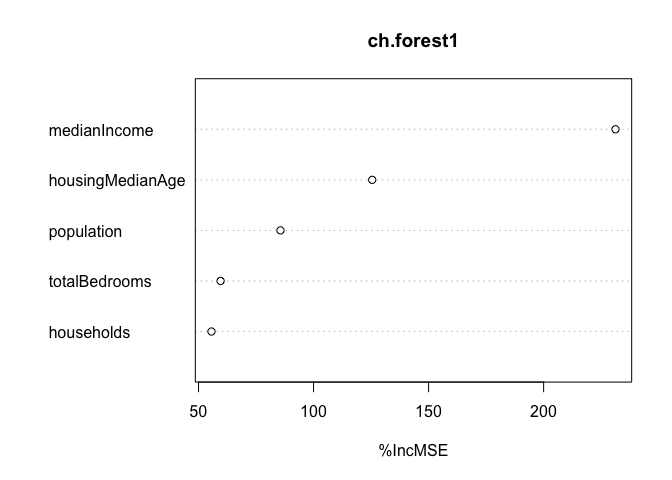

## Problem 1

##### (1) Although it seems that if we hires more cops, the crime goes down, in reality high crime cities have a highly incentive to hire cops which usually messes the data. We cannot get a clear relationship. Therefore, statistics on its own is not enough to get us to causation.

##### (2) Basically they find an example with a lot of police for reasons unrelated to crime, which is the terrorism alert system. By law, Washington, D.C.is a terrorism target, when the terror alert level goes to orange, then extra police are put on the Mall and other parts of Washington to protect against terrorists. It has nothing to do with street crime. In this case, the question is converted to: when there are extra police on the streets for reasons unrelated to street crime, what happens to street crime? Does it go down?

##### From the table, we can see the significant negative relationship between total daily crime and the high alert which implies more cops unrelated to existing crime in both models. It means when you have the extra police there for terrorism-related reasons, they’re on the streets, they make the streets safer, and things like murder, robbery, assault go down. So both of the two models isolate the effect of more police through detecting whether it is a high alert period. And the second model also separate the effect of more police from the effect of midday ridership which implies more victims on the street.

##### (3) The reason is to check if the reduce of crime is because of the increase of cops or other reasons. It’s possible that tourists were less likely to visit Washington or to go out due to the alert which means there will be less victims on the street. So they need to control this factor to purify the relationship between cop number and crime. In other words, they want to capture the influence of “reduced victim” on reduced crime.

##### (4) The model estimates the high alert fixed effects and district fixed effects while the effect of the midday ridership is also estimated as a controlled variable. The formula is here: Daily total number 0f Crimes in DC district 1 = (-11.058)+(-2.621)\* high alert\* dummy of District 1 + (-0.571)\* high alert\* dummy of Other Districts + 2.477 \* log(midday ridership)

##### During periods of high alert, crime in the National Mall area decreases by 2.621 crimes per day. Crime also decreases in the other districts, by 0.571 crimes per day, but this effect is not statistically significant. The log midday ridership also positively contributes to the explaination of outcome. Crime increases by 2.477 when the logarithm of midday ridership increases by 1.

## Problem 2

#### Overview - What matters commercial properties’ revenue?

##### In recent decades, rent to sales ratio has been an important measurement for firms’ decision-makers to avoid uncontrollable cost. As a result, economic entities become more and more ratinal on rental costs. Given such circumtances,for firms focusing on commercial properties, how to optimize rental revenue and make a balance between price and leasing rate become crucial for their survival and growth. This research wants to quantatively detect the facts with important influence on commercial properties revenue. Among many features such as total size of rental space, buildings’ age, average rent in local market, etc., which features should be weighted more when firms investment resourses and make decisions accordingly. Poor prediction would cause misleading and bring in huge risk.

#### Data and Model

##### Our data has 7,894 observations of commercial rental properties from across the United States. The original data has 23 variables within 4 categories: property features, environmental features, various costs, certifications.

##### At the beginning, we generate a new dependent variable Rev representing revenue per square foot per calendar year. Considering revenue is a combination of rent price and leasing rate, we define Rev as Rent\*leasing.rate/100. From the below description, we can see that there is one variable “empl\_gr” has 74 missings. Since the missing percentage is 0.94%, even less than 1%, we choose to omit those missing values when needed. However, the selected models in this project could omit these missing values by default, we won’t deal with it right now.

##### (There is a data summary table here)

    gb$Rev <- gb$Rent * gb$leasing_rate/100
    stargazer(gb[2:24],model.numbers = FALSE,type = 'text', out="gb_summary.htm")

    ## 
    ## ===================================================================================
    ## Statistic           N      Mean      St. Dev.     Min   Pctl(25) Pctl(75)    Max   
    ## -----------------------------------------------------------------------------------
    ## cluster           7,894   588.615     399.908      1      272     1,044     1,230  
    ## size              7,894 234,637.700 297,533.400  1,624  50,891.2 294,212  3,781,045
    ## empl_gr           7,820    3.207       8.163    -24.950  1.740    2.380    67.780  
    ## Rent              7,894   28.419      15.075     2.980   19.500   34.180   250.000 
    ## leasing_rate      7,894   82.606      21.380     0.000   77.850   96.440   100.000 
    ## stories           7,894   13.584      12.287       1       4        19       110   
    ## age               7,894   47.244      32.194       0       23       79       187   
    ## renovated         7,894    0.380       0.485       0       0        1         1    
    ## class_a           7,894    0.400       0.490       0       0        1         1    
    ## class_b           7,894    0.459       0.498       0       0        1         1    
    ## LEED              7,894    0.007       0.082       0       0        0         1    
    ## Energystar        7,894    0.081       0.273       0       0        0         1    
    ## green_rating      7,894    0.087       0.282       0       0        0         1    
    ## net               7,894    0.035       0.183       0       0        0         1    
    ## amenities         7,894    0.527       0.499       0       0        1         1    
    ## cd_total_07       7,894  1,229.354   1,104.589    39      684     1,620     5,240  
    ## hd_total07        7,894  3,432.042   1,976.937     0     1,419    4,796     7,200  
    ## total_dd_07       7,894  4,661.397   1,984.327   2,103   2,869    6,413     8,244  
    ## Precipitation     7,894   31.081      11.575    10.460   22.710   43.890   58.020  
    ## Gas_Costs         7,894    0.011       0.002     0.009   0.010    0.012     0.029  
    ## Electricity_Costs 7,894    0.031       0.009     0.018   0.023    0.038     0.063  
    ## City_Market_Rent  7,894   27.497      10.599     9.000   20.000   34.000   71.440  
    ## Rev               7,894   24.053      15.581     0.000   15.000   30.000   249.600 
    ## -----------------------------------------------------------------------------------

##### Our main goal of this project is to select the best model with lowest root mean square error of out-of-sample prediction. In this paper, when we say root mean square error, it is always related to test set prediction. Through this model, we’ll absolutely know the best predicting variable set. We start from a full tree model, then compare with random forest model and boosted regression trees. After the comparison of root mean square error, we choose the best type of model. But this is not the end, we’ll continue to compare the root mean square error generated by different selections of variable set with the same type of model. As long as we get the specific model and variables, we’ll compare the three types of models again with the consistent variable set. The best one with lowest root mean square error will be the final winner.

#### Analysis and Results

#### Model 1: Tree model with full variables set

##### Since tree models are among the most useful “general-purpose” function approximators. We want to specify branches that lead to good predictions. Our dependent variable is numerical and continuous variable. Thus, the regression tree is applied here, which can automacally detect the interactions. The total sample size is 7894. We split the nodes only if there are at least 150 observations, and if the split improves the deviance by 1%. From the analysis we found City\_Market\_Rent, size and amenities are crucial predictors.The tree model predictors are exibited in Figure 2 When we fit the model in the test dataset, the root mean square error is 12.059.

    library(tidyverse)
    library(ggplot2)
    library(rpart)
    library(rpart.plot)
    library(rsample) 
    library(randomForest)
    library(lubridate)
    library(modelr)
    library(gbm)
    library(stargazer)
    gb <- read.csv("~/Documents/**2021spring course/DM/hw3/greenbuildings.csv")

    gb$Rev <- gb$Rent * gb$leasing_rate/100
    #summary(gb)
    e_na <- subset(gb,is.na(empl_gr))
    gbs <- subset(gb,!is.na(empl_gr))

    gb_split = initial_split(gb,prop=0.8)
    gb_train = training(gb_split)
    gb_test = testing(gb_split)

    par(mar = rep(3, 4))

    gb.tree = rpart(Rev ~ cluster+size+empl_gr+stories+age+renovated+class_a+class_b+
                      LEED+Energystar+green_rating+net+amenities+cd_total_07+hd_total07+
                      total_dd_07+Precipitation+Gas_Costs+Electricity_Costs+City_Market_Rent,
                    data=gb_train, control = rpart.control(cp = 0.01, minsplit=150))
    par(mar = rep(2,4))
    rpart.plot(gb.tree, digits=-5, type=4, extra=1, cex=0.3)

##### (Table 2. Tree Model Result - in PDF)

##### Tree model branch Size Expected Revenue

##### City\_Market\_Rent&lt;21.268 2009 14.182

##### 21.268&lt;=City\_Market\_Rent&lt;32.308 2403 21.642

##### 32.308&lt;=City\_Market\_Rent&lt;51.9 amenities=0 879 29.043

##### 32.308&lt;=City\_Market\_Rent&lt;51.9

##### amenities=1

##### Size&lt;=622786 767 37.497

##### 32.308&lt;=City\_Market\_Rent&lt;51.9

##### amenities=1

##### Size&gt;622786 53 55.424

##### City\_Market\_Rent&gt;=51.9

##### Size&lt;368482 129 54.923

##### City\_Market\_Rent&gt;=51.9

##### Size&gt;=368482 76 83.275

#### Model 2: Random Forest

##### For the first fandom forest model, we put all variables except the dependent revenue variable Rev and its related variable Rent and leasing rate. Since the missing values blocks the work program, we removed the 74 observations with missing empl\_gr variable which represents the year-on-year growth rate in employment in the building’s geographic region. We have detected that there are not outliers in any dimension for those observations with missing values. The less than 1% sample would not affect the results.

##### Figure 1. is the error and importance graph, we can see that 500 trees are the best choice. From the importance graph we can see the order of importance of different variables. The most important variable is size, the second one is age, and the third one is stories. In this full random forest model, the root mean square error is 8.627, which is obviously better than the first tree models.

    row.has.na <- apply(gb_train, 1, function(x){any(is.na(x))})
    predictors_no_NA <- gb_train[!row.has.na, ]
    gb.forest = randomForest(Rev ~ cluster+size+empl_gr+stories+age+renovated+class_a+class_b+
                               LEED+Energystar+green_rating+net+amenities+cd_total_07+hd_total07+
                               total_dd_07+Precipitation+Gas_Costs+Electricity_Costs+City_Market_Rent,
                               data=predictors_no_NA, importance = TRUE)
    plot(gb.forest)

    modelr::rmse(gb.tree, gb_test)

    ## [1] 10.86208

    modelr::rmse(gb.forest, gb_test) 

    ## [1] 7.396632

    varImpPlot(gb.forest, type=1)

##### (Figure 1. Error graph and importance graph for different number of trees model)

#### Mode 3: Boosted regression trees

##### We also run the boosted regression trees model with all possible variables to obtain the best model. We also set the tree numbers as 500 with 0.05 shrinkage level. As a result, the root mean square error for this model is 10.309. Table 3 is the list of the root mean square errors for each model with complete variables.

    boost1 = gbm(Rev ~ cluster+size+empl_gr+stories+age+renovated+class_a+class_b+
                   LEED+Energystar+green_rating+net+amenities+cd_total_07+hd_total07+
                   total_dd_07+Precipitation+Gas_Costs+Electricity_Costs+City_Market_Rent,
                 data=gb_train,
                 interaction.depth=4,n.trees=500,shrinkage=.05)

    ## Distribution not specified, assuming gaussian ...

    gbm.perf(boost1)

    ## OOB generally underestimates the optimal number of iterations although predictive performance is reasonably competitive. Using cv_folds>1 when calling gbm usually results in improved predictive performance.

    ## [1] 103
    ## attr(,"smoother")
    ## Call:
    ## loess(formula = object$oobag.improve ~ x, enp.target = min(max(4, 
    ##     length(x)/10), 50))
    ## 
    ## Number of Observations: 500 
    ## Equivalent Number of Parameters: 39.85 
    ## Residual Standard Error: 0.1021

    # RMSE
    rmse(boost1, gb_test)

    ## Using 500 trees...

    ## [1] 9.337932

##### (Table 3. Model comparison)

    modelr::rmse(gb.tree, gb_test)

    ## [1] 10.86208

    modelr::rmse(gb.forest, gb_test) 

    ## [1] 7.396632

    modelr::rmse(boost1, gb_test)

    ## Using 500 trees...

    ## [1] 9.337932

#### 4. Model Selection

##### By the comparison of root mean square error, we can see the random forest model works best. Taking the advantage of importance graph (Figure 2), we can easily further optimize the model. By randomly picking the first 10 variables, we get another root mean square error which is 5.009996. Since the variable empl\_gr variable with 74 missing values is not in the first 10 set, we can use entire dataset when we optimize the random forest model. Next, we pick the first 9 variables, and get a new root mean square error. Table 4 exhibits root mean square errors of different models with different variable selections.

    # 10
    gb.forest2 = randomForest(Rev ~ cluster+size+stories+age+renovated+class_a+class_b+amenities+cd_total_07+
                                City_Market_Rent, data=gb_train, importance = TRUE)
    modelr::rmse(gb.forest2, gb_test) 

    ## [1] 7.821039

    varImpPlot(gb.forest2, type=1)

    #9
    ##Win
    gb.forest3 = randomForest(Rev ~ cluster+size+stories+age+renovated+class_a+amenities+cd_total_07+
                                City_Market_Rent, data=gb_train, importance = TRUE)
    modelr::rmse(gb.forest3, gb_test) 

    ## [1] 7.75735

    varImpPlot(gb.forest3, type=1)

    # 8
    gb.forest4 = randomForest(Rev ~ size+stories+age+renovated+class_a+amenities+cd_total_07+
                                City_Market_Rent, data=gb_train, importance = TRUE)
    modelr::rmse(gb.forest4, gb_test) 

    ## [1] 7.525206

    varImpPlot(gb.forest4, type=1)

    # 7
    gb.forest5 = randomForest(Rev ~ size+stories+age+class_a+amenities+cd_total_07+
                                City_Market_Rent, data=gb_train, importance = TRUE)
    modelr::rmse(gb.forest5, gb_test) 

    ## [1] 7.486355

    varImpPlot(gb.forest5, type=1)

    # 6
    gb.forest6 = randomForest(Rev ~ size+stories+age+class_a+amenities+
                                City_Market_Rent, data=gb_train, importance = TRUE)
    modelr::rmse(gb.forest6, gb_test) 

    ## [1] 7.622034

    varImpPlot(gb.forest6, type=1)

##### (Table 4. Random Forest Models with different variable selections)

##### Model Selection RMSE

##### Entire variables 8.627096

##### First 10 variables 9.126699

##### First 9 variables 9.091752

##### First 8 variables 8.652966

##### First 7 variables 8.414495

##### First 6 variables 8.511267

##### From the above comparison, we can see that the random forest model with the first seven variables performs works best. In addition, we need to notify that the common variables don’t have a consistent order in each model, namely, the importance of a particular variable varies across different models.

    varImpPlot(gb.forest5, type=1)

\#\#\#\#\# Figure 2. Importance order of random forest model with seven
variables

##### Use the same seven variable set, we separately run tree model and boosted regression tree model again to compare the root mean square error. As table 5 shows, the variables selection doesn’t improve much in the tree model and boosted regression model with consistent conditions. The random forest with first eight variables performs much better than any other models.

    gb.tree2 = rpart(Rev ~ size+stories+age+class_a+amenities+cd_total_07+
                       City_Market_Rent,
                    data=gb_train, control = rpart.control(cp = 0.02, minsplit=100))
    rpart.plot(gb.tree2, digits=-5, type=4, extra=1, cex=0.3)

    modelr::rmse(gb.tree2, gb_test)

    ## [1] 10.94864

    boost2 = gbm(Rev ~ size+stories+age+class_a+amenities+cd_total_07+
                   City_Market_Rent,
                 data=gb_train,
                 interaction.depth=4,n.trees=500,shrinkage=.05)

    ## Distribution not specified, assuming gaussian ...

    modelr::rmse(boost2, gb_test)

    ## Using 500 trees...

    ## [1] 9.331499

##### (Table 5. Three types of models with the same 8 variable selection)

##### Model with 8 variables RMSE

##### Random Forest 8.414495

##### Tree Model 12.10759

##### Boosted Regression Model 10.14392

##### 5. Conclusion

##### In our claimed best model with lowest root mean square error, the City\_Market\_Rent, namely average rent per square-foot per calendar year in the building’s local market, has the biggest influence, which weighs much more than other variables, such as age, size, class A indicator (the highest-quality properties in a given market), number of cooling degree days in the building’s region in 2007.

##### In addition, we can clearly see the set of the most importance seven predictors and their orders. After average rent per square-foot per calendar year, the age dominates the predictions. Then, we have size, class-a indicator, amenities, number of cooling degree days in the building’s region in 2007, and the building stories. As long as we have information of these dimensions, we can provide a relatively good prediction for buildings’ revenue!

##### Furthermore, we can see the marginal change as well through below figures, each of which is focusing on a particular variable. But there is a limitation we need to point out, these marginal fugures haven’t contain the interaction between variables. Therefore, we need to be careful about it. For example, class A house might easily have amenaties. But we cannot see the relationship in these separate graphs. It will weaken our marginal predictions. More estimation or exploration is needed for the interactions if we want more accurate prediction.

##### (Figure 6 Marginal effects in Random Forest model)

    partialPlot(gb.forest5, gb, 'City_Market_Rent', las=1)

    partialPlot(gb.forest5, gb, 'age', las=1)

    partialPlot(gb.forest5, gb, 'size', las=1)

    partialPlot(gb.forest5, gb, 'class_a', las=1)

    partialPlot(gb.forest5, gb, 'amenities', las=1)

    partialPlot(gb.forest5, gb, 'cd_total_07', las=1)

    partialPlot(gb.forest5, gb, 'stories', las=1)

## Problem 3

    library(ggplot2)
    library(tibble)
    library(sf)

    ## Linking to GEOS 3.8.1, GDAL 3.1.4, PROJ 6.3.1

    library(maps)

    ## 
    ## Attaching package: 'maps'

    ## The following object is masked from 'package:purrr':
    ## 
    ##     map

    ch = read.csv('~/Documents/**2021spring course/DM/hw3/CAhousing.csv', header=TRUE)

#### 1. Overview – Predicting House Values in CA

##### It is well known that California is one of the states with highest house price. The exploration regarding how to predict house price based on some Census data would be very interesting! This project uses random forest and boosted regression model to predict the median house value in California. Through comparison of root mean square error generated in different models, we’ll select the best model with highest predictive power. The error or residual part that hasn’t been captured by the model will also be visualized.

#### 2. Data and Model

##### The original data has nine variables, including a dependent variable MeanHouseValue which means median market value of all households in the tract, and six independent variables. Two remaining variables are longitude and latitude, which help us to get accurate location of the houses and tracts. There are 20640 observations with no missing values. All of these variables are numeric. Furthermore, these variables are on different levels, age, income and house value are median value. But households, population, rooms are aggregation level. Figure 1 is a description of the dependent variable, darker color means higher values, and vice versa.

##### In order to describe models’ out-of-sample predictive power, we’ll arbitrarily split the data set. 80% go to training set, and 20% go to test set. We start from random forest models, then build another boosted regression model, and estimate each model with different variable sets. By comparing the root mean square error, we select the best model.

##### Figure 1. Median house value plots in CA area

    camap <- map_data("county", "california") %>% 
      select(lon = long, lat, group, region ,id = subregion)

    head(camap)

    ##         lon      lat group     region      id
    ## 1 -121.4785 37.48290     1 california alameda
    ## 2 -121.5129 37.48290     1 california alameda
    ## 3 -121.8853 37.48290     1 california alameda
    ## 4 -121.8968 37.46571     1 california alameda
    ## 5 -121.9254 37.45998     1 california alameda
    ## 6 -121.9483 37.47717     1 california alameda

    names(ch)[names(ch) =="longitude"] <-"lon"
    names(ch)[names(ch) =="latitude"] <-"lat"

    camap$lon <- round(camap$lon, 2)
    camap$lat <- round(camap$lat, 2)

    ch_split = initial_split(ch,prop=0.8)
    ch_train = training(ch_split)
    ch_test = testing(ch_split)

    ggplot() +
      geom_polygon(camap, mapping=aes(lon, lat, group = group),fill = "white", colour = "grey50") + 
      coord_quickmap()+
      geom_point(data = ch[,c(1:2,9)], mapping = aes( x = lon, y = lat , color=medianHouseValue)) +
      labs(
        title= "MedianHouseValue in CA",
        x="Logitude",
        y="Latitude"
      )

#### 3. Analysis and Results

#### Model 1 Random Forest with All Variables

##### We start from random forest because in general, it is a model with plenty of computation and relative accurate predictions. To obtain the best variable set, we reduce the least important variable each time, and generated new model and root mean square errors. Figure 2 is different RMSE estimations based on different importance results of random forest. We can see that the model with full variables has best predictive performance. Every time when we remove the least important variable according to the importance order, the error goes up.

##### Figure 2. Importance graph of Random Forest Model with all 6 variables

    ch.forest = randomForest(medianHouseValue ~ totalRooms+totalBedrooms+population+households+medianIncome+housingMedianAge,
                             data=ch_train, importance = TRUE)
    plot(ch.forest)

    modelr::rmse(ch.forest, ch_test)  

    ## [1] 64965.51

    varImpPlot(ch.forest, type=1)

##### Figure 3. Importance graph of Random Forest Model with the first important 5 variables

    ch.forest1 = randomForest(medianHouseValue ~ totalBedrooms+households+medianIncome+housingMedianAge+population,
                             data=ch_train, importance = TRUE)
    modelr::rmse(ch.forest1, ch_test)  # win

    ## [1] 68806.26

    varImpPlot(ch.forest1, type=1)

    ch.forest2 = randomForest(medianHouseValue ~ totalRooms+medianIncome+housingMedianAge+population,
                              data=ch_train, importance = TRUE)
    modelr::rmse(ch.forest2, ch_test)  # win

    ## [1] 74119.19

    varImpPlot(ch.forest2, type=1)

    yhat_test_rf = predict(ch.forest2, ch_test, n.trees=350)

##### Table 1. Random Forest Model (RF) – Root Mean Square Error (RMSE)

##### RF - Number of first several variables\* 6 5 4

##### RF - RMSE 65531.38 69201.18 74720.41

##### \*Variable selection is according to RF importance results

#### Model 2 Boosted regression model with All variables

##### The boosted regression tree model repeatedly fit simple trees to residuals. When we run Boosted Regression Analysis in the training dataset, we also start from complete variable set. We set the boosting steps as 500. It is amazing that this model has better out-of-sample performance. Again, when we reduce the least important variable according to the Random Effect importance order, the error goes up. Therefore, as Table 2 shows, the boosted regression model with full variable set outstands any other models.

    boost11 = gbm(medianHouseValue ~ totalRooms+totalBedrooms+population+households+medianIncome+housingMedianAge,
                 data=ch_test,interaction.depth=4,n.trees=500,shrinkage=.05)

    ## Distribution not specified, assuming gaussian ...

    gbm.perf(boost11)

    ## OOB generally underestimates the optimal number of iterations although predictive performance is reasonably competitive. Using cv_folds>1 when calling gbm usually results in improved predictive performance.

    ## [1] 216
    ## attr(,"smoother")
    ## Call:
    ## loess(formula = object$oobag.improve ~ x, enp.target = min(max(4, 
    ##     length(x)/10), 50))
    ## 
    ## Number of Observations: 500 
    ## Equivalent Number of Parameters: 39.85 
    ## Residual Standard Error: 3817000

    # RMSE
    rmse(boost11, ch_test)

    ## Using 500 trees...

    ## [1] 58301.07

    boost22 = gbm(medianHouseValue ~ totalBedrooms+households+medianIncome+housingMedianAge+population,
                 data=ch_test,interaction.depth=4,n.trees=500,shrinkage=.05)

    ## Distribution not specified, assuming gaussian ...

    # RMSE
    rmse(boost22, ch_test)

    ## Using 500 trees...

    ## [1] 61219.97

    boost33 = gbm(medianHouseValue ~ totalRooms+medianIncome+housingMedianAge+population,
                  data=ch_test,interaction.depth=4,n.trees=500,shrinkage=.05)

    ## Distribution not specified, assuming gaussian ...

    # RMSE
    rmse(boost33, ch_test)

    ## Using 500 trees...

    ## [1] 67302.1

##### Table 2. Boosted Regression Tree Model (BRT) – Root Mean Square Error (RMSE)

##### BRT - Number of first several variables\* 6 5 4

##### BRT - RMSE 58625.04 61021.47 67583.09

##### \*Variable selection is according to RF importance results.

#### 4. Model Prediction

##### As long as we choose the boosted regression model as the best model, we can estimate how accurate the models could predict. Therefore, we use the best model to predict the observations in the testing set. Then we plot both of the true observations and the predictive values generated from the best model. We compare them and calculate the residual between predictive values and true values. Even the residual could also be plotted. Notice that Figure 4 is the plot results of True values, predictive values and residuals.

    ch_test$yhat_test_gbm = predict(boost11, ch_test, n.trees=500)
    ch_test$resid = ch_test$yhat_test_gbm - ch_test$medianHouseValue

    ggplot() +
      geom_polygon(camap, mapping=aes(lon, lat, group = group),fill = "white", colour = "grey50") + 
      coord_quickmap()+
      geom_point(data = ch_test[,c(1:2,10)], mapping = aes( x = lon, y = lat , color=yhat_test_gbm))+
      labs(
        title= "MedianHouseValue: Out-of-sample Prediction",
        x="Logitude",
        y="Latitude"
      )

    ggplot() +
      geom_polygon(camap, mapping=aes(lon, lat, group = group),fill = "white", colour = "grey50") + 
      coord_quickmap()+
      geom_point(data = ch_test[,c(1:2,11)], mapping = aes( x = lon, y = lat , color=resid))+
      labs(
        title= "MedianHouseValue: Residual of Prediction",
        x="Logitude",
        y="Latitude"
      )

#### 5. Conclusion

##### From the best modal, namely boosted regression tree model, we can see that all the six variables are great predictors for the house values. Although it doesn’t give us an order which one is more important for prediction, maybe we can get a sense from the importance order in Random Forest model, which means the median income is the most important signal for the value of CA’s house. The Median Age is another good predictor, then population, total bedrooms, total number of households, and total room numbers.
